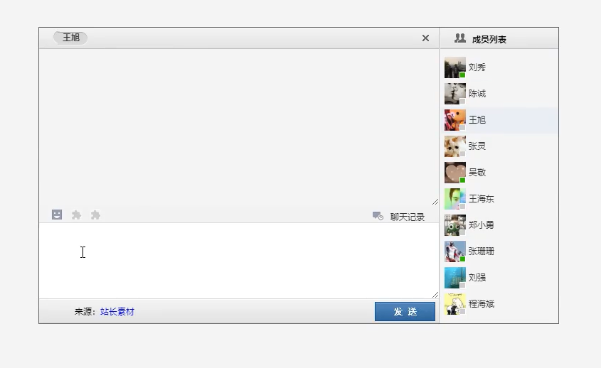

#### -socket.io

https://www.w3cschool.cn/socket/socket-1olq2egc.html

是一个库，可用于在浏览器和服务器之间进行实时、双向和基于事件的通信（异步）

npm install --save socket.io-client

express框架、mysql模块、

sqlQuery(sqlStr)获取数据库数据，sqlStr是一个字符串，内容为数据库查询语句；记得用异步操作(async,await)