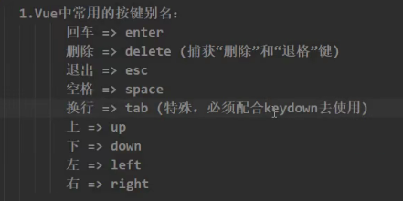
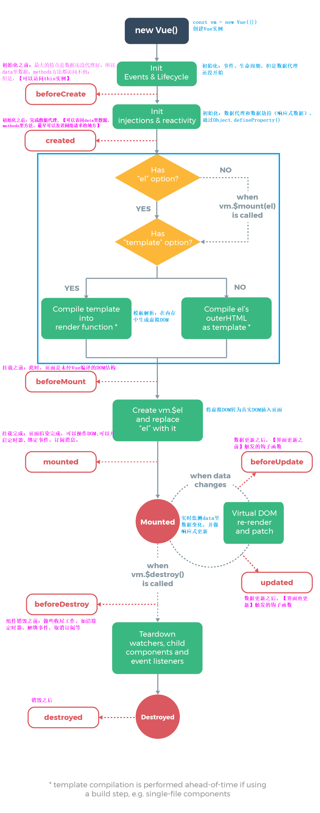

基本使用：

```html
<body>
  <div id="app"></div>
  <script src="https://cdn.jsdelivr.net/npm/vue@2.7.14/dist/vue.js"></script>
  <script>
    Vue.config.productionTip = false;
    new Vue({
      el: "#app",
      data: {},
    });
  </script>
</body>
```

#### 1. 指令

##### 1.1. 内置指令

```javascript
--v-bind:value=""   //:,单项绑定
--v-model=""    	//双向绑定，只能应用在表单类元素上（存在输入，有value值）
--v-on:click=""    	//@click=
--v-show="true"		//为true表示显现，为false表示隐藏；===display: none;
--v-if="false"		//条件渲染,不同于v-show,v-if会直接把节点删除（可用于组件的销毁与重建）
--v-for=""			//详见7.1
其他：
--v-text=""			//向其所在节点中渲染文本内容，会直接替换掉节点中本来的内容
--v-html=""			//与v-text类似，只不过可以渲染包括html结构的内容（标签等）
--v-cloak			//本质是一个特殊属性,没有值，Vue实例创建完毕后，会删除掉v-cloak属性，可以用于解决网速慢时页面展示出{{xxx}}的问题（需添加样式：[v-cloak]{ display: none }）
--v-once			//只动态渲染一次，以后数据的改变不会引起v-once所在结构的更新
--v-pre				//跳过其所在节点的编译过程，可以用于跳过那些没有使用指令、插值的节点，加快编译，提高效率
```

##### 1.2. 自定义指令

###### 1.2.1. 函数形式

- directives:{}   //也是一个配置对象，与el,data平级
- 在这里面写函数，这个函数就是自定义指令的名称，不过没有v-
- 在函数里面可以通过innerText等原生js渲染页面
- 函数会有两个参数，分别是该指令绑定的dom元素element和传入的值binding
- 该函数何时会被调用：1.指令与元素成功绑定时；2.指令所在的模板被重新解析时

###### 1.2.2. 对象形式

用于在特定时间点调用特定函数

bind() 指令与元素成功绑定时；inserted()//指令所在元素被插入页面时；update()//指令所在的模板被重新解析时

###### 1.2.3. 注意事项

- 指令名称不能用驼峰命名法命名，可以用 ' - ' 隔开，方法名用 '' 包裹起来（对象里的key）
- 指令里面的函数的this都是window，而不是vm

------

#### 2. 数据代理

##### 2.1. ==defineProperty==

```javascript
Object.defineProperty(person,'age',{value:18})
```

​	以这种方式添加的属性不参与遍历（不可枚举）

- 可以在对象中添加一个属性使其可遍历：**enumerable: true**
- writable: true,  //可以控制属性是否可以被修改

- configurable: true  //控制属性是否可以被删除
- get: function(){ return number }  //实现动态数据
- set(value){ number = value }  //实现双向数据绑定

##### 2.2. 定义

通过一个对象代理对另一个对象中属性的操作（读/写）

##### 2.3. Vue中的数据代理

通过 vm 对象来代理 data 对象中属性；当然也代理了 methods 中的方法

```javascript
Object.defineProperty(vm,'name',{
    get(){return data.name},  //获取时调用
    set(value){data.name=value} //修改时调用
})
```

------

#### 3. 内置事件

##### 3.1. 事件指令

```javascript
@click		//鼠标点击
@scroll		//滚动条滚动
@wheel 		//鼠标滚轮滚动
@keyup		//键盘松开，keydown表示键盘按下，一般只需一个就可以了
@blur		//失去焦点
```

##### 3.2. 事件修饰符

`@click.prevent`  阻止点击事件的默认行为，例如a标签的跳转地址

类似的还有:

- prevent: 阻止默认事件
- stop: 阻止事件冒泡
- once: 事件只触发一次（触发一次之后就失效）
- passive: 事件的默认行为立即执行，无需等待事件回调执行完毕

可以连续写（同时完成两个功能）：@click.prevent.stop

##### 3.3. 按键别名

`@keyup.enter=""`  表示按下回车键之后触发事件

也可以连着写，@keyup.ctrl.y表示两个按键一起按的时候才触发

类似的还有：



event.keyCode表示按键编码值，key表示按键名

------

#### 4. 计算属性

```javascript
//写在Vue实例对象中，与el,data平级
computed:{
    fullName:{
        //get的作用：当有人读取fullName时，get就会被调用，且返回值就作为fullName的值；有缓存，当所依赖的数据发生变化时，才重新调用get函数（刷新），否则一直使用第一次调用时的返回值
        get(){
            return this.firstName+this.lastName //this被改成了vm
        }
        set(value){
            const arr = value.split('-')
            this.firstName = arr[0]
            this.lastName = arr[1]
        }
    }
}
```

---

#### 5. 监视属性

```javascript
//与el,data平级
watch:{
    isHot:{
        //当isHot发生变化时就会调用handler
        handler(newValue,oldValue){
            console.log("isHot被修改了",newValue,oldValue)
        },
        immediate:true,  //开始就调动一次handler
        deep:true, //开启深度监视
    }
}
```

或者：`vm.$watch('isHot',{})`

##### 5.1. 深度监视

- 方法一：要监视numbers里面的a，需要这样写：`'numbers.a'`  ,不能省略 `''`

- 方法二：在监视属性numbers里面添加：`deep:true,`  开启深度监视

##### 5.2. 计算属性vs监视属性

当两者都能实现时，选择计算属性；当需要异步操作时，只能选择监视属性

因为计算属性是一个返回值，难以实现异步操作

---

#### 6. 绑定样式

##### 6.1. 绑定class样式

- 字符串写法，适用于：样式的类名不确定，需要动态指定；`:class="mood"`

- 数组写法，适用于：要绑定的样式个数不确定、名字也不确定；`:class="arr"` arr是一个数组，数组里面可以有对象，用于确定是否添加该类名

- 对象写法，适用于：要绑定的样式个数确定、名字也确定，但要动态决定用不用；

  ```javascript
  :class="obj"
  //在data中添加一个obj属性
  obj:{
      class1:false,  //用布尔值确定是否用
      class2:ture
  }
  ```

##### 6.2. 绑定style样式

`:style="styleObj"`  styleObj:{ ==fontSize== : '40px' } // 属性名需以驼峰命名法

---

#### 7. 列表渲染

##### 7.1. 基本列表(v-for)

- 加在谁身上就遍历谁，加在li上就会有几列，可以遍历数组

  `v-for="p in persons" :key="p.id"`

  或者：`v-for="(p,index) in persons" :key="index"`  ，不过尽量不用 index ，因为 index 容易变

  ==key是虚拟DOM对象的标识，加上key有助于虚拟DOM对比，利于复用，提高效率==

- 也可以遍历对象`v-for="(value,key) in car"`

- 甚至可以遍历字符串
- 遍历数字(指定次数) `v-for="number in 5"`  //从1到5

##### 7.2. 列表过滤

- watch实现：

  ==关键字：`filter, indexOf, handler, immediate`== 

  `this.persons.filter((p)=>{ return p.name.indexOf(val) !== -1 })`

  ==注意原数据最好不要直接改，用另一个代替==

- computed实现：

  ```javascript
  computed:{
      persons2:{
          get(){
              return this.persons.filter((p)=>{
                  return p.name.indexOf(val) !== -1
              })}}}
  ```
  

##### 7.3. 列表排序

```javascript
arr.sort((a,b)=>{
    return a-b; //升序，b-a表示降序
})
```

都写在computed里，这样改了任何用到的东西时，都会重新计算

##### 7.4. Vue.set的使用

用于向vue实例里添加一个属性

- 写在methods里：`Vue.set(this.student,'sex','男')`

- 或者写在vue实例外面：`vm.$set(vm._data.student,'sex','男')`
- 如果target指向的是一个数组，那第二个参数可以是一个数字，代表第几个元素，实现更改操作

##### 7.5. 数组的更改

更改数组不能直接通过索引值更改，否则不会引起页面的响应式变化；应当改用 push, pop, shift, unshift, splice, sort, reverse 等方法（当然也可用 Vue.set 方法进行修改）；filter等非变更原数组的方法要将改变之后的新数组替换掉原来的旧数组，因为其不会影响原数组，也就不会引起数据监测。

==vue的push和Array的push函数不是同一个（包装了一下，加了重新解析模板这一步，即通知页面更新）==

---

#### 8. 收集表单数据

- 若type="text"，则v-model收集的是value值，用户输入的就是value值

- 若type="radio"，则v-model收集的是value值，且要给标签配置value值

- 若type="checkbox"

  - 没有配置input的value属性，那么收集的就是checked(布尔值)

  - ==配置了value属性，且v-model双向绑定的那个值的初始值是数组，那么收集的就是value值组成的数组==

- v-model的三个修饰符：
  - lazy: 失去焦点（或回车）再收集数据
  - number: 输入字符串转为有效的数字
  - trim: 对输入进行首尾空格过滤

---

#### 9. 过滤器

filters与el,data平级，可被用于一些常见的文本格式化

- 注册过滤器：`Vue.filter(name,callback)` 或 `new Vue{filters:{}}`

- 使用过滤器：`{{ xxx | 过滤器名 }}` 或 `v-bind:属性 = "xxx | 过滤器名"`

- 过滤器也可以接受额外参数、多个过滤器也可以串联；过滤器并没有改变原本的数据，是产生新的对应的数据

---

#### 10. 生命周期

==之前的误区：数据更新只会触发 beforeUpdate 和 update 生命周期，并不会触发 mounted 生命周期，mounted 和 created 一样只会在初始化组件时触发一次==

##### 10.1. 生命周期钩子(函数)

是Vue在关键时刻帮我们调用的一些特殊名称的函数；而且this指向是vm

create, mount, update, destroy；分别对应beforeCreate,created...共8个生命周期函数

与el,data平级

##### 10.2. 创建(created)

完成了创建数据监测与数据代理后调用created函数

##### 10.3. 挂载(mounted)

完成模板的解析并把==初始==的真实DOM元素放入页面后（挂载完毕）调用mounted函数

做一些初始化的事：开启定时器，发送网络请求，订阅消息，绑定自定义事件等初始化操作

##### 10.4. 更新(updated)

当data里面数据发生改变后调用

##### 10.5. 销毁(destroyed)

销毁后调用

一般会在beforeDestroy函数里执行一些收尾操作：关闭定时器，取消订阅···

销毁后自定义事件会失效，但原生DOM事件依然有效；

一般不会在这里面操作数据，因为即便操作了数据，也不会触发更新了

##### 10.6. 父子组件的生命周期

- 渲染的过程：父beforeCreate -> 父created -> 父beforeMount -> 子beforeCreate -> 子created -> 子beforemount -> 子mounted -> 父mounted

- 子组件更新过程

  父beforeUpdate -> 子beforeUpdate -> 子updated -> 父updated

- 父组件更新过程

  父beforeUpdate -> 父updated

- 销毁过程

  父beforeDestroy -> 子beforeDestroy -> 子destroyed -> 父destroyed

---

#### 11. 一些属性与方法

- Vue.config.productionTip = false    //关闭vue的生产提示
- .trim()   //用于清空首尾空格
- 对象转字符串：JSON.stringify(obj)  ;   字符串转对象：JSON.parse(str)
- todo.hasOwnProperty('isEdit')     //判断todo是否含有某个属性
- 强制刷新： this.$forceUpdate()


#### 生命周期图示：

初始化阶段、模板编译阶段、挂载阶段、更新阶段、销毁阶段


