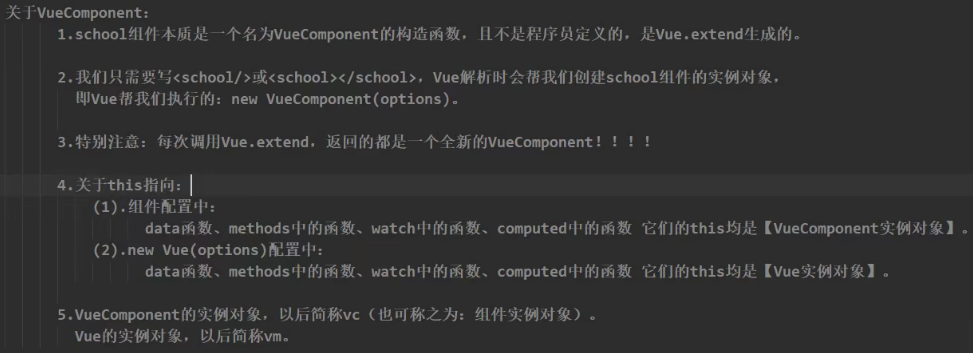

组件定义：实现应用中局部功能代码和资源的集合

---

#### 1. 非单文件组件

##### 1.1. 基本使用

关键字：Vue.extend({}) , components:{}

##### 1.2. 组件嵌套

vm->app->...

组件在哪儿注册就在哪个组件里面使用

##### 1.3. VueComponent



可以在组件内部方法中(methods:{})通过this获取到组件的实例对象(vc)

#### 2. 单文件组件

1.文件后缀是vue，2.命名规范：首字母大写及驼峰     3.下载插件：Vetur (用于提示和高亮等)   

4.注释用/* */     5.只支持三个标签：template, script, style 

==template 标签只起包裹作用，最终的渲染结果将不包含 template 元素==

##### 2.1. 简写

```javascript
<script>
  export default {		//省略了Vue.extend()
    name:'School',
    data(){},
    methods:{}
	}
<script>
```

##### 2.2. 主要文件

1.主界面index.html	2.入口文件main.js	3.App.vue	4.Student.vue


#### 补充

##### 1. 非单文件组件

```js
// 全局组件
Vue.component('comp-a',{
  template: `<div>全局组件-A组件 <comp-b></comp-b></div>`,
  data(){ return {} },
  methods: {},
  // 局部组件
  components: {
    'comp-b': {
      template: `<h2>局部组件-B组件</h2>`,
      data(){ return {} },
    }
  }
})
```

##### 2. 单文件组件

```vue
<template>
	<p>hello word!</p>
</template>
<script>
	export default {
    data() {
      return {}
    }
  }
</script>
<style scoped></style>
```

