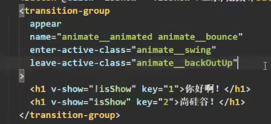

在另一个文件里写的东西==记得暴露==


#### 1. 脚手架

##### 1.1. 初始化

- 1.打开cmd或者终端(ctrl+`)全局安装@vue/cli :  npm install -g @vue/cli
- 2.==切换到你要创建项目的目录==，然后使用命令创建项目： vue create xxxx
- 3.进入文件，启动项目：==npm run serve==  ；ctrl+c停止项目
- 4.打包文件，npm run build, 会将打包之后的内容汇总在dist文件夹

若出现下载缓慢可以配置npm淘宝镜像：npm config set registry http://registry.npm.taobao.org

##### 1.2. nrm 

npm i nrm -g  // 全局下载nrm工具

nrm ls  // 查看可用下包地址

nrm use // 使用某个地址

##### 1.3. 一些关键点

- favicon.ico: 网站页签图标（网站标题上的）
- <%= BASE_URL %>就代表public文件夹，在index文件里面不允许写./等路径符号
- noscript标签：浏览器不支持vue脚手架就会显示里面的内容，否则就不显示
- render: h => h(App) ,main.js引入的vue是精简版的，没有模板解析器，不能用template,用render代替，相当于创建元素
- 使用图片要用require('url')将图片导入  `headerimg:require('./assets/img/1.jpg')`


#### 2. 一些属性与配置项

##### 2.1. ref属性

- 被用来给元素或子组件注册引用信息（id的替代者）

- 应用在html标签上获取的是真实DOM元素，应用在组件标签上是组件实例对象(vc)

  ​	==所以可以用这种方式获取子组件的数据或方法==

- 使用方式：打标识：ref="xxx"     		获取：this.$refs.xxx

##### 2.2. ==props配置项传参==

用于父组件给子组件传参数

- 让组件接受外部传过来的数据，props: ['name', 'age', 'sex']   	//与name,data平级

- props可以写成一个对象,里面的数据也可以写成对象，有几个属性：type, required, default

- 通过props获取到的数据不允许修改，通过在data里面加一个相关的属性解决:myAge: this.age

  ​	虽然监测不到对象里面属性的改变，但不建议在子组件里面修改父组件的数据
  
  ###### 2.2.2 子传父
  
  父组件传递函数给子组件，子组件通过 props 接收后就可以调用这个函数并传入参数
  
  ```
  父组件传递函数给子组件：<Son :change="changeTitle" />
  子组件使用函数传递参数：this.change('标题2');	//参数相当于传递给了在父组件声明的changeTitle函数
  ```

##### 2.3. mixin（混入）

也称为逻辑复用，可以包含任意组件选项（data, methods, computed, created, ...）

- 在一个.js（推荐写mixin.js）文件里面定义混合,其实就是一个对象，export  const xxx = {}
- 使用混入：先引入然后再在组件中添加一个配置项mixins: [xxx,yyy]
- 引入之后就可以使用里面的所有方法(methods)，mounted，data等所有配置
- 如果冲突了以原本组件的为主，但是生命周期钩子函数都会保存（而且先触发混合的钩子）

##### 2.4. 插件

- 本质是一个包含install方法的对象，第一个参数是Vue,后面也可以传参

- 定义插件：在一个文件(plugins.js)里写：export default {install(Vue){全局过滤器等}}，需要引入

  ​		import install from 'install'

  ​		Vue.use(install)

- 使用：Vue.use(plugins)

##### 2.5. scoped

用于加在style标签内，让该样式只应用于本组件，防止冲突；

一般在App组件中就不加，用于使其的一些样式可以通用

##### 2.6. nextTick

其实也是一个生命周期钩子

- 语法：this.$nextTick(回调函数)   //this指的是vc
- 作用：在下一次DOM更新结束后执行其指定的回调
- 什么时候用：当改变数据后，要基于更新后的新DOM进行某些操作时，就可以将操作写在此回调函数中


#### 3. TodoList案例

##### 3.1. 组件化编码流程

1. 实现静态组件：抽取组件，使用组件实现静态页面效果；按照功能点拆分
2. 展示动态数据：数据的类型、名称；数据保存在哪个组件；多个组件在用就放在他们的父组件上
3. 交互——从绑定事件监听开始

##### 3.2. 一些细节

1. 自动生成id的库nanoid: 

​		安装npm i nanoid		引入：import {nanoid} from 'nanoid'		使用：id:nanoid()

2. 子组件传递参数给父组件(props)：子组件可以通过使用父组件传递过来的函数传递参数给父组件

3. .reduce函数用于条件统计：

```javascript
const x = this.todos.reduce((pre,current)=>{
    return pre + (current.done ? 1 : 0)   //done为真则加一，否则不加
},0)
```

4. 若要删除数组中某个特定项，一般可以用filter
5. 若要添加新的数据，需要使用this.$set(todo,'isEdit',true) ; 如果直接添加的话会使其不被Vue监测
6. this.$nextTick(function(){})   //这里面的回调函数会在重新解析完当前模板之后再调用


#### 4. 浏览器本地存储

统称为webStorage,存储内容大小一般支持5MB左右；注意对象要先转成字符串再存储(JSON.stringify)

##### 4.1. localStorage

- localStorage.setItem('msg','hello') :添加数据； 还有.getItem(), .removeItem(), .clear()
- 均可以在浏览器Application里面的Local Storage查看
- 关闭浏览器之后数据仍然会存在

##### 4.2. sessionStorage

- 与localStorage的方法一样
- 关闭浏览器之后数据就会清除


#### 5.组件自定义事件

是一种组件间通信的方式，适用于：子组件 ===> 父组件；代替了使用props传递函数给子组件

##### 5.1. 绑定

- 方法一：使用@或v-on ;  例如：@atguigu=""

  方法二(更灵活)：使用ref在mounted里面绑定事件，这样就可以写在定时器里面，实现一定功能

  ​		绑定事件的方法：`this.$refs.xxx.$on('atguigu',this.getName)`   

  ​																	   $once表示只触发一次

- 写在哪个组件标签上就在哪个组件里写自定义事件

- 可以通过这种方式实现子组件向父组件传参数，而且不需要使用props

  ​		==传递数据的方法：`this.$emit('atguigu',this.name)`   （触发atguigu事件）==

  ​		参数会传递给父组件的回调函数getName(name){}

##### 5.2. 解绑

this.$off('atguigu') //解绑一个

this.$off(['atguigu','demo'])  //解绑多个需要写在一个数组中

this.$off()  //不写就解绑所有

this.$destroy()  //销毁当前组件的实例，其自定义事件也会跟着被销毁

##### 5.3. 注意点

- `this.$refs.xxx.$on('atguigu',function(){})`    

  ​	这里的回调函数的this会指向xxx，尽量别用这种方式，而是调用一个在本组件内写的方法或者箭头函数

- ==写在组件标签里的事件会默认成自定义事件==

  ​	@click.native="" 就可以改为使用原生DOM事件


#### 6. 全局事件总线

- 一种组件间通信的方式，适用于任意组件间通信

- 安装全局事件总线：

  ```javascript
  new Vue({
      beforeCreate(){
          Vue.prototype.$bus = this 
  }})
  ```

- 使用事件总线：

  1. A组件想接收数据，则在A组件中给$bus绑定自定义事件，事件的回调留在A组件自身

     ​	写在mounted里面：`this.$bus.$on('xxx',this.demo)`

  2. 提供数据：`this.$bus.$emit('xxx',数据)`

- 最好在beforeDestroy钩子中，用$off去解绑当前组件所用到的事件

`Vue.prototype.$bus = this `  前部分使所有组件都可以看到\$bus；后部分的this代表的是vm，使其可以使用\$on,\$emit,\$off` 等函数


#### 7. 消息订阅与发布

在Vue里不常用，Vue一般用全局事件总线

安装库：npm i pubsub-js

引入：import pubsub from 'pubsub-js'

订阅：this.pId = pubsub.subscribe('hello',(msgName,data)=>{})  //一个参数是消息名，一个是数据；或者把箭头函数换成this.demo（组件自己写的一个函数）

发布：pubsub.publish('hello',666)

取消订阅：pubsub.unsubscribe(this.pId)


#### 8. slot插槽

让父组件可以向子组件指定位置插入html结构，也是一种组件间通信的方式

##### 8.1. 默认插槽

```scss
// 父组件
<template>
	<Category>
			// 向子组件中插入的内容
	</Category>
</template>

// 子组件
<template>
	<div class="category">
    <slot>默认内容</slot>		// 插入的位置
  </div>
</template>
```

##### 8.2. 具名插槽

有时候会同时需要多个插槽，并将其渲染到不同的位置上，此时就需要使用具名插槽

父组件：用 `<template v-slot:center>` 包裹住要插入的内容，v-slot 代表名字，==v-slot: 可简写成 #==

子组件：`<slot name="center">`

##### 8.3. 作用域插槽

数据在组件的自身，但根据数据生成的结构需要组件的使用者来决定；相当于父组件获取到了子组件的数据

```
父组件： <template v-slot:default="ScopeData"> {{ ScopeData.user.firstName }} </template>
子组件：<span> <slot :user="user"></slot> </span>
```

其中 default 代表具名插槽中的默认名，就是子组件不写名时就会有个默认名叫 default 

在只有一个插槽的情况下 v-slot 甚至可以直接写在组件标签上，而不仅仅只能用在 template 上

详情查看链接：https://www.cnblogs.com/Solitary-Rhyme/p/16910208.html  或 vue 官网


#### 9. 过渡与动画

##### 9.1. 动画

- 把要实现动画功能的内容写在标签`<transition name='hello'>`里面；:appear="true"表示一上来就播放进场动画；或者直接写appear

- 样式名要固定写：.v-enter-active,  .v-leave-active  //需要把v换成标签里面name的属性值hello

  .hello-enter-active{ animation: atguigu 0.5s linear; }

  @keyframes atguigu {from{}  to{}}

##### 9.2. 过渡

- .hello-enter, .hello-enter-to{ transform:  translateX(-100%)}  ,   .hello-enter-active{}  //进场效果

  离场效果只需把enter改为leave;  可以把进场起点和离开终点写在一起；

##### 9.3. 第三方集成库 animate.css

官网地址：https://animate.style/

- npm install animate.css

- `name="animate__animated animate__bounce"`

  enter-active-class, leave-active-class

  都用transition-group标签包裹起来，记得里面的标签都需要加一个key属性




