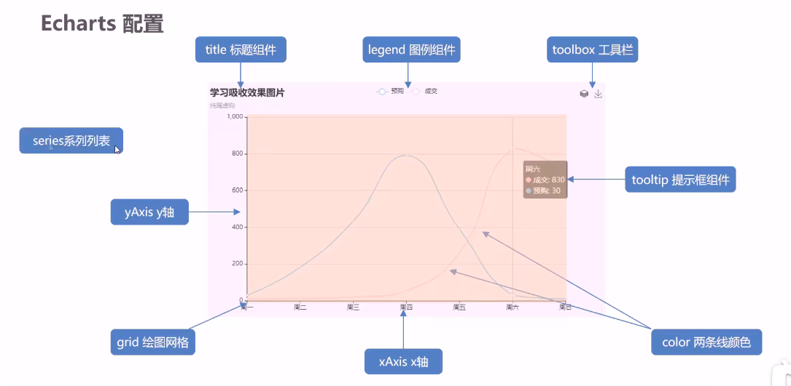

#### 1. rem 适配方案

使用 rem 作为单位时，屏幕大小变化时盒子大小会自动变化，实现自动适配

1. flexible.js 把屏幕分为24等份

2. cssrem 插件的基准值是 80px（总宽度为1920px），该插件可以自动将 px 值转换成 rem 

   插件-配置按钮-配置扩展设置-Root Font Size 里面设置；

---

#### 2. 基本使用

引入之后 初始化 echarts 实例：`var myChart = echarts.init(document.getElementId('main'))`

配置option：`var option = {  }`

最后生成图表：`myChart.setOption(option)`

---

#### 3. 基础配置

可在配置项手册中查看详情：https://echarts.apache.org/zh/option.html#title

| 属性         | 作用                                                         |
| ------------ | ------------------------------------------------------------ |
| title        | 设置图表的标题                                               |
| tooltip      | 图表的提示框组件， trigger 设置触发方式；就是鼠标放在图表上的响应 |
| legend       | 图例组件，各种线条所代表的意义，并且点击可以隐藏这一组数据   |
| toolbox      | 工具箱组件，另存为图片等功能                                 |
| grid         | 网格配置，可以控制图表大小， left, right, bottom；containLabel 可以控制是否显示刻度标签 |
| xAxis，yAxis | 坐标轴；axisLabel 可以设置坐标轴刻度标签相关的样式；axisLine 可以设置坐标轴是否显示；splitLine 可以设置y轴分割线相关样式；axisTick 可以设置刻度相关样式 |
| series       | 系列图表配置，决定着显示哪种类型的图表；是个数组，里面的每个对象代表一组图线； stack 代表数据堆叠，相同的 stack 值会使后面的数据产生叠加效果；itemStyle 可以设置柱子相关样式，例如 barBorderRadius 可以设置圆角； smooth 设置平滑曲线；lineStyle 修改线条样式 |
| color        | 是个数组，分别代表各组数据的颜色；注意只有一项也得写数组     |
|              |                                                              |
|              |                                                              |
|              |                                                              |

