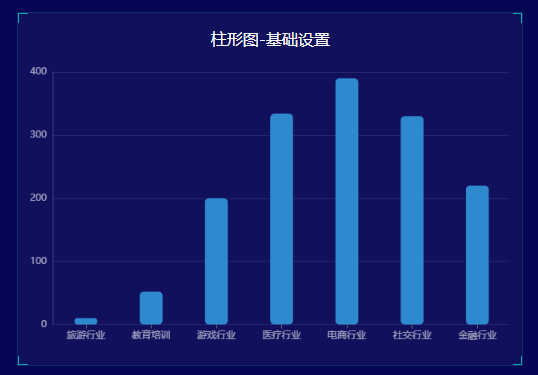
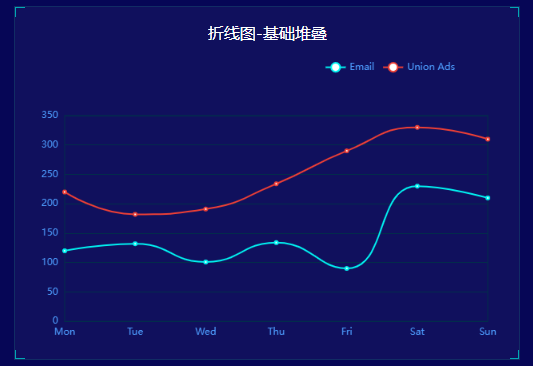
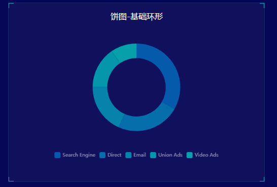

详情：\任务项目\公司任务\echarts

#### 1. 柱状图1



```js
(function () {
  var myChart = echarts.init(document.querySelector("#chart1"));
  var option = {
    color: ["#2f89cf"], //柱子颜色
    tooltip: {
      //鼠标移上去时的样式
      trigger: "axis", //触发方式，axis 表示坐标轴触发；设置为 item 表示数据项图形触发，例如饼图
      axisPointer: {
        type: "shadow", //移到项目上是会有阴影；可选：line, shadow, cross(十字准星)
      },
    },
    //修改图表大小，位置
    grid: {
      left: "0%",
      top: "10px",
      right: "0%",
      bottom: "4%",
      containLabel: true, //控制是否显示刻度标签
    },
    xAxis: [
      {
        type: "category", //设置坐标轴类型；可选：value, category(类目轴), time, log(对数数据)
        data: [
          //横轴数据
          "旅游行业",
          "教育培训",
          "游戏行业",
          "医疗行业",
          "电商行业",
          "社交行业",
          "金融行业",
        ],
        axisTick: {
          //坐标轴刻度相关设置
          alignWithLabel: true, //保证刻度线与标签对齐，
        },
        //修改刻度标签相关样式
        axisLabel: {
          color: "rgba(255,255,255,.6)",
          fontSize: "12",
        },
        //不显示x坐标轴
        axisLine: {
          show: false,
        },
      },
    ],
    yAxis: [
      {
        type: "value",
        axisLabel: {
          color: "rgba(255,255,255,.6)",
          fontSize: "12",
        },
        axisLine: {
          show: true,
          lineStyle: {
            //纵坐标线的相关设置
            color: "rgba(255,255,255,.1)",
            width: 2,
          },
        },
        //分割线
        splitLine: {
          lineStyle: {
            color: "rgba(255, 255, 255, 0.1)",
          },
        },
      },
    ],
    series: [
      {
        name: "Direct",
        type: "bar", //柱状图
        barWidth: "35%", //宽度
        data: [10, 52, 200, 334, 390, 330, 220],
        itemStyle: {
          //修改柱子为圆角
          barBorderRadius: 5,
        },
      },
    ],
  };
  myChart.setOption(option);
  //图表跟随屏幕大小自适应
  window.addEventListener("resize", function () {
    myChart.resize();
  });
})();
```

---

#### 2. 柱状图2


```js
(function () {
  var myChart = echarts.init(document.querySelector("#chart2"));
  var myColor = ["#1089E7", "#F57474", "#56D0E3", "#F8B448", "#8B78F6"];
  var option = {
    grid: {
      top: "10%",
      left: "22%",
      bottom: "10%",
      // containLabel: true,
    },
    xAxis: {
      show: false,
    },
    yAxis: [
      {
        type: "category",
        inverse: true, //设置为方向坐标，这样就能从上到下显示了
        data: ["HTML5", "CSS3", "javascript", "VUE", "NODE"],
        axisLine: {
          show: false, //不显示y轴的线
        },
        axisTick: {
          show: false, //不显示刻度
        },
        axisLabel: {
          color: "#fff",
        },
      },
      {
        type: "category",
        inverse: true,
        data: [702, 350, 610, 793, 664],
        axisLine: {
          show: false, //不显示y轴的线
        },
        axisTick: {
          show: false, //不显示刻度
        },
        axisLabel: {
          color: "#fff",
        },
      },
    ],
    series: [
      //第一组数据为内部数据，条状
      {
        name: "条",
        type: "bar",
        data: [70, 34, 60, 78, 69],
        yAxisIndex: 0, //可以使两组数据重叠
        itemStyle: {
          barBorderRadius: 20,
          //可使每个柱子的颜色都不一样
          color: function (params) {
            // params 就是六个柱子的对象，每次循环一个；而dataIndex则是当前柱子的索引号
            return myColor[params.dataIndex];
          },
        },
        barCategoryGap: 50, //柱子之间的距离
        barWidth: 10, //柱子的宽度
        //显示柱子内部的文字
        label: {
          show: true,
          position: "inside", //设置文字显示的位置，inside表示在内部显示
          formatter: "{c}%", // {c} 会自动解析为 data 中的数据；{a}是系列名，{b}是数据名
        },
      },
      //第二组数据为外部包裹的数据，框状
      {
        name: "框",
        type: "bar",
        barCategoryGap: 50,
        barWidth: 15,
        yAxisIndex: 1,
        data: [100, 100, 100, 100, 100],
        itemStyle: {
          color: "none",
          borderColor: "#00c1de",
          borderWidth: 3,
          barBorderRadius: 15,
        },
      },
    ],
  };
  myChart.setOption(option);
  window.addEventListener("resize", function () {
    myChart.resize();
  });
})();
```

---

#### 3. 折线图1



```js
(function () {
  var myChart = echarts.init(document.querySelector("#chart3"));
  var option = {
    color: ["#00f2f1", "#ed3f35"],
    tooltip: {
      trigger: "axis",
    },
    legend: {
      textStyle: {
        //修改图例组件 文字颜色
        color: "#4c9bfd",
      },
      right: "10%", //位置
    },
    grid: {
      top: "20%",
      left: "3%",
      right: "4%",
      bottom: "3%",
      show: true, //显示边框
      borderColor: "#012f4a", //边框颜色
      containLabel: true, //包含刻度文字在内
    },
    xAxis: {
      type: "category",
      boundaryGap: false, //去除轴间距（使折线图贴边）
      data: ["Mon", "Tue", "Wed", "Thu", "Fri", "Sat", "Sun"],
      axisTick: {
        show: false, //去除刻度
      },
      axisLabel: {
        color: "#4c9bfd",
      },
      axisLine: {
        show: false,
      },
    },
    yAxis: {
      type: "value",
      axisTick: {
        show: false,
      },
      axisLabel: {
        color: "#4c9bfd",
      },
      axisLine: {
        show: false,
      },
      splitLine: {
        lineStyle: {
          color: "#012f4a",
        },
      },
    },
    series: [
      {
        name: "Email",
        type: "line",
        smooth: true,  //平滑曲线显示
        data: [120, 132, 101, 134, 90, 230, 210],
      },
      {
        name: "Union Ads",
        type: "line",
        smooth: true,
        data: [220, 182, 191, 234, 290, 330, 310],
      },
    ],
  };
  myChart.setOption(option);
  window.addEventListener("resize", function () {
    myChart.resize();
  });
})();
```

---

#### 4. 折线图2


主要是 series 里的一些改变

```js
    series: [
      {
        name: "Email",
        type: "line",
        smooth: true,
        //修改线条样式
        lineStyle: {
          color: "#0184d5",
          width: 2,
        },
        //设置填充样式（颜色）
        areaStyle: {
          opacity: 0.8,
          color: new echarts.graphic.LinearGradient(
            0,
            0,
            0,
            1,
            [
              {
                offset: 0,
                color: "rgba(1,132,213,0.9)",
              },
              {
                offset: 0.8,
                color: "rgba(1,132,213,0.1)",
              },
            ],
            false
          ),
          shadowColor: "rgba(0,0,0,.1)",
        },
        //设置拐点
        symbol: "circle",
        symbolSize: 8,
        showSymbol: false, //设置成开始不显示，鼠标悬浮才显示
        //设置拐点颜色及边框
        itemStyle: {
          color: "#0184d5",
          borderColor: "rgba(211,220,107, .1)", //半透明边框
          borderWidth: 12,
        },
        data: [
          30, 40, 30, 40, 30, 40, 30, 60, 20, 40, 30, 40, 30, 40, 30, 40, 30,
          60, 20, 40, 30, 40, 30, 40, 30, 40, 20, 60, 50, 40,
        ],
      },
```

#### 5. 饼图1



```js
(function () {
  var myChart = echarts.init(document.querySelector("#chart5"));
  var option = {
    tooltip: {
      trigger: "item",
    },
    legend: {
      bottom: "10%",
      itemWidth: 15, //修改图表大小
      itemHeight: 15,
      //修改文字样式
      textStyle: {
        color: "rgba(255,255,255,.5)",
        fontSize: "12",
      },
    },
    series: [
      {
        color: ["#065aab", "#066eab", "#0682ab", "#0696ab", "#06a0ab"], //也可写在 option 的下面，与 tooltip 同级
        name: "Access From",
        type: "pie",
        center: ["50%", "40%"], //在容器中的位置，默认是水平垂直居中
        radius: ["40%", "60%"], //修改内圆半径和外圆半径（饼图大小）
        avoidLabelOverlap: false,
        label: {
          show: false,
          position: "center",
        },
        labelLine: {
          show: false,
        },
        data: [
          { value: 1048, name: "Search Engine" },
          { value: 735, name: "Direct" },
          { value: 580, name: "Email" },
          { value: 484, name: "Union Ads" },
          { value: 300, name: "Video Ads" },
        ],
      },
    ],
  };
  myChart.setOption(option);
  window.addEventListener("resize", function () {
    myChart.resize();
  });
})();
```

---

#### 6. 饼图2


```js
    series: [
      {
        color: [
          "#006cff",
          "#60cda0",
          "#ed8884",
          "#ff9f7f",
          "#0096ff",
          "#9fe6b8",
          "#32c5e9",
          "#1d9dff",
        ],
        name: "Nightingale Chart",
        type: "pie",
        //每个模块旁边的文字提示
        label: {
          show: true,
          textStyle: {
            color: "rgba(255,255,255,0.5)",
          },
        },
        //横线
        labelLine: {
          length: 6, //第一条线，链接图形的线条
          length2: 8, //第二条线，链接文字的线条
        },
        radius: ["10%", "70%"],
        center: ["50%", "40%"],
        roseType: "radius", //显示模式为 半径 ；area 为面积模式
        data: [
          { value: 40, name: "rose 1" },
          { value: 38, name: "rose 2" },
          { value: 32, name: "rose 3" },
          { value: 30, name: "rose 4" },
          { value: 28, name: "rose 5" },
          { value: 26, name: "rose 6" },
          { value: 22, name: "rose 7" },
          { value: 18, name: "rose 8" },
        ],
      },
    ],
```


