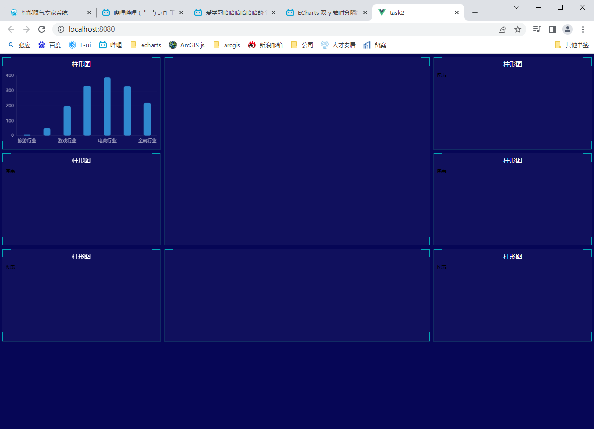

#### 1. echarts的引入

下载：`npm i echarts`

在 vue 组件中引入：`import * as echarts from 'echarts'`


#### 2. rem适配

- 下载： `npm i lib-flexible`
- 引入：在 main.js 中引入，`import 'lib-flexible/flexible.js'`

- 在 node_module/lib-flexible/flexible.js 中修改代码如下：

  ```js
  function refreshRem(){
      var width = docEl.getBoundingClientRect().width;
      // if (width / dpr > 540) {
      //     width = 540 * dpr;
      // }
      var rem = width / 24;
      docEl.style.fontSize = rem + 'px';
      flexible.rem = win.rem = rem;
  }
  ```

  这是按照1920px来划分的，因为分为24等份，故每份为80，故需将 cssrem 设置中的 root font size 改为80

- 安装 cssrem 插件，输入 px 时就可以选择转换为 rem 

#### 3. 盒子布局

```scss
    .panel {
      height: 3.75rem;
      margin: 0.125rem 0.0625rem;
      border: 1px solid rgba(25, 186, 139, 0.17);
      background-color: rgba(255, 255, 255, 0.04);
      position: relative;
      &::before {
        position: absolute;
        top: 0;
        left: 0;
        width: 20px;
        height: 20px;
        border-left: 2px solid #02a6b5;
        border-top: 2px solid #02a6b5;
        content: "";
      }
      &::after {
        position: absolute;
        top: 0;
        right: 0;
        width: 20px;
        height: 20px;
        border-top: 2px solid #02a6b5;
        border-right: 2px solid #02a6b5;
        content: "";
      }
      .panel-footer {
        position: absolute;
        bottom: 0;
        left: 0;
        width: 100%;
        &::before {
          position: absolute;
          bottom: 0;
          left: 0;
          width: 20px;
          height: 20px;
          border-left: 2px solid #02a6b5;
          border-bottom: 2px solid #02a6b5;
          content: "";
        }
        &::after {
          position: absolute;
          bottom: 0;
          right: 0;
          width: 20px;
          height: 20px;
          border-bottom: 2px solid #02a6b5;
          border-right: 2px solid #02a6b5;
          content: "";
        }
      }
      .panel-header {
        height: 0.6rem;
        color: #fff;
        line-height: 0.6rem;
        text-align: center;
        font-size: 0.25rem;
      }
      .chart {
        margin: 0 0.25rem;
        height: 3rem;
        background-color: skyblue;
      }
    }
```


效果如下：
