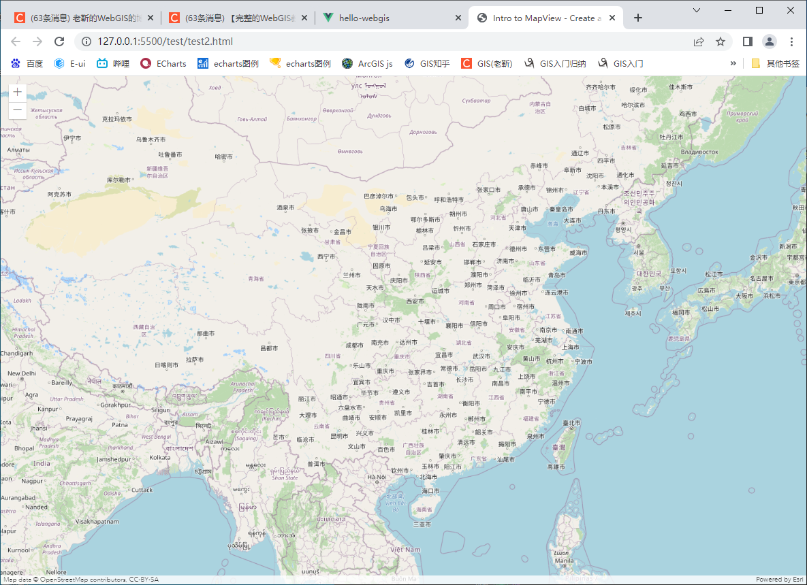
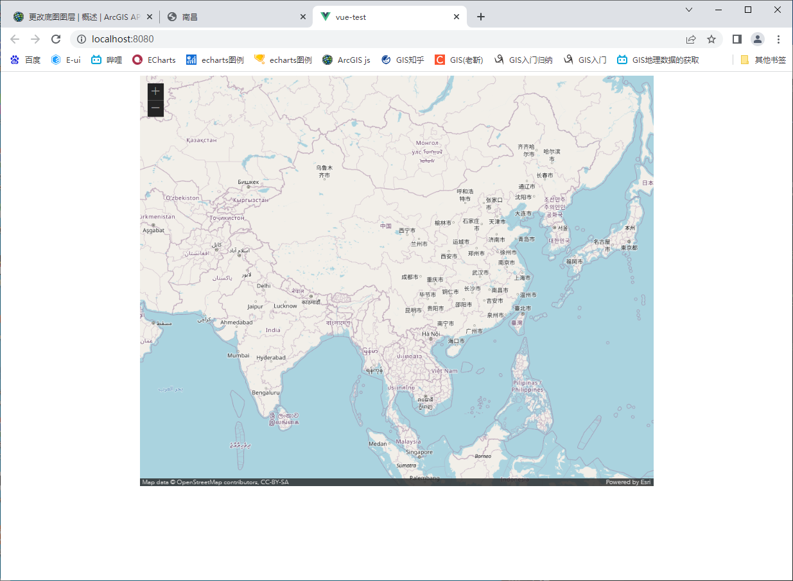

#### 1. 简单示例

```html
<!DOCTYPE html>
<html>
  <head>
    <meta charset="utf-8" />
    <meta
      name="viewport"
      content="initial-scale=1, maximum-scale=1, user-scalable=no"
    />
    <title>Intro to MapView - Create a 2D map</title>
    <style>
      html,
      body,
      #viewDiv {
        padding: 0;
        margin: 0;
        height: 100%;
        width: 100%;
      }
    </style>
    <link
      rel="stylesheet"
      href="https://js.arcgis.com/4.24/esri/themes/light/main.css"
    />
    <script src="https://js.arcgis.com/4.24/"></script>
    <script>
      require(["esri/Map", "esri/views/MapView"], (Map, MapView) => {
        const map = new Map({
          basemap: "osm",
        });
        const view = new MapView({
          container: "viewDiv", // Reference to the view div created in step 5
          map: map, // Reference to the map object created before the view
          zoom: 5, // Sets zoom level based on level of detail (LOD)
          center: [108, 32], // Sets center point of view using longitude,latitude
        });
      });
    </script>
  </head>
  <body>
    <div id="viewDiv"></div>
  </body>
</html>

```





---

#### 2. vue 中使用

```vue
<template>
  <div id="content"></div>
</template>

<script>
import Map from "@arcgis/core/Map";
import MapView from "@arcgis/core/views/MapView";
export default {
  methods: {
    _createMapView: function () {
      const map = new Map({
        //定义map
        basemap: "osm", //地图类型
        ground: "world-elevation",
      });
      const view = new MapView({
        // eslint-disable-line no-unused-vars
        container: "content", //容器
        map: map, //使用map
        zoom: 4, //地图缩放大小
        //经度纬度
        center: [100, 30], //可自定义
      });
      this.view = view;
    },
  },
  mounted: function () {
    this._createMapView();
  },
};
</script>

<style scoped>
#content {
  width: 1000px;
  height: 800px;
  margin: 0 auto;
}
</style>

```


