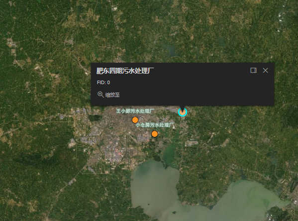

```js
initMap() {
  const url_plantPoint = '/json/aeration/plantPoint.json'
  const map = new Map({
    basemap: 'satellite',
  })
  const view = new MapView({
    container: 'viewDiv',
    map: map,
    zoom: 10,
    center: [117.5, 31.8],
  })

  // 渲染点要素
  const pointRenderer = {
    type: 'simple',
    symbol: {
      type: 'simple-marker',
      color: [252, 146, 31],
      size: '20px',
    },
  }
  // 悬浮时的高亮线边框
  const highlightSymbol = {
    type: 'simple-marker',
    color: [255, 255, 255, 0.4],
    size: '20px',
    outline: {
      color: [0, 255, 255, 0.9],
      width: 3,
    },
  }
  // 为点要素添加标题
  const pointLabels = new LabelClass({
    symbol: {
      type: 'text',
      color: '#FFFFFF',
      haloColor: '#5E8D74',
      haloSize: '1px',
      // font: {
      //   size: '12px',
      //   family: 'Noto Sans',
      //   style: 'italic',
      //   weight: 'normal',
      // },
    },
    labelPlacement: 'above-center',
    labelExpressionInfo: { expression: '$feature.名称' },
  })
  const plantLayer = new GeoJSONLayer({
    // id:'plant-layer',
    url: url_plantPoint,
    spatialReference: { wkid: 5936 },
    title: '污水厂点要素',
    renderer: pointRenderer,
    labelingInfo: [pointLabels],
    // popupTemplate: { title: 'ss' },
  })
  //在MapView中添加鼠标悬浮事件
  let mouseOn = view.on('pointer-move', function (event) {
    view.hitTest(event).then((res) => {
      // 关闭图形，防止多个图形重叠（透明度重复（重叠）造成颜色加深）
      view.graphics.removeAll()
      if (res.results.length) {
        let results = res.results.filter((result) => {
          if (result.graphic.layer) {
            // 返回感兴趣的图层
            return result.graphic.layer.id === plantLayer.id
          }
        })
        if (results.length > 0) {
          let g = results[0].graphic
          let geo = g.geometry
          // 悬浮时的高亮图形
          let highlightGraphic = new Graphic({
            geometry: geo,
            symbol: highlightSymbol,
          })
          view.graphics.add(highlightGraphic)
          // 悬浮时的弹窗
          let point = new Point(geo.x, geo.y, view.spatialReference)
          view.popup.open({ location: point, title: g.attributes.名称, content: 'FID: ' + g.attributes.FID })
        }
      } else {
        view.popup.close()
      }
    })
  })
  plantLayer.on('layerview-destroy', function (event) {
    //当该图形图层关闭时移除该鼠标监控事件
    mouseOn.remove()
  })
  map.add(plantLayer)

  // 让视图范围和点要素范围一致
  // plantLayer.when(() => {
  //   view.extent = plantLayer.fullExtent
  // })

  // 点击事件：跳转路由
  view.on('click', (event) => {
    view.hitTest(event).then((res) => {
      if (res.results.length > 0) {
        let message = res.results[res.results.length - 1].graphic.attributes
        // console.log(message)
        if (message.FID === 0) {
          this.$router.push('/aeration/feidong-plant')
        }
      }
    })
  })
},
```


效果如下：

