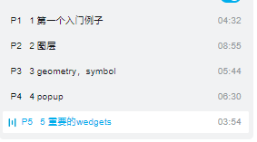

- vue中使用 esri-loader ；loadModules

- 学习参考知识点

- 学习资源

  

- 

| 代码                                | 作用                                   |
| ----------------------------------- | -------------------------------------- |
| map.ground.surfaceColor = "#004c73" | 设置背景颜色， .opacity 可以设置透明度 |
|                                     |                                        |
|                                     |                                        |

