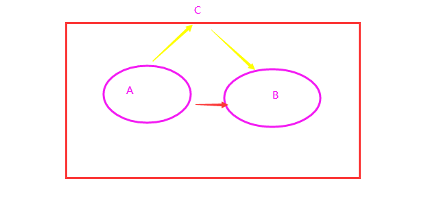

# 一、Vue 基础

## 1、 框架前置

### 1.1 为什么要学习流行框架？

企业为了提高效率，时间就是金钱。

开发人员：提高了开发效率

JS=>JQuery=>模板引擎=>框架时代（Angular(2+)、React、Vue）【好处：不用直接操作DOM，更多关注业务逻辑】

### 1.2 前端框架与库的区别？

- 功能层面

  jquery库：操作DOM+网络请求

  框架：提供全方位功能，齐全

  如果把库比作肯德基的小套餐的话，框架就类似于KFC的全家桶级别的。

  库是以提供API为主，像JQuery提供了大量的API，如果是框架呢，就是提供基础性的服务为主，vue有虚拟Dom的支持，有双向数据绑定的支撑，像这些呢，都会一些基础性的服务，可以提升开发效率。

- 代码层面

  库：是为了实现某个功能，而调用某个函数；

  框架：帮助我们运行编写好的代码（步骤：1、初始化框架自身的一些行为；2、执行你编写好的代码；3、释放一些资源）。

- 总结

  库：单一某个层面；可以任何地方调用库

  框架：大而沉，把代码给框架去执行。是一套完整的解决方案；对项目的侵入性较大，项目如果需要更换框架，则需要重新架构整个项目。

### 1.3 MV* 架构模式

目标：理解MVC、MVP、MVVM

核心思想都是将应用分层。

MV系列架构中，M和V分别指Model层和View层，但其功能会因为框架的不同而变化。

Model层是数据模型，用来存储数据；

View层是视图，展示Model层的数据。

虽然在不同的框架中，Model层和View层的内容可能会有所差别，但是其基础功能不变，变的只是 `数据的传输方式 `。

#### Web1.0时代

前后端未分离阶段：在Web1.0时代，并没有前端的概念。开发一个应用多数采用ASP.NET/Java/PHP编写，项目通常由多个`.aspx`/`.jsp`/`.php`文件构成，每个文件同时包含了HTML、CSS、JavaScript、C#/Java/PHP代码。


服务端比较重，有些内容横跨服务端和客户端。JSP在服务端生成，调用server获取数据，在jsp页面中进行封装，把前端的代码混成一个，返给前端。

这种架构的好处是简单快捷，但是，缺点也非常明显：JSP代码难以维护，前后端未分离，混合在一起，没有前端的概念，后端人员责任较重。

##### 后端MVC

为了让开发更加便捷，代码更容易维护，前后端职责更清晰。便衍生出了MVC开发模式和框架。典型的框架就是Java(Spring、 Structs、 Hibernate)、.Net（ASP.NET MVC）。这时的MVC仅限于服务端。


这种模式存在问题：

1. 前端页面开发效率不高。（后端人员兼顾前端开发，页面效果又不是很完美）
2. 前后端职责不清。（**一定的分离**，未彻底分离，view层，依赖jsp实现模板文件的渲染。）


#### Web2.0时代

自从Gmail的出现，Ajax技术风靡全球。有了Ajax技术之后，前后端的职责更加清晰了。因为前端可以通过Ajax与后端进行数据交互。


#### 1.3.1 MVC(Model-View-Controller)

前端的MVC与后端类似，M（Model）模型，V（View）视图，C（controller）控制器。它是MVC、MVP、MVVM这三者中最早产生的架构，其他两个架构模式是以它为基础发展而来的。

> Model：模型层，负责保存应用数据，与后端数据进行同步。
>
> View：视图层，负责视图展示，将model中的数据可视化出来
>
> Controller：控制器，负责业务逻辑，根据用户行为对Mode数据进行修改。


##### 存在问题：

1. 数据流混乱，可维护性太差。控制器可以修改模型，模型变了，会修改视图；但是也会有视图变了，修改模型。最后是视图修改的模型，还是控制器该的模型，不确定。
2. 由于很多开发者会在view层写逻辑代码，导致view层庞大，而控制层Controller变得单薄（就是简单的数据监听，再调用model层的更改逻辑）。

在前端开发中，缺少MVP开发模式，是以为AngularJS早早的将MVVM架构模式带入了前端。MVP模式在前端开发中并不常见，但是在安卓、IOS等原生开发中，比较常见。


#### 1.3.2 MVP（Model-View-Presenter 主持人，主播）

传统的MVC模式虽然可以管理页面系统中的数据，视图，控制器，但是在视图层创建界面时常常会用到模型层内的数据，==使模型层和视图层耦合在一起==，降低了复用性和灵活性。

MVP与MVC很接近，P指的是Presenter, Presenter可以理解为一 个中间人，它负责着View和Model之间的数据流动，防止View和Model之间直接交流。我们可以看一下图示:


上图可以看出Presenter与View层和Model层之间的通信是双向的。

> 在MVC框架中，View层可以通过访问Model层来更新，但在MVP框架中，View层不能再直接访问Model层，必须通过Presenter层提供的接口，然后Presenter层再去访问Model层。
>
> Presenter负责和Model进行双向交互，还和View进行双向交互。Model层和View层不能直接联系，只能通过Controller层。


从上图可以看出，View层和Model层互不干涉，View层也自由了很多，所以View层可以抽离出来做出来，在复用性上就比MVC框架好很多。

##### 存在问题：

由于View层和Model层都需要经过Presenter层，导致Presenter层比较复杂，维护起来也会有一定的问题；而且，因为没有绑定数据，==所有数据都需要Presenter层进行“手动同步”==，代码量较大，虽然比起MVC框架好很多，但还是有比较多冗余部分。

为了让View层和Model层的数据始终保持一致，MVVM框架出现了。


#### 1.3.3 MVVM模式 

MVVM是**==前端视图层==**的概念，主要关注于 视图层分离，也就是说：MVVM把前端的视图层，分为了 三部分 Model, View , VM ViewModel(视图模型)。  


MVVM是这样分割的：M、V、VM。

上图中最右边的就是M—>model，最左边就是V—>View，中间就是VM—>ViewModel。VM起到连接HTML和JSON数据的桥梁作用。如果JSON数据层改变，那么就通过VM在内存中维护的 虚拟 DOM 重新点对点刷新 View 界面，点对点起到提高效率作用；然后，如果View的某个地方有数据改变，比如用户在input标签里输入内容，有数据变动，那么就映射到Model里面，这就是VM的监听作用。


##### 特性：

1. 数据驱动视图

   好处：当Model层发生数据变化时，页面会自动重新渲染。开发人员值维护好数据的变化，页面结构会被VM会自动渲染出来。

   ViewModel通过实现一套==数据响应式机制==**自动**响应ModeI中数据变化，同时，Viewmodel会实现一套==更新策略==**自动**将数据变化转换为视图更新。

   注意：数据驱动视图是==单向的数据绑定==

2. 双向数据绑定

   前面学习原生JS时，表单收集用户输入，通过ajax提交数据。

   用户==在填写表单==时，双向数据绑定可以帮助开发人员在==不操作DOM的前提下==，==自动==把用户填写的内容==同步到数据源中==

   页面中的input值发生变化，vm会自动把最新的值取出来，更新到数据。

   好处：开发人员不再需要手动操作DOM元素，来获取表单元素输入的最新值；js数据的变化，会被自动渲染到页面上。


#### 总结：

1. 这三个架构模式，反应了前端领域的发展进程。共同目标都是职责划分（分层），解决model 层和view的耦合度问题。切分成功能鲜明的各个层，提高可读性和可维护性。
2. MVC模式出现较早主要应用在后端，如Spring MVC、ASP.NET MVC等。随着Ajax出现，有了纯粹的前端。因此，在前端领域MVC的早期有应用，如Backbone.js。在MVC基础上做些改进，为了实现这种分离关系，需要做很多额外概念的引入，并且进行优化。它的优点是分层清晰，缺点是数据流混乱，灵活性不高，带来维护性问题。
3. MVP模式在是MVC的进化形式，Presenter作为中间层负责MV通信, 解决了两者耦合问题,但P层过于臃肿会导致维护问题。
4. MVVM模式在前端领域有广泛应用。 跟 MVP 架构对比：MVVM中ViewModel 层把 Model 层和 View 层的数据同步自动化了，解决了 MVP 架构中数据同步比较麻烦的问题，不仅减轻了 ViewModel 层的压力，同时使得数据处理更加方便，只需告诉 View 层展示的数据是 Model 层中的哪一部分即可。


　Vue.js 是一个提供了 MVVM 风格的双向数据绑定的 Javascript 库，专注于View 层。它的核心是 MVVM 中的 VM，也就是 ViewModel。 ViewModel负责连接 View 和 Model，保证视图和数据的一致性，这种轻量级的架构让前端开发更加高效、便捷。


> ##### 00-非响应式.html
>
> ```html
> <!DOCTYPE html>
> <html lang="en">
> <head>
>     <meta charset="UTF-8">
>     <meta http-equiv="X-UA-Compatible" content="IE=edge">
>     <meta name="viewport" content="width=device-width, initial-scale=1.0">
>     <title>Document</title>
> </head>
> <body>
>     <div class="box">
> 
>     </div>
>     
>     <button class="btn">点我哦</button>
>     <script>
>         let msg='千锋大前端教研院-Vue学习！'
>         let box=document.querySelector('.box');
>         box.innerHTML=msg;
> 
>         let btn=document.querySelector('.btn');
>         btn.onclick=function(){
>             msg+='加油鸭，加油鸭！'
>             // 原生JS特点：数据变了，界面并不会跟着变化
>             console.log(msg);
>         }
>          
>     </script>
> </body>
> </html>
> ```


##  2、Vue 介绍

### 2.1  简介

Vue 是一个国产框架，之前所学的JQuery库、Bootstrap，基本都诞生于国外。像Vue这种优秀的国产框架少之又少，它的作者是国内大神—尤雨溪。


官网：

https://v2.cn.vuejs.org/


Vue (读音 /vjuː/，类似于 view) 是一套用于构建用户界面的**渐进式框架**。与其它大型框架不同的是，Vue 被设计为可以自底向上逐层应用。**Vue** **的核心库只关注视图层**，不仅易于上手，还便于与第三方库或既有项目整合。另一方面，当与现代化的工具链以及各种支持类库结合使用时，Vue 也完全能够为复杂的单页应用提供驱动。


**兼容性**：**Vue 不支持 IE8 及以下版本**，因为 Vue 使用了 IE8 无法模拟的 ECMAScript 5 特性。但它支持所有兼容 ECMAScript 5 的浏览器。

**开发者工具**:在使用 Vue 时，我们推荐在你的浏览器上安装 **Vue Devtools**。它允许你在一个更友好的界面中审查和调试 Vue 应用


**IE：它是一个用来下载其他浏览器的好工具**


### 2.2 关于渐进式

- 说明

  官网：与其它大型框架不同的是，Vue 被设计为可以自底向上逐层应用。

  简单应用：只需要引入一个轻量而小巧的核心Vue文件即可，这个库压缩完了只有100+kb。

  复杂应用：可以引入各式各样的Vue插件库

  Vue是非常灵活的，可以被逐步集成。也就是说，你可以根据你的需求场景，用不同的方式来使用Vue:

  - 无需构建步骤，渐进式增强静态的HTML
  - 在任何页面中作为Web Components嵌入
  - 单页应用(SPA)
  - 全栈/服务端渲染(SSR)
  - Jamstack I静态站点生成(SSG)
  - 开发桌面端、移动端、WebGL，甚至是命令行终端中的界面

- 体现

  声明式渲染=》组件系统=》客户端路由=》集中式状态管理=》项目构建

  声明式渲染：Vue的最简单用法

  组件系统：开发通用的代码

  客户端路由：开发单页面应用，实现页面的局部更新，支持浏览器的历史回退功能。

  集中式状态管理：规模较大，用了比较多的业务数据，Vuex

  项目构建：如果是大型的商业项目，包括独立开发，测试，部署，上线。


### 2.3 市场地位

Vue.js 是前端的**主流框架之一**，和Angular.js、React.js 一起，并成为前端三大主流框架！Vue.js 是目前最火的一个前端框架，React是最流行的一个前端框架。

Vue是一套用于构建用户界面的渐进式框架。Vue的核心库==**只关注视图层（MVC中的V这一层）**==。是一个单页面框架，是基于模块化组件化的开发模式。它不仅易于上手，还便于与第三方库或既有项目整合。（Vue有配套的第三方类库，可以整合起来做大型项目的开发）

+ React 和 Vue 有许多相似之处，它们都有：

  - 使用 Virtual DOM
  - 提供了响应式 (Reactive) 和组件化 (Composable) 的视图组件。
  - 将注意力集中保持在核心库，而将其他功能如路由和全局状态管理交给相关的库。

+ Vue.js的优点：

  1. 体积小，压缩后只有33kb

  2. 更高的运行效率，基于虚拟dom原理。

     一种可以预先通过JavaScript进行各种计算，把最终的DOM操作计算出来并优化的技术，由于这个DOM操作属于预处理操作，并没有真实的操作DOM，所以叫做虚拟DOM。

  3. 双向数据绑定原理。

     让开发者不用再去操作dom对象，把更多精力投入到业务逻辑上

  4. 生态丰富、学习成本低。

     市面上成熟、稳重的基于vue.js的UI框架、常用组件多。

     基于以上原因，Vue.js对初学者友好，容易上手。国内中小企业用的较多。

  


## 3、Vue 初体验

### 3.1 Vue使用方式

- 方式一：直接CDN引入

  以选择引入开发环境版本还是生产环境版本

  ```html
  <!-- 开发环境版本，包含了有帮助的命令行警告 --> 
  <script src="https://cdn.jsdelivr.net/npm/vue/dist/vue.js"></script>
  <!-- 生产环境版本，优化了尺寸和速度 -->
  <script src="https://cdn.jsdelivr.net/npm/vue"></script>
  ```

- 方式二：下载并引入（**==初学者推荐==**）

  开发环境 ：https://v2.cn.vuejs.org/js/vue.js  

  生产环境 ：https://v2.cn.vuejs.org/js/vue.min.js  

- 方式三：命令行工具（CLI）
  后续通过webpack和CLI的使用，我们使用该方式。


### 3.2 Vue 基本使用

- 声明式渲染

  Vue.js 的核心是一个允许采用简洁的模板语法来声明式地将数据渲染进 DOM 的系统。

  ```html
  <div id="app">
    {{ message }}
  </div>
  ```

  每个 Vue 应用都是通过用 `Vue` 函数创建一个新的 **Vue 实例**开始的：

  ```javascript
  var app = new Vue({  // Vue实例
    el: '#app',    //目的地，挂载点
    data: {		//数据
      message: 'Hello Vue!'
    }
  })
  ```

  

  Hello Vue!

  我们已经成功创建了第一个 Vue 应用！看起来这跟渲染一个字符串模板非常类似，但是 Vue 在背后做了大量工作。现在数据和 DOM 已经被建立了关联，所有东西都是**响应式的**。我们要怎么确认呢？打开你的浏览器的 JavaScript 控制台 (就在这个页面打开)，并修改 `app.message` 的值，你将看到上例相应地更新。

- 挂载的第二种写法

  ```js
  const vm = new Vue({
      // el:'#app', 一般情况挂载都是书写配置项
      //data可以是对象也可以是函数
      data(){
          return {
              msg:'Hello Vue!'
          }
      }
  }).$mount('#app')
  ```


> ##### 01.vue初体验.html
>
> ```html
> <!DOCTYPE html>
> <html lang="en">
> 
> <head>
>     <meta charset="UTF-8">
>     <meta http-equiv="X-UA-Compatible" content="IE=edge">
>     <meta name="viewport" content="width=device-width, initial-scale=1.0">
>     <title>Document</title>
>     <!-- 第一种： -->
>     <!-- <script src="https://cdn.jsdelivr.net/npm/vue/dist/vue.js"></script> -->
>     <!-- 第二种： -->
>     <script src="./lib/vue.js"></script> 
> </head>
> 
> <body>
>     <p>哈哈哈哈</p>
>     <!-- 2、在body中创建一个挂载点 -->
>     <div id="app">
>         {{msg}}
>     </div>
>     <script>
>         // 3、new  Vue实例，并挂载到挂载点上 MV VM(Vue在此充当vm的角色 )
>         const vm = new Vue({ //vue实例
>             // el:'#app', //挂载点
>             data: {
>                 msg: '千锋大前端教研院-Vue学习'
>             }
>         }).$mount('#app')
> 
> 
>         // 数据变了，界面跟着变展示
> 
>         // vm.msg='变了，变了啊'
>     </script>
> </body>
> 
> </html>
> ```
>


#### 总结：

1. 引入vue.js
2. 在body中创建一个挂载点
3. new Vue，挂载到挂载点上


### 3.3 开发者工具

在使用 Vue 时，我们推荐在你的浏览器上安装 **Vue Devtools**。它允许你在一个更友好的界面中审查和调试 Vue 应用

##### devtools不显示处理方式：


## 4、模板语法

插值语法，“Mustache”语法，胡须

​		Vue.js 使用了基于 HTML 的模板语法，允许开发者声明式地将 DOM 绑定至底层 Vue 实例的数据。所有 Vue.js 的模板都是合法的 HTML，所以能被遵循规范的浏览器和 HTML 解析器解析。

​		在底层的实现上，Vue 将模板编译成虚拟 DOM 渲染函数。结合响应系统，Vue 能够智能地计算出最少需要重新渲染多少组件，并把 DOM 操作次数减到最少。

数据绑定最常见的形式就是使用“Mustache”语法 (双大括号) 的文本插值：

```html
<div id="app">
  {{ message }}
</div>
```

```js
var app = new Vue({
  el: '#app',
  data: {
    message: 'Hello Vue!'
  }
})
```

效果：

​	

#### 4.1 {{}} 可以放什么？

> ##### 02.vue插值语法.html
>
> ```html
> <!DOCTYPE html>
> <html lang="en">
> 
> <head>
>     <meta charset="UTF-8">
>     <meta http-equiv="X-UA-Compatible" content="IE=edge">
>     <meta name="viewport" content="width=device-width, initial-scale=1.0">
>     <title>Document</title>
>     <!-- 1、 引入vue -->
>     <script src="vue.js"></script>
> </head>
> 
> <body>
>     <!-- 2、创建挂载节点 -->
>     <div id="app">
>         <h2>模板语法里可以放字符串、num、对象</h2>
>         <!-- 字符串 -->
>         <h3>{{msg}}</h3>
>         <!-- 数字 -->
>         <p>{{num}}</p>
>         <!-- 对象 -->
>         <p>{{obj.name}}--{{obj.age}}</p>
>         {{arr}}---{{ok}}
>         <hr>
>         <h2>{{}} 前后可以加内容：</h2>
>         <h3>11111---{{msg}}---2222</h3>
> 
> 
>         <!-- 使用 JavaScript 表达式 -->
>         <h3>{{num+10}}</h3>
>         <h3>{{ok?12:999}}</h3>
>         <!-- 字符串翻转 -->
>         <h3>{{msg.split('').reverse().join('')}}</h3>
>     </div>
> 
> 
>     <script>
>         // 3、new 实例 
>         const vm = new Vue({
>             el: '#app',
>             data: {
>                 msg: '千锋大前端教研院-Vue学习',
>                 num: 1,
>                 obj: {
>                     name: '千千',
>                     age: 18
>                 },
>                 arr: [2, 4, 6, 8],
>                 ok: true
>             }
>         })
> 
>         vm.msg = '小锋';
>     </script>
> </body>
> </html>
> ```
>
> 


####  4.2 JavaScript 表达式  

迄今为止，在我们的模板中，我们一直都只绑定简单的 property 键值。但实际上，对于所有的数据绑定，Vue.js 都提供了完全的 JavaScript 表达式支持。

表达式：值， 结果

```vue
<!--运算-->
{{ number + 1 }}
<!--三目运算-->
{{ ok ? 'YES' : 'NO' }}
<!--字符串处理-->
{{ message.split('').reverse().join('') }}
```

这些表达式会在所属 Vue 实例的数据作用域下作为 JavaScript 被解析。有个限制就是，每个绑定都只能包含**单个表达式**，所以下面的例子都**不会**生效。

```vue
<!-- 这是语句，不是表达式 -->
{{ var a = 1 }}

<!-- 流控制也不会生效，请使用三元表达式 -->
{{ if (ok) { return message } }}
```


## 5、指令语法

vue中定义好的一些以"v-"开头+具体的名称的属性，这些属性都有特定的功能。

- 说明

  指令加在标签，在Vue中凡是以 `v-` 开头的都叫做指令，加上就会有特定的功能。

- 用法

  ```html
  <div v-xx:prevent.a='表达式'></div>
  <div v-xx></div>  
  <div v-xx='表达式'></div>
  <div v-xx:yy> </div>
  ```

- 注意

  指令等号后是js执行环境，里面要写js表达式

  指令分：自定义指令和内置指令（Vue自带）

​      	内置指令：不需要引入，直接调用即可，每个内置指令都有自己的固定用法

​      	自定义指令：就是用户自己定义的。扩展功能

### 5.1 文本绑定

#### v-html、v-text

双大括号会将数据解释为普通文本，而非 HTML 代码。为了输出真正的 HTML，需要用到v-html

```html
<p>Using mustaches: {{ rawHtml }}</p>
<p>Using v-html directive: <span v-html="rawHtml"></span></p>
<!-- v-text -->
<p>Using v-text directive: <span v-text="rawHtml"></span></p>
```

> ##### 温馨提示
>
> 在网站上动态渲染任意 HTML 是非常危险的，因为这非常容易造成 [XSS 漏洞](https://blog.csdn.net/m0_64378913/article/details/124654153)。请仅在内容安全可信时再使用 `v-html`，并且**永远不要**使用用户提供的 HTML 内容(script也属于HTML内容)。

#### v-cloak

cloak ：[kləuk]  笼罩，覆盖；隐藏，掩饰的意思

用于隐藏尚未完成编译的 DOM 模板。 {{}}

当使用直接在 DOM 中书写的模板时，可能会出现一种叫做“未编译模板闪现”的情况：用户可能先看到的是还没编译完成的双大括号标签，直到挂载的组件将它们替换为实际渲染的内容。

`v-cloak` 会保留在所绑定的元素上，直到相关组件实例被挂载后才移除。配合像 `[v-cloak] { display: none }` 这样的 CSS 规则，它可以在组件编译完毕前隐藏原始模板。

```html
[v-cloak] {
  display: none;
}

<div v-cloak>
  {{ message }}
</div>
```

> 直到编译完成前，`<div>` 将不可见。


#### v-pre

元素内具有 `v-pre`，所有 Vue 模板语法都会被保留并按原样渲染。最常见的用例就是显示原始双大括号标签及内容。

```html
 <div v-pre>{{ rawHTML }}</div>
```


#### 完整代码

> ##### 03.vue常用指令.html
>
> ```html
> <!DOCTYPE html>
> <html lang="en">
> 
> <head>
>     <meta charset="UTF-8">
>     <meta http-equiv="X-UA-Compatible" content="IE=edge">
>     <meta name="viewport" content="width=device-width, initial-scale=1.0">
>     <title>Document</title>
> 
> 
>     <style>
>         [v-cloak] {
>             display: none;
>         }
> 
>         h2 {
>             color: red;
>         }
>     </style>
> 
> </head>
> 
> <body>
>     <!-- 2、创建挂载节点 -->
>     <div id="app">
> 
>         <h2>{{}} 前后可以加内容：</h2>
>         <h3>11111---{{msg}}---2222</h3>
>         <!-- <h2 v-text='msg'>12321313</h2>
>         <h3 v-cloak>
>             {{msg}}
>         </h3>
>         <h3 v-once>
>             {{msg}}
>         </h3> -->
>         <hr>
>         <h2>{{}}、v-html、v-text</h2>
>         <!-- 纯文本插值  以字符串的形式展示 -->
>         <h3>
>             以字符串的形式展示：{{htmlStr}}
>         </h3>
>         <!-- 解析输出 以标签形式展示 -->
>         <div v-html="htmlStr">22222</div>
>         <!-- 转义输出 不用 以字符串的形式展示 -->
>         <div v-text="htmlStr">3333</div>
>         
>         <!-- v-pre 含有该指令的标签内部的语法不会被vue解析 -->
>         <div v-pre>{{ msg }}</div>
> 
>     </div>
> 
>     <!-- 1、 引入vue -->
>     <script src="vue.js"></script>
>     <script>
>         // 3、new 实例 
>         const vm = new Vue({
>             el: '#app',
>             data: {
>                 msg: '千锋大前端',
>                 htmlStr: '<h2>千锋大前端</h2>',
>                 ok: false
>             }
>         })
>     </script>
> </body>
> 
> </html>
> ```


### 5.2 属性绑定

在插值语法中，我们一直都是在动态绑定标签内的值。如果说，我们想要标签的属性也变成动态，可以不可以实现呢？

答案是：可以的！在实际项目开发中，我们经常会从后台请求数据，而这些数据有可能是图片的地址，也有可能是a链接的地址，需要我们给img 标签和a 标签动态绑定指定。此时，就需要我们接下来要讲的 **属性绑定**。

- 说明

  **v-bind指令** 可以给任何属性赋值，是==**从数据到页面**的**单项数据流**==。

  

  

  

  

  ```html
  <!-- 标签里面用 {{}} , 绑定动态属性：v-bind:属性名   -->
  <div class="box" id="" style="">{{}}</div>
  <a href="" ></a>
  
  ```


#### 小结：

> 如果一个属性的值是变量，boolean类型，number类型，对象，数组，null，undefined，使用绑定属性


##### 完整代码

> 04.绑定属性.html
>
> ```vue
> <div id="app">
>     <!-- 标签里面用：{{}}  绑定动态属性：v-bind:属性名-->
>     <!-- v-bind： 是单项数据流 -->
>     <a v-bind:href="link">{{title}}</a>
>     
>     <!-- v-bind 语法糖：   ： -->
>     
>     
>     <p>
>         单向数据流，从数据到视图：
>         <input type="text" v-bind:value="title">
>     </p>
> </div>
> <script>
>     new Vue({
>         el: '#app',
>         data: {
>             link: 'http://www.baidu.com',
>             title:'百度一下',
>             url:'https://cn.vuejs.org/images/logo.svg'
>         }
>     })
> </script>
> ```


#### 5.2.1 动态绑定类属性

操作元素的 class 列表和内联样式是数据绑定的一个常见需求。因为它们都是属性，所以我们可以用 v-bind 处理它们：只需要通过表达式计算出字符串结果即可。不过，字符串拼接麻烦且易错。因此，在将 v-bind 用于 class 和 style 时，Vue.js 做了专门的增强。表达式结果的类型除了字符串之外，还可以是对象或数组。

##### 完整代码

> ##### 05.动态绑定绑定类属性.html
>
> ```vue
> <style>
>     .box {
>         width: 100px;
>         height: 100px;
>         background-color: pink;
>     }
> 
>     .size {
>         font-size: 30px;
>     }
> 
>     .bold {
>         font-weight: 900;
>     }
> </style>
> 
> <!-- 2、挂载点 -->
> <div id="app">
>     <!-- 第一种：对象方式 {属性名：属性值} 【最常用】
> 类样式能否生效依赖于后面的条件是true,还是false -->
>     
>     <button @click="flag=!flag">修改flag</button>
>     
>     <!-- 注意：在vue 当中 静态class和动态绑定class可以同时存在 -->
>     <div class="" v-bind:class="{box:flag,size:3>2}">对象方式</div>
>     <!-- 简写： -->
>     <div class="bold" :class="{box:flag,size:3>2}">对象方式</div>
> 
>     <!-- 第二种：数组方式  active:是个变量，它的值是类名-->
>     <div v-bind:class="[active,{bold:false}]">数组方式</div>
> 
> </div>
> <script>
>     // 3、new Vue 实例
>     new Vue({
>         el: '#app',
>         data: {
>             flag: false,
>             active: 'box'
>         }
>     })
> </script>
> ```


##### 注意：

==在vue 当中 静态class和动态绑定class可以同时存在==

```vue
<!-- 注意：在vue 当中 静态class和动态绑定class可以同时存在 -->
<div class="title" v-bind:class="{box:flag,size:3>2}">对象方式</div>
```


#### 5.2.2 动态绑定style属性

- 对象语法

  `v-bind:style` 的对象语法十分直观——看着非常像 CSS，但其实是一个 JavaScript 对象。CSS property 名可以用驼峰式 (camelCase) 或短横线分隔 (kebab-case，记得用引号括起来) 来命名：

  ```html
  <div v-bind:style="{ color: activeColor, fontSize: fontSize + 'px' }"></div>
  ```

  ```js
  data: {
    activeColor: 'red',
    fontSize: 30
  }
  ```

  

- 数组语法

  `v-bind:style` 的数组语法==可以将多个样式对象==应用到同一个元素上：

  ```html
  <div v-bind:style="[baseStyles, overridingStyles]"></div>
  ```

  

##### 完整代码

> ##### 06.动态绑定style属性.html
>
> ```vue
> <div id="app">
>     <div style="color: pink;font-size:30px">style</div>
> 
>     <!-- 第一种：对象方式 "{属性名：'属性值'，属性名：'属性值'}" -->
>     <div v-bind:style="{color:'red',fontSize:'30px'}">对象方式绑定style</div>
> 
>     <!-- 第二种：数组方式  可以将多个样式对象-->
>     <div :style="[styleObj,styleObj2]">数组方式</div>
> </div>
> <script>
>     new Vue({
>         el: '#app',
>         data: {
>             styleObj:{
>                 color:'green',
>                 fontSize:'40px'
>             },
>             styleObj2:{
>                 background:'yellow'
>             }
>         }
>     })
> </script>
> ```


### 5.3 条件渲染

原生 js : if  判断

```js
if(true){
    //....
}else if(){
    
}else if(){
    
}else{
    
}
```

在Vue当中，条件渲染用 v-if、v-else-if、v-else、v-show。

#### 5.3.1 v-if

`v-if` 指令用于条件性地渲染一块内容。这块内容只会在指令的表达式返回 true 的时候被渲染

```html
<h1 v-if="awesome">Vue is awesome!</h1>
```

也可以用 `v-else` 添加一个“else 块”：

```html
<h1 v-if="awesome">Vue is awesome!</h1>
<h1 v-else>Oh no </h1>
```

**在template上使用**

因为 `v-if` 是一个指令，所以必须将它添加到一个元素上。但是如果想切换多个元素呢？此时可以把一个 `<template>` 元素当做==不可见的包裹元素==，并在上面使用 `v-if`。最终的渲染结果将不包含 `<template>` 元素。 只起包裹作用

```html
<template v-if="ok">
  <h1>Title</h1>
  <p>Paragraph 1</p>
  <p>Paragraph 2</p>
</template>
```

#### 5.3.2 v-else

你可以使用 `v-else` 指令来表示 `v-if` 的“else 块”：

```html
<div v-if="Math.random() > 0.5">
  Now you see me
</div>
<div v-else>
  Now you don't
</div>
```

`v-else` 元素必须紧跟在带 `v-if` 或者 `v-else-if` 的元素的后面，否则它将不会被识别。

`v-else-if`，顾名思义，充当 `v-if` 的“else-if 块”，可以连续使用：

```html
<div v-if="type === 'A'">
  A
</div>
<div v-else-if="type === 'B'">
  B
</div>
<div v-else-if="type === 'C'">
  C
</div>
<div v-else>
  Not A/B/C
</div>
```


####  5.3.3  v-show

另一个用于根据条件展示元素的选项是 `v-show` 指令。用法大致一样：

```vue
<h1 v-show="ok">Hello!</h1>
```

不同的是带有 `v-show` 的元素始终会被渲染并保留在 DOM 中。`v-show` 只是简单地切换元素的 CSS property `display`


**v-if与v-show比较**

`v-if` 是“真正”的条件渲染，因为它会确保在切换过程中条件块内的事件监听器和子组件适当地被销毁和重建（添加和删除）。

`v-if` 也是**惰性的**：如果在初始渲染时条件为假，则什么也不做——直到条件第一次变为真时，才会开始渲染条件块。

相比之下，`v-show` 就简单得多——不管初始条件是什么，==元素总是会被渲染==，并且只是简单地基于 CSS 进行切换。

一般来说，`v-if` 有更高的切换开销，而 `v-show` 有更高的初始渲染开销。因此，如果需要==非常频繁地切换，则使用 `v-show` 较好==；如果==在运行时条件很少改变，则使用 `v-if` 较好==

CSS 控制  display:none   比 v-if 添加删除，效率高


#### 总结：

1. 语法：

   ```vue
   <div v-if='条件1'>条件1成立</div>
   <div v-else-if='条件2'>条件2成立</div>
   <div v-else>条件1，2都不成立</div>
   ```

2. v-if 功能：添加、删除元素；切换频率不高，用v-if


3. v-else-if 、v-else 要配合 v-if 一起使用，不能单独使用

4. v-show 语法:

   ```vue
   <div v-show='条件'>显示</div>
   ```

5. 特点：控制元素的display属性是否none；切换比较频繁，建议使用v-show

   应用场景：切换开销比较高就用 v-show


##### 完整代码：

> ##### 07.条件渲染(v-if与v-show比较).html
>
> ```html
> <!DOCTYPE html>
> <html lang="en">
> 
> <head>
>     <meta charset="UTF-8">
>     <meta http-equiv="X-UA-Compatible" content="IE=edge">
>     <meta name="viewport" content="width=device-width, initial-scale=1.0">
>     <title>Document</title>
>     <script src="./vue.js"></script>
> </head>
> 
> <body>
>     <div id="app">
>         <h2>v-if 条件渲染</h2>
>         <!-- v-if='boolean' 功能：添加、删除
>             特点：控制元素在页面当中是否渲染或者销毁
>          -->
>         <p v-if='isLignt'>天亮了，该起床啦</p>
>         <p v-else>天黑请闭眼</p>
>    
>      <div v-if="flag==='a'">A</div>
>         <div v-else-if="flag==='b'">B</div>
>         <div v-else-if="flag==='c'">C</div>
>         <div v-else>Not A 、B 、C</div>
>    
>      <hr>
>    
>      <h2>v-show 控制显示、隐藏</h2>
>         <!-- 特点：控制元素的 display: none; -->
>         <button @click='isShow=!isShow'>控制显示、隐藏</button>
>         <p v-show='isShow'>控制显示、隐藏</p>
>    
> 
> 
>  </div>
>    
>  <script>
>         new Vue({
>             el: '#app',
>             data: {
>                 isLignt: true,
>                 flag: 'c123',
>                 isShow: true
>             }
>         })
>     </script>
>    </body>
> 
> </html>
> ```


### 5.4 列表渲染

原生JS  遍历数组  for 

我们可以用 `v-for` 指令基于一个数组来渲染一个列表。`v-for` 指令需要使用 `item in items` 形式的特殊语法，其中 `items` 是源数据数组，而 `item` 则是被迭代的数组元素的**别名**。

```html
<ul id="app">
  <li v-for="item in items" :key="item.name">
    {{ item.name }}
  </li>
</ul>

```

```js
var example1 = new Vue({
  el: '#app',
  data: {
    items: [
      { name: '千千' },
      { name: '小峰' }
    ]
  }
})
```

效果：


##### 完整代码：

> ##### 08.v-for列表渲染.html
>
> ```html
> <!DOCTYPE html>
> <html lang="en">
> 
> <head>
>     <meta charset="UTF-8">
>     <meta http-equiv="X-UA-Compatible" content="IE=edge">
>     <meta name="viewport" content="width=device-width, initial-scale=1.0">
>     <title>Document</title>
>     <script src="./vue.js"></script>
> </head>
> 
> <body>
>     <div id="app">
>         <h2>v-for</h2>
>         <!-- 在原生JS当中，想遍历一个数组，首先想到的是for循环。在Vue中如何遍历呢？ -->
>         <!-- 遍历数组 -->
>         <ul>
>             <li v-for='(item,index) in arr' :key='index'>{{item}}</li>
>         </ul>
>         <!-- 遍历对象 -->
>         <ol>
>             <li v-for='(item,index) in obj' :key='index'>{{item}}</li>
>         </ol>
>         <!-- 遍历对象数组 -->
> 
>         <ul>
>             <li v-for="item in books" :key='item.id'>{{item.name}}---{{item.price}}</li>
>         </ul>
> 
>     </div>
>     <script>
>         new Vue({
>             el: '#app',
>             data: {
>                 arr: [2, 4, 6, 8],
>                 obj: {
>                     name: '千千',
>                     age: 19,
>                     sex: 'nv'
>                 },
>                 books: [{
>                         id: 1,
>                         name: 'HTML',
>                         price: 10
>                     }, {
>                         id: 2,
>                         name: 'CSS',
>                         price: 20
>                     },
>                     {
>                         id: 3,
>                         name: 'JS',
>                         price: 30
>                     }, {
>                         id: 4,
>                         name: 'Vue',
>                         price: 40
>                     }
>                 ]
>             }
>         })
>     </script>
> </body>
> 
> </html>
> ```


##### 作业：嵌套列表渲染


```json
[
    {
     "id":1,
     "city":'北京' ,
     "list":["东城区","西城区"]  
    }, {
     "id":2,
     "city":'天津' ,
     "list":["河东区","河西区"]  
    }
]
```


##### 完整代码：

> ##### 09.作业：嵌套列表渲染.html
>
> ```html
> <!DOCTYPE html>
> <html lang="en">
> 
> <head>
>     <meta charset="UTF-8">
>     <meta http-equiv="X-UA-Compatible" content="IE=edge">
>     <meta name="viewport" content="width=device-width, initial-scale=1.0">
>     <title>Document</title>
>     <script src="./vue.js"></script>
> </head>
> 
> <body>
>     <div id="app">
>         <h2>嵌套渲染</h2>
>         <ul>
>             <li v-for='(item,index) in list2' :key='index'>
>                 {{item.city}}
>                 <ol>
>                     <li v-for='(ele,i) in item.list' :key='i'>{{ele.name}}</li>
>                 </ol>
>             </li>
>         </ul>
> 
>     </div>
>     <script>
>         new Vue({
>             el: '#app',
>             data: {
>                 list: [{
>                     "city": "北京",
>                     "list": ["东城区", "西城区"]
>                 }, {
>                     "city": "天津",
>                     "list": ["河东区", "河西区"]
>                 }],
>                 list2: [{
>                     "city": "北京",
>                     "list": [{
>                             "name": "东城区"
>                         },
>                         {
>                             "name": "西城区"
>                         }
>                     ]
>                 }, {
>                     "city": "天津",
>                     "list": [{
>                             "name": "河东区"
>                         },
>                         {
>                             "name": "河西区"
>                         }
>                     ]
>                 }]
> 
>             }
>         })
>     </script>
> </body>
> 
> </html>
> ```


## 6、事件处理

### 6.1 监听事件

可以用 `v-on` 指令监听 DOM 事件，并在触发时运行一些 JavaScript 代码。

语法：

```html
<div id="example-1">
  <button v-on:click="counter += 1">Add 1</button>
  <p>The button above has been clicked {{ counter }} times.</p>
</div>
```

```js
var example1 = new Vue({ 
    el: '#example-1',
    data: {  
        counter: 0 
    } 
})
```

​	

### 6.2 事件处理方法

然而许多事件处理逻辑会更为复杂，所以直接把 JavaScript 代码写在 `v-on` 指令中是不可行的。因此 `v-on` 还可以接收一个需要调用的方法名称

```html
<div id="example-2">  
    <!-- `greet` 是在下面定义的方法名 -->  
    <button v-on:click="greet">Greet</button>
</div>
```

```js
var example2 = new Vue({
  el: '#example-2',
  data: {
    name: 'Vue.js'
  },
  // 在 `methods` 对象中定义方法
  methods: {
    greet: function (event) {
      // `this` 在方法里指向当前 Vue 实例
      alert('Hello ' + this.name + '!')
      // `event` 是原生 DOM 事件
      if (event) {
        alert(event.target.tagName)
      }
    }
  }
})

```


##### 完整代码：

> ##### 10.事件监听.html
>
> ```html
> <!DOCTYPE html>
> <html lang="en">
> 
> <head>
>     <meta charset="UTF-8">
>     <meta http-equiv="X-UA-Compatible" content="IE=edge">
>     <meta name="viewport" content="width=device-width, initial-scale=1.0">
>     <title>Document</title>
>     <script src="./vue.js"></script>
> </head>
> 
> <body>
>     <div id="app">
>         {{num}}
>         <button v-on:click='num+=1'>点我+1</button>
>         <button v-on:click='addNum'>点我+2</button>
> 
>     </div>
>     <script>
>         const vm = new Vue({
>             el: '#app',
>             data: {
>                 num: 0
>             },
>             methods: {
>                 addNum() {
>                     console.log(this);
>                     this.num += 2;
>                 },
>                 subNum() {
> 
>                 }
>             },
>         })
>     </script>
> </body>
> 
> </html>
> ```


### 6.3 事件传递参数

```html
<div id="example-3">
  <button v-on:click="say('hi')">Say hi</button>
  <button v-on:click="say('what')">Say what</button>
</div>
```

```js
new Vue({
  el: '#example-3',
  methods: {
    say: function (message) {
      alert(message)
    }
  }
})
```


##### 小结：

事件相关：1、this 指向   2、传参  3、事件对象


1. this 指向： 指向当前实例

2. 传参：  ` v-on:click="say('Hi')"`

3. 事件对象：

   不带参数:接受到的第一个参数就是事件对象 

   带参数：又要用事件对象时，必须写成$event！！！！！


##### 完整代码

> ##### 10.事件监听相关.html
>
> ```html
> <!DOCTYPE html>
> <html lang="en">
> 
> <head>
>     <meta charset="UTF-8">
>     <meta http-equiv="X-UA-Compatible" content="IE=edge">
>     <meta name="viewport" content="width=device-width, initial-scale=1.0">
>     <title>Document</title>
>     <script src="vue.js"></script>
> 
> </head>
> 
> <body>
>     <div id="app">
>         {{msg}}
>         <button v-on:click="test">查看this</button>
>         <!-- 传参 -->
>         <button v-on:click="say('Hi')">传参</button>
>         <!-- 事件对象  1、不带参数:接受到的第一个参数就是事件对象 -->
>         <button v-on:click="add">不带参数 查看事件对象</button>
>         <!-- 2、带参数：又要用事件对象时，必须写成$event！！！！！ -->
>         <button v-on:click="sub(2,$event)">带参数 查看事件对象</button>
>         <!-- 语法糖:简写   v-on的语法糖： @-->
>         <button @click="test">语法糖</button>
> 
>     </div>
> 
>     <script>
>         new Vue({
>             el: '#app',
>             data: {
>                 msg: 'Vue'
>             },
>             methods: {
>                 test() {
>                     // this  当前实例
>                     console.log(this.msg);
>                     this.add();
>                 },
>                 add(e) {
>                     console.log(e);
>                 },
>                 say(msg) {
>                     alert(msg)
>                 },
>                 sub(num, e) {
>                     console.log(num, e);
>                 }
>             },
>         })
>     </script>
> 
> </body>
> 
> </html>
> ```


### 6.4 事件修饰符

在事件处理程序中调用 `event.preventDefault()` 或 `event.stopPropagation()` 是非常常见的需求。尽管我们可以在方法中轻松实现这点，但更好的方式是：方法只有纯粹的数据逻辑，而不是去处理 DOM 事件细节。

为了解决这个问题，Vue.js 为 `v-on` 提供了**事件修饰符**。之前提过，修饰符是由点开头的指令后缀来表示的。

#### 6.4.1 事件修饰符

- `.stop`
- `.prevent`
- `.capture`
- `.self`
- `.once`
- .passive

```html
<!-- 阻止单击事件继续传播 -->
<a v-on:click.stop="doThis"></a>

<!-- 提交事件不再重载页面 -->
<form v-on:submit.prevent="onSubmit"></form>

<!-- 修饰符可以串联 -->
<a v-on:click.stop.prevent="doThat"></a>

<!-- 只有修饰符 -->
<form v-on:submit.prevent></form>

<!-- 添加事件监听器时使用事件捕获模式 -->
<!-- 即内部元素触发的事件先在此处理，然后才交由内部元素进行处理 -->
<div v-on:click.capture="doThis">...</div>

<!-- 只当在 event.target 是当前元素自身时触发处理函数 -->
<!-- 即事件不是从内部元素触发的 -->
<div v-on:click.self="doThat">...</div>
```

#### 6.4.2 按键修饰符

在监听键盘事件时，我们经常需要检查详细的按键。Vue 允许为 `v-on` 在监听键盘事件时添加按键修饰符：

.enter
.tab
.delete (捕获“删除”和“退格”键)
.esc
.space
.up
.down
.left
.right

```html
<input v-on:keyup.enter="submit">
```

#### 6.4.3 系统修饰键

可以用如下修饰符来实现仅在按下相应按键时才触发鼠标或键盘事件的监听器。

- `.ctrl`
- `.alt`
- `.shift`
- `.meta`

```html
<!-- Alt + C -->
<input v-on:keyup.alt.67="clear">

<!-- Ctrl + Click -->
<div v-on:click.ctrl="doSomething">Do something</div>
```


##### 完整代码

> ##### 10.事件修饰符.html
>
> ```html
> <!DOCTYPE html>
> <html lang="en">
> 
> <head>
>     <meta charset="UTF-8">
>     <meta http-equiv="X-UA-Compatible" content="IE=edge">
>     <meta name="viewport" content="width=device-width, initial-scale=1.0">
>     <title>Document</title>
>     <script src="vue.js"></script>
>     <style>
>         .outer {
>             width: 200px;
>             height: 200px;
>             background-color: skyblue;
>         }
> 
>         .inner {
>             width: 100px;
>             height: 100px;
>             background-color: yellowgreen;
>         }
>     </style>
> </head>
> 
> <body>
>     <div id="app">
>         <div class="outer" v-on:click="btnOuter">
>             <!-- 阻止冒泡  @click.stop-->
>             <div class="inner" @click.stop="btnInner">
> 
>             </div>
>         </div>
>         <!-- 阻止默认行为 -->
>         <a href="http://www.baidu.com" @click.prevent="test">百度一下，你就可以跳转了</a>
> 
>         <!-- 按钮修饰符 -->
>         <!-- @keyup.enter 只有按的是回车，才触发后面的submit 方法 -->
>         <input type="text" @keyup.enter="submit">
>         <!-- 特殊 -->
>         <input type="text" @keydown.tab="submit">
>         <!-- 系统修饰键 -->
>         <input type="text" @keyup.alt.67="clear">
>     </div>
> 
>     <script>
>         new Vue({
>             el: '#app',
>             data: {
> 
>             },
>             methods: {
>                 btnOuter() {
>                     console.log('我是外面的盒子')
>                 },
>                 btnInner(event) {
>                     console.log('我是里面的盒子');
>                     // 阻止冒泡，扼杀在摇篮里  原生JS写法
>                     // event.stopPropagation();
> 
>                 },
>                 test() {
>                     console.log('我不让你跳');
>                 },
>                 // 键盘抬起事件
>                 submit() {
>                     console.log(222);
>                 },
>                 clear() {
>                     //。。。。。
>                     console.log('333');
>                 }
>             },
> 
>         })
>     </script>
> </body>
> 
> </html>
> ```
>


### 6.5 案例：点击高亮

要求：

1. 动态渲染列表
2. 点谁高亮，谁高亮


```vue
<div id="app">
        <ul>
            <!-- 点谁，给谁添加背景颜色 -->
            <li v-for="(item,index) in 10" :key="index">{{item}}</li>
        </ul>

    </div>
    <script>
        new Vue({
            el: '#app',
            data: {

            }
        })
    </script>
```

实现：

> ##### 11.案例：点击高亮.html
>
> ```vue
> <div id="app">
>         <ul>
>             <!-- 点谁，给谁添加背景颜色 -->
>             <!-- 对象方式： active是否显示，取决于后面判断添加-->
>             <li v-for="(item,index) in 10" :key="index" :class="{active:index==num}" @click="changNum(index)">{{item}}
>             </li>
>         </ul>
> 
> 
>     </div>
>     <script>
>         new Vue({
>             el: '#app',
>             data: {
>                 num: 0
>             },
>             methods: {
>                 changNum(index) {
>                     // console.log(index);
>                     this.num = index;
>                 }
>             },
>         })
>     </script>
> ```
>


### 6.6 v-for一定要绑定key属性

#### v-for 为什么一定要绑定key?

> 有相同父元素的子元素必须有**独特的 key**。重复的 key 会造成渲染错误。

https://v2.cn.vuejs.org/v2/api/#key

##### 结论：

设置key的目的，就是为了让列表中当前节点得到复用。像vue、react、还有小程序当中，只要用了遍历，生成同样结构的数据，必须要给每个结构加一个唯一性的标识。


#### 为什么需要虚拟DOM？

数据渲染到界面要经历创建虚拟DOM的过程，才能真正上DOM树。

1. 真实DOM太重，属性太多。虚拟DOM轻。
2. 新旧虚拟DOM之间的对比，效率更高。


**虚拟Dom**：是真实Dom的映射，即用 JS 对象来描述真实DOM节点，本质上就是在 JS 和 DOM 之间做了一个缓存。

真实DOM：

```vue
<ul id='list'>
    <li class='item'>aa</li>
    <li class='item'>bb</li>
    <li class='item'>cc</li>
</ul>
```

虚拟DOM：

```js
{
    tagName:'ul',//节点标签名
    props:{//dom的属性，用一个对象存储键值对
        id:'list'
    },
    children:[//该节点的子节点
        {tagName:'li',props:{class:'item'},children:['aa']}，
        {tagName:'li',props:{class:'item'},children:['bb']},
        {tagName:'li',props:{class:'item'},children:['cc']}
    ]
}
```

别名：vdom、vnode、virtual dom、virtual node


**diff 算法**：比较两棵虚拟 DOM 树的差异，最小量变化

**patch**：将两个虚拟 DOM 对象的差异应用到真正的 DOM 树。


#### 为什么key属性最好不要用下标


#### 总结：          

1. 列表渲染一定要绑定key!!!!!!
2. 设置key的目的，就是为了让列表中当前节点得到复用
3. 原则：尽量不要用下标，用后台提供的唯一标识！

 

## 7、表单输入绑定

回顾：前面我们讲过从data数据到页面的单向绑定，用到v-bind，如果要实现双向绑定，就用到了接下来要讲的 v-model。

### 7.1 v-model

`v-model`  ：可以实现表单元素和Model层中的数据的双向绑定，特点注意：==只能应用在表单类元素单中！==

​		你可以用 `v-model` 指令在表单 `<input>`、`<textarea>` 及 `<select>` 元素上创建双向数据绑定。它会根据控件类型自动选取正确的方法来更新元素。尽管有些神奇，但 `v-model` 本质上不过是语法糖。它负责监听用户的输入事件以更新数据，并对一些极端场景进行一些特殊处理。

`v-model` 在内部为不同的输入元素使用不同的 property 并抛出不同的事件：

- text 和 textarea 元素使用 `value` property 和 `input` 事件；
- checkbox 和 radio 使用 `checked` property 和 `change` 事件；
- select 字段将 `value` 作为 prop 并将 `change` 作为事件。

你可以用 v-model 指令在表单控件元素上创建双向数据绑定

​	

v-model 默认收集的是表单元素中 value 的值


#### 案例：自动收集表单数据


```vue
<div id="app">
    <p>{{msg}}</p>
    <input type="text" v-model="msg">
    <!-- v-model 默认收集的是表单元素中 value 的值 -->
    <input type="text" value="123">

    <hr>
    <h2>自动收集表单数据</h2>
    <p>用户名：
        <input type="text" v-model="userInfo.useranme"></p>
    <p>密码：<input type="text" v-model="userInfo.pwd"></p>
    <p>
        性别：男 <input type="radio" name="gender" value="boy" v-model="userInfo.gender">
        女 <input type="radio" name="gender" value="girl" v-model="userInfo.gender">
    </p>
    <p>
        爱好：
        ⚽ <input type="checkbox" name="hobby" value="1" v-model="userInfo.hobby">
        🏀 <input type="checkbox" name="hobby" value="2" v-model="userInfo.hobby">
        🏓 <input type="checkbox" name="hobby" value="3" v-model="userInfo.hobby">
    </p>
    <p>
        <button @click="submit">提交</button>
    </p>
</div>

<script>
    new Vue({
        el: '#app',
        data: {
            msg: '千锋大前端',
            // 表单数据对象
            userInfo: {
                useranme: '易烊千玺',
                pwd: '123',
                gender: 'boy',
                hobby: ['2']
            }
        },
        methods: {
            submit() {
                console.log(this.userInfo);
            }
        },
    })
</script>
```


#### 完整代码

> ##### 12-02.v-model.html
>
> ```html
> <!DOCTYPE html>
> <html lang="en">
> 
> <head>
>     <meta charset="UTF-8">
>     <meta http-equiv="X-UA-Compatible" content="IE=edge">
>     <meta name="viewport" content="width=device-width, initial-scale=1.0">
>     <title>Document</title>
>     <script src="vue.js"></script>
> </head>
> 
> <body>
>     <div id="app">
>         <p>{{msg}}</p>
>         <input type="text" v-model="msg">
>         <!-- v-model 默认收集的是表单元素中 value 的值 -->
>         <input type="text" value="123">
> 
>         <hr>
>         <h2>自动收集表单数据</h2>
>         <p>用户名：
>             <input type="text" v-model="userInfo.useranme"></p>
>         <p>密码：<input type="text" v-model="userInfo.pwd"></p>
>         <p>
>             性别：男 <input type="radio" name="gender" value="boy" v-model="userInfo.gender">
>             女 <input type="radio" name="gender" value="girl" v-model="userInfo.gender">
>         </p>
>         <p>
>             爱好：
>             ⚽ <input type="checkbox" name="hobby" value="1" v-model="userInfo.hobby">
>             🏀 <input type="checkbox" name="hobby" value="2" v-model="userInfo.hobby">
>             🏓 <input type="checkbox" name="hobby" value="3" v-model="userInfo.hobby">
>         </p>
>         <p>
>             <button @click="submit">提交</button>
>         </p>
>     </div>
> 
>     <script>
>         new Vue({
>             el: '#app',
>             data: {
>                 msg: '今天周五了✌',
>                 // 表单数据对象
>                 userInfo: {
>                     useranme: '易烊千玺',
>                     pwd: '123',
>                     gender: 'boy',
>                     hobby: ['2']
>                 }
>             },
>             methods: {
>                 submit() {
>                     console.log(this.userInfo);
>                 }
>             },
>         })
>     </script>
> </body>
> 
> </html>
> ```


### 7.2 ref 来获取表单中的数据

> 用于注册元素或子组件的引用。

- 说明

  给DOM元素或组件起名字，相当于 id 标记，通过：this.$refs.名字 获取给Dom元素

- 语法

  ```html
  <input type='text' ref='userInfo' />  <!--相当于给input框取个名字，相当于id-->
  
  this.$refs.userInfo.value
  this.$refs.changeColor.style.color='red'
  ```

- 应用

  获取Dom节点


> ##### 12-03. ref 来获取表单中的数据.html
>
> ```vue
> <div id="app">
>   <!-- （1）ref 来获取表单中的数据 : 获取DOM元素，再获取里面的值-->
>   <input type="text" ref="name">
>   <input type="text" ref="pwd">
> 
>   <button @click="getVal">获取表单值</button>
> 
>   <!-- （2）获取Dom元素 -->
>   <h2 ref="myTitle" @click="changeColor">点我变色</h2>
> </div>
> <script>
>  new Vue({
>      el: '#app',
>      data: {
> 
>      },
>      methods: {
>          getVal() {
>              console.log(this.$refs.name.value);
>          },
>          changeColor() {
>              console.log(this.$refs.myTitle.style.color = 'red');
>          }
>      },
>  })
> </script>
> ```


### 7.3 修饰符

.**lazy**

在默认情况下，`v-model` 在每次 `input` 事件触发后将输入框的值与数据进行同步 (除了[上述](https://cn.vuejs.org/v2/guide/forms.html#vmodel-ime-tip)输入法组合文字时)。你可以添加 `lazy` 修饰符，从而转为在 `change` 事件_之后_进行同步：

```html
<!-- 在“change”时而非“input”时更新 -->
<input v-model.lazy="msg">
```


.**number**

如果想自动将用户的输入值转为数值类型，可以给 `v-model` 添加 `number` 修饰符：

```html
<input v-model.number="age" type="number">
```

这通常很有用，因为即使在 `type="number"` 时，HTML 输入元素的值也总会返回字符串。如果这个值无法被 `parseFloat()` 解析，则会返回原始的值。


.**trim**

如果要自动过滤用户输入的首尾空白字符，可以给 `v-model` 添加 `trim` 修饰符：

```html
<input v-model.trim="msg">
```


### 7.4 v-model实现的原理

v-model只不过是一个语法糖而已,真正的实现靠的还是

==原理：==
      1、通过v-bind，动态绑定value属性
      2、监听input事件，把变化后的值赋值给变量

v-model 是什么。语法糖 :value + @input。还要分为两种情况


> ##### 12.v-model实现的原理.html
>
> ```vue
> <div id="app">
>     -----{{msg}}----
>     <!-- .lazy  失去焦点 -->
>     <input type="text" v-model.lazy="msg">
>     <input type="text" v-model.number="num" type="number">
>     <input type="text" v-model.trim="msg">
> 
>     <hr>
>     <h2>v-model实现的原理</h2>
>     <!-- 默认收集的是表单元素的  value 的值 -->
>     <!-- 
>         ==原理：==
>         1、通过v-bind，动态绑定value数据
>         2、监听input事件，把变化后的值赋值给变量
> 		-->
>     {{val}}
>     <input type="text" :value="val" @input="change">
>     <input type="text"  :value="val" @input="val=$event.target.value">
> </div>
> 
> <script>
>     new Vue({
>         el: '#app',
>         data: {
>             msg: '  新的一周，加油鸭！ ',
>             num: 10,
>             // parseInt()
>             val: '初始值'
>         },
>         methods: {
>             change(e) {
>                 // e.target.value
>                 console.log(e.target.value);
>                 this.val = e.target.value;
>             }
>         },
>     })
> </script>
> ```
>


## 8、数据劫持与代理

### Object.defineProperty()

Vue中很多地方都用到了它，比如说Vue中的数据劫持、数据代理、计算属性等都用到了这个方法。

https://developer.mozilla.org/zh-CN/docs/Web/JavaScript/Reference/Global_Objects/Object/defineProperty

作用：为对象添加或者修改属性，使之变为==响应式的==。  数据劫持，拦截了做点儿啥事儿。

响应式：自动变，一个变了，另一个也跟着变  

#### 基本用法

```vue
<script>
        let obj={
            firstname:'易烊',
            lastname:'千玺'
        }
        // obj.fullname='易烊-千玺'
        // obj.firstname='欧阳';

        // console.log(obj);

        // obj.fullname=10
        Object.defineProperty(obj,'fullname',{
            value:10, //直接设置 a 属性的值为10
            writable:true, //是否可写，false 为不可写
            enumerable:true,  //可以枚举     
        })

        Object.defineProperty(obj,'b',{
            value:'abc',
            enumerable:true
        })
  
        obj.fullname=11 //writable:false,不可修改
        console.log(obj);

        // for in   遍历可枚举
        for (const key in obj) {
            console.log(key,obj[key]);
        }
    </script>
```


### 使属性变成响应式

```vue
<h2>Object.defineProperty</h2>
作用：为对象添加或修改现有属性，使之变成响应式
话术：Vue的数据绑定的原理是由 数据劫持结合订阅发布模式实现的。那么，什么是数据劫持呢？Vue 实现数据劫持 就是靠的Object.defineProperty() 来实现劫持。由这个方法定义的对象属性，都有一个getter,setter，当你试图访问某个属性时，就会走getter()，给这个属性设置值时，就走setter方法。
<!-- 数据响应式：数据变了，界面跟着变 -->
<script>

    let obj = {
        firstname: '易烊',
        lastname: '千玺'
    }
    // obj.fullname='易烊-千玺'
    // obj.firstname='欧阳';

    // console.log(obj);

    // obj.fullname=10
    Object.defineProperty(obj, 'fullname', {
        // getter  当访问这个属性时，走getter
        // value:10,
        get() {
            // 拦截 劫持  //[,,,,,,] 依赖收集
            console.log('你正在企图访问：fullname 属性');
            return this.firstname + '-' + this.lastname;
        },
        // setter  当给属性设置值时，走setter  发布  
        set(val) {
            console.log('你正在企图设置fullname的值:' + val);
            // 古力-娜扎
            let arr = val.split('-');
            console.log(arr);
            this.firstname=arr[0];
            this.lastname=arr[1];
        }
    })
    obj.firstname = '欧阳'
    obj.lastname = '娜娜'

    console.log(obj.fullname);  //[,,,,,,]

    obj.fullname = '古力-娜扎'

    console.log(obj);
</script>
```


> ##### 13.Object.defineProperty数据劫持.html
>
> ```html
> <!DOCTYPE html>
> <html lang="en">
> 
> <head>
>     <meta charset="UTF-8">
>     <meta http-equiv="X-UA-Compatible" content="IE=edge">
>     <meta name="viewport" content="width=device-width, initial-scale=1.0">
>     <title>Document</title>
> </head>
> 
> <body>
>     <h2>Object.defineProperty</h2>
>     作用：为对象添加或者修改属性，使之变成响应式
> </body>
> <script>
>     // vue的双向绑定是由==数据劫持==结合==发布者－订阅者模式==实现的，那么什么是数据劫持？vue是如何进行数据劫持的？说白了就是通过Object.defineProperty()来劫持对象属性的setter和getter操作，在数据变动时做你想要做的事情．我们可以看一下通过控制台输出一个定义在vue初始化数据上的对象是什么．
>     let obj = {
>         firstname: 'yiyang',
>         lastname: 'qianxi'
>     }
>     // obj.fullname='yiyang-qianxi';
>     // console.log(obj);
>     // obj.firstname='ouyang'
>     // console.log(obj);
>     // obj.fullname='guli-nazha';
>     // console.log(obj);
>     // obj.fullname
> 
>     Object.defineProperty(obj, 'fullname', {
>         // getter,setter
>         get() {
>             // 当我访问这个属性时，走getter方法
>             console.log('你企图在访问fullanme');
>             return this.firstname + '-' + this.lastname;
>         },
>         set(value) {
>             // 当我给这个属性设置值时，走setter方法
>             console.log('你企图在设置fullanme为:' + value);
>             let arr = value.split('-');
>             this.firstname = arr[0];
>             this.lastname = arr[1];
>         }
>     })
>     // obj.fullname='123'
>     console.log(obj.fullname);
>     obj.fullname = 'guli-nazha';
>     console.log(obj);
> </script>
> 
> </html>
> ```


### 模拟数据代理

前面给大家留了个悬念：数据明明定义在了data里，而我们通过 vm.msg 却可以直接访问和修改，并且影响视图变化。Vue 内部到底怎么做的呢？在这里呢，就给大家揭开它的神秘面纱。

答案就是：数据代理。Vue实现数据代理，还是靠Object.defineProperty()

#### 完整代码

> ##### 13.模拟数据代理.html
>
> ```vue
> <script>
>     let vm = {};
>     let data = {
>         msg: '哈哈哈哈'
>     }
> 
>     Object.defineProperty(vm, 'msg', {
>         get() {
>             return data.msg
>         },
>         set(val) {
>             data.msg = val;
>         }
>     })
>  
>     // vm.msg
>     console.log(vm.msg)
>     vm.msg='123'
>     // console.log(vm);
>     console.log(data);
> </script>
> ```
>


## 9、计算属性

模板内的表达式非常便利，但是设计它们的初衷是用于简单运算的。在模板中放入太多的逻辑会让模板过重且难以维护。例如：

```html
<div id="example">
  {{ message.split('').reverse().join('') }}
</div>
```

在这个地方，模板不再是简单的声明式逻辑。你必须看一段时间才能意识到，这里是想要显示变量 `message` 的翻转字符串。当你想要在模板中的多处包含此翻转字符串时，就会更加难以处理。

所以，对于任何复杂逻辑，你都应当使用**计算属性**。

**例子**

```html
<div id="example">
  <p>Original message: "{{ message }}"</p>
  <p>Computed reversed message: "{{ reversedMessage }}"</p>
</div>
```

```js
var vm = new Vue({
  el: '#example',
  data: {
    message: 'Hello'
  },
  computed: {
    // 计算属性的 getter
    reversedMessage: function () {
      // `this` 指向 vm 实例
      return this.message.split('').reverse().join('')
    }
  }
})
```

结果：

Original message: "Hello"

Computed reversed message: "olleH"


#### 案例：计算属性 VS 方法


#### 小结：

##### 计算属性：

- 概念：由计算得来的属性。当你需要一个属性，不需要在data中提前声明，而是由其他现有属性计算得到。

- 特点：是基于它的依赖而进行缓存。依赖变了，计算属性就重新计算;依赖不变，计算属性就不变。

- 应用：做大量计算的时候；如 购物车计算总价：数量*单价+数量*单价+数量*单价....

##### 方法：

- 方法不存在缓存。调用几次方法，就执行几次方法，每次调用都执行


> ##### 14.方法和计算属性.html
>
> ```vue
> <div id="app">
>     姓：<input type="text" v-model="firstname">
>     名：<input type="text" v-model="lastname">
>     <!-- 迪丽-热巴 -->
>     <!-- 迪丽-热巴 -->
>     <!-- 第一种方式 1、字符串拼接 【不用】-->
>     <p>1、字符串拼接: {{firstname+'-'+lastname}}</p>
>     <!-- 第二种方式 2、方法 【不用】-->
>     <p>2、方法：{{getFullName()}}</p>
>     <p>2、方法：{{getFullName()}}</p>
>     <p>2、方法：{{getFullName()}}</p>
> 
>     <p>3、计算属性：{{fullname}}</p>
>     <p>3、计算属性：{{fullname}}</p>
>     <p>3、计算属性：{{fullname}}</p>
> 
>     <p>计算属性简写方式：{{fullname2}}</p>
>     <!-- 计算属性：
> 由计算得来的属性。当你需要一个属性，不需要在data中提前声明，而是由其他现有属性计算得到。
> 特点：是基于它的依赖而进行缓存。依赖变了，计算属性就重新计算;依赖不变，计算属性就不变。
> 应用：做大量计算的时候；如 购物车计算总价：数量*单价+数量*单价+数量*单价....
> 
> 方法：  方法不存在缓存。调用几次方法，就执行几次方法，每次调用都执行-->
> </div>
> 
> <script>
>     new Vue({
>         el: '#app',
>         data: {
>             firstname: '迪丽',
>             lastname: '热巴'
>         },
>         methods: {
>             getFullName() {
>                 console.log('方法调用啦......');
>                 return this.firstname + '-' + this.lastname;
>             }
>         },
>         computed: {
>             // 计算属性，是基于它的依赖而变化的。
>             // 完整写法：
>             fullname: {
>                 // getter函数的返回值，就是计算属性的值
>                 get() {
>                     console.log('计算属性调用了.....');
>                     return this.firstname + '-' + this.lastname;
>                 },
>                 // 设置值时
>                 set(val) {
> 
>                 }
>             },
>             // 如果计算属性中只有getter方法，可以简写
>             fullname2() {
>                 return this.firstname + '-' + this.lastname;
>             }
>         },
>     })
> </script>
> ```
>


## 10、侦听器

又名 监视器。

- 说明

  监视的是已有数据。

  监听==单个数据的变化==，一旦数据有变化执行相应的方法。跟计算属性有类似的地方，数据的变化会触发方法。侦听器的特点：数据变化时==执行异步==或==开销较大的操作==。

- 用法

  监视基本的数据类型： 属性(新值,旧值)

  案例：监听姓，名的变化，改变下面的全称。

  

  ```js
  watch: {
      firstName: function(val){
          // val表示变化之后的值
          this.fullName = val + this.lastName;
      },
      lastName: function(val) {
     		 this.fullName = this.firstName + val;
      } ,
     //完整写法
          lastname: {
            handler(newVal, oldVal) {
              this.fullname = this.firstname + '-' + newVal;
            },
            immediate: true //无论有没有侦听到属性的变化，都执行一次上面的逻辑
          }
  },
  data:{
      firstName:'Tom',
      lastName:'Blue',
      fullName:'Tom Blue'
  }
  ```

- 针对这个案例，用计算属性更为简单

  虽然计算属性在大多数情况下更合适，但有时也需要一个自定义的侦听器。这就是为什么 Vue 通过 `watch` 选项提供了一个更通用的方法，来响应数据的变化。当需要==在数据变化时执行异步或开销较大的操作时，这个方式是最有用的==。


#### 案例：computed和watch

> ##### 15.算属性和侦听器.html
>
> ```vue
> <div id="app">
>     <h2>08.计算属性和方法</h2>
>     姓：<input type="text" v-model="firstname">
>     名：<input type="text" v-model="lastname">
>     <p>
>         计算属性 fullname：{{fullname}}
>     </p>
>     <p>
>         侦听器 full：{{full}}
>     </p>
>     <input type="text" v-model="keyword">
>     <!-- 计算属性：
> 由计算得来的属性。当你需要一个属性，不需要在data中提前声明，而是由其他现有属性计算得到。
> 特点：是基于它的依赖而进行缓存。依赖变了，计算属性就重新计算;依赖不变，计算属性就不变。
> 应用：做大量计算的时候；如 购物车计算总价：数量*单价+数量*单价+数量*单价....
> 不支持异步！！！
> 
> 方法：
> 方法不存在缓存。调用几次方法，就执行几次方法，每次调用都执行
> 
> 侦听器：
> 侦听已有的属性的变化，当侦听到属性变化后，执行相应逻辑
> 特点：属性需要在data里提前声明
> 
> 完整写法：immediate:true //无论有没有侦听到属性的变化，都执行一次上面的逻辑
> 
> 侦听器支持异步！！！-->
> </div>
> 
> <script>
>     new Vue({
>         el: '#app',
>         data: {
>             firstname: '迪丽',
>             lastname: '热巴',
>             full: '',
>             keyword: '',
>         },
>         computed: {
>             // 计算属性 简写方式
>             fullname() {
>                 // let a=1;
>                 // setTimeout(() => {
>                 //     a= this.firstname+'-'+this.lastname
>                 // }, 2000);   
> 
>                 // console.log(a);
> 
>                 return this.firstname + '-' + this.lastname;
>             }
>         },
>         // 侦听器：侦听已有的属性的变化，当侦听到属性变化后，执行相应逻辑
>         watch: {
>             // 简写  第一个参数是：新值  第二个参数是：旧值
>             // firstname(newVal,oldVal){
>             //     console.log('firstname 变化了....',newVal,oldVal);
>             //     this.full=newVal+'-'+this.lastname
>             // },
>             lastname(newVal) {
>                 console.log('lastname 变化了....', newVal);
>                 this.full = this.firstname + '-' + newVal
>             },
>             // 完整写法
>             firstname: {
>                 handler(newVal, oldVal) {
>                     // 侦听器支持异步
>                     setTimeout(() => {
>                         this.full = newVal + '-' + this.lastname
>                     }, 2000);
>                 },
>                 immediate: true //无论有没有侦听到属性的变化，都执行一次上面的逻辑
>             },
>             keyword() {
>                 // 异步:发送网络请求，搜索
>                 this.checkName();
> 
>                 // setTimeout(() => {
>                 //     console.log('keyword变化了,去发送网络请求.....');
>                 // }, 3000);
>             },
>             methods: {
>                 checkName() {
>                     // 发网络请求
>                 }
>             },
> 
>         },
>     })
> </script>
> ```
>


#### 小结：

**相同**：computed和watch都是观察页面的数据变化的。

**不同**：

**computed**：是计算属性，依赖其它属性值

1. 支持缓存，只有依赖数据发生改变，才会重新进行计算
2. 不支持异步，当computed内有异步操作时无效，无法监听数据的变化

**watch**：没有缓存性，更多的是==观察==的作用，类似于某些数据的监听回调，每当监听的数据变化时都会执行回调进行后续操作；

1. 不支持缓存，数据变，直接会触发相应的操作；
2. watch支持异步
3. 监听的函数接收两个参数，第一个参数是最新的值；第二个参数是输入之前的值


### 案例1：列表过滤(模糊搜索)

#### 效果：


> ##### 22.作业：列表过滤.html
>
> ```vue
> <div id="app">
>     <input type="text" placeholder="关键字" v-model="keyword">
>     <ul>
>         <li v-for="item in newList" :key="item.id">{{item.id}}----{{item.name}}</li>
>     </ul>
> </div>
> <script>
>     Vue.config.productionTip = false
>     // 3、new Vue 实例
>     new Vue({
>         el: '#app',
>         data: {
>             keyword: '',
>             list: [{
>                 id: 1,
>                 name: 'yiyangqianxi'
>             }, {
>                 id: 2,
>                 name: 'ouyangnana'
>             }, {
>                 id: 3,
>                 name: 'gulinazha'
>             }, {
>                 id: 4,
>                 name: 'dilireba'
>             }]
>         },
>         computed: {
>             newList() {
>                 // ES6解构
>                 // let {persons,keyword}=this;
>                 // return persons.filter(item=>item.name.indexOf(keyword)!=-1)
> 
>                 return this.list.filter(item => item.name.indexOf(this.keyword) != -1)
>             }
>         },
> 
>     })
> 
>     // 模糊搜索
>     // 1、字符串.indexOf(keyword) 有>=0 没有-1   !=-1 就表示有
>     // 2、遍历    newArr=arr.filter(item=>{
>     //      reurn item.name.indexOf(keyword)!=-1
>     // })
> ```
>


### 案例2：验证用户名是否可用

用户名是admin，不可以注册；只要不是 admin，就可以注册


> ##### 23.案例：验证用户名是否可用.html
>
> ```vue
> <div id="app">
>     用户名：<input type="text" v-model="username">
>     {{tip}}
> </div>
> <script>
>     // 3、new Vue 实例
>     new Vue({
>         el: '#app',
>         data: {
>             username: '',
>             tip:'' //提示
>         },
>         methods: {
>             checkName(val) {
>                 setTimeout(() => {
>                     if (val == 'admin') {
>                         //已经存在
>                         this.tip='已经存在，换一个吧'
>                     } else {
>                         // 可以注册
>                         this.tip='可以注册哦'
>                     }
>                 }, 3000);
>             }
>         },
>         watch: {
>             username(val) {
>                 // 发送网络请求
>                 this.checkName(val)
>                 // 提示
>                 this.tip='亲，请稍等...'
>             }
>         },
>     })
> </script>
> ```
>


## 11、重要的实例API

### 11.1 对象更新检测

说明：Vue会监视data中所有层级的数据。对象修改后 视图同步更新的特点。

Vue对对象数据的检测：

1. 修改已经存在的属性，界面跟着变。是响应式
2. 新添加的属性,界面不跟着变。 不是响应式


#### 实现对象视图同步更新

1. Vue.set( target, propertyName/index, value )
   参数：
       {Object | Array} target
       {string | number} propertyName/index
       {any} value
       返回值：设置的值。
   用法：
       向响应式对象中添加一个 property，并确保这个新 property 同样是响应式的，且触发视图更新。它必须用于向响应式对象上添加新 property，因为 Vue 无法探测普通的新增 property (比如 this.myObject.newProperty = 'hi')

   组件内部：

   ```js
   this.$set(this.obj,'age',18)
   ```


#### 总结：

Vue对对象数据的检测：

1. 可以修改已经存在的属性；

2. 但是，对于新添加的属性不是响应式的，要想实现响应式需要：

3. 对于删除已经存在的响应式数据，界面不会更新

   Vue.set(this.obj，'age',19)     this.$set(this.obj，'age',19)

    Vue.delete(this.obj,'age')     this.$delete(this.obj，'age')


##### 完整代码

> ##### 30.对象更新检测.html
>
>  ```html
> <!DOCTYPE html>
> <html lang="en">
> 
> <head>
>     <meta charset="UTF-8">
>     <meta http-equiv="X-UA-Compatible" content="IE=edge">
>     <meta name="viewport" content="width=device-width, initial-scale=1.0">
>     <title>Document</title>
> </head>
> 
> <body>
>     <!-- 2、在body中创建一个挂载点 -->
>     <div id="app">
>         <h2>DataReactive</h2>
>         <p>obj:{{ obj }}</p>
>         <p>
>             <button @click="changeName">修改name</button>
>         </p>
>         <p>
>             <button @click="addAge">添加Age</button>
>         </p>
>         <p>
>             <button @click="delName">删除Nam</button>
>         </p>
>     </div>
>    
>     <script src="vue.js"></script>
>     <script>
>      Vue.config.productionTip = false //阻止 vue在启动时生成生产提示
>         // 3、new  Vue实例，并挂载到挂载点上 MV VM(Vue在此充当vm的角色 )
>         const vm = new Vue({ //vue实例
>             // el:'#app', //挂载点
>             data: {
>                 obj: {
>                     name: "张三",
>                 },
>             },
>             methods: {
>                 changeName() {
>                     this.obj.name += "============";
>                 },
>                 addAge() {
>                     //
>                     // this.obj.age=18;
>                     // console.log(this.obj);
>                     // 方法1：
>                     // this.obj={...this.obj}
>                     // 方法2： es6: 合并对象
>                     // this.obj=Object.assign({},this.obj)
>                     // 方法3：vue官网解决方法：this.$set(this.obj,'age',18) Vue2 提供的,推崇使用，向响应式对象中添加一个 property，让新添加属性变成响应式，且触发视图更新。其内部实现原理还是Object.defineProperty() Object.defineProperty(Obj,'',{})
>                     this.$set(this.obj, "age", 18);
>                     console.log(this.obj);
>                 },
>                 delName() {
>                     // delete this.obj.name
>                     // console.log(this.obj);
>                     // 删除属性，界面更新
>                     this.$delete(this.obj, "name");
>                 },
>             },
>         }).$mount('#app')
>     </script>
>    </body>
>    
>    </html>
> ```


### 11.2 数组更新检测

#### 1、变更方法（修改原始数据）：

> Vue 将被侦听的数组的变更方法进行了包裹，所以它们也将会触发视图更新。这些被包裹过的方法包括：

| `push()`    | 往数组最后面添加一个元素，成功返回当前数组的长度             |
| ----------- | ------------------------------------------------------------ |
| `pop()`     | 删除数组的最后一个元素，成功返回删除元素的值                 |
| `shift()`   | 删除数组的第一个元素，成功返回删除元素的值                   |
| `unshift()` | 往数组最前面添加一个元素，成功返回当前数组的长度             |
| `splice()`  | 有三个参数，第一个是想要删除的元素的下标（必选），第二个是想要删除的个数（必选），第三个是删除 后想要在原位置替换的值 |
| `sort()`    | sort()  使数组按照字符编码默认从小到大排序,成功返回排序后的数组 |
| `reverse()` | reverse()  将数组倒序，成功返回倒序后的数组                  |

Vue 重写了以上几种方法，让数组变化后，通知页面更新的。对于下面的方法并没有重写。

#### 2、替换数组（生成新的数组）：

> 变更方法，顾名思义，会变更调用了这些方法的原始数组。相比之下，也有非变更方法，例如 `filter()`、`concat()` 和 `slice()`。它们不会变更原始数组，而**总是返回一个新数组**。当使用非变更方法时，可以==用新数组替换旧数组==：
>

| filter | filter() 方法创建一个新的数组，新数组中的元素是通过检查指定数组中符合条件的所有元素。 |
| ------ | ------------------------------------------------------------ |
| concat | concat() 方法用于连接两个或多个数组。该方法不会改变现有的数组 |
| slice  | slice() 方法可从已有的数组中返回选定的元素。该方法并不会修改数组，而是返回一个子数组 |


#### 举例：变更方法

```html
<input type="text" v-model='fname'>
<button @click='add'>添加</button>
<button @click='del'>删除</button>
<button @click='change'>替换</button>

<ul>
    <li :key='index' v-for='(item,index) in list'>{{item}}</li>
</ul>
```

Js:

```js
data: {
    fname: '',
        list: ['apple','orange','banana']
},
    methods: {
        add: function(){
            this.list.push(this.fname);
        },
            del: function(){
                this.list.pop();
            },
            change: function(){
          // 截取数组  
          // 如果只是截取数组：this.list.slice(0,2);并不会影响原始数组
          // 必须得把截取后的数组重新赋值给原始数组
          this.list = this.list.slice(0,2);
        }
    }
```


#### 3、数组响应式处理

对数组的修改，除了用上面提供的API之后，还可以通过索引直接操作数组。但是==通过索引操作并不是响应式的==。

```js
this.arr[2]='新值'
```


但是Vue 也提供了以下两种方法：

一、通过Vue对象调用 ：

```js
Vue.set(vm.items,indexOfItem,newValue) 
```

二、通过vue示例调用

```j
vm.$set(vm.items,indexOfItem,newValue)
```

1. 参数一：要处理的数组名称
2. 参数二：要处理的数组的索引
3. 参数三：要处理的数组的值

```html
<ul>
    <li v-for='item in list'>{{item}}</li>
</ul>
<div>
    <div>{{info.name}}</div>
    <div>{{info.age}}</div>
    <div>{{info.gender}}</div>
</div>
```


```js
/*
      动态处理响应式数据      
    */
var vm = new Vue({
    el: '#app',
    data: {
        list: ['apple', 'orange', 'banana'],
        info: {
            name: 'lisi',
            age: 12
        }
    },
});
// 用索引方式修改数据并不是响应式的
// vm.list[1] = 'lemon';
// 通过对象方式调用，可以修改数组里的值
// Vue.set(vm.list, 2, 'lemon');
// 通过实例方式
vm.$set(vm.list, 1, 'lemon');

```


总结：

这两个API ==既可以来处理数组的索引，又可以处理对象的属性 变成响应式的。==


> ##### 31.数组更新检测.html
>
> ```html
>  <!DOCTYPE html>
> <html lang="en">
> 
> <head>
>     <meta charset="UTF-8">
>     <meta http-equiv="X-UA-Compatible" content="IE=edge">
>     <meta name="viewport" content="width=device-width, initial-scale=1.0">
>     <title>Document</title>
> </head>
> 
> <body>
>     <!-- 2、在body中创建一个挂载点 -->
>     <div id="app">
>         <h2>数组更新检测</h2>
>         <p>{{ arr }}</p>
>         <button @click="addArr">添加一个</button>
>         <p>
>             <button @click="cut">截取</button>
>         </p>
>         <p>
>             <button @click="update">修改数组元素</button>
>         </p>
>     </div>
> 
>     <script src="vue.js"></script>
>     <script>
>         Vue.config.productionTip = false //阻止 vue在启动时生成生产提示
>         // 3、new  Vue实例，并挂载到挂载点上 MV VM(Vue在此充当vm的角色 )
>         const vm = new Vue({ //vue实例
>             // el:'#app', //挂载点
>             data: {
>                 arr: ["grape", "mongo", "peach"],
>             },
>             methods: {
>                 addArr() {
>                     // 修改了原数组，界面变
>                     // this.arr.push('lemon');
>                     this.arr.reverse();
>                 },
>                 cut() {
>                     // let newArr= this.arr.slice(1)
>                     // console.log(newArr);
>                     // // 需要替换
>                     // this.arr=newArr;
>                     // 替换简写
>                     this.arr = this.arr.slice(1);
>                 },
>                 update() {
>                     // 通过数组下标更改数组元素，改不掉
>                     // this.arr[2]='banana';
>                     //   需要使用Vue2提供的this.$set()修改
>                     // this.$set(this.arr,2,'banana')
>                     this.$delete(this.arr, 2);
>                 },
>             },
>         }).$mount('#app')
>     </script>
> </body>
> 
> </html>
> ```


### 11.3 界面强制更新

$forceUpdate()  强制该组件重新渲染。

鉴于 Vue 的全自动响应性系统，这个功能应该很少会被用到。

https://v2.cn.vuejs.org/v2/guide/components-edge-cases.html#%E5%BC%BA%E5%88%B6%E6%9B%B4%E6%96%B0


1. Vue对待对象的响应式和数组的响应式处理方式是不一样的：

   对于对象，使用的是Object.defineProperty()。

   对于数组，重写数组中常用的7种方法。

2. 对象的更新检测

   对于响应式对象上新添加的属性，不是响应式的，需要特殊处理

   删除对象上的数据，不是响应式的，需要特殊处理

   ```js
   Vue.set(this.obj，'age',19)     
   this.$set(this.obj，'age',19)
   
   Vue.delete(this.obj,'age')     
   this.$delete(this.obj，'age')
   ```

3. 数组的更新检测

   非变更方法，用新数组替换旧数组

   通过下标来修改数组元素的值，不是响应式的，需要特殊处理

   ```js
   Vue.set(vm.items,indexOfItem,newValue) 
   vm.$set(vm.items,indexOfItem,newValue)
   
   //删除数组里的某一项
   Vue.$delete(this.arr, 2);
   this.$delete(this.arr, 2);
   ```

   


# 二、组件相关

## 12、组件基础

### 概念区分

先来区分四个概念：模块和模块化、组件和组件化。

> 模块：一般是指一个js文件，但在webpack中模块指任何文件。
>

- 为什么要拆成模块：随着业务逻辑增加，代码越来越多且复杂。

- 作用：复用js, 简化js的编写, 提高js运行效率

> 模块化：针对工程，项目层面。当应用的js都以模块来编写的, 这个应用就是一个模块化的应用
>


> 组件：一个文件，包含html，css，js
>

- 为什么要用组件： 一个界面的功能更复杂

- 作用：复用编码, 简化项目编码, 提高运行效率

> 组件化：针对工程，项目层面。当应用是以多组件的方式实现, 这个应用就是一个组件化的应用
>


#### 认识组件化

- 组件化思想

  

  

  标准：要想组合到一块，肯定有不同的标准；有了标准，不同的程序员写出的代码都可以通用。

  分治：把不同的功能封装到不同的组件当中，这样每个组件都可以不同的生产。同理，在实际开发中，有利于不同的团队独立开发。

  重用：换组件

  组合：通过组合形成不同的产品

- 说明

  通常在框架中，我们将一个完整的页面分成很多个组件。每个组件都用于实现页面的一个具体功能块。而每一个组件又可以进行细分。

  组件是一个单独功能模块的封装：这个模块有属于自己的HTML模板，也有属于自己的数据data。使用时，把组件当作是一个标签。其实组件就是制作自定义的标签，这些标签在HTML中是没有的。

  

  

### 12.1 组件创建

通常一个应用会以一棵嵌套的组件树的形式来组织：

例如，你可能会有页头、侧边栏、内容区等组件，每个组件又包含了其它的像导航链接、博文之类的组件。


使用步骤：

* 定义组件
* 注册组件
* 使用组件

组件注册有两种方式：全局注册和局部注册。

为了能在模板中使用，这些组件必须先注册以便 Vue 能够识别。这里有两种组件的注册类型：**全局注册**和**局部注册**.

### 12.2 全局组件

在注册一个组件的时候，我们始终需要给它一个名字。比如在全局注册的时候我们已经看到了：

```
Vue.component('my-component-name', { /* ... */ })
```

该组件名就是 `Vue.component` 的第一个参数。

你给予组件的名字可能依赖于你打算拿它来做什么。当直接在 DOM 中使用一个组件 (而不是在字符串模板或[单文件组件](https://cn.vuejs.org/v2/guide/single-file-components.html)) 的时候，我们强烈推荐遵循 [W3C 规范](https://html.spec.whatwg.org/multipage/custom-elements.html#valid-custom-element-name)中的自定义组件名 (字母全小写且必须包含一个连字符)。这会帮助你避免和当前以及未来的 HTML 元素相冲突。

你可以在[风格指南](https://cn.vuejs.org/v2/style-guide/#基础组件名-强烈推荐)中查阅到关于组件名的其它建议。

**组件名大小写**

定义组件名的方式有两种：

**使用 kebab-case**

```js
Vue.component('my-component-name', { /* 内容配置 */ })
```

当使用 kebab-case (短横线分隔命名) 定义一个组件时，你也必须在引用这个自定义元素时使用 kebab-case，例如 `<my-component-name />`。

**使用 PascalCase**

```js
Vue.component('MyComponentName', { /* 内容配置 */ })
```

当使用 PascalCase (首字母大写命名) 定义一个组件时，你在引用这个自定义元素时==两种命名法都可以使用==。也就是说 `<my-component-name>` 和 `<MyComponentName/>` 都是可接受的。注意，尽管如此，直接在 DOM (即非字符串的模板) 中使用时只有 kebab-case 是有效的。

到目前为止，我们只用过 `Vue.component` 来创建组件：

```js
Vue.component('my-component-name', {
  // ... 选项 ...
})
```

这些组件是**全局注册的**。也就是说它们在注册之后可以用在任何新创建的 Vue 根实例 (`new Vue`) 的模板中。比如：

```html
Vue.component('component-a', { /* ... */ })
Vue.component('component-b', { /* ... */ })
Vue.component('component-c', { /* ... */ })

new Vue({ el: '#app' })
<div id="app">
  <component-a></component-a>
  <component-b></component-b>
  <component-c></component-c>
</div>
```

在所有子组件中也是如此，也就是说这三个组件*在各自内部*也都可以相互使用


#### 总结：

1. 名字规范：不能是HTML标签名

2. template内部必须包含一个根节点

3. 组件内部的data，必须写成一个函数。

4. 对于目前非单文件痛点，将来会在单文件组件中解决：

   dom 没有代码提示，高亮；

   css样式行内写法

   全局组件不能重名


#### ==步骤：==


> ##### 25_全局组件.html
>
> ```vue
> <!DOCTYPE html>
> <html lang="en">
> 
> <head>
>   <meta charset="UTF-8">
>   <meta http-equiv="X-UA-Compatible" content="IE=edge">
>   <meta name="viewport" content="width=device-width, initial-scale=1.0">
>   <title>25_全局注册组件</title>
> </head>
> 
> <body>
>   <div id="app">
>     <!-- 4、使用组件两种方式：（1）大驼峰式 （2）短横线式 在html文件中只能使用 短横线式  -->
>     <!-- 为了方便，Vue 支持将模板中使用 kebab-case 的标签解析为使用 PascalCase 注册的组件。
>       这意味着一个以 `MyComponent` 为名注册的组件，在模板中可以通过 `<MyComponent>` 或 `<my-component>` 引用。
>         这让我们能够使用同样的 JavaScript 组件注册代码来配合不同来源的模板。 -->
>     <my-header></my-header>
>     <!-- <MyHeader></MyHeader> -->
>   </div>
> </body>
> <!-- 1、 定义组件的模板 -->
> <template id="header">
>   <header>头部-{{msg}} - {{ reverseMsg }}</header>
> </template>
> 
> <script src="vue.js"></script>
> <script>
>   // 2、定义组件 - 首字母大写
>   const Header = {
>   //template:'<div> <h2>我是一个全局组件</h2> <p>{{ msg }}</p></div>',
>     template: '#header', // 绑定页面的模板 --- 必不可少
>     // 可以写任意的属于vue的选项
>     data() { // vue2中的所有的组件的 data 必须是函数
>       return {
>         msg: 'hello header'
>       }
>     },
>     computed: {
>       reverseMsg() {
>         return this.msg.split('').reverse().join('')
>       }
>     }
>   }
>   // 3、全局注册组件 --- 要在 new Vue 实例 之前
>   // Vue.component('MyHeader', Header) // 大驼峰式
>   Vue.component('my-header', Header) // 短横线式
> 
>   new Vue({}).$mount('#app')
> </script>
> 
> </html>
> ```
>


### 12.3 局部组件

```html
<!DOCTYPE html>
<html lang="en">

<head>
  <meta charset="UTF-8">
  <meta http-equiv="X-UA-Compatible" content="IE=edge">
  <meta name="viewport" content="width=device-width, initial-scale=1.0">
  <title>27_vue2局部注册组件</title>
</head>

<body>
  <div id="app">
    <!--4、 使用组件 大驼峰式 短横线式  在html文件中只能使用 短横线式  -->
    <!-- 为了方便，Vue 支持将模板中使用 kebab-case 的标签解析为使用 PascalCase 注册的组件。
      这意味着一个以 `MyComponent` 为名注册的组件，在模板中可以通过 `<MyComponent>` 或 `<my-component>` 引用。
        这让我们能够使用同样的 JavaScript 组件注册代码来配合不同来源的模板。 -->
    <my-header></my-header>
    <!-- <MyHeader></MyHeader> -->
  </div>
</body>
<!-- 1、 定义组件的模板 -->
<template id="header">
  <header>头部-{{msg}} - {{ reverseMsg }}</header>
</template>
<script src="lib/vue.js"></script>
<script>
  // 2、定义组件 - 首字母大写
  const Header = {
    template: '#header', // 绑定页面的模板 --- 必不可少
    // 可以写任意的属于vue的选项
    data() { // vue2中的所有的组件的 data 必须是函数
      return {
        msg: 'hello header'
      }
    },
    computed: {
      reverseMsg() {
        return this.msg.split('').reverse().join('')
      }
    }
  }

  new Vue({
    components: { // 3、 局部注册组件
      // MyHeader: Header
      'my-header': Header
    }
  }).$mount('#app')
</script>

</html>
```


四部曲：定义、引入、注册、使用

#####  1、定义局部组件 comB.js:

```js
let comB = {
  template: '<h2>comB</h2>'
}

export default comB
```


##### 2、App.vue 哪里需要哪里引入：

```js
import comB from "@/components/comB.js";
```

##### 3、注册：

```js
export default {
  name: "App",
  //注册组件
  components: {
    comB:comB
  },
};
```

##### 4、使用：

```vue
<comB/>
#或者
<comB></comB>
```


## 13、脚手架创建项目


### 13.1 创建项目

1. 安装脚手架

   npm install -g @vue/cli （安装脚手架）

   ```sh
   npm install -g @vue/cli
   # OR  npm i yarn -g
   yarn global add @vue/cli
   
   # 设置淘宝镜像 
   npm config set registry http://registry.npm.taobao.org/
   cnpm install -g @vue/cli
   ```

   检查其版本是否正确：

   ```bash
   vue --version
   
   vue -V
   ```

2. 创建项目

   vue create my-project

   项目名称最好是英文，不能包含驼峰命名法

​	演示：

preset :预设（提前设置）


babel：转码，把ES6=>ES5

eslint：语法校验

​	这个默认的设置非常适合快速创建一个新项目的原型，而手动设置则提供了更多的选项，它们是面向生产的项目更加需要的。

​	根据需要选择你想要的配置目录


### 13.2 目录结构分析


npm run serve：开发

npm run build ：上线

#### 插件安装：


## 14、组件传值


### 14.1 prop传值

最基本、最简单的组件通信方式。

适用场合：适用于父子之间

父可以给子传递==非函数数据==和==函数数据==


#### 14.1.1 传递普通数据（非函数数据）

**语法**：

调用子组件时通过属性形式定义传递的数据

` <Son title='标题' />`

在子级组件中,通过props属性接收,不写接收是接收不到的

```js
export default{
	props:['title']
 }
```

​    在子级组件中使用props数据：直接当变量使用 title

**1.** **静态props，动态的props**

​    静态props  `<Son title='标签'>`

​    动态的props ` <Son :title='mytitle'/>`

**2.** **props类型**

​    props:{ title:String }


#### 14.1.2 父向子传递函数数据

父可以给子传递函数数据，本质是父亲想要儿子的数据，通过函数调用传参的方式把数据传递给父亲	

```vue
<!-- 2、给子组件传递 函数数据 (本质：子=》父传值-->
<Son2 ref="son2" :run="run1" :say="say1"></Son2>
```


```js
run1() {
    alert("我是父组件的方法。");
},
    // 接收子组件传递来的参数
    say1(msg) {
        alert(msg);
    },

```

#### 子组件：

```vue
<button @click="say('我是大头儿子--Son2')">触发父组件传来的方法 say，并传值给父组件</button>
```


##### PropsFather.vue:

```vue
<template>
  <div>
    <h2>父组件</h2>
    <hr>
    <!-- 1、父向子传递非函数数据（普通数据：静态数据、动态数据） -->
    <Son1 msg='我是小头爸爸' :msg1='msg1' :run='run1'/>
    <!-- 2、父向子传递函数数据 本质：子向父传值  :run='run1'-->
    <hr>
    <Son2 :num='num' propC='propC' :propD='propD' propF='a'/>
  </div>
</template>

<script>
// 2、引入
import Son1 from './Son1.vue'
import Son2 from './Son2.vue'
export default {
    // 3、注册
    components:{
        Son1,
        Son2
    },
    data() {
        return {
            msg1:'我是父组件动态数据',
            num:'asda',
            propD:200
        }
    },
    methods: {
        // 方法定义在父组件里
        run1(msg){
            alert('我是父组件的方法,'+msg)
        }
    },
};
</script>

<style lang="less" scoped>
</style>
```


#### Son1.vue:

```vue
<template>
  <div>
    <h3>Son1子组件</h3>
    父向子传递的数据：{{msg}}---{{msg1}}
    <!--调用写在子组件 -->
    <button @click="run('我是大头儿子')">调用父组件的方法</button>
  </div>
</template>

<script>
export default {
  // 2、子组件接受
  props: ["msg",'msg1','run']
};
</script>

<style lang="less" scoped>
</style>
```


#### 总结：

1. Props 最基础的通信，用的也是比较多的，所以必须搞定
2. 父可以给子传递==函数数据==和==非函数数据==
   (1) 传递非函数数据，本质就是父亲给儿子传数据
   (2) 传递函数数据，本质是父亲想要儿子的数据，通过函数调用传参的方式把数据传递给父亲	

2. 不足（不是父子就很麻烦） 兄弟关系，就必须先把一个数据给了父亲，然后通过父亲再给另一个



### 14.2 props 校验

我们可以为组件的 prop 指定验证要求，例如你知道的这些类型。如果有一个需求没有被满足，则 Vue 会在浏览器控制台中警告你。这在开发一个会被别人用到的组件时尤其有帮助

```js
Vue.component('my-component', {
  props: {
    // 基础的类型检查 (`null` 和 `undefined` 会通过任何类型验证)
    propA: Number,
    // 多个可能的类型
    propB: [String, Number],
    // 必填的字符串
    propC: {
      type: String,
      required: true
    },
    // 带有默认值的数字
    propD: {
      type: Number,
      default: 100
    },
    // 带有默认值的对象
    propE: {
      type: Object,
      // 对象或数组默认值必须从一个工厂函数获取
      default: function () {
        return { message: 'hello' }
      }
    },
    // 自定义验证函数
    propF: {
      validator: function (value) {
        // 这个值必须匹配下列字符串中的一个
        return ['success', 'warning', 'danger'].indexOf(value) !== -1
      }
    }
  }
})
```

**类型校验**

当 prop 验证失败的时候，(开发环境构建版本的) Vue 将会产生一个控制台的警告。

`type` 可以是下列原生构造函数中的一个：

- `String`
- `Number`
- `Boolean`
- `Array`
- `Object`
- `Date`
- `Function`
- `Symbol`

额外的，`type` 还可以是一个自定义的构造函数，并且通过 `instanceof` 来进行检查确认。


#### Son2.vue

```vue
<template>
    <div>
        <h3>Son2</h3>
        num:{{num}}----{{propC}}---{{propD}}--{{propF}}

    </div>
</template>

<script>
    export default {
        // 方式1：数组写法
        // props:['num']
        // 方式2：对象
        props:{
            // num:Number,  
            // 多个可能类型
            num:[Number,String],
            // 必填
            propC:{
                required:true
            },
            // 默认值
            propD:{
                type:Number,//必须数字
                default:100
            },
            propF:{
                validator:function(val){
                    // propF  三者中一个
                    return ['a','b','c'].indexOf(val)!=-1
                }
            }

        }
        
    }
</script>

<style lang="less" scoped>

</style>
```


### 14.3 自定义事件

**由来：**父组件通过props传递给子组件的数据，子组件不能修改。但是可以通过自定义事件，由子组件通知父组件，让父组件自行修改。

#### 步骤：

1. 子组件中，通过this.$emit('自定义事件名'，'传参数') 触发
2. 父组件中，通过v-on 来监听子组件事件

  语法 ：

1. 子组件定义事件 

   ```js
   this.$emit('自定义事件名',this.msg)
   ```

 2. 父组件-调用子组件上面接受自定义事件

    ```html
    <子组件 @自定义事件名='函数名'/>
    
    methods:{
        函数名(val){
            this.xx = val;
        }
    }
    ```

==不足之处：只能应用在父子之间==


#### 自定义事件命名规范

不同于组件和 prop，事件名不存在任何自动化的大小写转换。而是触发的事件名需要完全匹配监听这个事件所用的名称。举个例子，如果触发一个 camelCase 名字的事件：

```js
this.$emit('myEvent')
```

则监听这个名字的 kebab-case 版本是不会有任何效果的：

```html
<!-- 没有效果 -->
<my-component v-on:my-event="doSomething"></my-component>
```


不同于组件和 prop，事件名不会被用作一个 JavaScript 变量名或 property 名，所以就没有理由使用 camelCase 或 PascalCase 了。并且 `v-on` 事件监听器在 DOM 模板中会被自动转换为全小写 (因为 HTML 是大小写不敏感的)，所以 `v-on:myEvent` 将会变成 `v-on:myevent`——导致 `myEvent` 不可能被监听到。

因此，我们推荐你**始终使用 kebab-case 的事件名**。


EmitFather.vue

```vue
<template>
  <div>
    <h2>自定义事件</h2>
    msg:{{msg}}
    <hr>
    <!-- 2、父组件中，通过v-on 来监听子组件事件 @change-->
    <Son :msg='msg' v-on:change='fatherChange'/>
  </div>
</template>

<script>
import Son from "./Son.vue";
export default {
    components:{
        Son
    },
    data() {
        return {
            msg:'小头爸爸'
        }
    },
    methods: {
        // 父组件修改msg
        fatherChange(val){
            this.msg+=val;
        }
    },
};
</script>
```


#### Son.vue:

```vue
<template>
    <div>
        <h3>子组件</h3>
        msg:{{msg}}
        <!-- vue 不允许子组件直接修改父组件的数据 -->
        <!-- <button @click="msg+='========'">改变msg</button> -->
        <!-- 办法：自定义事件 -->
        <button @click="changeMsg">改变msg</button>

    </div>
</template>

<script>
    export default {
        props:['msg'],
        methods: {
            changeMsg(){
                // 1、子组件中，通过this.$emit('自定义事件名'，'传参数') 触发
                this.$emit('change','我是大头儿子')
            }
        },
    }
</script>

```


#### 实现：

##### 子组件触发：


##### 父组件：


### 14.4  案例：实现分页功能


#### 要求：

1. 封装分页组件可以放在任何列表页使用
2. 总页数默认为10，当前页默认为1
3. 点击页码，选中页高亮显示 
4. 总页数，当前页都由使用的父组件传入


## 15、处理边界

https://v2.cn.vuejs.org/v2/guide/components-edge-cases.html#ad

> 这里记录的都是和处理边界情况有关的功能，即一些需要对 Vue 的规则做一些小调整的特殊情况。不过注意这些功能都是有劣势或危险的场景的。我们会在每个案例中注明，所以当你使用每个功能的时候请稍加留意。

### 15.1  访问根实例

放在根实例上的数据，能实现组件共享，全局的，因为所有的组件实例都可以访问这个实例

访问根实例 $root 

1. main.js：

   

   ```js
   // Vue 根实例
   new Vue({
     //根组件的数据，能实现组件共享，全局的，因为所有的组件实例都可以访问这个实例
     data: {
       user: '千千'
     },
     computed: {
       total: function () { /* ... */ }
     },
     methods: {
       add: function () { /* ... */ }
     }
   })
   ```

   

2. 其他组件 js：

   ```js
   this.$root.xx
   ```

   模板当中：

   ```html
   {{ $root.xx }}
   ```


所有的子组件都可以将这个实例作为一个全局 store 来访问或使用。

```js
// 获取根组件的数据
this.$root.user

// 写入根组件的数据
this.$root.user = '小锋'

// 访问根组件的计算属性
this.$root.total

// 调用根组件的方法
this.$root.add()
```

对于 demo 或非常小型的有少量组件的应用来说这是很方便的。不过这个模式扩展到中大型应用来说就不然了。因此在绝大多数情况下，我们强烈推荐使用 [Vuex](https://github.com/vuejs/vuex) 来管理应用的状态。

#### 注意：

不建议把大量数据放到跟组件上。


### 15.2 访问父组件实例 $parent 

打印this 先看自身：$vnode虚拟dom指向的是 第三层


#### 访问：

1. this.$parent.xxx  
2. {{ $parent.xx  }}

#### 子组件：

```js
<h2>son组件</h2>
<button @click="getParent">获取父组件实例</button>	

getParent(){
    //this 先看自身：$vnode虚拟dom指向的是 第三层
    console.log(this);
    // 在看$parent，拿到父组件实例
    console.log('获取父组件实例',this.$parent);
    console.log(this.$parent.info);//获取父组件属性
    this.$parent.demo(); //调用父组件方法
    this.$parent.info='修改父组件数据'; //修改父组件数据
}
```


- 注意

  1. 尽管在Vue中，允许通过 `$parent`访问父组件，但在真实开发中尽量不要这样做。
  2. ==子组件应该尽量避免直接访问父组件的数据，因为这样耦合度太高了。==

- 原因

  如果我们将子组件放在另外一个组件内，很可能该父组件没有对应的属性，往往会引起问题。此外，更不好做的是通过$parent直接修改父组件的状态，那么父组件中的状态将变得飘忽不定，很不利于我的调试和维护。

  

- 缺点：对于子组件而言，父组件定义的状态不确定


###  15.3 获取子组件实例

- this.$children是一个数组类型，它包含所有子组件对象。

#### 父组件：

```js
getSon() {
    console.log(this);
    // this.$children 是个数组
    console.log(this.$children[0].son);
},
```

- `$children` 的缺陷：

  通过 `$children` 访问子组件时，是一个数组类型，访问其中的子组件必须通过索引值。但是当子组件过多，我们需要拿到其中一个时，往往不能确定它的索引值，甚至还可能会发生变化。因此，我们想明确获取其中一个特定的组件，这个时候就可以使用$refs。

- 缺点：子组件的索引值不确定


### 15.4 $ref访问子组件实例

前面讲双向数据绑定时，讲过用 "ref 来获取表单中数据"，ref 获取的其实就是Dom元素，而组件其实也就是自定义标签元素，同样可以用 ref 获取。

1. 获取DOM元素：

   ```vue
   <div ref='xx'></div>
   ```

   this.$refs.xx 获取div-dom元素

2. 获取子组件实例

   ```vue
   <Son ref='xx'/>
   ```

   this.$refs.xx 

   ```vue
   <h3>测试ref属性</h3>
   <div ref="element">获取DOM元素</div>
   <div ref="ele">我是ele元素</div>
   <button @click="getDiv">获取div</button>
   <hr />
   <Son ref="child" />
   
   ```

   获取：

   ```js
   getDiv() {
       console.log(this);
       console.log(this.$refs.ele);
       this.$refs.ele.style.color = "red";
       //获取子组件实例
       console.log("子组件实例", this.$refs.child);
   },
   ```

   


### 15.5 组件实例和Vue实例关系

#### （1）组件实例和Vue实例

每个组件都是一个VueComponent构造函数，而在组件内部打印出来的this，都是当前组件的实例。

new VueComponent({options})

##### 对比： 

在组件选项中打印this，指的是VueComponent实例；即组件内的data函数，methods中的函数，watch中的函数，computed中的函数 都指的是 ==VueComponent实例对象==

在new Vue选项中打印this，指的是Vue实例；即data函数，methods中的函数，watch中的函数，computed中的函数 都指的是 ==Vue实例对象==

底层在创建的时候，很多代码都是复用的。

##### 所以：

> 组件实例有的功能，vm都有。但是vm有的，组件实例并不全都有。如el属性，只有根节点才能挂载。

https://v2.cn.vuejs.org/v2/guide/components.html


##### [`data` 必须是一个函数](https://v2.cn.vuejs.org/v2/guide/components.html#data-必须是一个函数)

**一个组件的 `data` 选项必须是一个函数**，因此每个实例可以维护一份被返回对象的独立的拷贝。

所谓的独立的拷贝。每次使用数据的时候，都去现调用这个函数，data函数返回的唯一对象。不同组件不共用。

#### 总结：

1. 组件实例是VueComponent实例对象
2. vm是Vue实例对象
3. 每一次在以组件标签的方式使用组件时，返回的是全新的VueComponent实例对象


#### （2）重新指向

结论：Vue强制让VueComponent的原型对象的隐式原型属性指向了Vue的原型对象

`VueComponent.prototype.__proto__===Vue.prototype`

> 组件内沿着原型链去查找

##### 回顾原生js：

实例的隐式原型对象（`__proto__`），永远指向其构造函数的原型对象(`prototype`)

```js
function Person(name,age){
	this.name=name;
    this.age=age
}
// 通过显示原型属性操作原型对象，添加属性或方法
Person.prototype.eat=function(){}
Person.prototype.type='人类';

//创建一个Person的实例对象
const p=new Person('小锋',18)

console.log(Person.prototype);//显示原型属性
console.log(p.__proto__); //隐式原型属性

// 他们都指向的同一个对象，这个对象我们称之为 原型对象。
console.log(Person.prototype===p.__proto__); //true

console.log(Person.prototype.type===p.__proto__.type); //true 习惯上省略 __proto__，因为人家之所有写成__proto__这种方式，就是不想让你去写
console.log(Person.prototype.type===p.type); //true 


```


Vue强制让VueComponent的原型对象的隐式原型属性指向了Vue的原型对象

`VueComponent.prototype.__proto__===Vue.prototype`


### 15.5 原型链传递

原生js：

```js
function Person(){

}
// 方法或属性
Person.prototype.eat=function(){}
Person.prototype.type='人类';
const p=new Person()

```


Vue.prototype.$user='admin'

```js
//挂载一个数据--挂载到原型链上
Vue.prototype.$user='admin'
```

访问：

```js
handle() {
    console.log(this);
    console.log("根组件的数据", this.$root.user);
    console.log("原型上的数据", this.$user);
},
```


## 16、全局事件总线

机制

#### 回顾：vue自定义事件

由来：父组件通过props传递给子组件的数据，子组件不能直接修改。想要修改？

可以通过自定义事件，==通知==父组件去修改。

步骤：

1. 在子组件中，通过 this.$emit(‘自定义事件名’,参数) 来触发事件
2. 父组件中，通过 v-on 来监听子组件的事件   v-on:changeFather=''


弊端：必须是父子

如果不是父子，是兄弟或者是其他隔着层级比较多的话，就不适合


#### 全局事件总线

基于vue自定义事件。  `$emit`  , `$on  `   

给Vue的原型对象上添加属性 {}，属性的值是Vue实例：

==适用场景：任何场景==

==缺点：管理不集中==

必须要满足的条件：

1，所有的组件对象都能找到它   this    Vue.prototype.xxx

2，在它身上可以使用`$emit` 和 `$on `  {}  Vue  vm

```js
Vue.prototype.$bus=Vue

this.xxx.$emit
this.xxx.$on

$bus
```


全局事件总线本质就是一个对象，在vue当中，选择vm作为全局事件总线

```js
new Vue({
  beforeCreate(){
    Vue.prototype.$bus=this; //配置事件总线，即把vm挂载到Vue的原型上，让所有组件都能找到它，并且能看到它上面的 $emit 和 $on
  },
  render: h => h(App)
}).$mount('#app')
```


 


## 16、插槽

### 16.1 插槽介绍

> Vue 实现了一套内容分发的 API，将 `<slot` 元素作为承载分发内容的出口。

简而言之：子组件在定义时，不确定显示什么，只是预留好空间，具体显示什么由调用它的父组件决定。


插槽的作用：让父组件可以向子组件指定的位置插入html结构，也是一种组件间通信的方式，适用于父组件---》子组件。插槽的使用者，往插槽里塞东西。

#### 步骤：

**（1）定义：**使用 `<slot>` 标签预留位置

**（2）调用组件时**，写具体的要呈现的内容，要显示在<slot>标签中


### 16.2 插槽类型

#### 16.2.1 匿名插槽

（1）子组件定义时，预留好插槽：

```html
<!--预留好插槽-->
<slot>默认内容，不传结构时，默认展示</slot>
```

（2）父组件：调用时不需要写具体的标识，都可以显示在匿名插槽中

  ```html
  import 组件 from './xxx'
  
  <Son>
    <h3>html结构</h3>    
  </Son>
  ```


#### 16.2.2 具名插槽

有时我们需要多个插槽。例如对于一个带有如下模板的 `<header>` 组件：

```html
<div class="header">
  <div>
    <!-- 我们希望把 左侧内容放这里 -->
  </div>
  <div>
    <!-- 我们希望把 中间内容放这里 -->
  </div>
  <div>
    <!-- 我们希望把 右侧内容放这里 -->
  </div>
</div>
```

对于这样的情况，`<slot>` 元素有一个特殊的 attribute：`name`。这个 attribute 可以用来定义额外的插槽：

```html
<div class="header">
  <!--左侧内容插槽 -->
  <slot name="left"></slot>

  <!--默认插槽 -->
  <slot></slot>
  
  <!--右侧侧内容插槽 -->
  <slot name="right"></slot>

</div>
```

一个不带 `name` 的 `<slot>` 出口会带有隐含的名字“default”。

**Vue2.6 版本后，新语法：**

在向具名插槽提供内容的时候，我们可以在一个 `<template>` 元素上使用 `v-slot` 指令，并以 `v-slot` 的参数的形式提供其名称：

```html
<Header>
    <template v-slot:left> 
    <!-- 具名插槽缩写 -->
    <!-- <template #left>  -->
        <span>列表左侧</span>
    </template>
    
    <span>列表标题</span>
    
    <template v-slot:right>
        <span>列表右侧</span>
    </template>
</Header>
```

现在 `<template>` 元素中的所有内容都将会被传入相应的插槽。任何没有被包裹在带有 `v-slot` 的 `<template>` 中的内容都会被视为默认插槽的内容。

然而，如果你希望更明确一些，仍然可以在一个 `<template>` 中包裹默认插槽的内容：

```html
<Header>
    <!-- <template v-slot:left> -->
    <!-- 具名插槽缩写 -->
    <template #left>
        <span>列表左侧</span>
    </template>
    
    <span v-slot:default>列表标题</span>
    
    <template v-slot:right="obj">
        <span>列表右侧</span>
    </template>
</Header>
```

**Vue2.6 版本之前**

老版本属性写法；新版本用v-slot指令的写法，v-slot只能用在template中 

```html
<!-- 老版本用法：必须是slot；不能是v-slot-->
<div slot="left">
    <span>列表左侧</span>
</div>
```

#### 总结：

1. 插槽定义在子组件里
2. 父组件插槽的使用者，往插槽里塞html结构
3. 普通插槽实现了：父向子传值


#### 16.2.3 作用域插槽

数据定义在子组件中，根据数据生成的结构由使用者父组件决定。

数据传递给插槽的使用者，即父组件。

作用: 让插槽内容能够访问子组件中才有的数据 (插槽提供数据，让别人使用)  

实现：子组件向父组件传值方式

2. 语法：子组件

   ```html
   <slot name="footer" :msg="msg" :num='num'></slot>
   ```

   

 3. 父组件 使用插槽：

    ```html
    <template v-slot:footer='data'>
       底部区域
        <p>使用slot数据:{{ obj }}</p>
        <p>{{ obj.msg }}</p>
    </template>
    ```

    

    注意：==data一个对象 data={ msg:'',num:'',...}==

#### 总结：

插槽的作用：插槽的使用者，往插槽里塞东西，而作用域插槽，就是把插槽的数据，反着传递给插槽的使用者


#### 16.2.4 具名插槽缩写

跟 v-on 和 v-bind 一样，v-slot 也有缩写，即把参数之前的所有内容 (v-slot:) 替换为字符 #。

例如 **v-slot:header 可以被重写为 #header**


#### 16.2.5 后备内容

有时为一个插槽设置具体的后备 (也就是默认的) 内容是很有用的，它只会在**没有提供内容的时候被渲染**。

默认值

```html
<slot name='header'>默认值</slot>
```

使用的时候：

```html
<template #header></template>
<template #footer></template>
```


#### 16.2.6 动态插槽

也可以用在 `v-slot` 上，来定义动态的插槽名：

```html
<Header>
  <template v-slot:[dynamicSlotName]>
    ...
  </template>
</Header>
```

##### 语法:

父组件：

```html
<!-- 动态插槽 -->
<Header>
	<template v-slot:[str]>新闻左侧，还是右侧，我也不确定-{{varName}}</template> 
</Header>
```

```js
data(){
    return {
        str:'right'
    }
}
```


### 16.3 总结：组件通信方式


## 17、生命周期

组件的生命周期：Vue 组件从创建到销毁的过程。

生命周期钩子（生命周期函数）：在特点时间点上触发的函数，不需要你手动调用，当组件加载到一定的阶段，会自动触发。

### 17.1 生命周期图

https://v2.cn.vuejs.org/v2/guide/instance.html#%E7%94%9F%E5%91%BD%E5%91%A8%E6%9C%9F%E5%9B%BE%E7%A4%BA


### 17.2 五个大阶段

初始化阶段、模板编译阶段、挂载阶段、更新阶段、销毁阶段


1. 初始化阶段：beforeCreate（初始化之前）、created（初始化之后）

   在beforeCreate 和created之间做数据代理和数据劫持。给data里的所有属性添加getter和setter方法。  

   beforeCreate：打印data里的数据，打印不到；vm已经创建，只是数据还没代理。

   created：初始化完成。可以访问数据。

   ```js
   beforeCreate() {
       //初始化之前最大的特点是数据还没代理好，打印不到
       console.log(this,this.isBlack)
   },
   
       created() {
           //初始化之后数据就能被访问了；最早发送网络请求
           console.log(this.isBlack)
       },
   ```

   

2. 挂载阶段：beforeMount和mounted 把虚拟Dom变成真实Dom

   beforeMount：

   mounted：

   ```js
   beforeMount() {
       console.log(this.$refs.myRef) //undefined，还没挂载
   },
   
       mounted() {
           //这个钩子用的是最多的，界面进入稳定运行状态。获取DOM元素、开启定时器、绑定事件监听
           console.log(this.$refs.myRef) //挂载上了
   
           this.timer = setInterval(() => {
               this.isBlack = !this.isBlack;
           },2000)
       },
   ```
   
   ==注意：前两个阶段完成 代表初始化展示页面就完成了==
   
3. 更新阶段：beforeUpdate和updated 

   beforeUpdate：vm上的数据已经更改，而页面的数据更新之前。

   updated：页面的数据更新之后，

   ```html
   <p ref="myRef" v-show="isBlack">{{isShow?'天黑，请闭眼':'狼人请睁眼'}}</p>
   ```

   

   ```js
   mounted() {
   
       this.timer = setInterval(() => {
           this.isBlack = !this.isBlack;
       },2000)
   }
   
   //页面数据更新前和页面数据更新 不是vm的数据
   beforeUpdate() {
       //数据更新之后，页面更新前  
       console.log(this.isBlack,this.$refs.myRef.innerHTML)
   },
   
       updated() {
           //页面更新后 页面的数据也更新了
           console.log(this.isBlack,this.$refs.myRef.innerHTML)
       },
   ```
   
   
   
4. 销毁阶段

   ​    beforeDestroy：收尾阶段，解绑事件，清除定时器

```js
methods: {
      destory(){
        //   手动调用销毁
          this.$destroy();
      }
  },
```


### 17.3 总结-钩子函数：

beforeCreate：实例化之前，数据和方法还没有代理，vm，

​				特点：访问不到数据和方法；可以访问this     this.$el

created: 实例化之后。已经代理完成

​			特点：可以访问数据和方法；最早发送网络请求      this.$el   

beforeMount：挂载之前   将模板挂载到虚拟DOM时     注意：页面中是没数据   this.$el 还没有

mounted：挂载完成   可以操作DOM，this.$el 也有了    开定时器、绑定事件

beforeUpdate: 数据更新之后，界面更新之前

updated： 数据更新之后，界面也更新之后

beforeDestroy ：销毁之前，收尾工作   清除定时器、解绑事件、注册表单填了一半儿，用户关闭当前页面，给用户友好提醒

Destroyed：销毁之后


## 18、高级组件

### 18.1 动态组件

作用：让组件显示和隐藏   v-if

特点：
通过组件销毁 和重建过程实现组件切换 

语法：

```html
<component :is='加载的组件名称'></component>
```


#### 案例：选项卡功能：

```vue
<div>
    <div class="tabs">
        <div class="tab-item" @click="changeTab('Home')">Home 链接</div>
        <div class="tab-item" @click="changeTab('Personal')">Personal链接</div>
    </div>
    <!-- <Home/> -->
    <!-- 动态组件 -->
    <component :is="comName"></component>
</div>
```


```vue
<script>
import Home from "./Home.vue";
import Personal from "./Personal.vue";

export default {
  data() {
    return {
      comName: "Personal",
    };
  },
  components: {
    Home,
    Personal,
  },
  methods: {
    changeTab(name) {
      this.comName = name;
    },
  },
};
</script>

<style lang="less" scoped>
.tabs {
  display: flex;
  .tabItem {
    flex: 1;
    height: 40px;
    line-height: 40px;
    border: 1px solid #666;
  }
}
</style>
```


> ##### 完整代码:DyCompFather.vue
>
> ```vue
> <template>
>   <div>
>     <h1>动态组件-选项卡功能实现</h1>
>     <!-- <Index v-show="comName === 'index'" />
>     <List v-show="comName === 'list'" />
>     <News v-show="comName === 'news'" /> -->
> 
>     <!-- 动态组件 -->
>     <component :is="comName"></component>
> 
>     <!-- 顶部 -->
>     <footer>
>       <ul>
>         <li @click="comName = 'index'">首页</li>
>         <li @click="comName = 'list'">列表</li>
>         <li @click="comName = 'news'">新闻</li>
>       </ul>
>     </footer>
>   </div>
> </template>
> 
> <script>
> import Index from "./Index.vue";
> import List from "./List.vue";
> import News from "./News.vue";
> export default {
>   components: {
>     Index,
>     List,
>     News,
>   },
>   data() {
>     return {
>       comName: "index",
>     };
>   },
> };
> </script>
> 
> <style lang="less" scoped>
> footer {
>   position: absolute;
>   bottom: 0;
>   width: 100%;
>   height: 40px;
>   line-height: 40px;
>   background-color: #ccc;
>   ul {
>     display: flex;
>     list-style: none;
>     li {
>       flex: 1;
>       text-align: center;
>     }
>   }
> }
> </style>
> ```


### 18.2  缓存组件

上面的动态组件，组件之间切换，不会复用，会卸载组件，重新挂载新组件。所以，每次切换 mounted 执行一次，说明每次切换渲染一次。当组件比较多，内容比较多的话，耗性能，而且页面中有发送网络请求的话，每次切换都得重新发送。没加keep-alive，相当于v-if效果，加上相当于 v-show。

```html
<!-- 动态组件 -->
<keep-alive :exclude='["Personal"]'>
    <component :is='comName'></component>
</keep-alive>
```


#### 两个生命周期钩子

被keep-alive包括的组件被缓存起来，就不会再走生命周期的挂载和销毁了，如果说有些特殊需求必须放到这两个生命周期里，该如何解决呢？

被keep-alive所缓存的组件，特有的两个钩子函数：

activated：组件被激活时触发

deactivated：组件失活时触发

```js
mounted() {
    console.log("News 组件 挂载完成");
},
    beforeDestroy() {
        console.log("News 组件 即将销毁");
    },
    activated() {
        // 当使用keep-alive的时候可以利用activated代替mounted发送请求
        console.log('Home activated')
        this.timer = setInterval(() => {
     		 console.log(111);
        }, 1000);
    },
        //失活
        deactivated() {
            // 当使用keep-alive的时候可以利用 deactivated 代替 destoyed 收尾工作，比如： 关闭定时器，清除缓存数据等
            console.log('Home deactivated')
            clearInterval(this.timer);
            this.timer = null;
        }
```


https://v2.cn.vuejs.org/v2/api/#keep-alive


https://cn.vuejs.org/v2/guide/components-dynamic-async.html#%E5%9C%A8%E5%8A%A8%E6%80%81%E7%BB%84%E4%BB%B6%E4%B8%8A%E4%BD%BF%E7%94%A8-keep-alive


### 18.3 异步组件

在大型应用中，我们可能需要将应用分割成小一些的代码块，并且只在需要的时候才从服务器加载一个模块。Vue 只有在这个组件需要被渲染的时候再去加载，且会把结果缓存起来供未来重渲染。

对于页面一上来不需要加载的组件，可以写成异步组件

```js
Personal:()=>import('./Personal.vue'), //异步导入组件
//或者
const Personal=()=>import('./Personal.vue')
```


对于大型项目“首屏加载过慢的问题”  可以使用后面学习的路由懒加载来解决，而路由懒加载就是异步组件结合Webpack的代码分割功能实现。


### 18.4 第11个钩子：errorCaptured

在捕获一个==来自后代组件的错误时==被调用。此钩子会收到三个参数：错误对象、发生错误的组件实例以及一个包含错误来源信息的字符串。此钩子可以返回 `false` 以阻止该错误继续向上传播。

子组件：

```js
 mounted() {
     //打印一个没有定义的变量
      console.log(a);
  },
```

父组件：ErrorParent.vue

```js
errorCaptured: (err, vm, info) => {
    //错误对象、发生错误的组件实例以及一个包含错误来源信息的字符串
    console.log(err, vm, info);
    return false
  },
```

全局捕获:

```js
// 当前整个应用的全局捕获
Vue.config.errorHandler = function (err, vm, info) {
  console.log(err, vm, info);
  console.log('全局错误捕获')
}
```


## 19、过渡与动画

### 19.1 过渡

Vue把元素的过渡分为两个阶段：进入阶段和离开阶段

进入过程：元素从无到有

离开过程：元素从有到无

能对什么过渡：对连续的过程可以加过渡。比如：颜色变化，宽高的变化

### 19.2 过渡类名

Vue 在插入、更新或者移除 DOM 时，提供多种不同方式的应用过渡效果。

在进入/离开的过渡中，会有 6 个 class 切换。

1. `v-enter`：定义进入过渡的开始状态。在元素被插入之前生效，在元素被插入之后的下一帧移除。

2. `v-enter-active`：定义进入过渡生效时的状态。在整个进入过渡的阶段中应用，在元素被插入之前生效，在过渡/动画完成之后移除。这个类可以被用来定义进入过渡的过程时间，延迟和曲线函数。

3. `v-enter-to`：**2.1.8 版及以上**定义进入过渡的结束状态。在元素被插入之后下一帧生效 (与此同时 `v-enter` 被移除)，在过渡/动画完成之后移除。

4. `v-leave`：定义离开过渡的开始状态。在离开过渡被触发时立刻生效，下一帧被移除。

5. `v-leave-active`：定义离开过渡生效时的状态。在整个离开过渡的阶段中应用，在离开过渡被触发时立刻生效，在过渡/动画完成之后移除。这个类可以被用来定义离开过渡的过程时间，延迟和曲线函数。

6. `v-leave-to`：**2.1.8 版及以上**定义离开过渡的结束状态。在离开过渡被触发之后下一帧生效 (与此同时 `v-leave` 被删除)，在过渡/动画完成之后移除。

   


对于这些在过渡中切换的类名来说，如果你使用一个没有名字的 ``，则 `v-` 是这些类名的默认前缀。如果你使用了 ``，那么 `v-enter` 会替换为 `my-transition-enter`。

`v-enter-active` 和 `v-leave-active` 可以控制进入/离开过渡的不同的缓和曲线，在下面章节会有个示例说明。


#### 语法：

```html
<button @click="isShow = !isShow">点击切换</button>
<transition name="slide">
    <div class="box" v-show="isShow"></div>
</transition>
```


```less
<style lang="less" scoped>
.drawer {
  background-color: yellowgreen;
  width: 100px;
  position: absolute;
  right: 0;
  top: 0;
  bottom: 0;
}

//进入之前的样式 在右边去
.slide-enter  {
  transform: translateX(100%);
}
//进入之后的样式 默认布局样式
.slide-enter-to {
  transform: translateX(0);
}
// 进入过程
.slide-enter-active{
  transition: all 0.5s;
}

//离开之后的 在右边去
.slide-leave-to  {
  transform: translateX(100%);
}
//离开之前的样式  默认布局样式
.slide-leave  {
  transform: translateX(0);
}
// 离开过程
.slide-leave-active {
  transition: all 0.5s;
}

</style>
```


#### [初始渲染的过渡](https://v2.cn.vuejs.org/v2/guide/transitions.html#初始渲染的过渡)

可以通过 `appear` attribute 设置节点在初始渲染的过渡

```vue
<transition appear>
  <!-- ... -->
</transition>
```


#### [多个元素的过渡](https://v2.cn.vuejs.org/v2/guide/transitions.html#多个元素的过渡)

我们之后讨论[多个组件的过渡](https://v2.cn.vuejs.org/v2/guide/transitions.html#多个组件的过渡)，对于原生标签可以使用 `v-if`/`v-else`。最常见的多标签过渡是一个列表和描述这个列表为空消息的元素：

```vue
<transition name="slide" appear>
    <table v-if="isShow">
        这是一个表格啊
    </table>
    <p v-else>Sorry, no items found.</p>
</transition>
```


同时生效的进入和离开的过渡不能满足所有要求，所以 Vue 提供了**过渡模式**

- `in-out`：新元素先进行过渡，完成之后当前元素过渡离开。
- `out-in`：当前元素先进行过渡，完成之后新元素过渡进入。

用 `out-in` 重写之前的开关按钮过渡：

```vue
<transition name="fade" mode="out-in">
  <!-- ... the buttons ... -->
</transition>
```


#### [多个组件的过渡](https://v2.cn.vuejs.org/v2/guide/transitions.html#多个组件的过渡)

多个组件的过渡简单很多 - 我们不需要使用 `key` attribute。相反，我们只需要使用[动态组件](https://v2.cn.vuejs.org/v2/guide/components.html#动态组件)：

```vue
<transition name="component-fade" mode="out-in">
  <component v-bind:is="view"></component>
</transition>
```


```less
// 从无到有
.slide-enter {
  transform: translateX(-100%);
}
// 进入之后的样式，离开之前的样式
.slide-enter-to,
.slide-leave {
  transform: translateX(0);
}
// 进入过程中，离开过程中
.slide-enter-active,
.slide-leave-active {
  transition: all 0.5s linear;
}
// 离开之后的样式
.slide-leave-to {
  transform: translateX(100%);
}

// fade [feɪd] 逐渐消失
.component-fade-enter-active,
.component-fade-leave-active {
  transition: opacity 0.3s ease;
}
// 进入之前的样式，离开之后 透明度都是0
.component-fade-enter,
.component-fade-leave-to {
  opacity: 0;
}
```


#### [列表过渡](https://v2.cn.vuejs.org/v2/guide/transitions.html#列表过渡)

目前为止，关于过渡我们已经讲到：

- 单个节点
- 同一时间渲染多个节点中的一个

那么怎么同时渲染整个列表，比如使用 `v-for`？在这种场景中，使用 `<transition-group>` 组件。在我们深入例子之前，先了解关于这个组件的几个特点：

- 不同于 `<transition>`，它会以一个真实元素呈现：默认为一个 `span`。你也可以通过 `tag` attribute 更换为其他元素。
- [过渡模式](https://v2.cn.vuejs.org/v2/guide/transitions.html#过渡模式)不可用，因为我们不再相互切换特有的元素。
- 内部元素**总是需要**提供唯一的 `key` attribute 值。
- CSS 过渡的类将会应用在内部的元素中，而不是这个组/容器本身。

```vue
<button v-on:click="add">Add</button>
  <button v-on:click="remove">Remove</button>
  <transition-group name="list" tag="p">
    <span v-for="item in items" v-bind:key="item" class="list-item">
      {{ item }}
    </span>
  </transition-group>
```


#### 总结：

1. 理解进入和离开，一共6个类
2. 哪个元素在变化，就给哪个元素使用transition标签（vue给我们定义的一个子组件标签）
3. 组件标签使用时候，name值决定了类名的前缀
4. 变化的元素添加过渡，就是给对应的类名添加样式


### 19.3 动画：参考官网

https://cn.vuejs.org/v2/guide/transitions.html#ad

CSS 动画用法同 CSS 过渡，区别是在动画中 `v-enter` 类名在节点插入 DOM 后不会立即删除，而是在 `animationend` 事件触发时删除。

动画版抽屉：

```vue
 <button @click="isShow = !isShow">Toggle show</button>
<transition name="slide" appear>
    <div class="drawer" v-show="isShow">我来了</div>
</transition>
```


```css
.drawer {
  background-color: yellowgreen;
  width: 100px;
  position: absolute;
  right: 0;
  top: 0;
  bottom: 0;
}
// 进来的过程中
.slide-enter-active {
  animation: slide 0.5s;
}
// 离开的过程中 相反动画
.slide-leave-active {
  animation: slide 0.5s reverse;
}

// slide 动画名
@keyframes slide {
  0% {
    transform: translateX(100%);
  }
  100% {
    transform: translateX(0);
  }
}
```


###  19.4 自定义过渡类名与三方库结合

官网：http://www.animate.net.cn/

https://github.com/animate-css/animate.css

#### animate.css@3.5.1

1. 引入在线的cdn的库  或者是下载到本地 引入本地静态css文件  引入在style @import url("https://cdn.jsdelivr.net/npm/animate.css@3.5.1"); 

2. 安装：

   （1）安装

   ```
   npm i animate.css@3.x -S 
   ```

   （2）main.js 引入样式

   ```js
   //main.js里引入演示
   import 'animate.css'
   ```

   （3）使用

   ```html
   <!--使用-->
   <div class="box animated fadeOut"></div>
   ```

   

   

#### animate.css@4.x

1. 引入在线的cdn的库  或者是下载到本地 引入本地静态css文件 

2. 安装：npm i animate.css -S 

3. 引入：import 'animate.css';

   ```html
   <h1 class="animate__animated animate__bounce">没有进来出去的过渡</h1>
       
   ```

<transition
               name="animate__animated animate__bounce"
               enter-active-class="animate__bounceInDown"
               leave-active-class="animate__bounceOutLeft"
               >

       <h2 v-show="isShow" style="background: yellowgreen">
           进来，出去都有动画效果
       </h2>
   </transition>


## 20、组件通信其他方式

前面学习的组件通信方式：

props、自定义事件传值、处理边界（`$root`、`$parent`、`$children`、`$refs`、原型链传递）、插槽（普通插槽、作用域插槽）


### 20.1 依赖注入provide/inject

常用的父子组件通信方式都是父组件绑定要传递给子组件的数据，子组件通过props属性接收，一旦组件层级变多时，采用这种方式一级一级传递值非常麻烦，而且代码可读性不高，不便后期维护。


`provide` 和 `inject` 可以帮助我们解决这一问题。 [[1\]](https://cn.vuejs.org/guide/components/provide-inject.html#footnote-1) 一个父组件相对于其所有的后代组件，会作为**依赖提供者**。任何后代的组件树，无论层级有多深，都可以**注入**由父组件提供给整条链路的依赖。


#### provide

vue提供了provide和inject帮助我们解决**多层次嵌套嵌套通信问题**。在provide中指定要传递给子孙组件的数据，子孙组件通过inject注入祖父组件传递过来的数据。

https://cn.vuejs.org/v2/api/#provide-inject

1. 说明：   

   vue组件之间的数据传递  ==深层数据传递== 顶级向子代传递数据
   例如：
       父传递子组件 prop  父组件->孙子   父组件->曾孙子 可以用prop是实现

2. 语法
        提供数据：provide：Object 或者 () => Object
         接受数据：inject：Array<string> 或者 { [key: string]: string | Symbol | Object }

    	常用的是：provide是函数形式，inject是数组形式

3. 基础使用

   1. 父组件：静态数据，provide写成对象形式，不可以访问data里数据
   
      ```js
       data(){
           return {
               money: 1000000,
               car: "法拉利",
           };
       },
           //provide传递数据
           //写法1：对象写法  
           provide: {
               house:'四合院2套'
           },
      ```
   
      

​      

   2. 后代组件： Sun.vue:

      ```js
      //接受数据--顶层
      //写法1：数组--推荐
      //接收写法 1：数组写法
      inject:['house','car']
      ```

      

4. 常用写法

   1. 父组件：动态数据，provide写成函数形式，可以访问data里数据

      ```js
      data(){
      	return {
            money: 1000000,
            car: "法拉利",
          };
      },
      //写法2：函数形式【常用】 返回对象
      provide(){
          //加工处理数据--- 
          return {
              car: "我是爷爷组件，我留给孙子财产，还有data的非固定资产：" + this.car+this.money,
          }
      },
      ```

      

   2. 后代组件：推荐使用数组形式

      ```js
      inject:['msg']
      //接受数据--顶层
      //写法1：数组--推荐
       inject:['info','msg'],
      ```

      写法2：对象形式，可以重新命名

      ```js
      // 写法2 对象
      inject:{
          info:{
              //重新命名
              from:'house',
          }
       }
      inject:{
          aa:{
              from: 'house',//来源--真实的字段名称 
              default: '默认值'  //设置默认值 
          },
          bb:'msg',
      }
      ```

      

   > 提示：`provide` 和 `inject` 绑定并不是可响应的。这是刻意为之的。然而，如果你传入了一个可监听的对象，那么其对象的 property 还是可响应的。

   ```js
   <button @click="change">传递的值不是响应式的</button>
   
   methods: {
       change() {
   //爷爷返回，不传了，props 响应式更新，provide 不更新
         this.money=0;
       },
     },
   ```

   

   祖先组件传递对象，对象的属性是响应的：

   ```js
   data() {
       return {
         money: 10000000,
         asset: {
           car: "玛莎拉蒂",
         },
       };
     },
     // 写法2：函数方式
     provide() {
       return {
         house: "四合院2套,现金：" + this.money,
         // 传对象
         asset: this.asset,
       };
     },
   ```

   子孙修改：

   ```vue
    <button @click="asset.car = '1111'">孙子组件修改爷爷组件数据</button>
   
   //接收
   inject: ["house", "asset"],
   ```

   此时 `asset`是响应式的数据，因为**对象的属性是响应的**。


#### 总结：

1. 我们可以把依赖注入看做是大范围的 props

2. 对于祖先不知道数据将提供给谁；对于子孙不知道数据从哪里来

   所以，追踪变化数据的比较困难，并不能准确的定位到是哪一个层级对数据进行了改变，当数据出现问题时，尤其是多人协作时，可能会大大增加问题定位的损耗

3. provide和inject主要在开发高阶插件/组件库时使用，并不推荐用于普通应用程序代码当中


### 20.2 基于v-model原理实现组件通信

前面学习v-model一般用于表单类元素上，也可以用在组件标签上 ，要求在组件标签内部有表单类元素。

v-model内部实现原理：

v-bind：  ==动态绑定value属性==  `<input  :value='msg'/>`

v-on：监听input事件 `<input  :msg='msg' @input='chagne'/> `

```js
chagne(e){
   this.msg= e.target.value
}
```


- html input v-model的本质 必须要在表单类或组件标签中使用

```js
:value = “data”  //读取data数据
@input = "data = $event.target.value"  //写入data数据
```

- 组件标签上 v-model本质

  ```js
  :value = "data"  //父组件传递属性给子组件，子组件需要接受
  @input = "data = $event" //父组件当中给子组件添加的自定义事件
  	数据在父组件当中
  ```

  子组件当中必须这样写：先接受 props:['value']

  子组件表单类元素

  ```html
  <input :value = "value" @input = "$emit('input',$event.target.value)" />
  ```

#### 总结：  

1. 父组件传递数据  
2. 子组件绑定修改数据的事件 
3. 实现父子组件双向数据同步问题 ，本质上还是自定义事件和props组合


### 20.3、.sync 属性修饰符

 实现父子组件双向数据同步问题，和 v-model 实现效果几乎一样
v-model一般用于带表单项的组件；sync属性修饰符一般用于不带表单项的组件

sync修饰符是一个语法糖，类似v-model，它主要是解决了父子组件的双向绑定问题。因为vue提倡的是单向数据流动，因此不能直接在子组件里面修改父组件传过来的数据，通过自定义事件通知父组件去修改。

而.sync 属性修饰符实现原理就是自定义事件。


1. 父组件给子组件属性传递数据后面添加.sync 例如: 

```html
<!--在父组件中给子组件Page传递数据 :属性名-->
<Page
      :totalPage="10"
      :currentPage.sync="currentPage"
      />
```

2. 子组件修改数据 需要分发事件 `@click = $emit("update:属性名",要更新的数据)`

   ```js
   // 在子组件中修改数据,触发事件 $emit('update:属性名',传值)
   // 点击高亮，实际切换的是下标
   changeIndex(index) {
    // 要子组件里修改父组件里的数据，不能修改！
       // this.currentPage = index;  //不能直接修改
       // ==》自定义事件
       // this.$emit("change", index + 1);  
       
       //不用绞尽脑汁去取自定义事件的名字
       this.$emit("update:current-page", index + 1);
   },
   ```


sync修饰符原理，其实是做了两步：

1、声明传的属性 `current-page`

2、触发`@update:current-page`事件

本质上还是props和自定义事件的组合


> 注意带有 `.sync` 修饰符的 `v-bind` **不能**和表达式一起使用 (例如 `v-bind:title.sync=”doc.title + ‘!’”` 是无效的)。取而代之的是，你只能提供你想要绑定的 property 名，类似 `v-model`。

当我们用一个对象同时设置多个 prop 的时候，也可以将这个 `.sync` 修饰符和 `v-bind` 配合使用：

```html
<text-document v-bind.sync="doc"></text-document>
```

这样会把 `doc` 对象中的每一个 property (如 `title`) 都作为一个独立的 prop 传进去，然后各自添加用于更新的 `v-on` 监听器。

> 将 `v-bind.sync` 用在一个字面量的对象上，例如 `v-bind.sync=”{ title: doc.title }”`，是无法正常工作的，因为在解析一个像这样的复杂表达式的时候，有很多边缘情况需要考虑。


#### 总结：

 v-model 和 .sync 都实现父子数据双向同步:

1. 子组件必须有input标签才可以
2. sync不限制标签，子组件在修改数据时，就必须约定使用@update:xxx


### 20.4 `$attrs`和`$listeners`

> 2.4.0 新增

- **类型**：`{ [key: string]: string }`

- **只读**

- **详细**：

  包含了父作用域中不作为 prop 被识别 (且获取) 的 attribute 绑定 (`class` 和 `style` 除外)。当一个组件没有声明任何 prop 时，这里会包含所有父作用域的绑定 (`class` 和 `style` 除外)，并且可以通过 `v-bind="$attrs"` 传入内部组件——在创建高级别的组件时非常有用。


this.$attrs：收集父组件向子组件传递的所有属性（除了class 、style和已经被props接收的）组成的对象

$listeners:收集父组件向子组件传递的所有的方法组成的对象

主要用于：父向子 传递属性数据和事件监听数据用的。主要用来让我们自己封装组件使用的。

如果父向子传的属性，不在props中接收，那么子组件通过`$attrs` 是可以看到全部属性；  如果在props中接收的属性，那么那个属性在$attrs当中看不到 

父组件：

```vue
<MyButton id="btn" class="button" style="btnStyle"  type="danger" size="large"  title="添加" msg="hello"  @run="run"  @say="say" />

<MyButton id="btn2" class="button" style="btnStyle"  type="success" size="small"  title="修改" msg="hello"  @run="run"  @say="say" />
```

子组件：

```js
props: ["title",'say'],
mounted() {
    console.log(this.$attrs, this.$listeners);
},
```

它会排除 props声明接收的属性 以及class style，其他属性都会收录到`this.$attrs`, 方法都收录到`this.$listeners`


#### [inheritAttrs](https://v2.cn.vuejs.org/v2/api/#inheritAttrs)

> - **类型**：`boolean`
>
> - **默认值**：`true`
>
> - **详细**：
>
>   默认情况下父作用域的不被认作 props 的 attribute 绑定 (attribute bindings) 将会“回退”且作为普通的 HTML attribute 应用在子组件的根元素上。当撰写包裹一个目标元素或另一个组件的组件时，这可能不会总是符合预期行为。通过设置 `inheritAttrs` 到 `false`，这些默认行为将会被去掉。而通过 (同样是 2.4 新增的) 实例 property `$attrs` 可以让这些 attribute 生效，且可以通过 `v-bind` 显性的绑定到非根元素上。
>
>   注意：这个选项**不影响** `class` 和 `style` 绑定。

上面子组件中props接收了title，其他都没接收，那么其他属性就会被回退为普通的HTML attribute，如下：


如果我们给子组件加上`inheriteAttrs: false`，渲染结果如下：


应用：自定义组件，elementui 二次封装


## 21、自定义指令

### 21.1 介绍

> 除了核心功能默认内置的指令 (`v-model` 和 `v-show`)，Vue 也允许注册自定义指令。注意，在 Vue2.0 中，代码复用和抽象的主要形式是组件。然而，有的情况下，你仍然需要对普通 DOM 元素进行底层操作，这时候就会用到自定义指令。

指令：对DOM操作的封装。

指令：v-

举个聚焦输入框的例子，如下：

```js
ele.focus();
this.$refs.MyInput.foucs()

v-focus
```

使用：

```vue
<input v-focus />
```


```js
，// 注册一个全局自定义指令 `v-focus`
Vue.directive('focus', {
  // 当被绑定的元素插入到 父节点 时……
  inserted: function (el) {
    // 聚焦元素
    el.focus()
  }
})


// 全局指令--带参数 
Vue.directive('color', {
  // 被绑定元素插入父节点时调用 (仅保证父节点存在，但不一定已被插入文档中)……  el：被绑定的元素 input
  inserted: function (el, binding) {
    console.log(binding.value.color);
    el.style.background = binding.value.color;
  },
 // 修改的时候
  update(el, binding) {
    console.log('update');
    el.style.backgroundColor = binding.value.color
  },
})
```

如果想注册局部指令，组件中也接受一个 `directives` 的选项：

```js
directives: {
  focus: {
    // 指令的定义
    inserted: function (el) {
      el.focus()
    }
  }
}
```

然后你可以在模板中任何元素上使用新的 `v-focus` property，如下：

```html
<input v-focus>

<h2>自定义指令</h2>
<input type="text" v-focus2>
<input type="text" v-color="{color:'red'}">
<input type="text" v-color="{color:'blue'}"> 
```


#### 函数简写

在很多时候，你可能想在 `bind` 和 `update` 时触发相同行为，而不关心其它的钩子。比如这样写：

```js
Vue.directive('color-swatch', function (el, binding) {
  el.style.backgroundColor = binding.value
})
```


### 21.2 钩子函数

一个指令定义对象可以提供如下几个钩子函数 (均为可选)：

- `bind`：只调用一次，指令第一次绑定到元素时调用。在这里可以进行一次性的初始化设置。（还没拿到节点，第一次绑定的时候调用）
- `inserted`：被绑定元素插入父节点时调用 (仅保证父节点存在，但不一定已被插入文档中)。
- `update`：所在组件的 VNode 更新时调用，**但是可能发生在其子 VNode 更新之前**。指令的值可能发生了改变，也可能没有。但是你可以通过比较更新前后的值来忽略不必要的模板更新 (详细的钩子函数参数见下)。

- `componentUpdated`：指令所在组件的 VNode **及其子 VNode** 全部更新后调用。
- `unbind`：只调用一次，指令与元素解绑时调用。

接下来我们来看一下钩子函数的参数 (即 `el`、`binding`、`vnode` 和 `oldVnode`)。


## 22、过滤器

Vue.js 允许你自定义过滤器，可被用于一些常见的文本格式化。过滤器可以用在两个地方：**双花括号插值和 `v-bind` 表达式** (后者从 2.1.0+ 开始支持)。

过滤器应该被添加在 JavaScript 表达式的尾部，由“管道”符号指示：

￥20    ￥30

sdSTFFOfsfsf

```html
<!-- 在双花括号中 -->
{{ message | capitalize }}

<!-- 在 `v-bind` 中 -->
<div v-bind:id="rawId | formatId"></div>
```


### 22.1 定义局部过滤器：

```js
filters: {
  capitalize: function (value) {
    if (!value) return ''
    value = value.toString()
    return value.charAt(0).toUpperCase() + value.slice(1)
  }
}
```


### 22.2 全局定义过滤器

创建 Vue 实例之前全局定义过滤器：

```js
Vue.filter('capitalize', function (value) {
  if (!value) return ''
  value = value.toString()
  return value.charAt(0).toUpperCase() + value.slice(1)
})

new Vue({
  // ...
})
```

当全局过滤器和局部过滤器重名时，会采用局部过滤器。

过滤器函数总接收表达式的值 (之前的操作链的结果) 作为第一个参数。在上述例子中，`capitalize` 过滤器函数将会收到 `message` 的值作为第一个参数。

过滤器可以串联：

```html
{{ message | filterA | filterB }}
```

在这个例子中，`filterA` 被定义为接收单个参数的过滤器函数，表达式 `message` 的值将作为参数传入到函数中。然后继续调用同样被定义为接收单个参数的过滤器函数 `filterB`，将 `filterA` 的结果传递到 `filterB` 中。

过滤器是 JavaScript 函数，因此可以接收参数：

```html
{{ message | filterA('arg1', arg2) }}
```

这里，`filterA` 被定义为接收三个参数的过滤器函数。其中 `message` 的值作为第一个参数，普通字符串 `'arg1'` 作为第二个参数，表达式 `arg2` 的值作为第三个参数。


### 22.3 定义本地的过滤器：

```js
// 全局过滤器
Vue.filter('upper', function (val) {
  if (!val) return '';
  // return val.toString().toUpperCase(); //全大写
  return val.toString().charAt(0).toUpperCase() + val.slice(1).toLowerCase(); //首字母大写
})


filters: {
  capitalize: function (value) {
    if (!value) return ''
    value = value.toString()
    return value.charAt(0).toUpperCase() + value.slice(1)
  }
}
```


## 23、逻辑复用

> 混入 (mixin) 提供了一种非常灵活的方式，来分发 Vue 组件中的可复用功能。一个混入对象可以包含任意组件选项。当组件使用混入对象时，所有混入对象的选项将被“混合”进入该组件本身的选项。

在 Vue 2 中，mixins 是创建可重用组件逻辑的主要方式。一个包含组件选项对象的数组，这些选项都将被混入到当前组件的实例中。

`mixins` 选项接受一个 mixin 对象数组。这些 mixin 对象可以像普通的实例对象一样包含实例选项，它们将使用一定的选项合并逻辑与最终的选项进行合并。举例来说，如果你的 mixin 包含了一个 `created` 钩子，而组件自身也有一个，那么这两个函数都会被调用。


理解全局混入：所有组件混入了这些逻辑代码，慎用！

```js
// 全局混入 全局mixin
// vue2.0 写法  Vue.mixin({})
Vue.mixin({
  methods: {
    say () {
      console.log(this.$el,'在mounted中调用say函数')
    }
  },
  mounted () {
    this.say()
  }
})

```


理解局部混入：通过mixins选项进行混入

点赞 ：button

文章点赞： a


> ##### mixin.js
>
> ```js
> export const GoodMixin = {
>     data() {
>         return {
>             loading: false
>         }
>     },
>     methods: {
>         good() {
>             this.loading = true;
>             // 模拟网络请求
>             setTimeout(() => {
>                 //。。。。省略请求代码
>                 this.loading = false;
>             }, 2000);
>         }
>     },
> }
> ```
>


> ##### A.vue
>
> ```vue
> <template>
>   <div>
>     <h2>A</h2>
>     <h3>
>       喜欢♥
>       <button @click="goodBtn">
>         {{ loading ? "网络请求中...." : "喜欢♥" }}
>       </button>
>     </h3>
>   </div>
> </template>
> 
> <script>
> import { GoodMixin } from "./mixin";
> export default {
>   mixins: [GoodMixin],
>   //   data() {
>   //     return {
>   //       loading: false
>   //     };
>   //   },
>   //   methods: {
>   //     goodBtn() {
>   //       this.loading = true;
>   //       // 模拟发请求
>   //       setTimeout(() => {
>   //         this.loading = false;
>   //       }, 2000);
>   //     }
>   //   }
> };
> </script>
> 
> <style lang="less" scoped>
> </style>
> ```


> ##### CompB.vue
>
> ```vue
> <template>
>   <div>
>     <h2>B</h2>
>     点赞
>     <a @click="goodBtn">{{ loading ? "网络请求中...." : "点赞" }}</a>
>   </div>
> </template>
> 
> <script>
> import { GoodMixin } from "./mixin";
> export default {
>   mixins: [GoodMixin],
> };
> </script>
> 
> <style lang="less" scoped>
> </style>
> ```


#### 总结： 

1. 在vue2.0中一些可复用的逻辑可以使用mixins来封装，但是需要考虑逻辑代码冲突问题。vue3.0的组合API很好的解决了这个问题，就不在推荐使用mixins了。

2. 当组件和混入对象含有同名选项时，这些选项将以恰当的方式进行“合并”。

   比如，数据对象在内部会进行递归合并，并在发生冲突时==以组件数据优先==。

   ```js
   var mixin = {
     data: function () {
       return {
         message: 'hello',
         foo: 'abc'
       }
     }
   }
   
   new Vue({
     mixins: [mixin],
     data: function () {
       return {
         message: 'goodbye',
         bar: 'def'
       }
     },
     created: function () {
       console.log(this.$data)
       //以组件数据为主，就近原则
       // => { message: "goodbye", foo: "abc", bar: "def" }
     }
   })
   ```

3. 同名钩子函数将合并为一个数组，因此都将被调用。另外，混入对象的钩子将在组件自身钩子**之前**调用。

   ```js
   var mixin = {
     created: function () {
       console.log('混入对象的钩子被调用')
     }
   }
   
   new Vue({
     mixins: [mixin],
     created: function () {
       console.log('组件钩子被调用')
     }
   })
   
   // => "混入对象的钩子被调用"
   // => "组件钩子被调用"
   ```

4. 混入也可以进行全局注册。使用时格外小心！一旦使用全局混入，它将影响**每一个**之后创建的 Vue 实例。使用恰当时，这可以用来为自定义选项注入处理逻辑。


## 24、nextTick

### 为什么要有nextTick?

#### [异步更新队列](https://v2.cn.vuejs.org/v2/guide/reactivity.html#异步更新队列)

Vue 在更新 DOM 时是**异步**执行的。只要侦听到数据变化，Vue 将开启一个队列，并缓冲在同一事件循环中发生的所有数据变更。如果同一个 watcher 被多次触发，只会被推入到队列中一次。这种在缓冲时去除重复数据对于避免不必要的计算和 DOM 操作是非常重要的。然后，在下一个的事件循环“tick”中，Vue 刷新队列并执行实际 (已去重的) 工作。Vue 在内部对异步队列尝试使用原生的 `Promise.then`、`MutationObserver` 和 `setImmediate`，如果执行环境不支持，则会采用 `setTimeout(fn, 0)` 代替。

例如，当你设置 `vm.someData = 'new value'`，该组件不会立即重新渲染。当刷新队列时，组件会在下一个事件循环“tick”中更新。多数情况我们不需要关心这个过程，但是如果你想基于更新后的 DOM 状态来做点什么，这就可能会有些棘手。虽然 Vue.js 通常鼓励开发人员使用“数据驱动”的方式思考，避免直接接触 DOM，但是有时我们必须要这么做。为了在数据变化之后等待 Vue 完成更新 DOM，可以在数据变化之后立即使用 `Vue.nextTick(callback)`。这样回调函数将在 DOM 更新完成后被调用。例如：

```vue
<div id="example">{{message}}</div>
```


```js
var vm = new Vue({
  el: '#example',
  data: {
    message: '123'
  }
})
vm.message = 'new message' // 更改数据
vm.$el.textContent === 'new message' // false
Vue.nextTick(function () {
  vm.$el.textContent === 'new message' // true
})
```

在组件内使用 `vm.$nextTick()` 实例方法特别方便，因为它不需要全局 `Vue`，并且回调函数中的 `this` 将自动绑定到当前的 Vue 实例上：

```js
Vue.component('example', {
  template: '<span>{{ message }}</span>',
  data: function () {
    return {
      message: '未更新'
    }
  },
  methods: {
    updateMessage: function () {
      this.message = '已更新'
      console.log(this.$el.textContent) // => '未更新'
      this.$nextTick(function () {
        console.log(this.$el.textContent) // => '已更新'
      })
    }
  }
})
```

### 使用场景

1. 如果想要在修改数据后立刻得到更新后的DOM结构，可以使用Vue.nextTick()

2. 在Vue生命周期的created()钩子函数进行的DOM操作一定要放在Vue.nextTick()的回调函数中。

   在 Vue生命周期函数中 created钩子函数中： DOM 并没有进行任何渲染， 而此时进行DOM 操作无异于是徒劳的， 所以此处一定将DOM 操作的js 代码放进Vue.nextTick 回调函数中， 

3. 在watch 侦听到数据变化后要执行某个回调函数，而这个操作需要使用随数据改变而改变的DOM结构的时候， 这个操作都应该放进Vue.nextTick () 回调函数中。


# 三、路由系统

## 1、什么是路由？

### 1.1 生活中的路由

生活中的路由和路由器，是为了上网。


路由(route)本质就是多个key—value的对应关系。route = key+value

路由器：router ，用来管理多个路由(多个对应关系)。


### 1.2 编程中的路由

根据不同的url，响应不同的数据或页面，这就是路由。key和value的一一对应关系。

##### 后端路由 vs 前端路由：

- 后端路由：根据不同的URL请求，返回不同的内容，本质是URL请求地址与服务器资源之间的对应关系。

  

  ```js
  /**
   * 商品删除接口 id
   */
  router.get("/backend/item/deleteItemById", (req, res) => {
      var id = req.query.id;
      const sql = "delete from project where id=?"
      const arr = [id];
      sqlFn(sql, arr, result => {
          if (result.affectedRows > 0) {
              res.send({
                  status: 200,
                  msg: "删除成功"
              })
          } else {
              res.send({
                  status: 500,
                  msg: "删除失败"
              })
          }
      })
  })
  ```

  

- 前端路由：为了实现SPA（Single Page Application）单页面应用。

  

  

  多页面：index.html、list.html、detail.html、order.html....多个页面来回切换、来回跳

  单页面：只有一个index.html，其他都是以组件的方式挂载

  

  

  

  ##### 前端路由本质：导航链接跟组件的对应关系。 

  需要开发人员自己配置相应的路由规则

  Vue Router 管理所有的路由规则：
  
  ```bash
  [
      /index    加载 index.vue
  
      /list     加载 list.vue
   
      /news     加载 news.vue
  
      .....
  ]
  ```


### 总结：

1. 前端路由：为了实现SPA（Single Page Application）单页面应用。
2. 整个应用只有一个完整的页面：index.html
3. 点击页面中导航链接，页面不会重新刷新，只会使页面局部刷新
4. Vue中的路由器 Vue Router 管理着：导航链接和组件的对应关系
5. 组件内部的数据通过发送网络请求获取并展示  


## 2、路由安装

### 2.1 简介

https://v3.router.vuejs.org/zh/

​	

Vue Router 是 [Vue.js (opens new window)](http://cn.vuejs.org/)官方的路由管理器。它和 Vue.js 的核心深度集成，让构建单页面应用变得易如反掌。包含的功能有：

- 嵌套的路由/视图表
- 模块化的、基于组件的路由配置
- 路由参数、查询、通配符
- 基于 Vue.js 过渡系统的视图过渡效果
- 细粒度的导航控制
- 带有自动激活的 CSS class 的链接
- HTML5 历史模式或 hash 模式，在 IE9 中自动降级
- 自定义的滚动条行为


### 2.2 概念区分

#### 非路由组件和路由组件

组件：HTML、JS、CSS的结合    完整的一个功能模块      定义、注册、使用

##### 非路由组件

静静在页面中存在，不需要点击，不用跳转

components/Header.vue

注册：需要在另外一个组件里注册  import Header from './Header'  compoents{ Header}

##### 路由组件

通过点击跳转，切换的组件

注册：在路由中注册

views/    pages/


### 2.3 路由安装步骤：

1. 安装路由

   npm i vue-router@3.5 -S

2. 引入路由插件   ==router/index.js==:

   ```js
   // 引入路由插件
   import VueRouter  from 'vue-router'
   
   // 安装路由  install（）
   Vue.use(VueRouter)
   ```

3. 定义(views)并且引入路由组件 ：   ==router/index.js==:

   ```js
   //引入路由组件
   import Home from '../views/Home.vue'
   import News from  '../views/News.vue'
   ```

4. 定义路由表（配置路由规则，路由，key-value）

   ```js
   // 4、定义路由规则
   const routes = [{
     path: '/home', //path： 路径  /+地址
     component: Home
   }, {
     path: '/news',
     component: News
   }]
   ```

5. 创建VueRouter实例，并导出

   ```js
   const router = new VueRouter({
     routes: routes
   })
   //导出路由实例
   export default router
   ```

6. 主文件导入路由实例，并挂载路由

   ```js
   import router from './router'
   
   new Vue({
     render: h => h(App),
     router
   }).$mount('#app')
   ```

7. 定义路由出口（展示区域，舞台） ==App.vue==

   ```html
   <router-view></router-view>
   ```

8. 路由导航  App.vue

   ```html
   <!-- 路由导航 -->
       <router-link to="/home">首页</router-link>
        <router-link to="/news">新闻</router-link>
       
      <!-- 路由出口 -->
      <router-view />
   ```

   

### 2.4 路由改造：

#### router/index.js:

```js
// 2、引入路由插件
import Vue from 'vue'
import VueRouter from 'vue-router'

// 3、导入路由组件
import Index from '../pages/Index.vue'
import List from '@/pages/List.vue'
import News from '../pages/News.vue'

// 安装  Vue.use() 是Vue安装插件的方式
Vue.use(VueRouter)

// 4、定义路由规则
const routes = [{
  path: '/index',
  component: Index
}, {
  path: '/news',
  component: News
}, {
  path: '/list',
  component: List
}]

// 5、new VueRouter 实例
const router = new VueRouter({
  // 路由表：就是指多条路由规则组成数组
  // routes:routes
  routes
})

// 导出路由器实例
export default router
```


#### App.vue:

```vue
<template>
  <div>
    <!-- 路由出口(展示区域、舞台) -->
    <router-view></router-view>

    <!-- 底部 -->
    <CommonFooter />
  </div>
</template>

<script>
// 2、ES6 导入组件
import CommonFooter from "@/components/CommonFooter.vue";

// ES6 默认导出方式
export default {
  name: "App",
  components: {
    // 3、注册组件
    CommonFooter,
  },
};
</script>

<style lang="less">
* {
  padding: 0;
  margin: 0;
}
</style>
```


#### pages/Index.vue:

```vue
<template>
  <div>
    <Header title="首页标题" />
    <div class="list">首页数据</div>
    <p>当前加载的是第 {{ current }} 页数据</p>
    <Page :totalPage="7" :currentPage="current" @change="changePageNum" />
  </div>
</template>

<script>
import Header from "../components/CommonHeader.vue";
import Page from "@/components/CommonPage.vue";
export default {
  name: "Index",
  components: {
    Header,
    Page,
  },
  data() {
    return {
      current: 7,
    };
  },
  mounted() {
    console.log("index 组件 挂载完成", this);
    window.indexRoute = this.$route;
    window.indexRouter = this.$router;
  },
  beforeDestroy() {
    // console.log("index 组件 即将销毁");
  },
  methods: {
    // 父组件修改页码
    changePageNum(index) {
      this.current = index;
    },
  },
};
</script>

<style lang="less" scoped>
.list {
  height: 100px;
}
</style>
```


#### pages/List.vue:

```vue
<template>
  <div>
    <Header :title="title" />

    <div class="list">列表数据</div>
    <p>当前加载的是第 {{ current }} 页数据</p>
    <Page :currentPage="current" @change="changePageNum" />
  </div>
</template>

<script>
import Header from "@/components/CommonHeader.vue";
import Page from "@/components/CommonPage.vue";
export default {
  name: "List",
  components: {
    Header,
    Page,
  },
  data() {
    return {
      title: "列表",
      current: 3,
    };
  },
  mounted() {
    console.log("List 组件 挂载完成", this);
    window.listRoute = this.$route;
    window.listRouter = this.$router;
  },
  beforeDestroy() {
    // console.log("List 组件 即将销毁");
  },
  methods: {
    // 父组件自己修改页码
    changePageNum(pageNum) {
      this.current = pageNum;
    },
  },
};
</script>

<style lang="less" scoped>
.list {
  height: 100px;
}
</style>
```


#### 总结：

1. 路由组件通常都放到`pages`或者`views`文件夹下，非路由组件通常放到`components`文件夹下
2. 通过路由切换，展示的路由组件，默认是被重新挂载，不展示的路由组件默认是被卸载的，下一次切换再重新挂载
3. 每个路由组件都有自己的`$route`属性，里面存放着自己的路由信息
4. 整个应用只有一个路由器实例router，可以在路由组件中通过`$router`获取


## 3、脚手架安装

项目创建时，选择vue-router

```bash
vue create vue-router-project
```


ESlint 不要


W


### 3.1：插曲 ESLint：


2013年6月创建的开源项目

目标：提供一个插件化的JavaScript代码检测工具。说白了，就是代码规范检测的工具。检测代码中潜在的问题，比如某个变量定义了未使用、变量是使用单引号，还是双引号；等等。

创建完项目后，在根目录会有一个 .eslintrc.js 文件， 就是ESLint的配置文件。

随着公司对代码格式越来越重视，ESLint也越来越被很多团队所接受。同时也有很多大厂也在ESLint 原有的基础之上，对ESLint的配置也进行了延伸。比如刚才在创建项目的时候，大家应该看到过：


官网：https://eslint.org 

文档: https://eslint.bootcss.com/docs/user-guide/configuring

包含了对ESLint的所有配置。

#### .eslintrc.js:

```js
// ESLint配置文件遵循commonJS的导出语法，导出的是ESLint的配置对象
// 文档: https://eslint.bootcss.com/docs/user-guide/configuring
module.exports = {
  // 当前.eslintrc.js所在的文件夹，即为根目录，ESLint将被限制到该目录下
  root: true,
  // env 来配置启用ESLint检测的环境
  env: {
    // 在node环境下启动ESLint检测
    node: true
  },
  // extends ESLint基础配置需要继承的配置，安装时选择的standard，表示会基于standard标准化配置来进行校验
  extends: [
    'plugin:vue/essential',
    '@vue/standard'
  ],
  // 解析器
  parserOptions: {
    parser: 'babel-eslint'
  },
  // 需要修改的启用规则及其各自的错误级别
  /**
   * key:是启用规则  value:是错误级别
   * 
   * 错误级别分为三级：
   * 'off' 或 0：表示 关闭规则，不校验
   * 'warn'或 1：表示 开启规则，使用警告级别的提醒，有warn不会导致程序退出
   * 'error' 或 2：表示开启规则，使用错误级别的提醒，有error会导致程序退出
   */
  rules: {
    'no-console': process.env.NODE_ENV === 'production' ? 'warn' : 'off',
    'no-debugger': process.env.NODE_ENV === 'production' ? 'warn' : 'off'
  }
}
```

 .eslintignore：忽略文件夹不检测eslint规范

```js
/node_modules/
bulid/*.js
src/assets
public
dist
```


如果出现不符合规范的代码格式，就会得到相应的错误。

执行 `npm run lint` 自动修复


#### 小结：

1. ESLint校验规范代码，保证团队中所有开发人员代码风格统一
2. 修复：手动；执行 `npm run lint` 自动修复


#### Prettier

中文网： https://www.prettier.cn/

##### 特点：

1. 代码格式化工具
2. 开箱即用
3. 直接集成到VSCode中
4. 配合VScode，在保存代码时，让代码直接符合ESLint （需要做一些配置）


##### 步骤：

1. 安装插件：

   

   安装完成之后，在配置Prettier的时候，会有响应的提示

2. 在项目根目录创建Prettier的配置文件  .prettierrc

3. .prettierrc 写入如下配置，上面安装完插件有智能提示：

   ```js
   {
     // 不尾随分号
     "semi": false,
     // 使用单引号
     "singleQuote": true,
     // 多行逗号分隔的语法中，最后一行不加逗号
     "trailingComma": "none"
   }
   ```

   

4. 修改VSCode配置，因为我们期望在保存代码的时候，直接符合ESLint标准

   

   即可实现，保存时，自动格式化代码啦 👏🏻

##### 额外的修改：

- VSCode而言，默认一个tab等于4个空格，而ESLint则是一个tab为2个空格

  

- 如果VSCode安装了多个代码格式化工具，选则 "Prettier"作为默认的

- ESLint和Prettier之间的冲突问题：

  好在冲突很少，只有这一个

  ```js
  18:7  error  Missing space before function parentheses  space-before-function-paren
  ```

  修改ESLint  .eslintrc.js 添加：

  ```diff
  rules: {
      'no-console': process.env.NODE_ENV === 'production' ? 'warn' : 'off',
      'no-debugger': process.env.NODE_ENV === 'production' ? 'warn' : 'off',
      quotes: 'warn',
  +    'space-before-function-paren': 'off'
    }
  ```

  重启项目，就不报错了


##### 关闭ESLint校验

根目标里添加vue.config.js：

在这里的设置会覆盖vue项目默认配置（对应的那一项设置）

```js
module.exports = {
    // 关闭eslint
    lintOnSave:false,
}
```


#### 总结：

ESLint和Prettier配合使用，不仅可以让个人代码更加规范，也可以由此约束整个团队的代码整齐度。我们这里讲的是两个插件配合使用，用ESLint做约束，Prettier做格式化，然后设置保存的时候自动格式化。


### 3.2 插曲：src文件夹目录别名

jsconfig. json配置别名@ 提示 （@代表src文件夹）

#### jsconfig.json:

```js
{
    "compilerOptions" : {
        "baseUrl": "./",
            "paths": {
            "@/*": ["src/*"]    
        }
    },
    "exclude":[
        "node_modules",
        "dist"
    ]
}
```

#### 注意：

改完配置项，要重启项目。


## 4、动态路由匹配

### 4.1 介绍

> ​	我们经常需要把某种模式匹配到的所有路由，全都映射到同个组件。例如，我们有一个 `User` 组件，对于所有 ID 各不相同的用户，都要使用这个组件来渲染。那么，我们可以在 `vue-router` 的路由路径中使用“动态路径参数”(dynamic segment) 来达到这个效果：

从列表页面到详情页，真实的详情页其实只有一个。那么如何区分不同的商品，展示不同的内容呢？通常做法，就是从列表页到详情页时传递id过来，在详情页根据id再去查询商品详情。


#### 路由传参：

分为两种情况：query传参和params传参

ajax里的query参数：localhost:3000?name=zs&id=001 

ajax里的params参数：localhost:3000/zs/001


### 4.2 query传参

参数会跟在url后面，不需要修改路由规则的配置

#### 写法一：字符串写法

```vue
<!-- query传参：字符串写法 -->
<!-- 静态写法 -->
<router-link to="/detail?id=001&title=hello">query传参-商品详情-1</router-link> |  
<router-link to="/detail?id=002&title=hi">query传参-商品详情-2</router-link> |

<!-- 字符串写法 动态写法 -->
<router-link
             v-for="item in goodsList"
             :key="item.id"
             :to="`/detail?id=${item.id}&title=${item.title}`"
             >query传参--商品详情-{{ item.id }} |
</router-link>
```

#### 写法二：对象写法：

```vue
<!-- query传参：对象写法     /first/second/third-->
<router-link
             v-for="item in goodsList"
             :key="item.id"
             :to="{ 
                  	path: '/detail', 
                  	query: { 
                  		id: item.id, 
                  		title: item.title 
                  		} 
                  }"
             >query传参--商品详情--{{ item.id }} |
</router-link>

```

#### 路由配置 router/index.js:

```js
// 定义路由表
const routes = [
  //{},{}.....
  {
    // 动态路由  以
    path: "/detail", //地址
    name: "detail",
    component: Detail,
  }
 ]
```

#### 接收参数Detail.vue：

```vue
<p>id---{{ $route.query.id }}</p>
<p>title---{{ $route.query.title }}</p>
```


```js
mounted() {
    console.log(this.$route);
},
```


#### 总结：

1. query 传参特点：?属性名1=属性值1&属性名2=属性值2

2. 接收参数：

   ```js
   $route.query.id
   $route.query.title
   ```

   

### 4.3 命名路由

作用：简化路由跳转

```diff
const router = new VueRouter({
  routes: [
    {
      path: '/detail',
+     name: 'xiangqing',
      component: Detail
    }
  ]
})
```

要链接到一个命名路由，可以给 `router-link` 的 `to` 属性传一个对象：

```html
 <!-- 简化前： path+query 组合-->
<router-link to="/about">About</router-link> |
<!-- 直接通过名字跳转，对于嵌套路由更方便 -->
<router-link :to="{ name: 'guanyu' }">About</router-link> |

<!-- 简化后写法：name+query传参组合 -->
<router-link
        v-for="item in goodsList"
        :key="item.id"
  		:to="{ 
               name: 'xiangqing', 
         	   query: 
                { id: item.id, title: item.title } }"
             >query传参--商品详情--{{ item.id }} |
</router-link>
```


### 4.4 params传参

ajax里的params参数：localhost:3000/zs/001

#### 写法一：字符串写法:

```vue
<!-- params to属性字符串写法 -->
<router-link to="/user/123/zhangsan">User1</router-link> |
<router-link to="/user/456/lisi">User2</router-link> |

<router-link
             v-for="item in userList"
             :key="item.id"
             :to="`/user/${item.id}/${item.name}`"
             >params传参—用户-{{ item.id }} |
</router-link>
```


#### 写法二：对象写法

```vue
<!-- params to属性对象写法 -->
<router-link
             v-for="item in userList"
             :key="item.id"
             :to="{
                  name: 'yonghu',
                  params: {
                              id: item.id,
                              name: item.name,
                           },
                  }"
             >params传参—用户-{{ item.id }} |
</router-link>
```

#### 路由配置 router/index.js

```js
// 定义路由表
const routes = [
  //{},{},{}.....
  {
    // params 动态路由  以冒号开头  /路径/:参数/:参数
    path: "/user/:id/:name", //地址
    name: "yonghu",
    component: User,
  },
 ]
```

#### 接收参数User.vue：

```vue
 <div>
    <H2>User</H2>
    <p>name:{{ $route.params.id }}----{{ $route.params.name }}</p>
  </div>
```


```js
created() {
    console.log(this);
    // 获取参数  {参数：值,id:123,name:''}
    console.log(this.$route.params);
},
```


#### 总结：

1. 配置动态路由，声明接收params参数：

   ```js
   {
       // params 动态路由  以冒号开头  /路径/:参数/:参数
       path: "/user/:id/:name", //地址
       name: "yonghu",
       component: User,
     },
   ```

2. params 传参特点：/user/参数1/参数2      to="/user/123/zhangsan"

3. 接收参数：

   ```js
   $route.params.id
   $route.params.title
   ```

4. 对比query传参：

   params参数：属于路径当中的一部分，需要注意，在配置路由的时候，需要占位

   query参数：不属于路径当中的一部分，不需要占位
   
5.  有name+params、name+query、path+query组合

   一定没有 name+path 组合！！！


##### router/index.js:

```js
const routes = [{
    path: '/',
    name: 'home',
    component: HomeView
  },
  {
    path: '/about',
    name: 'about',
    component: () => import('../views/AboutView.vue')
  }, {
    // query方式传参  以
    path: "/detail", //地址
    name: "detail",
    component: Detail,
  },{
    // 动态路由 params方式传参  以冒号开头  /路径/:参数/:参数
    name: 'User',
    path: '/user/:name/:id',
    component: User
  }
]
```

##### App.vue

```vue
<div id="app">
    <nav>
      <!-- 路由导航 -->
      <router-link to="/">Home</router-link>|
      <router-link to="/about">About</router-link>|
      <!-- 动态路由传参 -->
      <router-link to="/detail?id=001&title=hi">detail1</router-link>|
      <router-link to="/user/456/lisi">User2</router-link>   |
      <router-link to='/nest'> 嵌套路由</router-link>
    </nav>
    <!-- 路由出口 舞台 （一级路由）-->
    <router-view />
  </div>
```


## 5、嵌套路由


```js
{
    path: '/nest',
    // 重定向  a 重定向到 b
    redirect:'/nest/nest1',
    component: () => import('../views/Nest/Nest.vue'),
    // children 配置子路由  [{},{}] 每个对象又是一条路由规则
    children: [{
          path: 'nest1', //访问  /nest/nest1
          component: () => import('../views/Nest/Nest1.vue')
        }, {
          path: 'nest2', //访问  /nest/nest2
          component: () => import('../views/Nest/Nest2.vue')
        }]

  }
```


#### Nest.vue 

路由跳转要写完整路径，子路由前面带上父路由

```vue
<template>
    <div>
        Nest嵌套路由
        <!-- 路由导航 -->
        <ul>
            <li><router-link to='/nest/nest1'>Nest1</router-link></li>
            <li><router-link to='/nest/nest2'>Nest2</router-link></li>
        </ul>
        <!-- 路由出口 -->
        <router-view></router-view>
    </div>
</template>
```


#### 设置重定向：

```js
 // 重定向  a 重定向到 b
redirect:'/nest/nest1',
```


## 6、编程式导航

声明式导航：`<router-link>`

编程式导航：JS控制跳转

### 6.1 router.push

除了使用 `<router-link>` 创建 a 标签来定义导航链接，我们还可以借助 router 的实例方法，通过编写代码来实现。

```js
router.push(location, onComplete?, onAbort?)
```

**注意：在 Vue 实例内部，你可以通过 `$router` 访问路由实例。因此你可以调用 `this.$router.push`。**

想要导航到不同的 URL，则使用 `router.push` 方法。这个方法会向 history 栈添加一个新的记录，所以，当用户点击浏览器后退按钮时，则回到之前的 URL。

当你点击 `<router-link>` 时，这个方法会在内部调用，所以说，点击 `<router-link :to="...">` 等同于调用 `router.push(...)`。

| 声明式                      | 编程式             |
| --------------------------- | ------------------ |
| `<router-link :to="...  ">` | `router.push(...)` |

该方法的参数可以是一个字符串路径，或者一个描述地址的对象。例如：

```js
// 字符串
router.push('home')

// 对象
router.push({ path: 'home' })

// params方式： 命名的路由 给路由规则加个名字    /user/123/zhangsan
router.push({ name: 'user', params: { userId: '123' }})

// 带查询参数，变成 /register?plan=private&ws=apple
router.push({ path: 'register', query: { plan: 'private', }})
```


#### HomeView.vue:

```vue
<template>
  <div class="home">
    <h2>Home</h2>
    <button @click="toAbout">编程式导航，跳转到about页面，不带参数</button>
    <p>
      <button @click="toDetail">
        编程式导航，跳转到Detail页面，query 参数,
      </button>
    </p>

    <button @click="toUser">编程式导航，跳转到User页面，params 带参数</button>
  </div>
</template>

<script>
// @ is an alias to /src

export default {
  name: "HomeView",
  components: {},
  created() {
    console.log(this);
  },
  methods: {
    toAbout() {
      // 第一种：字符串写法
      // this.$router.push('/about');
      // 第二种：对象写法 path
      // this.$router.push({
      //   path:'/about'
      // })
      // 第三种：命名路由 name
      this.$router.push({
        name: "about",
      });
    },
    toDetail() {
      // query 参数
      this.$router.push({
        path: "detail",
        query: {
          id: "001",
          title: "zhangsan",
        },
      });
    },
    toUser() {
      // 1、字符串拼接  /user/123/zhangsan
      // this.$router.push('/user/789/wangwu')
      // 第二种方式： name+params  params 带参数
      this.$router.push({
        name: "yonghu",
        params: {
          id: "100",
          name: "damao",
        },
      });
    },
  },
};
</script>
```


**注意：如果提供了 `path`，`params` 会被忽略，上述例子中的 `query` 并不属于这种情况。取而代之的是下面例子的做法，你需要提供路由的 `name` 或手写完整的带有参数的 `path`：**

```js
const userId = '123'
router.push({ name: 'user', params: { userId }}) // -> /user/123
router.push({ path: `/user/${userId}` }) // -> /user/123
// 这里的 params 不生效
router.push({ path: '/user', params: { userId }}) // -> /user
```

同样的规则也适用于 `router-link` 组件的 `to` 属性。

https://v3.router.vuejs.org/zh/guide/essentials/passing-props.html#%E5%87%BD%E6%95%B0%E6%A8%A1%E5%BC%8F


#### 总结：

有name+params、name+query、path+query组合

一定没有 name+path 组合！！！


### 6.2 router.replace

路由对浏览器历史记录的影响。

浏览器的历史记录是如何保存历史记录的呢？

浏览器对历史记录的存放是一个栈的结构。

####  push 模式：默认开启

一直往里面追加记录，并没有破坏，压栈

- 此模式下，前进和后退就是操作指针

每个按钮，都是拿 `router-link`去写，默认都会产生一条历史记录。


#### replace 模式：

特点：替换掉当前栈顶的那一条记录。


跟 `router.push` 很像，唯一的不同就是，它不会向 history 添加新记录，而是跟它的方法名一样 —— 替换掉当前的 history 记录。

| 声明式                            | 编程式                |
| --------------------------------- | --------------------- |
| `<router-link :to="..." replace>` | `router.replace(...)` |

#### 特点：

关闭当前路由界面，打开新的路由界面，并且没有历史记录


### 6.3 forward、back、go

forward：前进

back：后退

go：这个方法的参数是一个整数，意思是在 history 记录中向前或者后退多少步，类似 `window.history.go(n)`。

例子

​	


## 7、命名路由、重定向和别名

### 7.1 命名路由

有时候，通过一个名称来标识一个路由显得更方便一些，特别是在链接一个路由，或者是执行一些跳转的时候。你可以在创建 Router 实例的时候，在 `routes` 配置中给某个路由设置名称。

```diff
const router = new VueRouter({
  routes: [
    {
      path: '/user/:userId',
+     name: 'user',
      component: User
    }
  ]
})
```

要链接到一个命名路由，可以给 `router-link` 的 `to` 属性传一个对象：

```html
<router-link :to="{ name: 'user', params: { userId: 123 }}">User</router-link>

 <!-- {name + params:{id:'456'} }-->
<router-link :to="{name:'User',params:{name:'lisi',id:'456'}}">命名路由</router-link> |
```

这跟代码调用 `router.push()` 是一回事：

```js
router.push({ name: 'user', params: { userId: 123 } })
```

这两种方式都会把路由导航到 `/user/123` 路径。


### 7.2 重定向

重定向也是通过 `routes` 配置来完成，下面例子是从 `/a` 重定向到 `/b`：

```js
const router = new VueRouter({
  routes: [
    { path: '/a', redirect: '/b' }
  ]
})
```

重定向的目标也可以是一个命名的路由：

```js
const router = new VueRouter({
  routes: [
    { path: '/a', redirect: { name: 'foo' }}
  ]
})
```

甚至是一个方法，动态返回重定向目标：

```js
const router = new VueRouter({
  routes: [
    { path: '/a', redirect: to => {
      // 方法接收 目标路由 作为参数
      // return 重定向的 字符串路径/路径对象
    }}
  ]
})
```

注意[导航守卫](https://router.vuejs.org/zh/guide/advanced/navigation-guards.html)并没有应用在跳转路由上，而仅仅应用在其目标上。在下面这个例子中，为 `/a` 路由添加一个 `beforeEnter` 守卫并不会有任何效果。


### 7.3 别名

“重定向”的意思是，当用户访问 `/a`时，URL 将会被替换成 `/b`，然后匹配路由为 `/b`，那么“别名”又是什么呢？

**`/a` 的别名是 `/b`，意味着，当用户访问 `/b` 时，URL 会保持为 `/b`，但是路由匹配则为 `/a`，就像用户访问 `/a` 一样。**


上面对应的路由配置为：

```js
const router = new VueRouter({
  routes: [
    { path: '/about', component: About, alias: '/bb' }
  ]
})
```

“别名”的功能让你可以自由地将 UI 结构映射到任意的 URL，而不是受限于配置的嵌套路由结构。

==用途：多个功能共享一个组件。给用户感觉，跳转到新界面了，但其实，还是同一个组件==

表单：添加、修改 共有组件   /add  /update  


## 8、路由组件传参

### 8.1 介绍

==耦合度越低越好==

在组件中使用 `$route` 会使之与其对应路由形成高度耦合，从而使组件只能在某些特定的 URL 上使用，限制了其灵活性。

使用 `props` 将组件和路由解耦：

```diff
{
  // 动态路由  以冒号开头  /路径/:参数/:参数
  path: '/user/:id/:name', //地址
  name: 'user',
  component: User,
+  // 第一步：支持动态路由传参
+  props: true
 }
```

如果 `props` 被设置为 `true`，`route.params` 将会被设置为组件属性。

##### User.vue

```diff
<script>
export default {
+  // 第二步：
+  props: ["id", "name"],
 
}
```

这样你便可以在任何地方使用该组件，使得该组件更易于重用和测试。

#### 第一种：布尔值写法

会把该路由组件收到的==所有params参数==，以props的形式传递给组件

##### 弊端：

只能传递params参数，不能传递query参数

#### 第二种：对象写法

props值为对象，对象中所有的key-value组合都会通过props传给组件

```js
{
    // params 动态路由  以冒号开头  /路径/:参数/:参数
    path: '/user/:id/:name',
    name: 'yonghu',
    component: () => import('@/views/User.vue'),
    // 第二种写法：props值为对象，对象中所有的key-value组合都会通过props传给组件
    props: { a: '1',b:'2' }
  }
```

##### 弊端：

传递的是死数据，无法传递动态参数，所以很少使用。

#### 第三种：函数写法

props值为函数，返回的对象通过props传递给组件，灵活，推荐使用

```js
// 第三种写法：props值为函数，返回的对象通过props传递给组件，灵活，推荐使用
props(route) {
    return {
        id: route.params.id,
        title: route.params.title
    }
}
```


## 9、路由模式

脚手架创建项目时，"路由模式选用哪种模式，要用history模式吗？"

#### 路由模式

1. 默认 hash 模式   http://yoursite.com/#/user/id 有#

   `#` 及其后面的内容就是hash值

   hash值最大的特点：hash值不会包含在http请求中，即不会作为路径的一部分发给服务器。

2. history 模式     http://yoursite.com/user/id 没有#
   注意：
     ==使用这个history 模式 在发布项目到线上的时候，需要后台的支持。==

#### 语法配置

```js
const router = new VueRouter({
    mode: 'history',
    routes: [...]
})
```

#### 为什么要改成history模式？

1. 地址好看
2. 公司要求
3. 地址分享的时候，有些软件会把地址加上#或者截取#，用hash会出现问题，用history就不会。

#### 特殊处理

如果单看地址，浏览器分不清楚是后端路由，还是前端路由。浏览器会以为是请求的后端接口。因此，这种模式下，容易出现一个Bug：找不到地址时，报404错误

> 不过这种模式要玩好，还需要后台配置支持。因为我们的应用是个单页客户端应用，如果后台没有正确的配置，当用户在浏览器直接访问 `http://oursite.com/user/id` 就会返回 404，这就不好看了。

##### 后端配置例子

https://v3.router.vuejs.org/zh/guide/essentials/history-mode.html#%E5%90%8E%E7%AB%AF%E9%85%8D%E7%BD%AE%E4%BE%8B%E5%AD%90


## 10、导航高亮

1. Router-link默认携带class：router-link-active和router-link-exact-active

2. 不想使用默认类名，可以进行修改 

   1. 单独修改某一个路由的高亮类名

      ```html
      <router-link activeClass='active' exactActiveClass='aa'></router-link>
      ```

      

   2. 全局修改
           全局配置来修改：linkActiveClass和linkExactActiveClass

        优先级：单个>全局的

```js
const router = new VueRouter({
  //路由模式
  // mode:'hash/history',
  routes,
  //设置高亮的class名字
  linkActiveClass:'aa',
  linkExactActiveClass:'bb'
})
```


## 11、路由导航守卫

### 11.1 简介

​	


**作用**：拦截，对路由进行权限控制

**分类：**全局守卫（3个）、路由独享守卫（1）个、组件内守卫（3个）

**原则**：要么别写，写了必须要有放行  next()


### 11.2 全局前置守卫（全局前置钩子）

你可以使用 `router.beforeEach` 注册一个全局前置守卫：

初始化的时候调用、每次路由切换之前被调用

==注意：只要发生路由跳转，都会被拦截，都会走全局前置守卫==

​	router.beforeEach 注册一个全局前置守卫

```js
const router = new VueRouter({ ... })
                              
//注册一个全局前置守卫 
router.beforeEach((to, from, next) => {
  // ...
})
```

当一个导航触发时，全局前置守卫按照创建顺序调用。守卫是异步解析执行，此时导航在所有守卫 resolve 完之前一直处于 **等待中**。

每个守卫方法接收三个参数：

- **`to: Route`**: 即将要进入的目标 [路由对象](https://router.vuejs.org/zh/api/#路由对象)
- **`from: Route`**: 当前导航正要离开的路由
- **`next: Function`**: 一定要调用该方法来 **resolve** 这个钩子。执行效果依赖 `next` 方法的调用参数。
  - **`next()`**: 进行管道中的下一个钩子。如果全部钩子执行完了，则导航的状态就是 **confirmed** (确认的)。
  - **`next(false)`**: 中断当前的导航。如果浏览器的 URL 改变了 (可能是用户手动或者浏览器后退按钮)，那么 URL 地址会重置到 `from` 路由对应的地址。
  - **`next('/')` 或者 `next({ path: '/' })`**: 跳转到一个不同的地址。当前的导航被中断，然后进行一个新的导航。你可以向 `next` 传递任意位置对象，且允许设置诸如 `replace: true`、`name: 'home'` 之类的选项以及任何用在 [`router-link` 的 `to` prop](https://router.vuejs.org/zh/api/#to) 或 [`router.push`](https://router.vuejs.org/zh/api/#router-push) 中的选项。
  - **`next(error)`**: (2.4.0+) 如果传入 `next` 的参数是一个 `Error` 实例，则导航会被终止且该错误会被传递给 [`router.onError()`](https://router.vuejs.org/zh/api/#router-onerror) 注册过的回调。

​	**确保 `next` 函数在任何给定的导航守卫中都被严格调用一次。它可以出现多于一次，但是只能在所有的逻辑路径都不重叠的情况下，否则钩子永远都不会被解析或报错**。


### 11.3 全局解析守卫（了解）

​	在 2.5.0+ 你可以用 `router.beforeResolve` 注册一个全局守卫。这和 `router.beforeEach` 类似，区别是在导航被确认之前，**同时在所有组件内守卫和异步路由组件被解析之后**，解析守卫就被调用。


### 11.4 全局后置钩子

初始化的时候调用、每次路由切换之后被调用

你也可以注册全局后置钩子，然而和守卫不同的是，这些钩子不会接受 `next` 函数也不会改变导航本身：

```js
router.afterEach((to, from) => {
  // ...
})
```


```js
// 全局前置守卫——每个组件进入的时候，都要拦截一下
router.beforeEach((to, from, next) => {
  // console.log('全局前置守卫---------beforeEach');
  // console.log(to,from);
  // next();
  console.log(to.meta);
  if (to.meta.isLogin) { //true==》必须要登录才能进入
    const user = '';
    // 再判断是否有登录信息
    if (user) {
      next(); //有登陆信息
    } else {
      next('/login');//没登录信息，导航到登录页面
    }
  } else {
    // false 不需要登录，直接放行
    next();
  }

})

// 全局解析守卫
router.beforeResolve((to, from, next) => {
  // console.log('全局解析守卫---------beforeResolve');
  next(); //放行
})

// 全局后置钩子
router.afterEach((to, from) => {
  // console.log('全局后置钩子---------afterEach');
})
```


### 11.5 路由独享的守卫（1个）

beforeEnter

你可以在路由配置上直接定义 `beforeEnter` 守卫：

```js
const router = new VueRouter({
  routes: [
   {
    path: '/about',
    name: 'about',
    //异步组件
    component: () => import('../views/AboutView.vue'),
    // 路由独享守卫====》针对这一条路由规则
    beforeEnter: (to, from, next) => {
      // ...
      console.log('路由独享守卫-----about');
      next();
    },
    // 路由元信息   需要登录，才能进入该组件
    meta: {
      isLogin: true
    }
  }
  
  ]
})
```

这些守卫与全局前置守卫的方法参数是一样的。


### 11.6 组件内的守卫（3个）

最后，你可以在路由组件内直接定义以下路由导航守卫：

- `beforeRouteEnter` 读不到this
- `beforeRouteUpdate` (2.2 新增)
- `beforeRouteLeave`

```js
const Foo = {
  template: `...`,
  beforeRouteEnter(to, from, next) {
    // 在渲染该组件的对应路由被 confirm 前调用
    // 不！能！获取组件实例 `this`
    // 因为当守卫执行前，组件实例还没被创建
  },
  beforeRouteUpdate(to, from, next) {
    // 在当前路由改变，但是该组件被复用时调用
    // 举例来说，对于一个带有动态参数的路径 /foo/:id，在 /foo/1 和 /foo/2 之间跳转的时候，
    // 由于会渲染同样的 Foo 组件，因此组件实例会被复用。而这个钩子就会在这个情况下被调用。
    // 可以访问组件实例 `this`
  },
  beforeRouteLeave(to, from, next) {
    // 导航离开该组件的对应路由时调用
    // 可以访问组件实例 `this`
  }
}
```


> ##### User.vue
>
> ```vue
> <template>
>   <div>
>     <H2>User</H2>
>     <p>name:{{$route.params.id}}----{{$route.params.name}}</p>
>     <p>路由组件传参方式：{{id}}----{{name}}</p>
>     <p>msg：{{msg}}</p>
>   </div>
> </template>
> 
> <script>
> export default {
>   // 第二步：
>   props: ["id", "name"],
>   data() {
>     return {
>       msg: 123
>     };
>   },
>   created() {
>     console.log(this);
>     // 获取参数  {参数：值,id:123,name:''}
>     console.log(this.$route.params);
>   },
>   mounted() {
>     console.log("mounted===========");
>     this.getUserInfoById();
>   },
>   methods: {
>     getUserInfoById() {
>       console.log("根据ID去查详情");
>     }
>   },
> 
>   beforeRouteEnter(to, from, next) {
>     // 在渲染该组件的对应路由被 confirm 前调用
>     // 不！能！获取组件实例 `this`
>     // 因为当守卫执行前，组件实例还没被创建
>     console.log(this); //undefined
>     //vm:组件实例 拿到this之后，立马执行下面逻辑
>     next(vm => {
>       vm.msg = "456";
>     });
>   },
>   beforeRouteUpdate(to, from, next) {
>     console.log(to);
>     console.log(from);
>     if (to.path != from.path) {
>       // 调用方法，发送网络请求
>       this.getUserInfoById();
>     }
>     next();
>   },
>   beforeRouteLeave(to, from, next) {
>     // ...
>     next();
>   }
> };
> </script>
> 
> <style lang="less" scoped>
> </style>
> ```


### 11.7 完整的导航解析流程

1. 导航被触发。

2. 在失活的组件里调用 `beforeRouteLeave` 守卫。

3. 调用全局的 `beforeEach` 守卫。

4. 在重用的组件里调用 `beforeRouteUpdate` 守卫 (2.2+)。

5. 在路由配置里调用 `beforeEnter`。

6. 解析异步路由组件。

7. 在被激活的组件里调用 `beforeRouteEnter`。

8. 调用全局的 `beforeResolve` 守卫 (2.5+)。

9. 导航被确认。

10. 调用全局的 `afterEach` 钩子。

11. 触发 DOM 更新。

12. 调用 `beforeRouteEnter` 守卫中传给 `next` 的回调函数，创建好的组件实例会作为回调函数的参数传入。

    

### 总结：

**作用**：拦截，对路由进行权限控制

**分类：**全局守卫（3个）、路由独享守卫（1）个、组件内守卫（3个）

**原则**：要么别写，写了必须要有方向  next()


### 11.8 路由元信息

#### 介绍

定义路由的时候可以配置 `meta` 字段：

​	标记

那么如何访问这个 `meta` 字段呢？

​	首先，我们称呼 `routes` 配置中的每个路由对象为 **路由记录**。路由记录可以是嵌套的，因此，当一个路由匹配成功后，他可能匹配多个路由记录

例如，根据上面的路由配置，`/foo/bar` 这个 URL 将会匹配父路由记录以及子路由记录。

​	一个路由匹配到的所有路由记录会暴露为 `$route` 对象 (还有在导航守卫中的路由对象) 的 `$route.matched` 数组。因此，我们需要遍历 `$route.matched` 来检查路由记录中的 `meta` 字段。


全局前置守卫里拦截判断：

```js
//全局前置守卫
router.beforeEach((to,from,next)=>{
    //1. 判断将要去的路由组件是否需要登录 
    if(to.meta.isLogin){//true 
   //2. 需要登录-- 再判断是否已经登录了 
      //判断登录状态 token
      const token='';//用户名 
      if(token){
        //有用户信息，表示已经登录了，直接放行
        next()
      }else{
        //没有用户信息，没登录，去登录页
        next('/login');  
      }

    }else{
      //不需要登录
      next();
    }
})
```


#### views/Layout.vue：

```vue
<template>
  <div>
    <h2>布局</h2>
    <nav>
      <router-link to="/">Home</router-link>    | 
      <router-link to="/about">About</router-link>   |
      <router-link to='/login'>去登录吧</router-link>
    </nav>
    
    <!-- 二级路由 路由出口-->
    <router-view></router-view>
  </div>
</template>

```

#### views/Login.vue

```vue
<template>
    <div>
        <h2>登录页</h2>
    </div>
</template>

```

#### App.vue：

```vue
<template>
  <div id="app">

    <!-- 一级路由:上面什么都不写，才能实现完全覆盖，Login 和Layout并列关系 -->
    <router-view/>
    
  </div>
</template>
```


#### index.js:

```js
import Vue from 'vue'
import VueRouter from 'vue-router'
import HomeView from '../views/HomeView.vue'
import Layout from '@/views/Layout.vue'

Vue.use(VueRouter)

const routes = [
  {
    path: '/',
    component: Layout,
    children:[
      {
        path:'',
        component:HomeView
      },{
        path:'about',
        component:()=>import('@/views/AboutView.vue')
      }
    ]
  },
  {
    path: '/login',
    component: () => import('../views/Login.vue')
  }
]

const router = new VueRouter({
  routes
})

export default router

```


# 四、网络请求

## 1、常用 Ajax请求方式

XHR(标准)、JQuery(第三方) 、Fetch(标准)、Axios(第三方)

### 1.1 XHR

XMLHttpRequest是WebAPI中的标准对象。

```js
const xhr=new XMLHttpRequest()
//XRH身上有很多的API:
xhr.open() // 配置请求信息
xhr.send（） // 发出一个请求
```

##### 注意：

在真正开发中不常用，一般会对XHR进行二次封装，或用已经成型的第三方封装。比如JQuery、Axios

### 1.2 Fetch

Fetch跟XHR是平级的，是基于Promise封装的标准。在window内置对象身上，直接就能使用，直接发送请求。因为是基于Promise封装的，链式回调很方便。

##### 问题：

1. 把返回的数据，包两次Promise。得两次.then() 才能拿到数据
2. 最致命的就是兼容性问题。在IE浏览器上，不能使用。


### 1.3 JQuery 第三方封装

JQuery对XHR进行了封装  `$.get`   `$.post`

JQuery确实封装了Ajax请求，但是它的核心是封装DOM操作，剩下的才是周边的东西。在React、Vue项目中都很少操作DOM，而为了发送网络请求，引入一个专门操作DOM的库，还比较大，得不偿失。


### 1.4、Axios 第三方封装

跟JQuery相比，优势在于它是Promise风格的，并且支持请求拦截和响应拦截，而且非常小。所以，在React、Vue项目中，不使用JQuery。

##### 注意：

JQuery、Axios都是对XHR的封装。


### 1.5 常用http请求方式

##### Get:

参数在url 路径中：

```js
 //  http://xxxxx?username=zhangsan&pwd=123
```

##### Post:

为了安全，所有的参数都要放到body请求体当中。但是，放到请求体当中，需要注意编码格式。

（1）表单编码格式

```js
x-www-form-urlencoded   参数：username=zhangsan&pwd=123
```

（2）json格式

```js
json     `{"name":"zhangsan","age":99}`
```


## 2、Fetch

Fetch跟XHR是平级的，是基于Promise封装的标准。在window内置对象身上，直接就能使用，直接发送请求。因为是基于Promise封装的，链式回调很方便。

```js
 // get 请求: res.json()
fetch('http://localhost:3000/test1')
    .then((res) => res.json())
    .then((res) => {
    console.log(res)
})

// get 请求:   res.text() 得到的是字符串
fetch('http://localhost:3000/test1')
    .then((res) => res.text())
    .then((res) => {
    console.log(res)
})

// post 请求 ：表单编码格式
fetch('http://localhost:3000/login', {
    method: 'post',
    headers: {
        'Content-Type': 'application/x-www-form-urlencoded'
    },
    body: 'username=zhangsan&password=123'
})
    .then((res) => res.json())
    .then((res) => {
    console.log(res)
})


// post 请求 ：json
fetch('http://localhost:3000/login', {
    method: 'post',
    headers: {
        'Content-Type': 'application/json'
    },
    body: JSON.stringify({
        username: 'qianfeng',
        password: 123
    })
})
    .then((res) => res.json())
    .then((res) => {
    console.log(res)
})
```

#### 问题：

1. 把返回的数据，包两次Promise。得两次.then() 才能拿到数据
2. 最致命的就是兼容性问题。在IE浏览器上，不能使用。

所以，推荐使用Axios，而且Vue的作者尤大大也公开表明推荐大家使用Axios


#### 列表渲染：


## 3、Axios

### 3.1 介绍

Axios 是一个基于 promise 的 HTTP 库，可以用在浏览器和 node.js 中

特点：

- 从浏览器中创建 [XMLHttpRequests](https://developer.mozilla.org/en-US/docs/Web/API/XMLHttpRequest)
- 从 node.js 创建 [http](http://nodejs.org/api/http.html) 请求
- 支持 [Promise](https://developer.mozilla.org/en-US/docs/Web/JavaScript/Reference/Global_Objects/Promise) API
- 拦截请求和响应
- 转换请求数据和响应数据
- 取消请求
- 自动转换 JSON 数据
- 客户端支持防御 [XSRF](http://en.wikipedia.org/wiki/Cross-site_request_forgery)


#### 文档：

https://github.com/axios/axios

https://www.kancloud.cn/yunye/axios/234845


### 3.2 axios使用

1. 安装

   ```js
   npm install axios -S
   ```

2. 常见请求方式

   1. 执行 `GET` 请求

      ```js
      // 为给定 ID 的 user 创建请求
      axios.get('/user?ID=12345')
        .then(function (response) {
          console.log(response.data);
        })
        .catch(function (error) {
          console.log(error);
        });
      
      // 可选地，上面的请求可以这样做
      axios.get('/user', {
          params: {
            ID: 12345
          }
        })
        .then(function (response) {
          console.log(response.data);
        })
        .catch(function (error) {
          console.log(error);
        });
      ```

      

     2. 执行 `POST` 请求

        ```js
        axios.post('/user', {
            firstName: 'Fred',
            lastName: 'Flintstone'
          })
          .then(function (response) {
            console.log(response.data);
          })
          .catch(function (error) {
            console.log(error);
          });
        ```

        执行多个并发请求

        ```js
        function getUserAccount() {
          return axios.get('/user/12345');
        }
        
        function getUserPermissions() {
          return axios.get('/user/12345/permissions');
        }
        
        axios.all([getUserAccount(), getUserPermissions()])
          .then(axios.spread(function (acct, perms) {
            // 两个请求现在都执行完成
          }));
        ```

3. 拦截器

   在请求或响应被 `then` 或 `catch` 处理前拦截它们。

   ```js
   // 添加请求拦截器
   axios.interceptors.request.use(function (config) {
       // 在发送请求之前做些什么
       return config;
     }, function (error) {
       // 对请求错误做些什么
       return Promise.reject(error);
     });
   
   // 添加响应拦截器
   axios.interceptors.response.use(function (response) {
       // 对响应数据做点什么
       return response;
     }, function (error) {
       // 对响应错误做点什么
       return Promise.reject(error);
     });
   ```


#### 组件内发请求

1、安装

```bash
npm  i axios -S
```

2、组件内引入

```bahs
import axios from 'axios'
```

3、使用

```js
mounted() {
    // 第一种方式：组件内引入，直接使用
    axios
      .get("http://localhost:3000/test1")
      .then(res => {
        console.log(res.data);
        // 赋值
        this.list = res.data.banner;
      })
      .catch(err => {
        console.log(err);
      });
  }
```


不足：

需要在每个需要发网络请求的组件内，import 导入


#### 挂Vue原型对象上

##### main.js:

```js
// 引入axios
import axios from 'axios'

// 挂载原型对象上
Vue.prototype.$axios=axios;

```

任何组件里：

```js
mounted() {
    console.log(this);
    this.$axios
      .get("http://localhost:3000/test1")
      .then(res => {
        console.log(res.data);
      })
      .catch(err => {
        console.log(err);
      });
  }
```


### 3.3 axios二次封装

#### 进度条：nprogress  

安装：

```js
npm  i  nprogress -S
```

使用：

```js
import Nprogress from 'nprogress' //进度条
import 'nprogress/nprogress.css' //进度条样式

// 显示进度条
Nprogress.start();


// 隐藏进度条
Nprogress.done();
```


#### 统一处理POST 请求参数： 

```js
npm i qs -S
```

使用：

```js
import qs from 'query-string'

//处理post请求发送的参数格式
if(config.method==='post'){
    config.data = qs.stringify(config.data)//{} 转 xx=xx&xx=xx 
}
```


```js
/**
 * 封装的axios
 */
import axios from 'axios'
import qs from 'query-string'

//自定义新建一个 axios 实例
const instance = axios.create({
    baseURL:process.env.VUE_APP_BASE_URL,//网络请求的基础路径 
    timeout: 5000,//请求等待时间 时间到了后台没有返回数据 请求中断
})


//拦截器 
// 添加请求拦截器
instance.interceptors.request.use(function (config) {
    console.log('添加请求拦截器',config);
    //处理post请求发送的参数格式
    if(config.method==='post'){
        config.data = qs.stringify(config.data)//{} 转 xx=xx&xx=xx 
    }
    //配置请求token 
    let token= localStorage.getItem('token')
    if(token){
        config.headers.Authorization=token;
    }else{
        return config;
    }
    // console.log('添加请求拦截器--config',config);
    // 在发送请求之前做些什么
    return config;
  }, function (error) {
    // 对请求错误做些什么
    return Promise.reject(error);
  });

// 添加响应拦截器
instance.interceptors.response.use(
    res=>{
        return  res.data
    },
    error=>{
        console.log('响应拦截器错误',error);
        

		// 失败之后的回调  Promise的失败  成功：Promise.resolve()   reutrn '23'  return false
    // 失败  Promise.reject()
        return Promise.reject(error)
  });

export default  instance;

```


## 4、跨域

### 什么是跨域？

所谓的跨域就是违背了浏览器的同源策略。

规定了三者必须一致：协议名、主机名、端口号


请求确实送到了服务器，服务器也确实收到了请求，并且把数据给了浏览器。但是，浏览器并没有把数据给用户。

### 如何解决跨域？

#### （1）cors：

不用前端人员做任何的事情。后端人员加几个特殊的响应头。所以，cors解决跨域，才是真正意义上的解决跨域。

真正开发中，响应头不是随便配置的。配置之后，导致的就是任何人都可以找这个服务器要数据。

#### （2）jsonp

是借助script标签的src属性，在引入外部资源的时候，不受同源策略的特点。

虽然巧妙，但是真正开发用的微乎其微。面试的时候，问的多，就是看你知不知道这个技巧。

原因：

1. 前端人员写回调函数，后端配合。
2. 只能解决get请求的跨域问题，post、delete、put都请求解决不了。


#### （3）代理服务器

代理服务器所处的端口号跟前端一样。

发请求发给代理服务器，代理服务器把请求转发给真实服务器。


房屋中介

服务器和服务器之间打交道，不存在跨域，用的就是最传统的http请求，不用ajax。Ajax是前端技术。有浏览器才有window，才有xhr,才有fetch。

##### 开启代理服务器：

（1）nginx 反向代理服务器  （学习成本高，需要了解后端技术）

（2）借助vue-cli


设置代理：vue.config.js

```js
//手动创建  vue.config.js
module.exports = {
  //  写自己想要配置的东西去覆盖系统自带的
  lintOnSave: false, // 关闭ESLint的规则
  devServer: {
    proxy: {
      '/api': {
        target: 'http://localhost:3000',
        ws: true, // websocket 客户端和服务端通信的一种方式
        changeOrigin: true, //用于控制请求头中的host
        pathRewrite: {
          '^/api': ''
        }
      },
      '/foo': {
        target: 'http://localhost:5000',
        ws: true, //websocket 客户端和服务端通信的一种方式
        changeOrigin: true, //用于控制请求头中的host
        pathRewrite: {
          '^/api': ''
        }
      }
    }
  }
}
```


```js
// get 请求
fetch('/api/test1')
    .then((res) => res.json())
    .then((res) => {
    console.log(res)
})
```


# 五、状态管理

## 回顾：组件通信方式：

1. props  适合父子之间  App.vue

2. 自定义事件    适合父子之间  this.$emit   v-on

3. 兄弟组件  父组件做中转  子=》父=》子

4. `$root`、  ` $parent`  (父组件的属性不确定)、 `   $children` 、`  $refs`、 ` Vue.prototype.xxx`  this.

5. 跨层级比较深的组件：

   Provide  inject  ==>数据不是响应式

   事件总线机制  ==》痛点：管理不集中

6. Vuex==>任意组件


## 1、Vuex介绍

### 1.1 简介

 Vuex 是一个专为 Vue.js 应用程序开发的**状态管理模式**。它采用==集中式存储==管理应用的所有组件的状态，并以相应的规则保证状态以一种==可预测==的方式发生变化。Vuex 也集成到 Vue 的官方调试工具 [devtools extension (opens new window)](https://github.com/vuejs/vue-devtools)，提供了诸如零配置的 time-travel 调试、状态快照导入导出等高级调试功能。

​	https://v3.vuex.vuejs.org/zh/


### 1.2 vuex原理图

​	


### 1.3 什么情况下我应该使用 Vuex？

Vuex 可以帮助我们管理共享状态，并附带了更多的概念和框架。这需要对短期和长期效益进行权衡。

​	如果您不打算开发大型单页应用，使用 Vuex 可能是繁琐冗余的。确实是如此——如果您的应用够简单，您最好不要使用 Vuex。一个简单的 [store 模式 (opens new window)](https://cn.vuejs.org/v2/guide/state-management.html#简单状态管理起步使用)就足够您所需了。但是，如果您需要构建一个中大型单页应用，您很可能会考虑如何更好地在组件外部管理状态，Vuex 将会成为自然而然的选择.


哪些数据需要放进来？

需要组件之间共享的数据，：购物车信息、用户登录，用户信息


## 2、安装

2022.2.7，Vue3成为了默认版本

npm  i vue 安装的是Vue3     npm i  vuex    vuex4.x

1. 安装

```sh
npm install vuex@3.x --save
```

yarn 

```sh
yarn add vuex
```

在一个模块化的打包系统中，您必须显式地通过 `Vue.use()` 来安装 Vuex：

2. 导入并安装  store/index.js

   ```js
   import Vue from 'vue'
   import Vuex from 'vuex'
   
   Vue.use(Vuex)
   ```

3. 创建store对象，并导出

   ```js
   // 3、创建Strore实例
   const store = new Vuex.Store({
     // 共享数据
     state:{
       count:0
     }
   })
   
   export default store
   ```

   

4. main.js 引入并挂载

   ```js
   // 导入仓库实例
   import store from './store'

   new Vue({
     // 6、挂载
     router,
     // store:store,
     store,
     render: h => h(App)
   }).$mount('#app')
   ```
   
   


## 3、store

### 3.1 介绍

​	每一个 Vuex 应用的核心就是 store（仓库）。“store”基本上就是一个容器，它包含着你的应用中大部分的**状态 (state)**。Vuex 和单纯的全局对象有以下两点不同：

1. Vuex 的状态存储是响应式的。当 Vue 组件从 store 中读取状态的时候，若 store 中的状态发生变化，那么相应的组件也会相应地得到高效更新。
2. 你不能直接改变 store 中的状态。改变 store 中的状态的唯一途径就是显式地**提交 (commit) mutation**。这样使得我们可以方便地跟踪每一个状态的变化，从而让我们能够实现一些工具帮助我们更好地了解我们的应用


### 3.2 最简单的 Store

​	安装Vuex 之后，让我们来创建一个 store。创建过程直截了当——仅需要提供一个初始 state 对象和一些 mutation：

```js
import Vue from 'vue'
import Vuex from 'vuex'

Vue.use(Vuex)

const store = new Vuex.Store({
  state: {
    count: 0
  },
  mutations: {
    ADD (state) {
      state.count++
    }
  }
})
```

现在，你可以通过 `store.state` 来获取状态对象，以及通过 `store.commit` 方法触发状态变更：

```js
store.commit('ADD')

console.log(store.state.count) // -> 1
```

为了在 Vue 组件中访问 `this.$store` property，你需要为 Vue 实例提供创建好的 store。Vuex 提供了一个从根组件向所有子组件，以 `store` 选项的方式“注入”该 store 的机制：

```js
new Vue({
  el: '#app',
  store: store,
})
```


### 3.3 核心概念：

#### 3.3.1 state

提供唯一的公共数据源，需要共享的数据都放到store的state中

```js
// 3、创建Strore实例
const store = new Vuex.Store({
  // 共享数据
  state:{
    count:0
  }
})
```

##### 访问数据第一种方式：普通方式

JS中：

```js
this.$store.state.count
```

HTML模板当中：

```vue
 <p>访问state中数据的第一种方式: 
     {{$store.state.count}}---{{this.$store.state.count}}</p>
```

访问state中数据的第2种方式:

##### 访问数据第二种方式：辅助函数

```js
// 1、按需引入辅助函数
import { mapState } from "vuex";
 computed: {
    // 2、映射成当前组件需要的计算属性 【常用】   ...mapState(['','',''])
    ...mapState(["count"]),
    //mapState 对象写法
    ...mapState({shu:'count',xuexiao:'school',xueke:'subject'}),   
    ...mapState({
      // mapState 函数写法:可以访问data数据
      count22: state => state.count,
      count33(state) {
        return state.count+this.num;
      }
    }),
    fullname() {}
  },
  mounted() {
    console.log(this.count);
  }
```

使用数据：

```vue
 <h2>减 子组件---辅助函数</h2>
<p>访问state中数据的第二种方式：{{count}}---{{count22}}---{{count33}}</p>
```


#### 3.3.2 Mutation 

更改 Vuex 的 store 中的状态的==唯一方法==是提交 mutation （变异）

mutation  本质 方法， 方法名()     commit('mutationName')

##### （1）定义mutation：

```js
 mutations: {
    // mutation是一个方法，在此可以定义多个mutation 
    // 1、定义  mutation   作用：修改state里的数据
    ADD(state, value) {
        console.log('ADD mutation 被调用了')
        state.count += value
    }
  }
```

##### （2）commit  mutation

```js
methods: {
    add() {
      // 触发mutation的第一种方式 this.$store.commit('mutation名字')
      this.$store.commit("add", 3);
    }
  }
```


##### 第二种触发mutation的方法：辅助函数

映射为当前组件所需要的methods方法：	

```js
// 1. 从 vuex 中按需导入 mapMutations 函数
import { mapMutations } from 'vuex'
```


```js
// 2. 将指定的 mutations 函数，映射为当前组件的 methods 函数
methods: {
 ...mapMutations(['add', 'addN'])
}
```


##### Mutation 常量管理

mutation-types.js：

```js
// 定义所有mutation的类型，并导出
export const ADD_MUTATION='add_mutation'
export const SUBN_MUTATION='subn_mutation'
```

store/index.js:

```js
// 按需导入常量
import {
    ADD_MUTATION,
    SUBN_MUTATION
} from './mutation-types'

// 3、创建Store实例
const store = new Vuex.Store({
    // 共享数据
    state: {
        count: 0,
        num: 100
    },
    mutations: {
        // mutation是一个方法，在此可以定义多个mutation 
        // 1、定义  mutation   作用：修改state里的数据
        ADD(state, value) {
            console.log('ADD mutation 被调用了')
            state.count += value
          }
    }
})
```

add.vue

```js
// 引入常量
import { ADD_MUTATION } from "../store/mutation-types";

methods: {
    btnAdd() {
      // 2、触发mutation的第一种方式 this.$store.commit('mutation名字')
      // this.$store.commit("add");
      this.$store.commit(ADD_MUTATION);
    },
}
```

sub.vue

```js
//引入常量
import { SUBN_MUTATION } from "../store/mutation-types";


methods: {
    // ...mapMutations(['mutation名字']) 作用：將store中mutations映射成当前组件所需要的methods方法
    ...mapMutations(["sub", SUBN_MUTATION]),

    subN() {
      // this.subn_mutation
      this[SUBN_MUTATION](3);
    }
  },
```


#### 3.3.3 Action 

- 说明

  Action 用于处理异步任务。如果通过异步操作变更数据，必须通过 Action，而不能使用 Mutation，但是在 Action 中还是要通过触发Mutation 的方式间接变更数据。

- 注意

  在 actions 中，不能直接修改 state 中的数据；

  必须通过 context.commit() 触发某个 mutation 才行

- 使用

##### 触发 actions 的第一种方式：

```js
// 1、定义 Action
 const store = new Vuex.Store({
     // ...省略其他代码
     mutations: {
         ADD(state, value) {
            console.log('ADD mutation 被调用了')
            state.count += value
          }
     },
     // 放多个action,每个action都是响应组件中用户动作的方法
    const actions = {
      // context 上下文
      // add(context, value) {
      //   console.log('add action 被调用了')
      //   context.commit('ADD', value)
      // },
      // 奇数加
      oddAdd(context, value) {
        console.log('oddAdd action 被调用了--奇数加')
        // 是否是奇数
        if (context.state.count % 2) {
          context.commit('ADD', value)
        }
      },
      // 延迟加
      delayAdd(context, value) {
        console.log('delayAdd action 被调用了--延迟加')
        setTimeout(() => {
          context.commit('ADD', value)
        }, 2000)
      }
    }
 })
 
 
 // 2、触发 Action
 methods: {
     handle() {
         // 触发 actions 的第一种方式
         this.$store.dispatch('oddAdd')
     }
 }
 
```


##### 触发 actions 的第二种方式：

- 实现

  ```js
  // 1. 从 vuex 中按需导入 mapActions 函数
  import { mapActions } from 'vuex'
  ```

  通过刚才导入的 mapActions 函数，将需要的 actions 函数，映射为当前组件的 methods 方法：

  ```js
  // 2. 将指定的 actions 函数，映射为当前组件的 methods 函数
  methods: {
   	...mapActions(['addASync', 'addNASync'])
  }
  ```

  3、直接调用

  ```html
  <button @click="subN(3)">-N</button>
  <button @click="subNAsync(5)">-N Async</button>
  ```

  

#### 3.3.4 Getter

- 说明

  Getter 用于对 Store 中的数据进行加工处理形成新的数据，==不对store中的数据进行修改，只起到一个包装的作用==。

  1. Getter 可以对 Store 中已有的数据加工处理之后形成新的数据，类似 Vue 的计算属性。
  2. Store 中数据发生变化，Getter 的数据也会跟着变化。

- 定义getters：

  ```js
  // 定义 Getter
   const store = new Vuex.Store({
       state: {
      	 count: 2
       },
       getters: {
           showNum: state => {
           	// return '当前最新的数量是【'+ state.count +'】'
               return state.count*2
           }
       }
   })
  ```

  1. **使用 getters 的第一种方式：**

  ```js
  this.$store.getters.名称
  ```

  在Addition.vue当中：

  ```html
   <!-- <h3>当前最新的count值为：{{$store.state.count}}</h3> -->
   <h3>{{$store.getters.showNum}}</h3>
  ```

  

  

  2. **使用 getters 的第二种方式：**

  ```js
  import { mapGetters } from 'vuex'
  computed: {
   ...mapGetters(['showNum'])
  }
  ```

  在Subtraction.vue子组件当中：

  ```html
   <!-- <h3>当前最新的count值为：{{count}}</h3> -->
  <h3>{{showNum}}</h3>
  ```

  
  
- Vuex 允许我们在 store 中定义“getter”（可以认为是 store 的计算属性）。就像计算属性一样，getter 的返回值会根据它的依赖被缓存起来，且只有当它的依赖值发生了改变才会被重新计算。

  Getter 接受 state 作为其第一个参数：

  ```js
  const store = new Vuex.Store({
    state: {
      todos: [
        { id: 1, text: '...', done: true },
        { id: 2, text: '...', done: false },
        { id: 3, text: '...', done: true },
        { id: 4, text: '...', done: false }
      ]
    },
    getters: {
      doneTodos: state => {
        return state.todos.filter(todo => todo.done)  []
      },
      unDoneTodos: state => {
        return state.todos.filter(todo => !todo.done)
      }
    }
  })
  
  this.$store.state.todos
  //首页  done  true
  
  //news  done  true
  ```

  ##### 通过属性访问

  Getter 会暴露为 `store.getters` 对象，你可以以属性的形式访问这些值：

  ```js
  store.getters.doneTodos // -> [{ id: 1, text: '...', done: true }]
  ```

  Getter 也可以接受其他 getter 作为第二个参数：

  ```js
  getters: {
    // ...
    doneTodosCount: (state, getters) => {
      return getters.doneTodos.length
    }
  }
  store.getters.doneTodosCount // -> 1
  ```

  我们可以很容易地在任何组件中使用它：

  ```js
  computed: {
    doneTodosCount () {
      return this.$store.getters.doneTodosCount
    }
  }
  ```

  注意，getter 在通过属性访问时是作为 Vue 的响应式系统的一部分缓存其中的。

  ##### 通过方法访问

  你也可以通过让 getter 返回一个函数，来实现给 getter 传参。在你对 store 里的数组进行查询时非常有用。

  ```js
  getters: {
    // ...
    getTodoById: (state) => (id) => {
      return state.todos.find(todo => todo.id === id)  //obj
    }
  }
  store.getters.getTodoById(2) // -> { id: 2, text: '...', done: false }
  ```

  注意，getter 在通过方法访问时，每次都会去进行调用，而不会缓存结果。


### 3.4 辅助函数

#### 1、mapState

映射state中的中的数据为当前组件的计算属性

```js
// 1、按需引入辅助函数
import { mapState } from "vuex";
```


```js
computed: {
    // 开发人员自己定义计算属性
    num() {
      return this.$store.state.count
    },
    // ......
    // 借助mapState从仓库 state 中读取当前组件所需要的状态，映射成当前组件的计算属性【对象写法】
    ...mapState({ num: 'count', xuexiao: 'school', xueke: 'subject' }),

    // 【数组写法】(一个属性两个用途，一个作为计算属性，另一个去state里找状态)
    ...mapState(['count', 'school', 'subject']),
    
    // 【函数写法】
    ...mapState({
        // 箭头函数可使代码更简练
        count: state => state.count,
        // 为了能够使用 `this` 获取局部状态，必须使用常规函数
        countPlusLocalState (state) {
          return state.count + this.localCount
        }
  	})
    
    
}
```

#### 2、mapGetters

映射仓库中的getters中的数据为当前组件的计算属性

```js
computed: {
    // 开发人员自己定义计算属性
    doubleCount() {
      return this.$store.getters.doubleCount
    },
    // 借助 mapGetters 从仓库 getters 中读取当前组件所需要的getters，映射成当前组件的计算属性【对象写法】
    ...mapGetters(doubleNum, 'doubleCount'),
    // 【数组写法】
    ...mapGetters(['doubleCount'])
  },
```


#### 3、mapMutations

映射仓库中的Mutations为当前组件的方法，包含 `$store.commit(xxx)`的函数

```js
methods: {
    // 开发人员自己写方法
    add() {
      // this.$store.commit('ADD', 1)
      // 调用辅助函数
      this.jia(1)
    },
    // 映射仓库中的Mutation为当前组件的方法【对象写法】
    ...mapMutations({ jia: 'ADD' }),
    // 【数组写法】
    ...mapMutations(['ADD']),
    
  }
```


#### 4、mapActions

映射仓库中的Actions为当前组件的方法，包含 `$store.commit(xxx)`的函数

```js
methods: {
    // 开发人员自己写方法
    addOdd() {
      // this.$store.dispatch('oddAdd', 2)
      // 调用辅助函数
      this.jiaOdd(2)
    },
    delayAdd() {
      // this.$store.dispatch('delayAdd', 3)
      // 调用辅助函数
      this.delayJia(3)
    },
    // 映射仓库中的Action为当前组件的方法【对象写法】
    ...mapActions({ jiaOdd: 'oddAdd', delayJia: 'delayAdd' }),
    // 【数组写法】
    ...mapActions(['oddAdd', 'delayAdd'])
  }
```


#### 注意：

mapActions与mapMutations使用时，传参！


### 3.5 Modules

#### （1）介绍

​    由于使用单一状态树，应用的所有状态会集中到一个比较大的对象。当应用变得非常复杂时，store 对象就有可能变得相当臃肿。

​    为了解决以上问题，Vuex 允许我们将 store 分割成模块（module）。每个模块拥有自己的 state、mutation、action、getter、甚至是嵌套子模块。

所谓的模块管理，就是把状态拆分成一个个的模块进行管理。

```js
const moduleA = {
  state: () => ({ ... }),
  mutations: { ... },
  actions: { ... },
  getters: { ... }
}

const moduleB = {
  state: () => ({ ... }),
  mutations: { ... },
  actions: { ... }
}

const store = new Vuex.Store({
  modules: {
    a: moduleA,
    b: moduleB
  }
})

store.state.a // -> moduleA 的状态
store.state.b // -> moduleB 的状态
```

https://vuex.vuejs.org/zh/guide/modules.html#%E6%A8%A1%E5%9D%97%E7%9A%84%E5%B1%80%E9%83%A8%E7%8A%B6%E6%80%81

#### （2）语法

App.vue

```vue
<div id="app">
    <nav>
      <router-link to="/">Vuex基本使用</router-link>   |
      <router-link to="/about">模块管理</router-link>  |
       <router-link to="/user">严格模式--表单处理</router-link>  |
    </nav>
    <!-- 路由出口 舞台 （一级路由）-->
    <router-view />
</div>
```


```js
//5. 模块  用户信息 城市数据  购车数据  搜索数据 ... 
  modules:{
      //5.1 城市数据 
      cityModule:{
          namespaced:true,//开启命名空间 让actions mutations getters的作用域是当前的模块下 而不是挂载到全局 
            state: {
                cityName: '北京',
                cityId: '001'
            },
            mutations: {
                changeCity(state, payload) {
                    state.cityName = payload;
                }
            },
            actions: {
                changeCityAsync(context, payload) {
                    // 异步  同步触发 mutation
                    setTimeout(() => {
                        context.commit('changeCity', payload)
                    }, 2000);
                },
                // {}
                someAction({commit,dispatch,getters,rootGetters,rootState,state}, payload) {
                    // console.log(context);
                    //触发当前模块的mutation
                    // commit('changeCity',payload)  
                    // 触发根模块的mutation
                    // commit('add', null, { root: true }) 

                    //触发自己模块的 action
                    dispatch('changeCityAsync', '河北') // -> 'foo/someOtherAction'
                    //触发根模块的 action
                    dispatch('addNAsync', 10, {
                        root: true
                    })

                }
            },
            getters: {
                showCity: (state) => {
                    return state.cityName + ',欢迎你~~~'
                },
                /**
                 * 访问全局内容
                 * @param {当前模块的状态} state 
                 * @param {当前模块的 getters} getters 
                 * @param {根模块的状态，还有其他模块} rootState 
                 * @param {根模块的getters，还有其他模块的getters} rootGetters 
                 */
                someGetter: (state, getters, rootState, rootGetters) => {
                    console.log(state, getters, rootState, rootGetters);

                    return rootGetters['userModule/showName'] + getters.showCity;
                }
            }
          },
       //5.2 用户数据
       loginModule:{
              namespaced: true, //开启命名空间 让mutations、actions、getters 都在当前模块下
                state: {
                    uname: '大毛',
                    id: '100'
                },
                mutations: {
                    changeName(state, payload) {
                        state.uname = payload;
                    }
                },
                actions: {
                    changeNameAsync(context, payload) {
                        // 异步  同步触发 mutation
                        setTimeout(() => {
                            context.commit('changeName', payload)
                        }, 2000);
                    }

                },
                getters: {
                    showName: (state) => {
                        return state.uname + ',你好啊~'
                    }
                }
          }
  }
```

3. 命名空间 

   如果希望你的模块具有更高的封装度和复用性，你可以通过添加 namespaced: true 的方式使其成为带命名空间的模块。

```js
namespaced: true 
```


```vue
<template>
  <div>
    <h2>普通访问方式</h2>
    <p>state-----{{ $store.state.cityModules.cityName }}</p>
    <p>
      <button @click="updateCity">修改城市</button>
    </p>
    <p>
      异步修改：<button @click="updateCityAsync">异步修改城市</button>
    </p>
    <p>
        getter 获取数据：{{$store.getters['cityModules/getCity']}}
    </p>
    <p>
        getter 获取全局数据：{{$store.getters['cityModules/someGetter']}}
    </p>

    <hr />

    <h2>辅助函数方式方式</h2>
    mapState-----{{ cityName }}---{{ cityId }}----{{ userName }}
    <p>mapMutations---- <button @click="changeCity('上海')">修改城市</button></p>
    <p>mapActions---- <button @click="changeCityAsync('上海')">异步修改城市</button></p>
    <p>mapGetters---- {{getCity}}</p>

    <p>action 里面触发同模块下面的其他action:
        <button @click="someAction">触发</button>
    </p>


  </div>
</template>

<script>
import { mapState, mapMutations,mapActions,mapGetters } from "vuex";
export default {
  created() {
    console.log(this);
  },
  computed: {
    //语法：...mapState('模块名称',['模块变量'])
    ...mapState("cityModules", ["cityName", "cityId"]),
    ...mapState("userModules", ["userName", "userId"]),
    ...mapGetters("cityModules", ["getCity",''])
  },
  methods: {
    //   辅助函数 模块下
    //语法：...mapMutations('模块名称',['模块方法'])
    ...mapMutations('cityModules',['changeCity']),

    ...mapActions('cityModules',['changeCityAsync','someAction']),

    /**
     * 普通方式触发模块内的mutation：
     * 语法：this.$store.commit('模块/mutationName','参数')
     */
    updateCity() {
      this.$store.commit("cityModules/changeCity", "天津");
    },
    /**
     * 普通方式触发模块内的action：
     * 语法：this.$store.dispatch('模块/mutationName','参数')
     */
    updateCityAsync(){
        this.$store.dispatch('cityModules/changeCityAsync','深圳')
    }
  },
};
</script>

<style lang="less" scoped>
</style>
```


#### （3） 在带命名空间的模块内访问全局内容（Global Assets）

###### 访问全局的数据

局部模块想要访问全局模块，或者两个独立的模块用其他模块的数据或方法。

如果你希望使用全局 state 和 getter，`rootState` 和 `rootGetters` 会作为第三和第四参数传入 ==getter==，也会通过 `context` 对象的属性传入 ==action==。


若需要在全局命名空间内分发 action 或提交 mutation，将 `{ root: true }` 作为第三参数传给 `dispatch` 或 `commit` 即可。

前两个参数：自己的state，getters；后两个参数：全局的state，全局的getters

==注意：这里没有说Mutations==

```js
modules: {
  foo: {
    namespaced: true,

    getters: {
      // 在这个模块的 getter 中，`getters` 被局部化了
      // 你可以使用 getter 的第四个参数来调用 `rootGetters`
      someGetter (state, getters, rootState, rootGetters) {
        getters.someOtherGetter // -> 'foo/someOtherGetter'
        rootGetters.someOtherGetter // -> 'someOtherGetter'
      },
      someOtherGetter: state => { ... }
    },

    actions: {
      // 在这个模块中， dispatch 和 commit 也被局部化了
      // 他们可以接受 `root` 属性以访问根 dispatch 或 commit
      someAction ({ dispatch, commit, getters, rootGetters }) {
        getters.someGetter // -> 'foo/someGetter'
        rootGetters.someGetter // -> 'someGetter'

        dispatch('someOtherAction') // -> 'foo/someOtherAction'
        dispatch('someOtherAction', null, { root: true }) // -> 'someOtherAction'

        commit('someMutation') // -> 'foo/someMutation'
        commit('someMutation', null, { root: true }) // -> 'someMutation'
      },
      someOtherAction (ctx, payload) { ... }
    }
  }
}
```


##### （4）在带命名空间的模块注册全局 action

若需要在带命名空间的模块注册全局 action，你可添加 `root: true`，并将这个 action 的定义放在函数 `handler` 中。例如：

```js
{
  actions: {
    someOtherAction ({dispatch}) {
      dispatch('someAction')
    }
  },
  modules: {
    foo: {
      namespaced: true,

      actions: {
        someAction: {
          root: true,
          handler (namespacedContext, payload) { ... } // -> 'someAction'
        }
      }
    }
  }
}
```


## 4、目录结构

Vuex 并不限制你的代码结构。但是，它规定了一些需要遵守的规则：

1. 应用层级的状态应该集中到单个 store 对象中。
2. 提交 **mutation** 是更改状态的唯一方法，并且这个过程是同步的。
3. 异步逻辑都应该封装到 **action** 里面。

只要你遵守以上规则，如何组织代码随你便。如果你的 store 文件太大，只需将 action、mutation 和 getter 分割到单独的文件。

对于大型应用，我们会希望把 Vuex 相关代码分割到模块中。下面是项目结构示例：

```bash
├── index.html
├── main.js
├── api
│   └── ... # 抽取出API请求
├── components
│   ├── App.vue
│   └── ...
└── store
    ├── index.js          # 我们组装模块并导出 store 的地方
    ├── actions.js        # 根级别的 action
    ├── mutations.js      # 根级别的 mutation
    └── modules
        ├── cart.js       # 购物车模块
        └── products.js   # 产品模块
```


```js
import Vue from 'vue'
// 2、导入Vuex，并且安装到项目中
import Vuex from 'vuex'
// 安装 
Vue.use(Vuex)

import state from './state'
import mutations from './mutations'
import actions from './actions'
import getters from './getters'
import cityModule from './module/cityModule'
import userModule from './module/userModule'


// 3、创建Store实例
const store = new Vuex.Store({
    // 开启严格模式
    strict:true,
    // 共享数据
    state,
    mutations,
    actions,
    getters,
    modules: {
        cityModule,
        userModule
    }
})

// 导出实例
export default store;
```


## 5、严格模式

开启严格模式，仅需在创建 store 的时候传入 `strict: true`：

```js
const store = new Vuex.Store({
  // ...
  strict: true
})
```

在严格模式下，无论何时发生了状态变更且不是由 mutation 函数引起的，将会抛出错误。这能保证所有的状态变更都能被调试工具跟踪到。

```js
add() {
      // 触发mutation；commit一个mutation
      this.$store.commit("add");
      // 直接修改Mutation，故意报错
      this.$store.state.count=10;
    },
```


一般不开，开了之后就会做深层次检测，消耗性能。


### 5.1 开发环境与发布环境

**不要在发布环境下启用严格模式**！严格模式会深度监测状态树来检测不合规的状态变更——请确保在发布环境下关闭严格模式，以避免性能损失。

类似于插件，我们可以让构建工具来处理这种情况：

```js
const store = new Vuex.Store({
  // ...
  strict: process.env.NODE_ENV !== 'production'
})
```


### 5.2 表单处理

当在严格模式中使用 Vuex 时，在属于 Vuex 的 state 上使用 `v-model` 会比较棘手：

```html
<input v-model="obj.message">
```

假设这里的 `obj` 是在计算属性中返回的一个属于 Vuex store 的对象，在用户输入时，`v-model` 会试图直接修改 `obj.message`。在严格模式中，由于这个修改不是在 mutation 函数中执行的, 这里会抛出一个错误。


#### 修改方法一：利用v-model原理实现

用“Vuex 的思维”去解决这个问题的方法是：给 `<input>` 中绑定 value，然后侦听 `input` 或者 `change` 事件，在事件回调中调用一个方法:

```html
<input :value="message" @input="changeMsg">
```


```js
// ...
methods: {
    changeMsg(e) {
      // 用户输入的值
      console.log(e.target.value)
      this.$store.commit('CHANGE_MSG', e.target.value)
    }
  }
```

下面是 mutation 函数：

```js
// ...
mutations: {
  CHANGE_MSG(state, value) {
    state.msg = value
  }
}
```


#### 修改方法二：双向绑定的计算属性（推荐使用）

必须承认，这样做比简单地使用“`v-model` + 局部状态”要啰嗦得多，并且也损失了一些 `v-model` 中很有用的特性。另一个方法是使用带有 setter 的双向绑定计算属性：

```html
<input v-model="message">
// ...
computed: {
  message: {
    get () {
      return this.$store.state.msg
    },
    set (value) {
      this.$store.commit('CHANGE_MSG', value)
    }
  }
}
```


```vue
<template>
  <div>
    $store.state.msg:{{ $store.state.msg }}
    <!-- v-model: 语法糖
        1、v-bind:value  msg
        2、v-on:input  ==>msg    
     -->
    <!-- 直接修改state里状态，不允许！！！ -->
    <p>
      直接修改state里状态，报错！！：
      <input type="text" v-model="$store.state.msg" />
    </p>

    <!-- 利用 v-model 原理实现-->
    <p>
      利用 v-model 原理实现：
      <input type="text" :value="$store.state.msg" @input="changeMsg" />
    </p>
    <p>
      双向绑定计算属性：
      <input type="text" v-model="message" />
    </p>
  </div>
</template>

<script>
export default {
  data() {
    return {}
  },
  computed: {
    message: {
      // 访问message ,走getter()
      get() {
        return this.$store.state.msg
      },
      // 设置值，走setter()
      set(val) {
        this.$store.commit('CHANGE_MSG', val)
      }
    }
  },
  methods: {
    changeMsg(e) {
      // 用户输入的值
      console.log(e.target.value)
      this.$store.commit('CHANGE_MSG', e.target.value)
    }
  }
}
</script>

<style lang="less" scoped></style>

```


## 6、案例：登录信息存取

#### 步骤：

1. 准备工作

   vue-axios项目，Home.vue 删除无效代码

2. Login.vue 

   dispatch `loginModule/loginAction`

3. 搭建Vuex，登录成功存用户信息

   1. 路由拦截，从仓库获取token验证

4. 持久化处理

5. 首页显示优化

6. 退出登录


# 六、UI组件库

## 1、常用UI组件库

### 1.1 移动端

Vant：https://vant-contrib.gitee.io/vant/v2/#/zh-CN/ 有赞团队

MintUI：http://mint-ui.github.io/#!/zh-cn  饿了么


### 1.2 PC端

Element-UI ：https://element.eleme.cn/#/zh-CN 饿了么


## 2、Element-UI

- 说明

  Element-UI：一套为开发者、设计师和产品经理准备的基于 Vue 2.0 的桌面端组件库。是饿了么公司基于vue开发的vue的Ui组件库。省去美化样式的时间，让前端开发人员把更多的精力放到业务逻辑上。

  官网地址：

  https://element.eleme.cn/#/zh-CN
  
  

### 2.1 完整引入

1. npm 安装： 

   1. npm i element-ui -S

   2. 导入文件：
      在 main.js 中写入以下内容：

      ```js
      import Vue from 'vue';
      // 导入组件库
      import ElementUI from 'element-ui';
      // 导入组件相关样式
      import 'element-ui/lib/theme-chalk/index.css';
      import App from './App.vue';
      // 安装 Vue 插件  install
      Vue.use(ElementUI);
      ```

 2. 使用 vue add 安装

    1. 命令：
    
       ```bash
       vue add element
       ```
    
    2. How do you want to import Element? 
       1. Fully import 全局安装 ==（选择这个）==
       2. Import on demand 按需加载 
    
     3. Do you wish to overwrite Element's SCSS variables? 是否覆盖element的scss文件  : ==n==
    
     4. Choose the locale you want to load:==zh-CN==


### 2.2 按需引入

全部引入的方式，很多用不到组件也被引入打包，让我们的项目增大。实际工作中，应用最多的是按需引入。

借助 [babel-plugin-component](https://github.com/QingWei-Li/babel-plugin-component)，我们可以只引入需要的组件，以达到减小项目体积的目的。

首先，安装 babel-plugin-component：

```bash
npm install babel-plugin-component -D
```

然后，将 .babelrc 修改为：

npm i vue-cli -g

==注意：旧版本的脚手架才有的 .babelrc，新版本vue脚手架是在 babel.config.js==

```json
module.exports = {
  presets: ["@vue/cli-plugin-babel/preset"],
  "plugins": [
    [
      "component",
      {
        "libraryName": "element-ui",
        "styleLibraryName": "theme-chalk"
      }
    ]
  ]
};

```

​	接下来，如果你只希望引入部分组件，比如 Button 和 Select，那么需要在 main.js 中写入以下内容：

```js
import Vue from 'vue';
import { Button, Select } from 'element-ui';
import App from './App.vue';

Vue.component(Button.name, Button);
Vue.component(Select.name, Select);
/* 或写为
 * Vue.use(Button)
 * Vue.use(Select)
 */

new Vue({
  el: '#app',
  render: h => h(App)
});
```

### 2.3 登录界面

#### 2.3.1 效果展示


#### 2.3.2 代码实现

```vue
<template>
  <div class="login">
    <h2>登 录</h2>
    <!-- 
      el-form  
          model	表单数据对象	object
          status-icon	是否在输入框中显示校验结果反馈图标	boolean
          validate	对整个表单进行校验的方法，参数为一个回调函数。该回调函数会在校验结束后被调用，并传入两个参数：是否校验成功和未通过校验的字段。若不传入回调函数，则会返回一个 promise	Function(callback: Function(boolean, object))

          resetFields	对整个表单进行重置，将所有字段值重置为初始值并移除校验结果


      el-form-item
          prop	表单域 model 字段，在使用 validate、resetFields 方法的情况下，该属性是必填的	string	传入 Form 组件的 model 中的字段

      -->
    <el-form
      :model="loginForm"
      status-icon
      :rules="rules"
      ref="ruleForm"
      label-width="100px"
      class="login-form"
    >
      <!-- prop 必须得跟v-model 一直。即username和loginForm.username -->
      <el-form-item label="用户名" prop="username">
        <el-input type="text" v-model="loginForm.username"></el-input>
      </el-form-item>
      <el-form-item label="密码" prop="pwd">
        <el-input type="password" v-model="loginForm.pwd"></el-input>
      </el-form-item>

      <el-form-item>
        <el-button type="primary" @click="submitForm">登录</el-button>
        <el-button @click="resetForm('ruleForm')">重置</el-button>
      </el-form-item>
    </el-form>
  </div>
</template>

<script>
export default {
  data() {
    var validateUser = (rule, value, callback) => {
      if (value === '') {
        callback(new Error('请输入用户名'))
      } else {
        callback() //返回空，不往外抛错了
      }
    }
    var validatePwd = (rule, value, callback) => {
      if (value === '') {
        callback(new Error('请输入密码'))
      } else {
        callback()
      }
    }
    return {
      loginForm: {
        username: '',
        pwd: ''
      },
      rules: {
        username: [{ validator: validateUser, trigger: 'blur' }],
        pwd: [{ validator: validatePwd, trigger: 'blur' }]
      }
    }
  },
  methods: {
    submitForm() {
      this.$refs.ruleForm.validate((valid) => {
        if (valid) {
          // 验证成功，去登录
          this.$store.dispatch('loginModule/loginAction', {
            username: this.loginForm.username,
            password: this.loginForm.pwd
          })
        } else {
          console.log('验证失败!!')
          return false
        }
      })
    },
    // 重置表单
    resetForm(formName) {
      this.$refs[formName].resetFields()
    }
  }
}
</script>

<style lang="less" scoped>
.login {
  position: absolute;
  left: 50%;
  top: 50%;
  transform: translate(-50%, -50%);
  padding: 40px;
  width: 500px;
  height: 260px;
  border-radius: 5px;
  box-shadow: 0 0 5px 5px #eee;
}
</style>

```


### 2.4 首页


#### Layout.vue

```vue
<template>
  <div>
    <!-- 路由导航 -->
    <MyMenu />

    <!-- 二级路由出口 -->
    <router-view></router-view>
  </div>
</template>
```

#### Mymenu.vue

```vue
<template>
  <div>
    <!-- 
    el-menu
        default-active	当前激活菜单的 index	string
        mode	模式	string	horizontal / vertical
        active-text-color	当前激活菜单的文字颜色（仅支持 hex 格式）	string
        router	是否使用 vue-router 的模式，启用该模式会在激活导航时以 index 作为 path 进行路由跳转	boolean	—	false

        事件：
            @select select	菜单激活回调	index: 选中菜单项的 index, indexPath: 选中菜单项的 index path
    el-menu-item
        index	唯一标志	string/null
    -->
    <el-menu
      :default-active="$route.path"
      class="el-menu-demo"
      mode="horizontal"
      @select="handleSelect"
      background-color="#545c64"
      text-color="#fff"
      active-text-color="#ffd04b"
      router
    >
      <el-menu-item index="/">首页</el-menu-item>
      <el-menu-item index="/about">关于</el-menu-item>

      <!-- <el-submenu index="/option">
        <template slot="title">选项</template>
        <el-menu-item index="2-1">选项1</el-menu-item>
        <el-menu-item index="2-2">选项2</el-menu-item>
        <el-menu-item index="2-3">选项3</el-menu-item>
        <el-submenu index="2-4">
          <template slot="title">选项4</template>
          <el-menu-item index="2-4-1">选项1</el-menu-item>
          <el-menu-item index="2-4-2">选项2</el-menu-item>
          <el-menu-item index="2-4-3">选项3</el-menu-item>
        </el-submenu>
      </el-submenu>
      <el-menu-item index="3" disabled>消息中心</el-menu-item>
      <el-menu-item index="4"><a target="_blank">订单管理</a></el-menu-item> -->

      <div class="menu-right">
        <el-button
          v-if="!$store.state.loginModule.userinfo.token"
          @click="login"
          >去登录</el-button
        >
        <template v-else>
          欢迎，{{ userinfo.username }}
          <i class="el-icon-switch-button" @click="exit"></i>
        </template>
      </div>
    </el-menu>
  </div>
</template>

<script>
import { mapMutations, mapState } from 'vuex'
export default {
  data() {
    return {
      activeIndex: '1'
    }
  },
  computed: {
    ...mapState('loginModule', ['userinfo'])
  },
  methods: {
    ...mapMutations('loginModule', ['DEL_USER']),
    handleSelect(key, keyPath) {
      console.log(key, keyPath)
    },
    login() {
      this.$router.push('/login')
    },
    exit() {
      // DEL_USER
      // this.$store.commit('loginModule', ['DEL_USER'])
      this.DEL_USER()
      // 清空本地存储
      localStorage.removeItem('userinfo')
      // 刷新当前页面
      this.$router.go(0)
    }
  }
}
</script>

<style lang="less" scoped>
.menu-right {
  height: 60px;
  line-height: 60px;
  float: right;
  margin-right: 30px;
  color: #fff;
  font-size: 20px;

  i {
    font-size: 22px;
    margin-left: 10px;
  }
}
</style>

```


### 2.5 优化

#### 2.5.1 问题：刷新页面，不能重新加载当面页面

描述：在about页刷新，地址栏还是/about，但是页面跳转回首页（高亮）


##### 方案一：localStorage存储索引值

```js
methods: {
    handleSelect(key, keyPath) {
      console.log(key, keyPath);
      sessionStorage.setItem("index", key);
    },
  }, 
  created() {
    let index = sessionStorage.getItem("index");
    if (index) {
      this.activeIndex = index;
    }
  }
```


##### 方案二：根据$route的path路径切换

```html
<el-menu
      :default-active="$route.path"
</el-menu>
```


#### 2.5.2  导航条居中显示


