# 一、Vue3 快速上手

### 关于Vue2和Vue3版本

什么时候使用Vue2？什么时候使用Vue3？

老项目：Vue2

新项目：Vue3


## 1.1 Vue3介绍

### Vue3现状

- 2020年09月18日，发布vue3.0版本。代号：One Piece（海贼王 ）
- 现在主流组件库都已经发布了支持vue3.0的版本，其他生态也已经非常成熟

### Vue3优势

- 性能提升（体积更小，速度更快）

  打包体积减少41%

  内存减少54%

  初次渲染快55%，更新渲染快133%

  https://github.com/vuejs/core/releases/tag/v3.0.0

  ....

- 源码升级

  使用Proxy代替defineProperty实现响应式

  重写虚拟DOM，虚拟DOM的对比更快了，实现Tree-Shaking

  ....

- 更好的支持Typescript

  最大的亮点。对类型进行更加严格的校验。以后肯定是拥抱TS的前端时代。

- 新特性【重点关注 】

  - 组合API（Composition API） 能够更好的组织逻辑，封装逻辑，复用逻辑

    setup配置

    ref 和 reactive

    watch 和 watchEffect

    Provide 和 inject

    ....

  - 新的内置组件

    Fragment: Vue 3 组件不再要求有一个唯一的根节点，清除了很多无用的占位 div。

    Teleport: 允许组件渲染在别的元素内，主要开发弹窗组件的时候特别有用。

    Suspense: 异步组件，更方便开发有异步请求的组件。

  - 其他改变

    新生命周期钩子

    .....

  

### Vue3展望：

- 这是趋势，越来越多的企业将来肯定会升级到Vue3.0
- ==大型项目==，由于对Ts的友好越来越多大型项目可以用Vue3.0
- 最火框架，它是国内最火的前端框架之一
- 英文网站：https://v3.vuejs.org/
- 中文：https://cn.vuejs.org/


#### 总结： 为什么要学 vue3 ?

- 适应市场学习流行的技术提高提升自己竞争力，给自己加薪。


## 1.2 项目创建

### 1.2.1 vue-cli 创建

https://cli.vuejs.org/zh/

https://cli.vuejs.org/zh/guide/creating-a-project.html

1. 安装最新版本的Vue-cli工具	

```bash
# 查看vue-cli 版本，确保在4.5.0以上
vue -V  
# 或者  
vue --version

# 安装或升级脚手架
npm install -g @vue/cli

# 创建项目
vue create vue3-cli-base
```

2. 创建项目选择


​	


### 1.2.2 vite 创建

创建项目：

```bash
#vue2 
vue create <project-name>

#vue3 vue官方创建vue3项目的命令，基于vite打包的
npm init vue@latest

# 创建一个纯的vite项目
npm init vite@latest 
```


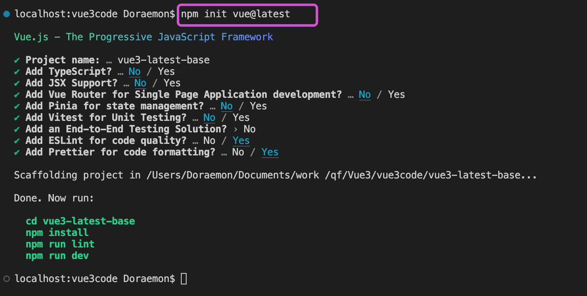


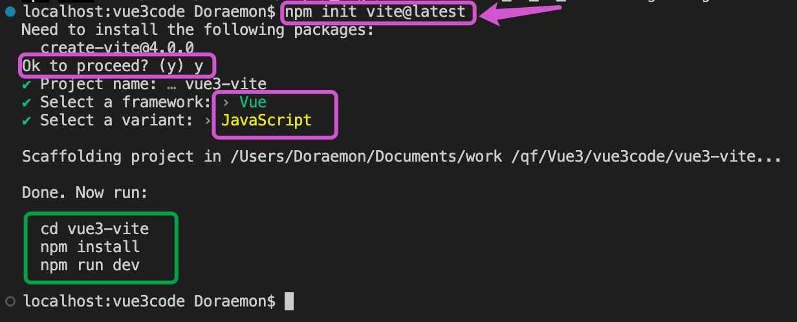


并没有node_modules文件

```bash
cnpm i
```

启动

```bash
npm run dev
```


#### 关于vite

什么是vite？—— 新一代前端构建工具。 Webpack  vue-cli

官方文档：https://vitejs.cn

- 它是一个更加轻量（热更新速度快，打包构建速度快）的vue项目脚手架工具。

- 相对于vue-cli它默认安装的插件非常少，随着开发过程依赖增多，需要自己额外配置。

  - **所以：** 在单纯学习vue3语法会使用它，后面做项目的时候我们还是使用vue-cli

  

- 优势：
  - 开发环境中，无需打包操作，可快速的冷启动。
  - 轻量快速的热重载（HMR）。
  - 真正的按需编译，不再等待整个应用编译完成。

- 传统构建 与 vite构建对比图


现用现分析，动态引入和代码分割。


## 1.3 目录结构

### 1.3.1 main.js 根实例初始化

在2.x中，通过`new Vue()`的方法来初始化

```js
new Vue({
  router,
  store,
  render: h => h(App)
}).$mount('#app')
```

在3.x中Vue不再是一个构造函数，通过createApp方法初始化

```js
// 引入的不再是 Vue 构造函数；而是一个叫做 createApp 的工厂函数 
import { createApp } from 'vue'

//创建应用实例对象-app(类似于之前vue2中vm,但app比vm更”轻“)  #app 页面上容器的id
const app = createApp(App)

app.use(store).use(router).mount('#app')

```


##### 注意：

main.js入口文件，不支持之前的引入 vue 文件的方式。


### 1.3.2 App.vue

```vue
<!-- Vue3组件中的模板结构可以没有根标签 -->
```


## 1.4 开发者工具

Vue.js Devtools 


# 二、选项API vs 组合API

## 2.1 选项API和组合API

Vue3 支持两种代码风格，选项式API和组合式API，当然两种代码风格都可以完成一样的功能，不同的是书写风格上的差异。

**选项式** **API (Options API)**

使用选项式 API，我们可以==用包含多个选项的对象来描述组件的逻辑，例如 data 、 methods 和 mounted== 。选项所定义的属性都会暴露在函数内部的 this 上，它会指向当前的组件实例。

**组合式** **API (Composition API)**

通过组合式 API，我们可以使用==导入的 API 函数来描述组件逻辑==。


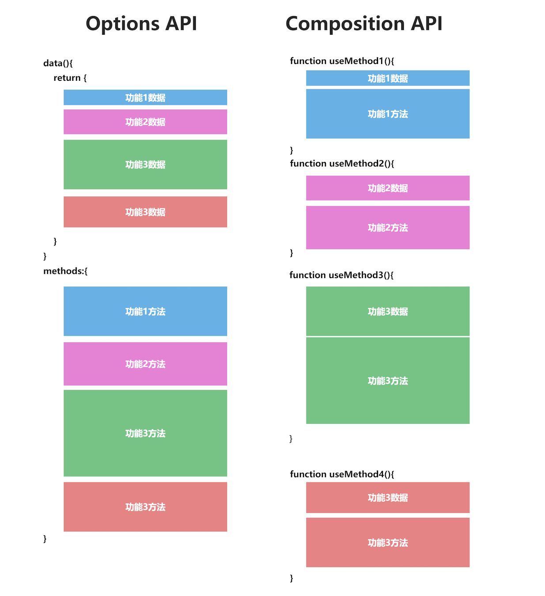


每一个功能模块的代码颜色一样，左边是 Options API，一个功能的代码零散的分布在 data，methods 等配置内，维护起来很麻烦，而右边的 Compositon API 就不一样了，每个功能模块都在一起维护。

其实还可以更进一步，如果每个颜色块代码，我们都拆分出去一个函数，我们就会写出类似上面右侧风格的代码，每个数据来源都清晰可见，而且每个功能函数都可以在各个地方复用。


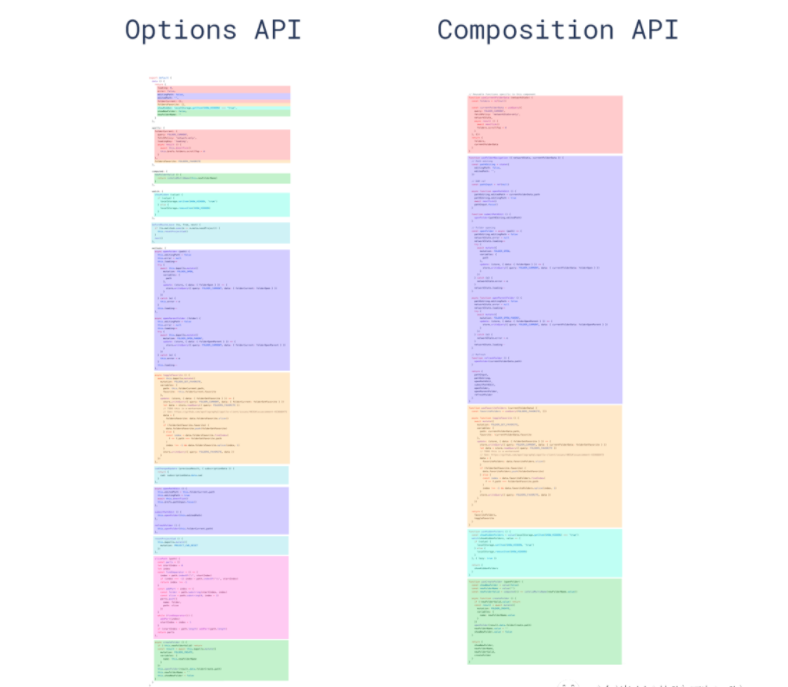


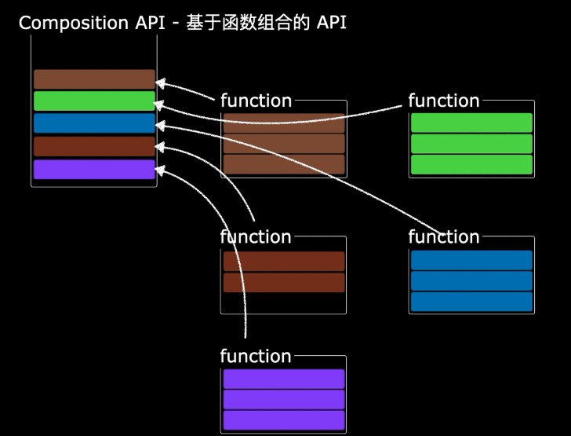


**选项式** **API (Options API)**

```vue
<template>
  <div>
    <h2>Vue2计数器</h2>
    <p>count：{{ count }}</p>
    <button @click="count += 1">count++</button>
  </div>
</template>

<script>
export default {
  name: "Vue2Domo",
  data() {
    return {
      count: 0,
    };
  },
  methods: {},
  mounted() {},
};
</script>

<style lang="less" scoped></style>
```


**组合式** **API (Composition API)**

```vue
<template>
    <h3>Vue3计数器</h3>
    <p>Count:{{ count }}</p>
    <button @click="addHandler">增加</button>
</template>
<script setup>

    import { ref } from "vue"
    const count = ref(0)
    const addHandler = () =>{
        count.value++
    }

</script>
```


#### 两种风格区别

##### 选项式API

在 vue2.x 项目中使用的就是 选项式API 写法

优点：易于学习和使用，写代码的位置已经约定好了

缺点：代码组织性差，相似的逻辑代码不便于复用，逻辑复杂代码多了不好阅读


##### 组合式API

在 vue3 中使用的就是 组合API 写法

优点：功能逻辑复杂繁多情况下，各个功能逻辑代码组织再一起，便于阅读和维护

缺点：需要有良好的代码组织能力和拆分逻辑能力

为了能让大家较好的过渡到vue3.0的版本来，也支持vue2.x选项API写法


关闭 Vue3 template 多个节点报错问题：

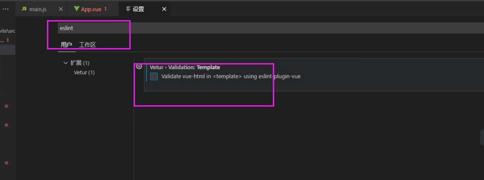


插件安装：


## 2.2 响应式

### 2.2.1 Vue2 响应式

```vue
<template>
  <div>
    <h2>Vue2响应式</h2>
    <p>{{ count }}</p>
    <button @click="count += 1">count++</button>
  </div>
</template>

<script>
export default {
  data() {
    return {
      msg: "Vue2响应式",
      count: 0,
    };
  },
};
</script>

<style lang="less" scoped></style>
```


### 2.2.2 Vue3 响应式

要在组件模板中使用响应式状态，需要在 `setup()` 函数中定义并返回。

#### setup

1. Vue3中一个新的配置项，值为一个函数。`setup` 是一个专门用于组合式 API 的特殊钩子函数
2. 所有的组合API函数都在此使用, 只在初始化时执行一次
3. 组件中用到的数据、方法等都要写在 setup中。
4. setup 两种返回值：
   - 对象。对象中的属性、方法在模板中都可直接使用
   - 函数。自定义渲染内容，覆盖模板内容

5. 注意

- 尽量不要与Vue2配置混用
  - Vue2配置（data,methods,computed....）中可以访问到setup中的属性、方法
  - 但是，在setup中==不能访问==Vue2的配置（data,methods,computed....）
  - 如果有重名，setup优先
- setup不能是一个async函数。一个函数如果被async修饰了，那么返回的就不再是一个普通的对象，而是被promise包裹的对象，模板中看不到return对象中的属性。


#### 组合API_函数写法

```vue
<template>
  <h2>Vue3——Setup</h2>

  <h3>姓名：{{ name }}</h3>
  <h3>年龄：{{ age }}</h3>
  <button @click="sayHi">打招呼</button>
</template>

<script>
import { h } from "vue";
export default {
  // 暂时不考虑响应式，只是测试setup 
 // `setup` 是一个专门用于组合式 API 的特殊钩子函数
  setup() {
    // 定义数据
    let name = "zhangsan";
    let age = 18;

    // 定义方法
    function sayHi() {
      alert(`我是${name},今年${age}岁了！`);
    }

    // 返回对象写法【常用】
    return { name, age, sayHi };

    // 返回渲染函数
    // return () => h("h1", "返回函数写法");
  },
};
</script>

<style lang="less" scoped></style>
```


#### ref

- 作用: 定义一个数据的响应式

- 语法
  
  ```js
  const xxx = ref(initValue):
  ```
  
- 说明
  
  - 创建一个包含响应式数据的==引用(reference)对象（或者说 ref对象）==
  - js中操作数据: ` xxx.value`
  - 模板中操作数据: 不需要.value
  
- 解释

  用ref包括的基本类型数据是==RefImpl的实例对象==。

  RefImpl：reference(引用) implement(实现)    "**引用的实现**"

  生成的对象：引用实现的实例对象，简称==【引用对象】==

- 注意：

  一般用来定义一个基本类型的响应式数据，也可以是对象类型

  基本类型数据：响应式仍然是 通过 `Object.defineProperty()` 的getter和setter实现

- 代码演示


```vue
<template>
  <h2>ref实现基本类型数据的响应式</h2>

  <h3>姓名：{{ name }}</h3>
  <h3>年龄：{{ age }}</h3>
  <button @click="change">修改name age</button>
</template>

<script>
import { ref } from "vue";
export default {
  setup() {
    // 定义数据
    let name = ref("zhangsan");
    let age = ref(18);
      
      
    // 处理对象
    let score = ref({
      english: 19,
      shuxue: 99,
      // 深层次
      a: {
        b: {
          c: 1,
        },
      },
    });
    // 数组
    let hobby = ref(["⚽️", "🏀", "🏓"]);

    // 定义方法
    function change() {
      // name = "lisi";
      // age = 98;  // 值修改了，但是界面并没有跟着变
      console.log(name, age); // 查看ref加工之后的属性是什么样子的？
      name.value = "lisi";
      age.value = 98;
        
      // score.value.english.value = 100;
      console.log(score.value);
      // ref({})  修改里面的属性  .属性名  不需要再 .value
      score.value.english = 100;
      score.value.a.b.c = 999;
      hobby.value[0] = "足球";
      console.log(hobby.value);
    }

    return { name, age,score, hobby, change };
  },
};
</script>

<style lang="less" scoped></style>

```


模板在解析的时候，会判断是不是ref形式创建的数据，直接取出value。所以在模板中使用的时候，省略 .value


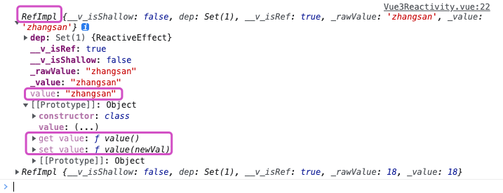


##### 总结：

- 在Vue3中 ，想把普通的number、string、Boolean 变成响应式的数据，就必须要借助ref

- Vue3里ref 对基本类型数据实现响应式的原理，是通过Object.defineProperty()，getter和setter拦截来实现   .value

- ref 定义对象类型数据，底层原理是利用了ES6的的Proxy实现的响应式，而在Vue3中，对Proxy的操作封装在了一个叫做reactive的新函数中。

  获取这个对象   score.value

  获取或修改对象里面的某个属性：score.value.属性名

```js
// 处理对象
    let score = ref({
      english: 19,
      shuxue: 99,
      // 深层次
      a: {
        b: {
          c: 1,
        },
      },
    });

// 定义方法
    const change = () => {
      name.value = "李四";
      age.value = 98;
      console.log(name, age);
      // score.value.english.value = 100;
      console.log(score.value);
      // ref({})  修改里面的属性  .属性名  不需要再 .value
      score.value.english = 100;
      score.value.a.b.c = 999;
      hobby.value[0] = "足球";
      console.log(hobby.value);
    };
```


#### reactive

- 作用

  定义一个==对象类型==的响应式数据， 别用reactive定义基本类型数据

- 语法

  ```js
  // const 代理对象 = reactive(源对象)
  const proxyObj = reactive(obj)
  ```

  接收一个==普通对象(或数组)==，然后返回一个==响应式代理对象==

- 定义的响应式数据是“深层的”：会影响对象内部所有嵌套的属性

- 内部基于 ES6 的 Proxy 实现，通过代理对象操作源对象内部数据都是响应式的

- 代码

  ```vue
  <template>
    <h3>Vue3Reactive实现对象类型数据的响应式</h3>
    <p>姓名：{{ stu.name }}</p>
    <p>年龄：{{ stu.age }}</p>
    <p>英语：{{ stu.score.english }}</p>
    <p>数学：{{ stu.score.shuxue }}</p>
    <p>测试 c :{{ stu.a.b.c }}</p>
    <p>爱好：{{ stu.hobby }}</p>
    <p><button @click="change">修改name和age</button></p>
  </template>
  
  <script>
  import { reactive, ref } from "vue";
  export default {
    setup() {
      // 处理对象  ref({}) 借助 reactive来实现的响应式
      // 代理对象  源对象
      let stu = reactive({
        name: "zhangsan",
        age: 18,
        score: {
          english: 19,
          shuxue: 99,
        },
        // 深层次
        a: {
          b: {
            c: 1,
          },
        },
        hobby: ["⚽️", "🏀", "🏓"],
      });
  
      // 定义方法
      const change = () => {
        stu.name = "李四";
        stu.age = 98;
        // reactive({})  修改里面的属性  不需要再 .value
        stu.score.english = 100;
        stu.hobby[1] = "篮球";
      };
  
      return { stu, change };
    },
  };
  </script>
  <style lang="" scoped></style>
  
  ```
  
  

#### 总结：

##### ref 和reactive的区别

 ref：定义一个数据的响应式，number,string,boolean  得到的是：RefImpl的实例，==引用对象==  .value

 reactive：定义复杂类型数据响应式，Object，Array  得到的是：Proxy的实例，==代理对象==

##### 原理区别：

ref处理基本数据类型，用的是Object.defineProperty()，走的是getter,setter，数据劫持

reactive处理对象，数组类型，底层用的是ES6里的Proxy，通过代理对象对源对象进行加工操作


### 2.2.3 toRef()

toRef是函数，转换**响应式对象**中**某个**属性为单独响应式数据，并且==**跟原来是数据的值是关联的**==。

语法：

```js
let name = toRef(obj, "name");
```

 

通过对象解构出来的数据，不是响应式的。需要使用toRef

```vue
<template>
  <div>
    <p>姓名：{{ obj.name }}</p>
    <p>年龄：{{ obj.age }}</p>
    <p>c ：{{ obj.a.b.c }}</p>
    <p>hobby：{{ obj.hobby }}</p>

    <!--
        把响应式对象里的属性成为单独的响应式数据：
         1、toRef(obj,'name')
         2、修改 属性.value=
         使用场景：
         在模板当中直接访问属性
     -->
    {{ name }}
    <p>
      <button @click="updateName">修改name</button>
    </p>
  </div>
</template>

<script setup>
import { reactive, toRef } from "vue";
//定义数据
const obj = reactive({
  name: "三毛",
  age: 18,
  a: {
    b: {
      c: 1,
    },
  },
  hobby: ["⚽️", "🏀", "🏓"],
});

// 对象解构的方式，解构出来属性不再是响应式的啦！！！
// let { name ,age,a,hobby} = obj;
// console.log(name);

// 重点：转换**响应式对象**中**某个**属性为单独响应式数据
// 1、toRef(obj,'name')
let name = toRef(obj, "name");
console.log(name);

const updateName = () => {
  // 2、修改 属性.value=
  name.value += "===";
  console.log(name);
};
</script>

<style lang="less" scoped></style>
```


#### 使用场景：

有一个响应式对象数据，但是模版中只需要使用其中一项数据。


### 2.2.4 toRefs()

- toRefs是函数，转换**响应式对象**中所有属性为单独响应式数据，对象成为普通对象，并且==**值是关联的**==

  ```vue
  <template>
    <div>
      <p>name：{{ name }}</p>
      <p>age：{{ age }}</p>
      <p>a.b.c：{{ a.b.c }}</p>
      <p><button @click="updateName">修改</button></p>
    </div>
  </template>
  
  <script>
  import { reactive, toRef, toRefs } from "@vue/reactivity";
  export default {
    setup() {
      // 定义响应式数据
      const obj = reactive({
        name: "zs",
        age: 18,
        a: {
          b: {
            c: 1,
          },
        },
        hobby: ["⚽️", "🏀", "🏓"],
      });
      const obj2 = { ...obj };
      console.log("普通对象：", obj2);
      const obj3 = toRefs(obj);
      console.log("响应式对象：", obj3);
  
      const updateName = () => {
        console.log("updateName、、、、");
        obj3.name.value += "==";
        obj3.age.value += 1;
        // 也可以改原来的数据，因为【值是关联的】
        obj.name += "===";
        obj.a.b.c += 2;
      };
  
      return { ...obj3, updateName };
    },
  };
  </script>
  ```

  


### 2.2.5 Vue2 响应式原理

#### vue2的响应式

对象类型：通过 `Object.defineProperty()` 对属性的读取或修改进行拦截(数据劫持) 

数组类型：通过重写数组方法来实现拦截，对数组的变更方法进行了包装。

```js
Object.defineProperty(data, 'count', {
    get () {}, 
    set () {}
})
```


存在问题：

1. 对象新增属性或者删除已有属性，界面不会更新

   解决办法：`this.$set(obj,'gender','女')`

2. 直接通过下标修改数组，界面也不会更新

   解决办法：`this.$set(arr,1,'🏀')`


### 2.2.6 Vue3 响应式原理

#### Vue3 响应式

- 通过Proxy(代理):  拦截对data任意属性的任意(13种)操作, 包括属性值的读写, 属性的添加, 属性的删除等...

  ref() 基本数据类型 Object.defineProperty() 

  reactive({})  []  Proxy   ref(null)  ref([])  ==>proxy

- 通过 Reflect(反射):  动态对源对象的相应属性进行特定的操作

- 文档:

  - https://developer.mozilla.org/zh-CN/docs/Web/JavaScript/Reference/Global_Objects/Proxy

  - https://developer.mozilla.org/zh-CN/docs/Web/JavaScript/Reference/Global_Objects/Reflect

    ```js
    //被代理
    const data={
        name:'lucy',
        age:19
    }
    //proxyData 代理对象
    const proxyData= new Proxy(data, {
    	// 拦截读取属性值
        get (target, prop) {
        	return Reflect.get(target, prop)
        },
        // 拦截设置属性值或添加新属性
        set (target, prop, value) {
        	return Reflect.set(target, prop, value)
        },
        // 拦截删除属性
        deleteProperty (target, prop) {
        	return Reflect.deleteProperty(target, prop)
        }
    })
    
    proxy.name = 'tom'   
    ```


> ##### 代码演示
>
> ```vue
> <template>
>   <h2>Vue3 响应式</h2>
>   <h3 v-show="stu.name">姓名：{{ stu.name }}</h3>
>   <h3>年龄：{{ stu.age }}</h3>
>   <h3 v-show="stu.gender">性别：{{ stu.gender }}</h3>
>   <button @click="addGender">添加gender</button>
>   <button @click="delName">删除name</button>
> </template>
> 
> <script setup>
> import { reactive } from "vue";
> let stu = reactive({
>   name: "张三",
>   age: 18,
>   hobby: ["⚽️", "🏀", "🏓"],
> });
> function addGender() {
>   stu.gender = "女";
> }
> function delName() {
>   delete stu.name;
> }
> </script>
> 
> <style lang="less" scoped></style>
> ```


测试：

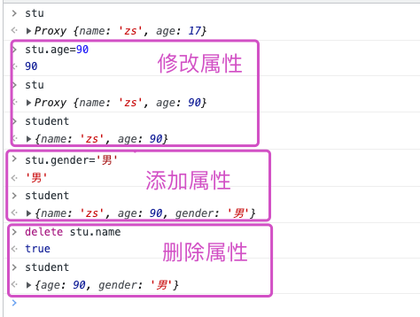


#### Vue2 实现原理：

```html
<!DOCTYPE html>
<html lang="en">
  <head>
    <meta charset="UTF-8" />
    <meta http-equiv="X-UA-Compatible" content="IE=edge" />
    <meta name="viewport" content="width=device-width, initial-scale=1.0" />
    <title>Document</title>
  </head>
  <body>
    <script>
      // 源数据
      let student = {
        name: "zs",
        age: 17,
      };
      // 模拟Vue2实现响应式: 实现对name的代理
      let stu = {};
      Object.defineProperty(stu, "name", {
        get() {
          //当读取name属性时
          return student.name;
        },
        set(val) {
          // 当修改name属性时;想要实现响应式，最主要实现的是set
          console.log("name被修改了，此处省略所有的修改页面的逻辑....");
          student.name = val;
        },
      });
      // 模拟Vue2实现响应式: 实现对age的代理
      Object.defineProperty(stu, "age", {
        get() {
          //当读取name属性时
          return student.age;
        },
        set(val) {
          // 当修改name属性时;想要实现响应式，最主要实现的是set
          console.log("name被修改了，此处省略所有的修改页面的逻辑....");
          student.age = val;
        },
      });
      //问题：添加一个属性，删除一个属性，捕获不到
    </script>
  </body>
</html>

```


#### Vue3 实现原理

```html
<!DOCTYPE html>
<html lang="en">
  <head>
    <meta charset="UTF-8" />
    <meta http-equiv="X-UA-Compatible" content="IE=edge" />
    <meta name="viewport" content="width=device-width, initial-scale=1.0" />
    <title>Document</title>
  </head>
  <body>
    <script>
      // 源数据
      let student = {
        name: "zs",
        age: 17,
      };
      // 实现代理
      // let stu = new Proxy(student, {});

      // 模拟Vue3实现响应式
      let stu = new Proxy(student, {
        //读取某个属性时调用 拦截
        get(target, prop) {
          console.log(`读取stu上的属性，`, prop);
          return target[prop];
        },
        // 修改 或 追加 属性时调用；拦截
        set(target, prop, value) {
          console.log(
            `修改了stu上的${prop}属性, 此处省略所有的修改页面的逻辑....`
          );
          target[prop] = value;
        },
        //删除属性时调用； 拦截
        deleteProperty(target, prop) {
          console.log(
            `删除了stu上的${prop}属性, 此处省略所有的修改页面的逻辑....`
          );
          return delete target[prop];
          // return Reflect.deleteProperty(target, prop);
        },
      });
    </script>
  </body>
</html>

```


Reflect：

```html
<!DOCTYPE html>
<html lang="en">
  <head>
    <meta charset="UTF-8" />
    <meta http-equiv="X-UA-Compatible" content="IE=edge" />
    <meta name="viewport" content="width=device-width, initial-scale=1.0" />
    <title>Document</title>
  </head>
  <body>
    <script>
      // 源数据
      let student = {
        name: "zs",
        age: 17,
      };
      // 实现代理
      // let stu = new Proxy(student, {});

      // proxyUser是代理对象, user是被代理对象
      // 后面所有的操作都是通过代理对象来操作被代理对象内部属性

      // 模拟Vue3实现响应式
      let stu = new Proxy(student, {
        //读取某个属性时调用 拦截
        get(target, prop) {
          console.log(`读取stu上的属性，`, prop);
          // return target[prop];
          return Reflect.get(target, prop);
        },
        // 修改 或 追加 属性时调用；拦截
        set(target, prop, value) {
          console.log(
            `修改了stu上的${prop}属性, 此处省略所有的修改页面的逻辑....`
          );
          // target[prop] = value;
          return Reflect.set(target, prop, value);
        },
        //删除属性时调用； 拦截
        deleteProperty(target, prop) {
          console.log(
            `删除了stu上的${prop}属性, 此处省略所有的修改页面的逻辑....`
          );
          // return delete target[prop];
          return Reflect.deleteProperty(target, prop);
        },
      });
    </script>
  </body>
</html>

```


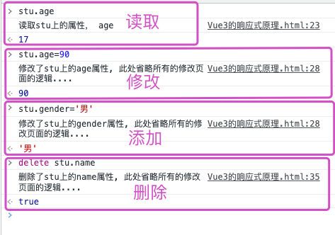


### 2.2.7 reactive VS ref

#### 定义：

ref：用来定义 基本类型数据；reactive：用来定义对象或数组类型数据(递归深度响应式)

ref 也可以用来定义对象或数组，内部自动通过 reactive 转为代理对象

#### 使用：

ref 定义的数据：操作数据需要 `.value`，模板中读取时不需要 `.value`

reactive定义的数据：操作与读取数据都不需要  `.value`

#### 原理：

ref 通过 `Object.defineProperty()` 的getter和setter实现响应式。

reactive通过ES6的Proxy 实现响应式，并通过Reflect操作源对象内部的数据。

#### 总结：

reactive 用的多一些。虽然不能定义基本类型数据，可以把组件里需要的数据，放到对象里，把这个对象交给reactive，包装成响应式对象。（类似Vue2里的data选项）

```je
let data=reactive({
	order:{},
	student:{}
})
```


## 2.3  setup细节

- setup执行的时机
  - 在beforeCreate之前执行(一次), 此时组件对象还没有创建
  - this是undefined, 不能通过this来访问data/computed/methods / props
  - 其实所有的composition API相关回调函数中也都不可以
- setup的返回值
  - 一般都返回一个对象: 为模板提供数据, 也就是模板中可以直接使用此对象中的所有属性/方法
  - 返回对象中的属性会与data函数返回对象的属性合并成为组件对象的属性
  - 返回对象中的方法会与methods中的方法合并成组件对象的方法
  - 如果有重名, setup优先
- 注意
  - 一般不要混合使用: methods中可以访问setup提供的属性和方法, 但在setup方法中不能访问data和methods
  - setup不能是一个async函数: 因为返回值不再是return的对象, 而是promise, 模板看不到return对象中的属性数据
- setup的参数
  - setup(props, context) / setup(props, {attrs, slots, emit})
  - props：值为对象， 包含组件外部传递过来，且组件内部声明接收了的属性 
  - context：上下文对象
  - attrs：值为对象， 包含组件外部传递过来，但没有在props配置中声明的属性， 相当于 `this.$attrs`
  - emit: 用来分发自定义事件的函数, 相当于 `this.$emit`
  - slots: 收到的插槽内容, 相当于 `this.$slots`


> #### 完整代码：
>
> ```vue
> <template>
>   <div>
>     <p>{{ msg }}——{{ num }}</p>
>     <p><button @click="testSay">触发父组件say方法</button></p>
>     <slot />
>   </div>
> </template>
> 
> <script>
> import { reactive } from "vue";
> export default {
>   // 把收到的所有的属性，都放到对象中，而且是Proxy类型，说明是代理对象，能实现响应式 接收了，才能使用  多些参数 "aa",是undefined
>   props: ["msg", "num", "aa"],
>   // emits: ["say"], // 接收父组件方法，可选的, 声明了更利于开发人员阅读, 且可以对分发的事件数据进行校验 。可以不接受，也能使用
>   beforeCreate() {
>     console.log("-----beforeCreate-----");
>   },
>   setup(props, context) {
>     //在beforeCreate之前执行(一次), 此时组件对象还没有创建
>     // this是undefined
>     // console.log("-----setup-----", this);
>     // 3、setup的参数
>     /**
>      *- setup(props, context) / setup(props, {attrs, slots, emit})
>     - props: 包含props配置声明且传入了的所有属性的对象
>     - context：不是响应式对象，只是普普通通的Object对象
>     - attrs: 包含没有在props配置中声明的属性的对象, 相当于Vue2中this.$attrs
>     - slots: 包含所有传入的插槽内容的对象, 相当于Vue2中 this.$slots
>     - emit: 用来分发自定义事件的函数, 相当于Vue2中 this.$emit
>      */
>     // console.log(props, b, c);
>     console.log(context.slots);
>     // 定义数据
>     let stu = reactive({
>       name: "张三",
>       age: 18,
>     });
> 
>     function testSay() {
>       // 触发自定义事件
>       context.emit("say", "我是大头儿子");
>     }
> 
>     return {
>       stu,
>       testSay,
>     };
>   },
> };
> </script>
> 
> <style lang="less" scoped></style>
> ```
>
> 


### `<script setup>`

在 `setup()` 函数中手动暴露大量的状态和方法非常繁琐。幸运的是，我们可以通过使用构建工具来简化该操作。当使用单文件组件（SFC）时，我们可以使用 `<script setup>` 来大幅度地简化代码。（只写Vue3代码）

```vue
<template>
  <h2>Vue3——Setup</h2>

  <h3>姓名：{{ name }}</h3>
  <h3>年龄：{{ age }}</h3>
  <button @click="sayHi">打招呼</button>
</template>

<script setup>
// 定义数据
const username = "zhangsan";
const age = 18;

// 定义方法
function sayHi() {
  alert(`我是${username},今年${age}岁了！`);
}
</script>

<style lang="less" scoped></style>

```


> 在指南的后续章节中，我们基本上都会在组合式 API 示例中使用单文件组件 + `<script setup>` 的语法，因为大多数 Vue 开发者都会这样使用。


## 2.4 计算属性

计算属性本身简化模板语法（{{}}）带来的复杂。

使用选项式API的时候，所有的计算属性都必须放在 computed 中，这样如果有很多计算属性就显得很臃肿，但如何使用组合式API，这个问题就迎刃而解了。

Vue3 的计算属性写法，完全可以提取到单独文件里去处理，处理完再引入。

### 选项API_计算属性

```vue
<template>
  <div>
    <h2>Vue2 的计算属性</h2>
    <p>{{ msg }}</p>
    <p>{{ reverseHello }}</p>
    <p>{{ info }}</p>
    <p>{{ reverseInfo }}</p>
  </div>
</template>

<script>
export default {
  data() {
    return {
      msg: "hello",
      info: "你好啊",
    };
  },
  computed: {
    //Vue2的 计算属性特别多，就会造成computed臃肿
    reverseHello() {
      return this.msg.split("").reverse().join("");
    },
    reverseInfo() {
      return this.info.split("").reverse().join("");
    },
  },
};
</script>

<style lang="less" scoped>
</style>
```


### 组合API_计算属性

```vue
<template>
  <h2>Vue3 的计算属性</h2>
  <p>{{ msg }}</p>
  <p>反转：{{ reverseHello }}</p>
  <p>info:{{ info }}</p>
  <p>info:{{ reverseInfo }}</p>
</template>

<script setup>
import { ref, computed } from "vue";
import { infoComputed } from "./utils/computed";
const msg = ref("hello");
const info = ref("你好啊");
const reverseHello = computed(() => {
  // 注意：ref定义的数据类型，需要 .value 才能访问值
  return msg.value.split("").reverse().join("");
});
// const reverseInfo=computed(()=>{
//     return info.value.split('').reverse().join('')
// })
// 多个计算属性，提取到单独的文件里，一句话引入使用；让主文件变得相对更好阅读和理解
const reverseInfo = infoComputed(info);
</script>

<style lang="less" scoped>
</style>
```

提取到单独文件：

```js
import { computed } from 'vue'

export function infoComputed(data) {
    const reverseData = computed(() => {
        return data.value.split('').reverse().join('')
    })
    return reverseData
}
```


完整写法：

```vue
<template>
  <p>姓：<input type="text" v-model="user.firstname" /></p>
  <p>名：<input type="text" v-model="user.lastname" /></p>
  <p>计算属性：<input type="text" v-model="user.fullname" /></p>
</template>

<script setup>
import { computed, reactive } from "vue";

let user = reactive({
  firstname: "张",
  lastname: "三",
});
// 计算属性完整写法
user.fullname = computed({
  get() {
    return user.firstname + "-" + user.lastname;
  },
  set(val) {
    const arr = val.split("-");
    user.firstname = arr[0];
    user.lastname = arr[1];
  },
});
</script>

<style lang="less" scoped></style>

```


### 组合API_事件处理

在组合式API中，事件的实现相对比较为简单，与在原生 JavaScript 中有些相似

####  选项API_事件处理

```vue
<template>
  <h2>Vue2事件</h2>
  <p>{{count}}</p>
  <button @click="add">count++</button>
</template>

<script>
export default {
  data() {
    return {
      count: 0,
    };
  },
  methods: {
    add(){
        this.count++
    }
  },
};
</script>

<style lang="less" scoped>
</style>
```


#### 组合API_事件处理

```vue
<template>
  <h3>Vue3事件</h3>
  <p>{{ count }}</p>
  <button @click="add">count++</button>
</template>

<script setup>
import { ref } from "vue";

const count = ref(0);
function add() {
  count.value++;
}
// 箭头函数写法
// const add=()=>{
//     count.value++;
// }
</script>

<style lang="less" scoped>
</style>
```


## 2.5 侦听器

### 选项式API_侦听器

```vue
<template>
  <h2>Vue2侦听器</h2>
  <p><input type="text" v-model="keyword" /></p>
  <p>keyword:{{ keyword }}</p>
</template>

<script>
export default {
  data() {
    return {
      keyword: "1",
    };
  },
  // 侦听已有属性的变化
  watch: {
    // keyword(newVal, oldVal) {
    //   console.log(newVal, oldVal);
    // },
    keyword: {
      immediate: true, //  立即监听
      deep: true, // 开启深层次检测，默认开启的是浅层次的监视
      handler( newVal, oldVal) {
        console.log("keyword变化了", newVal, oldVal);
      },
    },
  },
};
</script>

<style lang="less" scoped></style>

```


### 组合式API_侦听器

#### 监听 ref  定义的响应式数据

```vue
<template>
  <h2>Vue3侦听器</h2>
  <p><input type="text" v-model="keyword" /></p>
  <p>搜索内容为：{{ keyword }}</p>
  <p>count：{{ count }}</p>
  <p><button @click="count++">count++</button></p>
</template>

<script setup>
import { ref, watch } from "vue";

const keyword = ref("a");
let count = ref(0);
// 1、监听ref定义的响应式数据
// 两个参数：参数1：要侦听的数据  参数2：回调函数 参数3：监视的配置
watch(
  keyword,
  (newVal, oldVal) => {
    console.log("keyword 变化了：", newVal, oldVal);
  },
  { immediate: true }
);

// watch(count, (newVal, oldVal) => {
//   console.log("count 变化了：", newVal, oldVal);
// });

// 2、监视ref定义的多个响应式数据
watch([keyword, count], (newVal, oldVal) => {
  console.log("keyword或count变化：", newVal, oldVal);
});

// 多个watch 拆封到文件当中，
</script>

<style lang="less" scoped></style>

```


#### 监听 reactive 定义的响应式数据

```vue
<template>
  <h2>Vue3侦听器</h2>
   <p>姓名：{{ stu.name }}</p>
  <p>年龄：{{ stu.age }}</p>
  <p>sub1 成绩：{{ stu.subject.sub1.score }}</p>
  <button @click="stu.name += '=='">修改姓名</button>
    <button @click="stu.age++">修改age</button>
    <button @click="stu.subject.sub1.score += 10">修改分数</button>
</template>

<script setup>
import { ref, watch, reactive } from "vue";

// 2、监听一个reactive数据
const stu = reactive({
  name: "zs",
  age: 18,
  subject: {
    sub1: {
      score: 10,
    },
  },
});

// 3、监听一个reactive定义的全部数据,不管哪个属性，只要有变化，就能监听到
// 注意：（1）监听reactive定义的响应式数据时，无法正确获得oldVal  解决：用ref定义对象不可以；只能ref 定义单个属性  （2）默认开启深度监视，没法关闭  （3）监听reactive定义的对象中的某个对象属性，需要加deep才可以
// watch(
//   user,
//   (newVal, oldVal) => {
//     console.log("user变化了...", newVal, oldVal);
//   },
//   { deep: false } // 默认开启深度监视，没法关闭
// );

//4、特殊情况：监听reactive定义的对象中的某个对象属性，需要加deep才可以
watch(
  () => user.subject,
  (newVal, oldVal) => {
    console.log("监听user.subject 改变了：", newVal, oldVal);
  },
  {
    deep: true,
  }
);

// 5. 只监听对象中某一个属性的变化 例如：obj.age
// 需要写成函数返回该属性的方式才能监听到
watch(
  () => user.age,
  (newVal, oldVal) => {
    console.log("监听user.age改变了：", newVal, oldVal);
  }
);
// 只监听obj.name变化
watch(
  () => user.name,
  (newVal, oldVal) => {
    console.log("监听user.name改变了：", newVal, oldVal);
  }
);
// 6. 监听对象中某些属性的变化
watch([() => user.age, () => user.name], (newVal, oldVal) => {
  console.log("监听name 或者 age改变了：", newVal, oldVal);
});
</script>

<style lang="less" scoped></style>

```


##### 注意：

1. 监听reactive定义的响应式数据时，无法正确获得oldVal
2. 默认开启深度监视，没法关闭 
3. 监听reactive定义的对象中的某个对象属性，需要加deep才可以


### watchEffect函数

watch的作用：既要指明要监视的属性，也要指明监视的回调

watchEffect的作用：

- 不用指明监视哪个属性，监视的回调中用到哪个属性，就监视哪个属性
- 默认初始时就会执行第一次, 从而可以收集需要监视的数据

类似计算属性：

基于它的依赖进行缓存，依赖变化，重新计算。

- 计算属性，要有返回值
- 而watchEffect，没有返回值，是监视到变化之后，做什么逻辑。

```vue
<template>
  <h2>Vue3 watchEffect</h2>
  <p>count:{{ count }}</p>
  <p>msg:{{ msg }}</p>
  <button @click="count++">count++</button>
  <button @click="msg += '=='">修改msg</button>
  <p>姓名：{{ stu.name }}</p>
  <p>年龄：{{ stu.age }}</p>
  <p>sub1 成绩：{{ stu.subject.sub1.score }}</p>
  <button @click="stu.name += '!'">修改姓名</button>
  <button @click="stu.age += 1">修改年龄</button>
  <button @click="stu.subject.sub1.score += 10">修改分数</button>
</template>

<script setup>
import { ref, watch, reactive, watchEffect } from "vue";

const count = ref(1);
const msg = ref("Hi");
const stu = reactive({
  name: "zs",
  age: 18,
  subject: {
    sub1: {
      score: 10,
    },
  },
});
// 监视的回调中用到哪个属性，就监视哪个属性;没有的则不监视
watchEffect(() => {
  const x = count.value;
  const y = stu.age;
  console.log("watchEffect回调");
});
</script>

<style lang="less" scoped></style>

```


## 2.6 生命周期

**回顾vue2.x生命周期钩子函数：**

- beforeCreate
- created
- beforeMount
- mounted
- beforeUpdate
- updated
- beforeDestroy
- destroyed

**Vue3中可以继续使用Vue2中的生命周期钩子，但是有两个改名了：**

- beforeDestroy 改为了  beforeUnmount
- destroyed  改为了  unmounted


**Vue3 提供了Composition API形式的生命周期钩子，与 2.x 版本生命周期相对应**：

- `beforeCreate` -> 使用 `setup()`
- `created` -> 使用 `setup()`
- `beforeMount` -> `onBeforeMount`
- `mounted` -> `onMounted`
- `beforeUpdate` -> `onBeforeUpdate`
- `updated` -> `onUpdated`
- `beforeDestroy` -> `onBeforeUnmount`
- `destroyed` -> `onUnmounted`
- `errorCaptured` -> `onErrorCaptured`


#### 认识vue3.0生命周期钩子函数

- `setup` 创建实例前
- `onBeforeMount` 挂载DOM前
- `onMounted` 挂载DOM后
- `onBeforeUpdate` 更新前
- `onUpdated` 更新后
- `onBeforeUnmount` 卸载前
- `onUnmounted` 卸载后


#### 组合式API_生命周期

把生命周期钩子都放在setup里。

```vue
<template>
  <h3>Vue3生命周期</h3>
  <p>{{ msg }}</p>
  <button @click="changeMsg">changeMsg</button>
</template>

<script setup>
import { ref } from "vue";
import {
  onBeforeMount,
  onMounted,
  onBeforeUpdate,
  onUpdated,
  onBeforeUnmount,
  onUnmounted,
} from "vue";
const msg = ref("1");
const changeMsg = () => {
  msg.value += "==";
};
    // beforeCreate 和 created Vue3里并没有提供组合API的写法；即这两个放不到组合API里
    // 组合式API的生命周期，比配置项的生命周期要早一些；一般不会混合写
onBeforeMount(() => {
  console.log("挂载之前");
});
onMounted(() => {
  console.log("挂载完成111");
});
onMounted(() => {
  console.log("挂载完成222");
});
onBeforeUpdate(() => {
  console.log("更新之前");
});
onUpdated(() => {
  console.log("更新之后");
});
onBeforeUnmount(() => {
  console.log("将要卸载");
});
onUnmounted(() => {
  console.log("卸载完成");
});
</script>

<style lang="less" scoped>
</style>
```


#### 注意：

Vue2中写多个什么生命周期函数，只执行最后一个。后面的覆盖前面的。

组合API的生命周期钩子有7个，可以多次使用同一个钩子，每一个钩子函数可以处理一个业务，执行顺序和书写顺序相同。


## 2.7 模板引用

虽然 Vue 的声明性渲染模型为你抽象了大部分对 DOM 的直接操作，但在某些情况下，我们仍然需要直接访问底层 DOM 元素。要实现这一点，我们可以使用特殊的 `ref` attribute：

读取DOM

放在DOM元素上，获取DOM节点，放到组件上，获取子组件的实例，可以直接使用子组件的属性和方法

Vue2:

```js
this.$refs.box
```


Vue3:

```vue
<template>
  <h3>Vue3 获取Dom 元素</h3>
  <div ref="box">Hello</div>
</template>

<script setup>
import { ref, onMounted } from "vue";

const box = ref(null);
onMounted(() => {
  console.log(box.value);
});
</script>

<style lang="less" scoped>
</style>
```


## 2.8 组件通信_props

### 选项API_props:

```vue
<template>
  <h2>Vue2 组件传递props</h2>
  <h3>父组件</h3>
  <p>msg:{{ msg }}</p>
  <Child :msg="msg" />
</template>

<script>
import Child from "./Child.vue";
export default {
  components: {
    Child,
  },
  data() {
    return {
      msg: "Vue2 父组件数据",
    };
  },
};
</script>

<style lang="less" scoped></style>

```

子组件：

```vue
<template>
  <h3>子组件</h3>
  <p>父组件传递过来的msg:{{ msg }}</p>
</template>

<script>
export default {
  props: ["msg"],
};
</script>

<style lang="less" scoped></style>
```


### 组合API_props:

在使用 `<script setup>` 的单文件组件中，props 可以使用 `defineProps()` 宏来声明：

```vue
<script setup>
const props = defineProps(['foo'])

console.log(props.foo)
</script>
```


在没有使用 `<script setup>` 的组件中，prop 可以使用 [`props`](https://cn.vuejs.org/api/options-state.html#props) 选项来声明：

```js
export default {
  props: ['foo'],
  setup(props) {
    // setup() 接收 props 作为第一个参数
    console.log(props.foo)
  }
}
```

注意传递给 `defineProps()` 的参数和提供给 `props` 选项的值是相同的，两种声明方式背后其实使用的都是 prop 选项。

除了使用字符串数组来声明 prop 外，还可以使用对象的形式：

```js
// 使用 <script setup>
defineProps({
  title: String,
  likes: Number
})
```


```js
// 非 <script setup>
export default {
  props: {
    title: String,
    likes: Number
  }
}
```

对于以对象形式声明中的每个属性，key 是 prop 的名称，而值则是该 prop 预期类型的构造函数。比如，如果要求一个 prop 的值是 `number` 类型，则可使用 `Number` 构造函数作为其声明的值。


```vue
<!-- 子组件 -->
<script setup>
	defineProps(['title'])
</script>

<template>
  <h4>{{ title }}</h4>
</template>
```


#### 父组件：

```vue
<template>
  <h2>Vue3 组件传递props——父组件</h2>
  <p>msg:{{ msg }}</p>
  <Child :msg="msg" />
</template>

<script setup>
// Vue3 引入组件不需要注册，直接使用
import Child from "./Child.vue";
let msg = "vue3 msg";
</script>

<style lang="less" scoped></style>
```


#### 子组件：

```vue
<template>
  <h3>子组件</h3>
  <p>父组件传递过来的msg:{{ msg }}</p>
</template>

<script setup>
// defineProps:接收父向子传递的数据
// const props = defineProps(["msg"]);
const props = defineProps({
  msg: {
    type: String,
    default: "99",
  },
});
console.log(props);
</script>

<style lang="less" scoped></style>
```


 

## 2.9 组件通信_自定义事件

### Vue2自定义事件

```vue
<template>
  <div>
    <h3>Vue2 自定义事件</h3>
    <h3>Parent</h3>
    <Child @sendMsg="getMsg" />
    <p>{{ message }}</p>
  </div>
</template>
<script>
import Child from "./Child.vue";

export default {
  data() {
    return {
      message: "",
    };
  },
  components: {
    Child,
  },
  methods: {
    getMsg(data) {
      this.message = data;
    },
  },
};
</script>
```

子组件：

```vue
<template>
  <div>
    <h3>Child</h3>
    <button @click="sendHandler">发送数据</button>
  </div>
</template>
<script>
export default {
  data() {
    return {
      msg: "子元素数据",
    };
  },
  methods: {
    sendHandler() {
      this.$emit("sendMsg", this.msg);
    },
  },
};
</script>
```


### Vue3 自定义事件

可以通过 [`defineEmits`](https://cn.vuejs.org/api/sfc-script-setup.html#defineprops-defineemits) 宏来声明需要抛出的事件：

```vue
<!-- 子组件 -->
<script setup>
    defineProps(['title'])
    // 注意：接收的是数组
    defineEmits(['enlarge-text'])
</script>
```

和 `defineProps` 类似，`defineEmits` 仅可用于  `<script setup>` 之中，并且不需要导入。

```vue
<script setup>
    const emit = defineEmits(['enlarge-text'])
	// 抛出事件
    emit('enlarge-text')
</script>
```


#### 父组件：

```vue
<template>
  <h3>父组件</h3>
  <hr />
  <Child @sendMsg="getMsg" />
  {{ msg }}
</template>

<script setup>
import { ref } from "vue";
import Child from "./Child.vue";
const msg = ref("");
const getMsg = (data) => {
  msg.value = data.value;
};
</script>

<style lang="less" scoped>
</style>
```

#### 子组件：

```vue
<template>
  <h3>子组件</h3>
  <button @click="sendHandler">子组件向父组件发送数据</button>
</template>

<script setup>
import { ref } from "vue";

const msg = ref("子组件数据");
const emit = defineEmits("sendMsg");

const sendHandler = () => {
  emit("sendMsg", msg);
};
</script>

<style lang="less" scoped>
</style>
```


## 2.10 组件通信_ `v-model` 原理实现

1）:value

2) @input

### 选项API

```vue
<template>
  <div>
    <h3>Vue2 利用v-model原理实现组件传值——Parent</h3>
    <p>父组件的msg ：{{ msg }}</p>
    <CustomInput :val="msg" @update:val="(newVal) => (msg = newVal)" />
  </div>
</template>
<script>
import CustomInput from "./CustomInput.vue";

export default {
  data() {
    return {
      msg: "Hi",
    };
  },
  components: {
    CustomInput,
  },
};
</script>
```

子组件：

```vue
<template>
  <div>
    <h3>子组件</h3>
    <input
      type="text"
      :value="val"
      @input="$emit('update:val', $event.target.value)"
    />
  </div>
</template>
<script>
export default {
  props: ["val"],
};
</script>
```


### 组合API

自定义事件可以用于开发支持 `v-model` 的自定义表单组件。回忆一下 `v-model` 在原生元素上的用法：

```vue
<input v-model="searchText" />
```

上面的代码其实等价于下面这段 (编译器会对 `v-model` 进行展开)：

```vue
<input
  :value="searchText"
  @input="searchText = $event.target.value"
/>
```

而当使用在一个组件上时，`v-model` 会被展开为如下的形式：

```vue
<CustomInput
  :modelValue="searchText"
  @update:modelValue="newValue => searchText = newValue"
/>
```


要让这个例子实际工作起来，`<CustomInput>` 组件内部需要做两件事：

1. 将内部原生 `input` 元素的 `value` attribute 绑定到 `modelValue` prop
2. 输入新的值时在 `input` 元素上触发 `update:modelValue` 事件


```vue
<!-- CustomInput.vue -->
<script setup>
defineProps(['modelValue'])
defineEmits(['update:modelValue'])
</script>

<template>
  <input
    :value="modelValue"
    @input="$emit('update:modelValue', $event.target.value)"
  />
</template>
```

现在 `v-model` 也可以在这个组件上正常工作了：

```vue
<CustomInput v-model="searchText" />
```


#### `v-model` 的参数

默认情况下，`v-model` 在组件上都是使用 `modelValue` 作为 prop，并以 `update:modelValue` 作为对应的事件。我们可以通过给 `v-model` 指定一个参数来更改这些名字：

```vue
<MyComponent v-model:title="bookTitle" />
```

在这个例子中，子组件应声明一个 `title` prop，并通过触发 `update:title` 事件更新父组件值：

```vue
<!-- 子组件 -->
<script setup>
    defineProps(['title'])
    defineEmits(['update:title'])
</script>

<template>
  <input
    type="text"
    :value="title"
    @input="$emit('update:title', $event.target.value)"
  />
</template>
```


> #### 完整代码：
>
> ```vue
> <template>
>   <h3>父组件</h3>
>   父组件的 title：{{ title }}
>   <CustomInput
>     :title="title"
>     @update:title="(newTitle) => (title = newTitle)"
>   />
> </template>
> 
> <script setup>
> import { ref } from "vue";
> import CustomInput from "./CustomInput.vue";
> const title = ref("vue3");
> </script>
> 
> <style lang="less" scoped></style>
> 
> ```
>
> #### 子组件:
>
> ```vue
> <template>
>   <div>
>     <h3>子组件</h3>
>     <input
>       type="text"
>       :value="title"
>       @input="$emit('update:title', $event.target.value)"
>     />
>   </div>
> </template>
> 
> <script setup>
> defineProps(["title"]);
> defineEmits(["update:title"]);
> </script>
> 
> <style lang="less" scoped></style>
> ```
>
> 


#### 多个 `v-model` 绑定

利用刚才在上一小节中学到的技巧，我们可以在一个组件上创建多个 `v-model` 双向绑定，每一个 `v-model` 都会同步不同的 prop：

```vue
<UserName
  v-model:first-name="first"
  v-model:last-name="last"
/>
```


```vue
<script setup>
defineProps({
  firstName: String,
  lastName: String
})

defineEmits(['update:firstName', 'update:lastName'])
</script>

<template>
  <input
    type="text"
    :value="firstName"
    @input="$emit('update:firstName', $event.target.value)"
  />
  <input
    type="text"
    :value="lastName"
    @input="$emit('update:lastName', $event.target.value)"
  />
</template>
```


### 自定义的修饰符

v-model.trim='msg'

.number  .lazy  ---> change

对于又有参数又有修  饰符的 `v-model` 绑定，生成的 prop 名将是 `arg + "Modifiers"`。举例来说：

```vue
<MyComponent v-model:title.capitalize="myText">
```

相应的声明应该是：

```js
export default {
  props: ['title', 'titleModifiers'],
  emits: ['update:title'],
  created() {
    console.log(this.titleModifiers) // { capitalize: true }
  }
}
```


> ##### 完整代码：
>
> ```vue
> <p>myText:{{ myText }}</p>
> <CapitalizeInput v-model:title.capitalize="myText" />
> ```
>
> ##### CapitalizeInput.vue:
>
> ```vue
> <template>
>   <h3>自定义修饰符</h3>
>   <!-- <input
>     type="text"
>     :value="title"
>     @input="$emit('update:title', $event.target.value)"
>   /> -->
>   <input type="text" :value="title" @input="emitValue" />
> </template>
> 
> <script setup>
> const props = defineProps(["title", "titleModifiers"]);
> const emit = defineEmits(["update:title"]);
>     
> console.log(props.titleModifiers); //{capitalize: true}
>     
> const emitValue = (e) => {
>   let value = e.target.value;
>   if (props.titleModifiers.capitalize) {
>     value = value.charAt(0).toUpperCase() + value.slice(1);
>   }
>   emit("update:title", value);
> };
> </script>
> 
> <style lang="less" scoped></style>
> 
> ```


## 2.11 组件通信_透传 Attributes

### Vue2:

this.$attrs：收集父组件向子组件传递的所有属性（除了class 、style和已经被props接收的）组成的对象

$listeners:收集父组件向子组件传递的所有的方法组成的对象

主要用于：父向子 传递属性数据和事件监听数据用的。主要用来让我们自己封装组件使用的。

如果父向子传的属性，不在props中接收，那么子组件通过`$attrs` 是可以看到全部属性；  如果在props中接收的属性，那么那个属性在$attrs当中看不到 

Vue3不支持 `$listeners`，当前vue3项目，无法演示

父组件：

```vue
<MyButton id="btn" class="button" style="btnStyle"  type="danger" size="large"  title="添加" msg="hello"  @run="run"  @say="say" />

<MyButton id="btn2" class="button" style="btnStyle"  type="success" size="small"  title="修改" msg="hello"  @run="run"  @say="say" />
```

子组件：

```js
props: ["title",'say'],
mounted() {
    console.log(this.$attrs, this.$listeners);
},
```

它会排除 props声明接收的属性 以及class style，其他属性都会收录到`this.$attrs`, 方法都收录到`this.$listeners`

### Vue3：

“透传 attribute”指的是传递给一个组件，却没有被该组件声明为 [props](https://cn.vuejs.org/guide/components/props.html) 或 [emits](https://cn.vuejs.org/guide/components/events.html#defining-custom-events) 的 attribute 或者 `v-on` 事件监听器。最常见的例子就是 `class`、`style` 和 `id`。

白话：

`$attrs`可以被看作是一个安全网（捡漏，兜底儿的），它可以捕获任何我们没有在组件中声明的东西。

#### Attributes 继承

==当一个组件以单个元素为根作渲染时==，透传的 attribute 会自动被添加到根元素上。举例来说，假如我们有一个 `<Child>` 组件，它的模板长这样：

```html
<!-- <Child> 的模板 -->
<button>click me</button>
```

一个父组件使用了这个组件，并且传入了 `class`：

```html
<Child class="large" />
```

最后渲染出的 DOM 结果是：

```html
<button class="large">click me</button>
```

这里，`<Child>` 并没有将 `class` 声明为一个它所接受的 prop，所以 `class` 被视作透传 attribute，自动透传到了 `<Child>` 的根元素上。

#### 对 `class` 和 `style` 的合并

如果一个子组件的根元素已经有了 `class` 或 `style` attribute，它会和从父组件上继承的值合并。如果我们将之前的 `<MyButton>` 组件的模板改成这样：

```vue
<!-- <MyButton> 的模板 -->
<button class="btn">click me</button>
```

则最后渲染出的 DOM 结果会变成：

```vue
<button class="btn large">click me</button>
```

####  `v-on` 监听器继承

同样的规则也适用于 `v-on` 事件监听器：

```vue
<MyButton @click="onClick" />
```

`click` 监听器会被添加到 `<MyButton>` 的根元素，即那个原生的 `<button>` 元素之上。当原生的 `<button>` 被点击，会触发父组件的 `onClick` 方法。同样的，如果原生 `button` 元素自身也通过 `v-on` 绑定了一个事件监听器，则这个监听器和从父组件继承的监听器都会被触发。

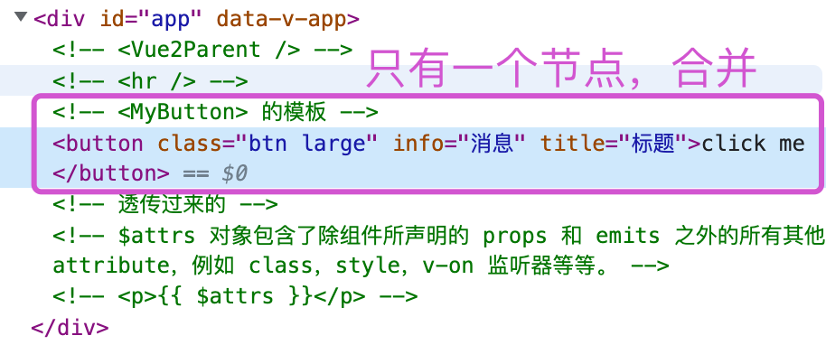


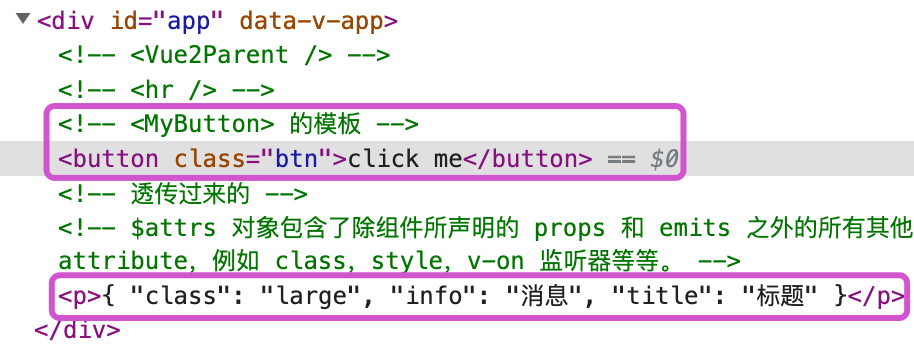


#### 多根节点的 Attributes 继承

和单根节点组件有所不同，有着多个根节点的组件没有自动 attribute 透传行为。如果 `$attrs` 没有被显式绑定，将会抛出一个运行时警告。

```vue
<CustomLayout id="custom-layout" @click="changeValue" />
```

如果 `<CustomLayout>` 有下面这样的多根节点模板，由于 Vue 不知道要将 attribute 透传到哪里，所以会抛出一个警告。

```vue
<header>...</header>
<main>...</main>
<footer>...</footer>
```

如果 `$attrs` 被显式绑定，则不会有警告：

```vue
<header>...</header>
<main v-bind="$attrs">...</main>
<footer>...</footer>
```


`$attrs` 被显式绑定

```vue
<template>
  <!-- <Child> 的模板 -->
  <button class="btn" @click="click">click me</button>
  <!-- 透传过来的 -->
  <!-- $attrs 对象包含了除组件所声明的 props 和 emits 之外的所有其他 attribute，例如 class，style，v-on 监听器等等。 -->
  <p>{{ $attrs }}</p>
</template>
```


#### 深层组件继承：

封装组件时，我们使用 `attrs` 充当桥梁，将所有的属性（属性和事件）复制到一个或多个元素上。

封装之后：


基础样式：

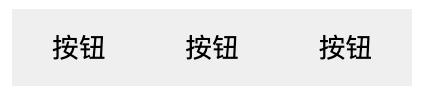

####  禁用 Attributes 继承

如果你**不想要**一个组件自动地继承 attribute，你可以在组件选项中设置 `inheritAttrs: false`。

如果你使用了 `<script setup>`，你需要一个==额外的 `<script>`==块来书写这个选项声明：

```vue
<script>
// 使用普通的 <script> 来声明选项
export default {
  inheritAttrs: false
}
</script>

<script setup>
// ...setup 部分逻辑
</script>
```

最常见的需要禁用 attribute 继承的场景就是 attribute 需要应用在根节点以外的其他元素上。通过设置 `inheritAttrs` 选项为 `false`，你可以完全控制透传进来的 attribute 被如何使用。


##### BaseButton.vue

```vue
<template>
  <button class="btn" v-bind="$attrs">按钮</button>
  <!-- <span>测试</span> -->
</template>

<script setup>
import { onMounted, useAttrs } from "vue";
const attrs = useAttrs();
onMounted(() => {
  console.log("2", attrs);
});
</script>

<style lang="less" scoped>
.btn {
  border: 0;
  padding: 10px 20px;
}
</style>
```

##### MyButton.vue

```vue
<template>
  <!-- 深层组件继承 -->
  <base-button />
</template>

<script setup>
import BaseButton from "./BaseButton.vue";
import { onMounted, useAttrs } from "vue";
const attrs = useAttrs();
onMounted(() => {
  console.log("1", attrs);
});
</script>

<style lang="less" scoped></style>

```


```vue
<template>
  <Child class="large" @click="onClick" info="消息" title="标题" />
  <hr />
  <my-button
    type="a"
    class="btn-success"
    @click="print('success')"
    @my-event="myalert(1)"
  ></my-button>
  <my-button
    type="b"
    class="btn-danger"
    @click="print('danger')"
    @my-event="myalert(2)"
  ></my-button>
  <my-button
    type="c"
    class="btn-primary"
    @click="print('primary')"
    @my-event="myalert(3)"
  ></my-button>
</template>

<script setup>
import Child from "./Child.vue";
import MyButton from "./MyButton.vue";
function onClick() {
  console.log("1111");
}
const say = () => {
  console.log("sayHi");
};
</script>

<style scoped>
.btn-success {
  background-color: greenyellow;
  color: #fff;
}
.btn-danger {
  background-color: hotpink;
  color: #fff;
}
.btn-primary {
  background-color: skyblue;
  color: #fff;
}
</style>
```


## 2.12 组件通信_依赖注入

#### Provide / Inject

作用：实现祖先与子孙组件间通信，又名 深层传递

功能类似 2.x 的`provide/inject`


### 选项API


### 组合API

使用场景：有一个父组件，里头有子组件，有孙组件，有很多后代组件，共享父组件数据。

这里要值得一说的是Provide / Inject的应用，他们在3.x中得到了增强

- provide() 和 inject() 可以实现嵌套组件之间的数据传递。
- 这两个函数只能在 setup() 函数中使用。
- 父级组件中使用 provide() 函数向下传递数据。
- 子级组件中使用 inject() 获取上层传递过来的数据。
- 不限层级 父组件


步骤：

1. 父级组件中使用 provide() 函数向下传递数据。

   ```js
   import { provide, ref } from "vue";
   
   const money = ref(100);
   
   // 谁定义，谁修改原则
   const changeMoney = (saleMoney) => {
     console.log("changeMoney", saleMoney);
     money.value = money.value - saleMoney;
   };
   
   // provide('数据名称', 要传递的数据)  将数据提供给后代组件 provide
   provide("money", money);
   
   // 将函数提供给后代组件 provide
   provide("changeMoney", changeMoney);
   ```

   

2. 子级组件中使用 inject() 获取上层传递过来的数据。

   ```js
   import { inject, ref } from "vue";
   
   const money = inject("money");
   
   // 孙组件，消费50，通知父组件App.vue组件，进行修改
   // 不能自己修改数据，遵循单选数据流原则，大白话：数据谁定义谁修改
   const changeMoney = inject("changeMoney");
   ```

   

#### 完整代码：

##### provideAndInject.vue：

```vue
<template>
  <h1>父组件</h1>
  {{ money }} <button @click="money = 10000">发钱</button>
  <hr />
  <Son />
</template>

<script setup>
import Son from "./Son.vue";
import { provide, ref } from "vue";

const money = ref(100);
// 谁定义，谁修改原则
const changeMoney = (saleMoney) => {
  console.log("changeMoney", saleMoney);
  money.value = money.value - saleMoney;
};

// provide('数据名称', 要传递的数据)
// 将数据提供给后代组件 provide
provide("money", money);

// 将函数提供给后代组件 provide
provide("changeMoney", changeMoney);
</script>
```

#### Son.vue:

```vue
<template>
  <div class="container">
    <h2>子组件 {{ money }}</h2>
    <hr />
    <GrandSon />
  </div>
</template>
<script>
import { inject } from "vue";
import GrandSon from "./GrandSon.vue";
export default {
  name: "Son",
  components: {
    GrandSon,
  },
  setup() {
    // 接收祖先组件提供的数据
    const money = inject("money");
    return { money };
  },
};
</script>
<style scoped lang="less"></style>
```


#### GrandSon.vue：

```vue
<template>
  <div class="container">
    <h3>孙组件 {{ money }} <button @click="fn">消费20</button></h3>
  </div>
</template>
<script>
import { inject } from "vue";
export default {
  name: "GrandSon",
  setup() {
    const money = inject("money");

    // 孙组件，消费50，通知父组件App.vue组件，进行修改
    // 不能自己修改数据，遵循单选数据流原则，大白话：数据谁定义谁修改
    const changeMoney = inject("changeMoney");
    const fn = () => {
      changeMoney(20);
    };
    return { money, fn };
  },
};
</script>
<style scoped lang="less"></style>
```


#### 总结：

- provide函数提供数据和函数给后代组件使用
- inject函数给当前组件注入provide提供的数据和函数
- 数据通信：遵循单向数据流的原则，谁定义，谁修改


#### 组件之间的数据交互有多少种方案

1. 父传子：props
2. 子传父：自定义事件emit
3. 组件共享状态：vuex
4. 自上而下：provider inject
5. 事件总线：eventbus（不太推荐）(mitt)


## 2.13 组件通信_事件总线

### Vue2_事件总线

在2.x中通过EventBus的方法来实现组件通信 

Vue3不支持，当前vue3项目，无法演示

```js
var EventBus = new Vue()
Vue.prototype.$EventBus = EventBus
...
this.$EventBus.$on()  this.$EventBus.$emit()
```


### Vue3_mitt

在3.x中移除了`$on`, `$off`等方法，而是推荐使用mitt方案来代替

```js
import mitt from 'mitt'
const emitter = mitt()
// 挂载到 app 上
app.config.globalProperties.$mitt=mitter

// 监听： listen to an event
emitter.on('foo', e => console.log('foo', e) )
// 发射: fire an event
emitter.emit('foo', { a: 'b' })
```


#### 使用mitt库

1. 安装：

   npm i mitt -S

2. main.js中挂载

   ```js
   import mitt from 'mitt'
   // mitt库默认导出的是一个函数，我们需要执行它从而得到事件总线的对象
   const mitter=mitt()
   const app = createApp(App)
   
   // 挂载到 app 上
   app.config.globalProperties.$mitt=mitter
   
   app.mount('#app')
   ```

   

   也可以在单独的文件暴露出事件总线对象

   utils/eventbus.js:

   ```js
   // mitt库默认导出的是一个函数，我们需要执行它从而得到事件总线的对象
   /* eventbus.js */
   // 这里我们在js中暴露这个事件总线对象
   import mitt from "mitt";
   const emitter = mitt();
   export default emitter;
   ```

   

3. 在A 组件中发射

   ```vue
   <template>
     <h3>A 组件</h3>
     <p>
       <button @click="sendMsg">发送数据</button>
     </p>
   </template>
   
   <script setup>
   import { ref,getCurrentInstance } from "vue";
   
   const msg=ref('A里的数据')
   const { proxy } = getCurrentInstance();
   
   const sendMsg = () => {
     proxy.$mitt.emit('send',msg)
   };
   </script>
   
   <style lang="less" scoped>
   </style>
   ```

   

4. B组件中接收

   ```vue
   <template>
     <h3>B 组件</h3>
     <p>
       {{message}}
     </p>
   </template>
   
   <script setup>
   import { getCurrentInstance, onMounted, ref } from "vue";
   
   const {proxy} = getCurrentInstance();
   const message = ref("");
   
   onMounted(() => {
     proxy.$mitt.on("send", (data) => {
       message.value=data.value
     });
   });
   </script>
   
   <style lang="less" scoped>
   </style>
   ```

   


## 2.14 组合式函数

在 Vue 应用的概念中，“组合式函数”(Composables) 是一个利用 Vue 的组合式 API 来封装和复用**有状态逻辑**的函数。

或者叫做 自定义Hook，

##### 什么是Hook?   钩子

Hook 本质是一个函数。

组合式 API 的一部分灵感正来自于 React hooks，Vue 的组合式函数也的确在逻辑组合能力上与 React hooks 相近。

自定义Hook：使用Vue3的组合API封装的可复用的功能函数

作用：类似于vue2中的mixin技术

优势：封装复用代码， 让组合API逻辑更清楚易懂


### 案例：

- 需求1：记录鼠标坐标
- 需求2：计数功能


基本步骤：

- 记录鼠标坐标
  - 定义一个响应式数据对象，包含x和y属性。  ==>响应式数据对象
  - 在组件渲染完毕后，监听window的鼠标移动事件  ==>生命周期，挂载之后
  - 指定move函数为事件对应方法，在函数中修改坐标
  - 在setup返回数据，模版中使用
- 累加1功能
  - 定义一个简单数据类型的响应式数据  ==》ref(0)
  - 定义一个修改数字的方法
  - 在setup返回数据和函数，模板中使用


#### 代码：

```vue
<template>
  <div>
    <h2>获取鼠标位置</h2>
    <p>
      x:{{ mouse.x }}---y:{{ mouse.y }}
      <!-- x:{{ x }}---y:{{ y }} -->
    </p>
    <hr />
    <h2>计数器</h2>
    <p>
      count:{{ count }}
      <button @click="add">count++</button>
    </p>
  </div>
</template>

<script setup>
import { reactive, onMounted, toRefs, ref, onBeforeUnmount } from "vue";

// 1、定义一个响应式数据对象，包含x和y属性
const mouse = reactive({
  x: 0,
  y: 0,
});
// 2、监听document的鼠标移动事件  ==>事件绑定，
onMounted(() => {
  window.addEventListener("mousemove", move);
});
// 3、move函数为事件对应方法
const move = (e) => {
  console.log(e.pageX, e.pageY);
  mouse.x = e.pageX;
  mouse.y = e.pageY;
};
// 4、解绑事件
onBeforeUnmount(() => {
  window.removeEventListener("mousemove", move);
});

// 定义响应式的基本数据类型
let count = ref(0);

// 累加
const add = () => {
  count.value++;
};

// export default {
//   setup(props) {

//     // 单纯 ...mouse 解构是不可以的，需要 toRefs,再解构
//     return { ...toRefs(mouse), count, add };
//   },
// };
</script>

<style lang="less" scoped></style>
```


### 封装：

#### hooks/useMouse.js

```js
import { reactive, onMounted, onBeforeUnmount } from "vue";

export default function () {
  // 1、定义一个响应式数据对象，包含x和y属性
  const mouse = reactive({
    x: 0,
    y: 0,
  });
  // 2、监听document的鼠标移动事件  ==>事件绑定，
  onMounted(() => {
    window.addEventListener("mousemove", move);
  });
  // 3、move函数为事件对应方法
  const move = (e) => {
    console.log(e.pageX, e.pageY);
    mouse.x = e.pageX;
    mouse.y = e.pageY;
  };
  // 4、解绑事件
  onBeforeUnmount(() => {
    window.removeEventListener("mousemove", move);
  });

    //推荐组合式函数始终返回一个包含多个 ref 的普通的非响应式对象，这样该对象在组件中被解构为 ref 之后仍可以保持响应性
  // return mouse;
  return { ...toRefs(mouse) };
}
```


#### hooks/useCounter.js：

```js
import { ref } from "vue";

export default function () {
  // 定义响应式的基本数据类型
  let count = ref(0);

  // 累加
  const add = () => {
    count.value++;
  };

  return { add, count };
}
```


```vue
<template>
  <div>
    <h2>获取鼠标位置</h2>
    <p>
      x:{{ mouse.x }}---y:{{ mouse.y }}
    </p>
    <hr />
    <h2>计数器</h2>
    <p>
      count:{{ counter.count }}
      <button @click="counter.add">count++</button>
    </p>
  </div>
</template>

<script setup>
import useMouse from "../hooks/useMouse";
import useCounter from "../hooks/useCounter";

let mouse = useMouse();
let counter = useCounter();
</script>

<style lang="less" scoped></style>
```


#### 升级：

```vue
<template>
  <div>
    <h2>获取鼠标位置</h2>
    <p>
      x:{{ x }}---y:{{ y }}
    </p>
    <hr />
    <h2>计数器</h2>
    <p>
      count:{{ count }}
      <button @click="add">count++</button>
    </p>
  </div>
</template>

<script setup>
import useMouse from "../hooks/useMouse";
import useCounter from "../hooks/useCounter";

let { x, y } = useMouse();
let { count, add } = useCounter();
</script>

<style lang="less" scoped></style>

```


#### 基于函数组合的API:

抽取组合式函数不仅是为了复用，也是为了代码组织。随着组件复杂度的增高，你可能会最终发现组件多得难以查询和理解。组合式 API 会给予你足够的灵活性，让你可以基于逻辑问题将组件代码拆分成更小的函数：

```vue
<script setup>
import { useFeatureA } from './featureA.js'
import { useFeatureB } from './featureB.js'
import { useFeatureC } from './featureC.js'

const { foo, bar } = useFeatureA()
const { baz } = useFeatureB(foo)
const { qux } = useFeatureC(baz)
</script>
```


### 与其他模式的比较

#### 和 Mixin 的对比

Vue 2 的用户可能会对 [mixins](https://cn.vuejs.org/api/options-composition.html#mixins) 选项比较熟悉。它也让我们能够把组件逻辑提取到可复用的单元里。然而 mixins 有三个主要的短板：

1. **不清晰的数据来源**：当使用了多个 mixin 时，实例上的数据属性来自哪个 mixin 变得不清晰，这使追溯实现和理解组件行为变得困难。这也是我们推荐在组合式函数中使用 ref + 解构模式的理由：让属性的来源在消费组件时一目了然。
2. **命名空间冲突**：多个来自不同作者的 mixin 可能会注册相同的属性名，造成命名冲突。若使用组合式函数，你可以通过在解构变量时对变量进行重命名来避免相同的键名。
3. **隐式的跨 mixin 交流**：多个 mixin 需要依赖共享的属性名来进行相互作用，这使得它们隐性地耦合在一起。而一个组合式函数的返回值可以作为另一个组合式函数的参数被传入，像普通函数那样。

基于上述理由，我们不再推荐在 Vue 3 中继续使用 mixin。保留该功能只是为了项目迁移的需求和照顾熟悉它的用户。


## 2.15 工具函数

### 2.15.1 shallowReactive 与 shallowRef

浅的，肤浅的，浅薄的意思

Vue 的响应性系统默认是深度的。虽然这让状态管理变得更直观，但在数据量巨大时，深度响应性也会导致不小的性能负担，因为每个属性访问都将触发代理的依赖追踪。

- shallowReactive : 只处理了==对象最外层属性==的响应式（即浅响应式）
- shallowRef: 只处理基本数据类型的响应式，不进行对象的响应式处理
- 什么时候用浅响应式呢?
  - 一般情况下使用ref和reactive即可
  - 如果有一个对象数据，结构比较深, 但变化时只是外层属性变化，那么就用 shallowReactive
  - 如果有一个对象数据，后续功能不会修改该对象中的属性。 而是产生新的对象来替换 ，那么就用 shallowRef


```vue
<template>
  <h3>学生信息展示</h3>
  <p>姓名：{{ user.name }}</p>
  <p>年龄：{{ user.age }}</p>
  <p>薪水：{{ user.job.job1.money }}</p>
  <button @click="user.name += '=='">修改姓名</button>
  <button @click="user.age += 1">修改年龄</button>
  <button @click="user.job.job1.money += 1">涨薪</button>
  <hr />
  <h3>求和</h3>
  <p>count：{{ count.m }}</p>
  <p><button @click="count.m++">count++</button></p>
  <!-- 而是产生新的对象来替换  -->
  <p><button @click="count = { m: 999 }">生成新对象来替换</button></p>
</template>

<script setup>
import { reactive, shallowReactive, shallowRef } from "vue";

// 2、监听一个reactive数据
// shallowReactive：只考虑对象类型的，第一层响应式，第二层不考虑
// const user = shallowReactive({
const user = reactive({
  name: "zs",
  age: 18,
  job: {
    job1: {
      money: 30,
    },
  },
});

// const count = ref(1);
// 区别：在于shallowRef不去处理对象类型的响应式的
// ref({}) 里面传递对象，会借助reactive，变成proxy
const count = shallowRef({
  m: 1,
});
// 输出验证
console.log(count);
</script>

<style lang="less" scoped></style>
```


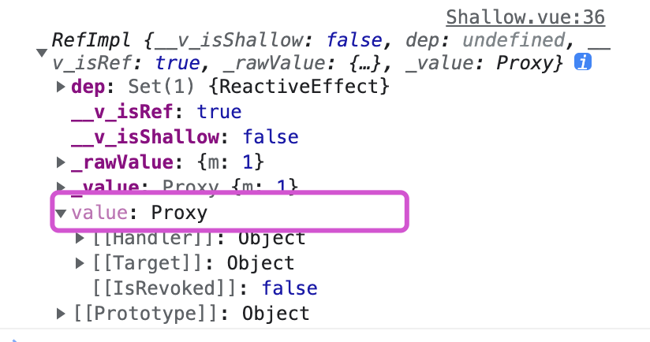


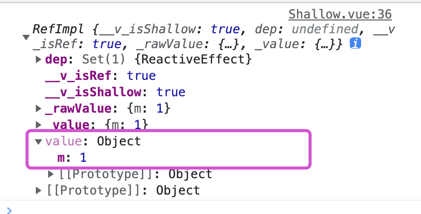


### 2.15.2 readonly 与 shallowReadonly

- readonly

  接受一个对象 (不论是响应式还是普通的) 或是一个ref，返回一个原值的只读代理。

  是深度只读

- shallowReadonly

  让一个响应式数据变成只读的，但是浅只读

- 应用场景:

  在某些特定情况下, 我们可能不希望对数据进行更新的操作, 那就可以包装生成一个只读代理对象来读取数据, 而不能修改或删除

```vue
<template>
  <h3>学生信息展示</h3>
  <p>姓名：{{ stu.name }}</p>
  <p>年龄：{{ stu.age }}</p>
  <p>薪水：{{ stu.job.job1.money }}</p>
  <button @click="stu.name += '=='">修改姓名</button>
  <button @click="stu.age += 1">修改年龄</button>
  <button @click="stu.job.job1.money += 1">涨薪</button>
  <hr />
  <h3>求和</h3>
  <p>count：{{ count }}</p>
  <p><button @click="count++">count++</button></p>
</template>

<script setup>
import { reactive, readonly, ref, shallowReadonly } from "vue";

// 2、监听一个reactive数据
let stu = reactive({
  name: "zs",
  age: 18,
  job: {
    job1: {
      money: 30,
    },
  },
});
// 使响应式数据变成只读的, 不能修改，有警告！
// stu = readonly(stu);
// shallowReadonly 对象里的第一层不能修改，里面的可以修改
stu = shallowReadonly(stu);

let count = ref(1);
// 变成只读
count = readonly(count);
</script>

<style lang="less" scoped></style>
```


### 2.15.3 toRaw 与 markRaw

用ref和reactive的目的，是做把普通的数据转换为响应式数据，有的时候，我们需要把响应式数据变为普通数据。

Raw: 原始的意思

- toRaw：把xx变为原始
  - `toRaw()` 可以返回由 [`reactive()`](https://cn.vuejs.org/api/reactivity-core.html#reactive)、[`readonly()`](https://cn.vuejs.org/api/reactivity-core.html#readonly)、[`shallowReactive()`](https://cn.vuejs.org/api/reactivity-advanced.html#shallowreactive) 或者 [`shallowReadonly()`](https://cn.vuejs.org/api/reactivity-advanced.html#shallowreadonly) 创建的代理对应的原始对象。
  - 简而言之：将==代理对象==转为==普通对象==。这是一个还原方法，可用于临时读取，访问不会被代理/跟踪，写入时也不会触发界面更新。
  - 使用场景：用于读取响应式对象对应的普通对象，对这个普通对象的所有操作，不会引起页面更新。
- markRaw：把xx标记为原始
  - 标记一个对象，使其永远不会转换为代理对象。返回对象本身
  - 应用场景:
    - 有些值不应被设置为响应式的，例如复杂的第三方类实例或 Vue 组件对象。
    - 当渲染具有不可变数据源的大列表时，跳过代理转换可以提高性能。

> ##### 完整代码：
>
> ```vue
> <template>
>   <h3>学生信息展示</h3>
>   <p>姓名：{{ stu.name }}</p>
>   <p>年龄：{{ stu.age }}</p>
>   <p>薪水：{{ stu.job.job1.money }}</p>
>   <p>手机：{{ stu.phone }}</p>
>   <button @click="stu.name += '=='">修改姓名</button>
>   <button @click="stu.age += 1">修改年龄</button>
>   <button @click="stu.job.job1.money += 1">涨薪</button>
> 
>   <!--  -->
>   <p><button @click="showRawStu">输出原始的stu</button></p>
>   <p><button @click="addPhone">添加属性</button></p>
>   <p>
>     <button @click="stu.phone.name += '==='">
>       修改后添加的属性，验证是否是响应式的
>     </button>
>   </p>
>   <p>
>     <button @click="stu.phone.price += 10">修改价格，验证是否是响应式的</button>
>   </p>
>   <!--  -->
>   <hr />
>   <h3>求和</h3>
>   <p>count：{{ count }}</p>
>   <p><button @click="count++">count++</button></p>
> </template>
> 
> <script setup>
> import { markRaw, reactive, readonly, ref, shallowReadonly, toRaw } from "vue";
> 
> // 2、监听一个reactive数据
> let stu = reactive({
>   name: "zs",
>   age: 18,
>   job: {
>     job1: {
>       money: 30,
>     },
>   },
>   // 提前准备好数据
>   // classInfo: {},
> });
> 
> let count = ref(1);
> 
> const showRawStu = () => {
>   // console.log(stu);  // 输出的是是响应式对象
>   const student = toRaw(stu); // 还原成原始对象
>   student.age++; // 界面不会再变
>   console.log(student);
>   // 只能处理reactive定义的响应式对象
>   // const c = toRow(count);
>   // console.log(c);
> };
> 
> // 添加属性
> const addPhone = () => {
>   let phone = { name: "iPhone", price: 9999 };
>   // 后添加的属性也都是响应式的
>   // stu.phone = phone;
>   
>   stu.phone = markRaw(phone);
> 
> };
> 
> </script>
> 
> <style lang="less" scoped></style>
> 
> ```
>
> 


### 2.15.4 响应式数据的判断

- isRef: 检查一个值是否为一个 ref 对象
- isReactive: 检查一个对象是否是由 `reactive` 创建的响应式代理
- isReadonly: 检查一个对象是否是由 `readonly` 创建的只读代理
- isProxy: 检查一个对象是否是由 `reactive` 或者 `readonly` 方法创建的代理


```js
import {
  reactive,
  readonly,
  ref,
  isRef,
  isReactive,
  isReadonly,
  isProxy,
} from "vue";

// 2、监听一个reactive数据
let stu = reactive({
  name: "zs",
  age: 18,
  job: {
    job1: {
      money: 30,
    },
  },
});
let count = ref(1);
let stu2 = readonly(stu);
console.log(isRef(count));
console.log(isReactive(stu));
console.log(isReadonly(stu2));
console.log(isProxy(stu));
console.log(isProxy(stu2));
```


# 三、新增组件

## 3.1 Fragment（片断）

- 在Vue2中: 组件必须有一个根标签
- 在Vue3中: 组件可以没有根标签，内部会将多个标签包含在一个Fragment虚拟元素中
- 好处: 减少标签层级, 减小内存占用

```vue
<template>
    <h2>aaaa</h2>
    <h2>aaaa</h2>
</template>
```


## 3.2 Teleport（瞬移）

- `<Teleport>` 是一个内置组件，它可以将一个组件内部的一部分模板“传送”到该组件的 DOM 结构外层的位置去。


有时我们可能会遇到这样的场景：一个组件模板的一部分在逻辑上从属于该组件，但从整个应用视图的角度来看，它在 DOM 中应该被渲染在整个 Vue 应用外部的其他地方。

这类场景最常见的例子就是全屏的模态框。理想情况下，我们希望触发模态框的按钮和模态框本身是在同一个组件中，因为它们都与组件的开关状态有关。但这意味着该模态框将与按钮一起渲染在应用 DOM 结构里很深的地方。这会导致该模态框的 CSS 布局代码很难写。

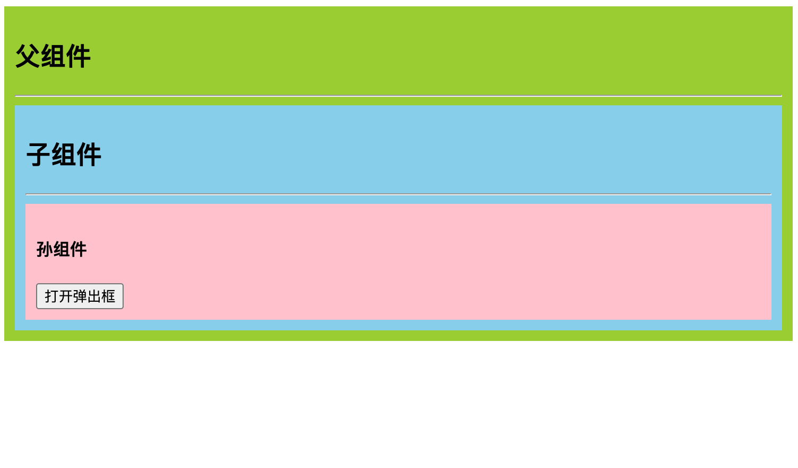

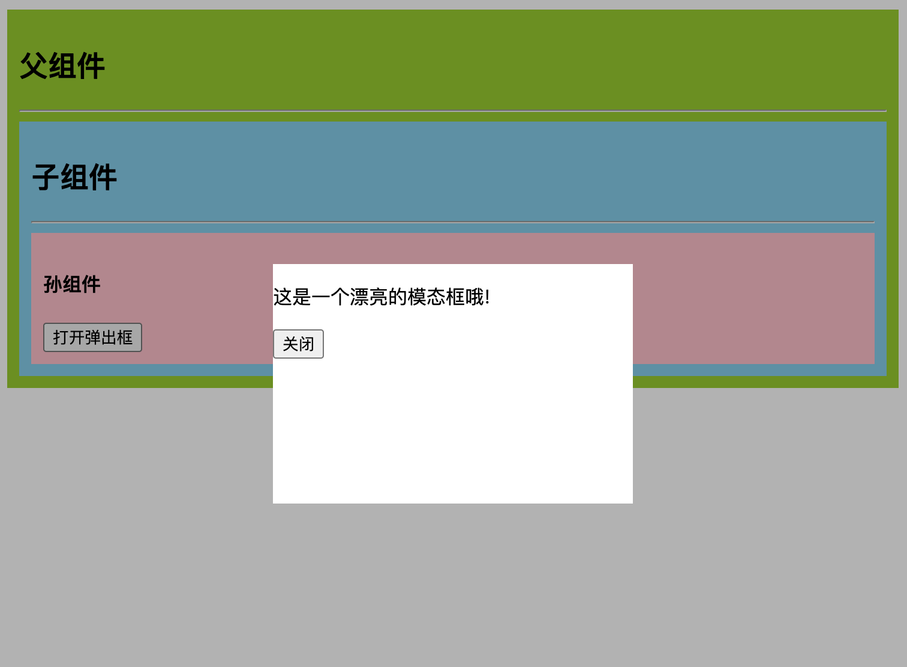


当在初始 HTML 结构中使用这个组件时，会有一些潜在的问题：

- `position: fixed` 能够相对于浏览器窗口放置有一个条件，那就是不能有任何祖先元素设置了 `transform`、`perspective` 或者 `filter` 样式属性。也就是说如果我们想要用 CSS `transform` 为祖先节点 `` 设置动画，就会不小心破坏模态框的布局！
- 这个模态框的 `z-index` 受限于它的容器元素。如果有其他元素与 `` 重叠并有更高的 `z-index`，则它会覆盖住我们的模态框。


#### 注意：

`<Teleport>` 只改变了渲染的 DOM 结构，它不会影响组件间的逻辑关系。也就是说，如果 `<Teleport>` 包含了一个组件，那么该组件始终和这个使用了 `<Teleport>` 的组件保持逻辑上的父子关系。传入的 props 和触发的事件也会照常工作。

这也意味着来自父组件的注入也会按预期工作，子组件将在 Vue Devtools 中嵌套在父级组件下面，而不是放在实际内容移动到的地方。


### Son.vue

```vue
<template>
  <div class="son">
    <h2>子组件</h2>
    <hr />
    <Sun />
  </div>
</template>

<script setup>
import Sun from "./Sun.vue";
</script>

<style scoped>
.son {
  /* position: fixed 能够相对于浏览器窗口放置有一个条件，那就是不能有任何祖先元素设置了 transform、perspective 或者 filter 样式属性。也就是说如果我们想要用 CSS transform 为祖先节点 <div class="outer"> 设置动画，就会不小心破坏模态框的布局！
  原因：给被覆盖的元素设置transform样式，被覆盖的元素层级会被提升
    即：原本应该被覆盖的元素会变成覆盖其他元素
  */
  transform: translate(0, 0);
  padding: 10px;
  background-color: skyblue;
}
</style>

```


### Sun.vue

```vue
<template>
  <div class="sun">
    <h4>孙组件</h4>
    <button @click="open = true">打开弹出框</button>
    <teleport to="body">
      <Transition name="modal">
        <!-- 遮罩层 -->
        <div class="mask" v-if="open">
          <!-- 模态框，登录框 -->
          <div class="login">
            <p>Hello from the modal!</p>
            <button @click="open = false">关闭</button>
          </div>
        </div>
      </Transition>
    </teleport>
  </div>
</template>

<script>
import { ref } from "vue";
export default {
  setup() {
    const open = ref(false);

    return { open };
  },
};
</script>

<style scoped>
.sun {
  padding: 10px;
  background-color: pink;
}
.mask {
  position: fixed;
  top: 0;
  left: 0;
  bottom: 0;
  right: 0;
  background-color: rgba(0, 0, 0, 0.3);
  /* 过渡 */
  /* transition: opacity 3s ease; */
}
.login {
  position: absolute;
  left: 50%;
  top: 50%;
  transform: translate(-50%, -50%);

  width: 300px;
  height: 200px;
  /* margin-left: -150px;
    margin-top: -100px; */
  background-color: #fff;
}

/*
 * 对于 transition="modal" 的元素来说
 * 当通过 Vue.js 切换它们的可见性时
 * 以下样式会被自动应用。
 *
 * 你可以简单地通过编辑这些样式
 * 来体验该模态框的过渡效果。
 */

.modal-enter-from {
  opacity: 0;
}

.modal-leave-to {
  opacity: 0;
}

.modal-enter-from .modal-container,
.modal-leave-to .modal-container {
  -webkit-transform: scale(1.1);
  transform: scale(1.1);
}
</style>

```


### 多个 Teleport 共享目标

一个可重用的模态框组件可能同时存在多个实例。对于此类场景，多个 `<Teleport>` 组件可以将其内容挂载在同一个目标元素上，而顺序就是简单的顺次追加，后挂载的将排在目标元素下更后面的位置上。

比如下面这样的用例：

```vue
<Teleport to="#modals">
  <div>A</div>
</Teleport>
<Teleport to="#modals">
  <div>B</div>
</Teleport>
```

渲染的结果为：

```vue
<div id="modals">
  <div>A</div>
  <div>B</div>
</div>
```


## 3.3 Suspense(不确定的)

n. 焦虑，悬念；

- 它们允许我们的应用程序在等待异步组件时渲染一些后备内容，可以让我们创建一个平滑的用户体验

- 好处：在HTML模板中写异步判断，成功，等待

- Suspense原理：是通过插槽来实现的，一个default和一个fallback。
  default里面放置异步组件，fallback里面就放置异步组件未渲染之前的一个样式

  

  #### Father.vue

  ```vue
  <template>
    <div class="father">
      <h2>父组件</h2>
      <!-- <Son /> -->
      <Suspense>
        <template v-slot:default>
          <Son />
        </template>
  
        <template v-slot:fallback>
          <h1 style="color: pink">Loading...</h1>
        </template>
      </Suspense>
    </div>
  </template>
  
  <script setup>
  // 引入组件：静态引入和动态引入
  // import Son from "./Son.vue";
  // vue2中动态引入组件的方式，vue3中不支持
  // const AsyncComp = () => import("./components/AsyncComp.vue");
  import { defineAsyncComponent } from "vue";
  // 动态引入(异步引入) Father组件先出现，Son后出现
  const Son = defineAsyncComponent(() => import("./Son.vue"));
  </script>
  
  <style scoped>
  .father {
    padding: 10px;
    background-color: yellowgreen;
  }
  </style>
  
  ```

  #### Son.vue

  ```vue
  <template>
    <div class="son">
      <h3>子组件</h3>
      {{ list }}
    </div>
  </template>
  
  <script setup>
  // import axios from "axios";
  
  import { ref } from "@vue/reactivity";
  
  // await axios
  //   .get("")
  //   .then((res) => {})
  //   .catch((err) => {});
  
  const list = ref("是个大列表数据...");
  await new Promise((resolve, reject) => {
    setTimeout(() => {
      resolve({ list });
    }, 3000);
  });
  </script>
  
  <style scoped>
  .son {
    transform: translate(0, 0);
    padding: 10px;
    background-color: skyblue;
  }
  </style>
  
  ```


# Pinia

## 回顾Vuex

### Vue2版本的状态管理

​    在Vue2中，我们使用的状态管理Vuex

​    关于Vuex的版本：3.x版本

​    版本匹配：

​        Vue2 + Vuex3.x + VueRouter3.x

​        Vue3 + Vuex4.x + VueRouter4.x

创建项目

```bash
npm init vue@latest
```

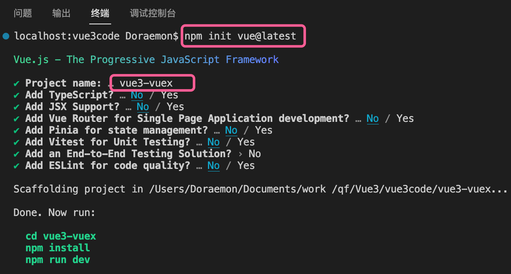


Vuex: https://vuex.vuejs.org/zh/

### 1、安装Vuex

```bash
npm install --save vuex@next
```

### 2、初始化

#### Vue2 初始化

```js
import Vue from 'vue'
import Vuex from 'vuex'

Vue.use(Vuex)

const store = new Vuex.Store({
  state: {
    count: 0
  },
  mutations: {
    increment (state) {
      state.count++
    }
  }
})
```


#### Vue3 初始化

```js
import { createStore } from "vuex"
const store = createStore({
    state:{
        count:10
    },
    mutations:{
        addCount(state,num){
            state.count += num
        }
    },
    actions:{
        asyncAddCount(context,num){
            setTimeout(() =>{
                context.commit("addCount",num)
            })
        }
    },
    getters:{
        getCount(state){
            return "当前count值为：" + state.count
        }
    }
})
export default store
```


### 3、主文件引入

#### Vue2 main.js:

```js
import store from "./store";


new Vue({
  router,
  store,
  render: (h) => h(App),
}).$mount("#app");
```


#### Vue3 main.js

```js
import store from "./store/index.js"

const app = createApp(App)
app.use(store)
app.mount('#app')
```


### 4、读取仓库数据

#### 选项式API：

```vue
<template>
  <h3>选项式API中使用Vuex</h3>
  <p>直接读取：{{ $store.state.count }}</p>
  <p>mapState 映射仓库里状态：{{ count }}</p>
  <p>mapGetters隐射仓库里Getters:{{ getCount }}</p>
  <button @click="addHandler">增加</button>
</template>
<script>
import { mapState, mapMutations, mapActions, mapGetters } from "vuex";
export default {
  computed: {
    ...mapState(["count"]),
    ...mapGetters(["getCount"]),
  },
  methods: {
    ...mapMutations(["addCount"]),
    ...mapActions(["asyncAddCount"]),
    addHandler() {
      // 累加count
      // this.addCount(2)
      this.asyncAddCount(2);
    },
  },
};
</script>

```


#### 组合式API:

```vue
<template>
  <h3>组合式API中使用Vuex</h3>
  <p>直接读取：{{ $store.state.count }}</p>
  <p>{{ count }}</p>
  <p>读取仓库里的计算属性:{{ getCount }}</p>
  <button @click="addHandler">增加</button>
</template>
<script setup>
import { useStore } from "vuex";
import { computed } from "vue";
const store = useStore();
const count = computed(() => {
  return store.state.count;
});
// 读取仓库里的计算属性
const getCount = computed(() => {
  return store.getters.getCount;
});
// 修改数据
const addHandler = () => {
  // commit Mutation
  // store.commit("addCount",5)
  // dispatch action
  store.dispatch("asyncAddCount", 5);
};
</script>

```


## 一、初识Pinia


### 1、介绍

官网解释：

> Pinia 是 Vue 的存储库，它允许您跨组件/页面共享状态。 

在Vue3中，可以使用传统的Vuex来实现状态管理，也可以使用最新的pinia来实现状态管理。

与 Vuex 相比，Pinia 提供了一个更简单的 API，具有更少的规范

官方文档：https://pinia.vuejs.org/

中文文档：https://pinia.web3doc.top/


#### 与 Vuex 的比较

> Pinia 最初是为了探索 Vuex 的下一次迭代会是什么样子，结合了Vuex 5 核心团队讨论中的许多想法。最终，我们意识到 Pinia 已经实现了我们在 Vuex 5 中想要的大部分内容，并决定实现它 取而代之的是新的建议。
>
> 
>
> 实际上，pinia就是Vuex的升级版，官网也说过，为了尊重原作者，所以取名pinia，而没有取名Vuex，所以大家可以直接将pinia比作为Vue3的Vuex。


### 2、为什么要使用pinia？

**优点：**

- 足够轻量，压缩后体积只有1kb左右
- pinia中只有state、getter、action，抛弃了Vuex中的Mutation
- pinia中action支持同步和异步，Vuex不支持
- 良好的Typescript支持，毕竟我们Vue3都推荐使用TS来编写，这个时候使用pinia就非常合适了
- 无需再创建各个模块嵌套了，Vuex中如果数据过多，我们通常分模块来进行管理，稍显麻烦，而pinia中每个store都是独立的，互相不影响。
- pinia支持插件来扩展自身功能。
- Vue2和Vue3都支持。
- 支持服务端渲染。

pinia的优点还有非常多，上面列出的主要是它的一些主要优点，更多细节的地方还需要大家在使用的时候慢慢体会。


### 3、使用

创建项目

```bash
 npm init vue@latest
```


#### 步骤：

1. 安装

   ```bash
   npm i pinia -S
   ```

2. 创建仓库   stores/countStore.js

   ```js
   import { defineStore } from 'pinia'
   
   /**
    * 创建仓库  第一个参数：仓库名字
    */
   export const useCountStore = defineStore('count', {
       // 在pinia中的状态，类似于组件中的data,必须是一个函数
       state: () => {
           return {
               count: 10
           }
       }
   })
   ```

3. 主文件加载仓库

   ```js
   import {createPinia} from 'pinia'
   
   createApp(App).use(createPinia()).mount('#app')
   ```

4. 组件使用仓库

   ```vue
   <template>
     <h3>使用Pinia</h3>
     <p>读取仓库里数据：{{ countStore.count }}</p>
   </template>
   
   <script setup>
   import { useCountStore } from "@/store/countStore.js";
   const countStore = useCountStore();
   </script>
   
   <style lang="less" scoped>
   </style>
   ```

   


### 4、定义Store

#### Option Store

与 Vue 的选项式 API 类似，我们也可以传入一个带有 `state`、`actions` 与 `getters` 属性的 Option 对象。

```js
export const useCounterStore = defineStore('counter', {
  state: () => ({ count: 0 }),
  getters: {
    double: (state) => {
        reurn state.count * 2
    },
  },
  actions: {
    increment() {
      this.count++
    },
  },
})
```

你可以认为 `state` 是 store 的数据 (`data`)，`getters` 是 store 的计算属性 (`computed`)，而 `actions` 则是方法 (`methods`)。

为方便上手使用，Option Store 应尽可能直观简单。


#### Setup Store

也存在另一种定义 store 的可用语法。与 Vue 组合式 API 的 [setup 函数](https://cn.vuejs.org/api/composition-api-setup.html) 相似，我们可以传入一个函数，该函数定义了一些响应式属性和方法，并且返回一个带有我们想暴露出去的属性和方法的对象。

```js
export const useCounterStore = defineStore('counter', () => {
  //`ref()` 就是 `state` 属性
  const count = ref(0)
  //`computed()` 就是 `getters`
  
  //`function()` 就是 `actions`
  function increment() {
    count.value++
  }

  return { count, increment }
})
```

在 *Setup Store* 中：

- `ref()` 就是 `state` 属性
- `computed()` 就是 `getters`
- `function()` 就是 `actions`

Setup store 比 [Option Store](https://pinia.vuejs.org/zh/core-concepts/#option-stores) 带来了更多的灵活性，因为你可以在一个 store 内创建侦听器，并自由地使用任何[组合式函数](https://cn.vuejs.org/guide/reusability/composables.html#composables)。不过，请记住，使用组合式函数会让 [SSR](https://pinia.vuejs.org/zh/cookbook/composables.html) 变得更加复杂。

#### 你应该选用哪种语法？

和[在 Vue 中如何选择组合式 API 与选项式 API](https://cn.vuejs.org/guide/introduction.html#which-to-choose) 一样，选择你觉得最舒服的那一个就好。如果你还不确定，可以先试试 [Option Store](https://pinia.vuejs.org/zh/core-concepts/#option-stores)。


## 二、核心概念

Pinia 本身就是模块化的，Vuex需要借助modules完成模块化 

### 1、State

大多数时候，state 是 store 的核心部分。 我们通常从定义应用程序的状态开始。 在 Pinia 中，状态被定义为返回初始状态的函数

##### Store/loginStore.js:

```js
import { defineStore } from 'pinia'

export const useLoginStore = defineStore('login', {
    // 为了完整类型推理，推荐使用箭头函数
    state: () => {
        return {
            token: 'Abumsfwqrqe1321y602'
        }
    }
})
```

#### 组合式API—读取Pinia数据

```vue
<template>
  <h3>组合式API写法——读取Pinia数据</h3>
  <p>读取仓库里数据：{{ countStore.count }}----{{countStore.num}}</p>
  <p>自动分模块管理：{{loginStore.token}}</p>
</template>

<script setup>
    // 从仓库里引入模块
    import { useCountStore } from "@/store/countStore.js";
    import { useLoginStore } from "@/store/loginStore.js";
    const countStore = useCountStore();
    const loginStore=useLoginStore()
</script>

```

#### 

#### 选项式API读取Pinia 数据

```vue
<template>
  <h2>选项式API(Vue2)读取Pinia 数据</h2>
  <p>count:{{ count }}</p>
  <p>别名 myCount：{{ myCount }}</p>
  <p>doubleCount:{{ doubleCount }}</p>
</template>

<script>
import { mapState } from "pinia";
import { useCountStore } from "../../store/countStore";
export default {
  computed: {
    ...mapState(useCountStore, {
      count: (store) => store.count, //映射仓库里的数据为当前组件的计算属性
      myCount: (store) => store.count, //当前组件里取别名
      //对count加工处理，不能写成箭头函数
      doubleCount(store) {
        return store.count * 2;
      },
    }),
  },
};
</script>
```


### 2、修改状态

在 pinia 中修改状态要比在 vuex 中修改状态简单的多，因为不用引入额外的概念，直接用 store.counter++ 修改 store。

#### 组合式API修改仓库里的状态

```vue
<template>
  <h2>组合式API写法——修改Pinia数据</h2>
  <p>
    <button @click="add">修改仓库里值：count++</button>
  </p>
</template>

<script setup>
    // 从仓库里引入模块
    import { useCountStore } from "@/store/countStore.js";
    import { useLoginStore } from "@/store/loginStore.js";
    const countStore = useCountStore();
    const loginStore = useLoginStore();
    const add = () => {
      countStore.count++;
    };
</script>
```


#### 注意：

`const { count } = countStore();` 解构出来的值，不是响应式的。修改会报错！！


#### Pinia storeToRefs处理结构赋值失去响应式

```vue
<template>
  <h2>解构赋值失去响应式</h2>
  <p>{{ count }}</p>
</template>

<script setup>
import { useCountStore } from "../../store/countStore";
import { storeToRefs } from "pinia";

const store = useCountStore();
// 结构出来的数据不是响应式的
// const {count} =store
// 处理方式: storeToRefs 包裹store,再解构，count是响应式的
const { count } = storeToRefs(store);
</script>

<style lang="less" scoped>
</style>
```


#### 选项API中修改仓库里的状态

需要借助mapWritableState ，映射成当前组件的计算属性。

```diff
<template>
  <h2>选项式API(Vue2)读取Pinia 数据</h2>
  <p>
+    <button @click="addHandler">选项式API(Vue2) 修改count的值</button>
  </p>
</template>

<script>
+ import { mapState, mapWritableState } from "pinia";
import { useCountStore } from "../../store/countStore";
export default {
  computed: {
+    // 与从 store.count 中读取的数据相同
+    ...mapWritableState(useCountStore, ["count"]),

+	// 与上述相同，但将其注册为 this.myOwnName
+    ...mapWritableState(useCounterStore, {
+      myOwnName: 'count',
+    }),
  },
  methods: {
+    addHandler() {
+     this.count+=10;
+    },
  },
};
</script>
```


####  重置  state

有时候我们修改了state数据，想要将它还原，这个时候该怎么做呢？就比如用户填写了一部分表单，突然想重置为最初始的状态。

此时，我们直接调用store的$reset()方法即可，继续使用我们的例子，添加一个重置按钮。

**代码如下：**

```vue
<button @click="reset">重置store</button>


// 重置store
const reset = () => {
  countStore.$reset();
};
```

当我们点击重置按钮时，store中的数据会变为初始状态，页面也会更新。


#### $patch 批量更改state

前面我们修改state的数据是都是一条一条修改的，比如`store.count++` 直接修改store，如果我们一次性需要修改很多条数据的话，有更加简便的方法，使用store的$patch方法，它允许我们用一个 `state` 的补丁对象在同一时间更改多个属性：

应用场景：当需要同时修改多个state属性时，可以使用`$patch`方法。

注意：`$patch` 对多个state的修改在pinia内部是有优化的，比一个个的修改，在性能上有提升


##### 第一种写法：对象写法

```js
<button @click="patchStore">批量修改数据</button>
// 批量修改数据
const patchStore = () => {
  store.$patch({
      count: store.count + 1,
      age: 120,
      name: 'DIO',
    })
};
```


##### 第二种写法：函数参数

有这种用法的是由于：对于像数组执行push之类的操作比较麻烦（需要再创建一个对象，执行后push，在加入....）

```js
// 批量修改
function update() {
  // (1)往数组里添加元素
  arr.value.push(7);
  countStore.$patch({
    count: 100,
    num: 9.9,
    // (2)再赋值
    arr: arr.value,
  });
}

// 函数写法
const updateCount = () => {
  countStore.$patch((state) => {
    state.count = 1000;
    state.arr.push(10);
  });
};
```


#### 替换 state

pinia提供了方法让我们直接替换整个state对象，使用store的$state方法。

**示例代码：**

```js
store.$state = { counter: 666, name: '张三' }
```

上段代码会将我们提前声明的state替换为新的对象，可能这种场景用得比较少，这里我就不展开说明了。


#### 订阅 state

类似于 Vuex 的 [subscribe 方法](https://vuex.vuejs.org/zh/api/index.html#subscribe)，你可以通过 store 的 `$subscribe()` 方法侦听 state 及其变化。比起普通的 `watch()`，使用 `$subscribe()` 的好处是 *subscriptions* 在 *patch* 后只触发一次(例如，当使用上面的函数版本时)。

```js
cartStore.$subscribe((mutation, state) => {
  // import { MutationType } from 'pinia'
  mutation.type // 'direct'直接改变 | 'patch object' | 'patch function'
  // 和 cartStore.$id 一样
  mutation.storeId // 'cart'
  // 只有 mutation.type === 'patch object'的情况下才可用
  mutation.payload // 传递给 cartStore.$patch() 的补丁对象。

  // 每当状态发生变化时，将整个 state 持久化到本地存储。
  localStorage.setItem('cart', JSON.stringify(state))
})
```

mutation：是记录state变化信息的对象

state：是store 的state对象


Type：

direct：直接调用state属性改值

patch object：更改方式是通过patch函数，传入的是object数据

patch function：更改方式是通过patch函数，传入的是函数


storeId：仓库id

events ：存储变化的数据信息


##### `$subscribe()`与`watch` 的区别：

`$subscribe()`是当调用`$patch`方法后，就会触发（无论值是否真的被改变）

`watch`是只有值发生变化的时候，才会触发 

```js
countStore.$subscribe((mutation, state) => {
  console.log(mutation, state);
});
watch(countStore.$state, (newVal, oldVal) => {
  console.log(newVal, oldVal);
});
```


### 3、Getters

Getter 完全等同于 Store 状态的计算属性。

```js
 getters:{
     countGetter(state){
         return 'getters中返回加工包装之后的count：'+state.count*2
     }
 }
```


#### 组合API访问getters：

```vue
<p>
    访问仓库getters：{{countStore.countGetter}}
</p>

<script setup>
// 从仓库里引入模块
import { useCountStore } from "@/store/countStore.js";
    
const countStore = useCountStore();
</script>
```


#### 选项API中访问getters：

在Pinia中，无论是state，还是getters 都是通过mapState读取的，没有mapGetters

```diff
<p>
+    访问仓库里 getters: {{countGetter}}
</p>

<script>
import { mapState, mapWritableState } from "pinia";
import { useCountStore } from "../../store/countStore";
export default {
  computed: {
    ...mapState(useCountStore, {
      count: (store) => store.count, //映射仓库里的数据为当前组件的计算属性
      myCount: (store) => store.count, //当前组件里取别名
      //对count加工处理，不能写成箭头函数
      doubleCount(store) {
        return store.count * 2;
      },
    }),
    ...mapWritableState(useCountStore, ["count"]),
+    // 选项API中访问getters
+   ...mapState(useCountStore,['countGetter'])
  },
};
</script>
```


### 4、Actions

Actions 相当于组件中的 methods。 它们可以使用 defineStore() 中的actions 属性定义，并且**它们非常适合定义业务逻辑**

````js
// actions 定义修改state数据的方法
actions: {
    addAction() {
        this.count++;
    },
        subAction() {
            this.count--;
        }
}
````

#### 组合API中：

```vue
 <p>
     <button @click="addHandler">调用 action 让count++</button>
</p>
<p>
    <button @click="subHandler">调用 action 让count--</button>
</p>
<script setup>
    // 从仓库里引入模块
    import { useCountStore } from "@/store/countStore.js";
    const countStore = useCountStore();
    const add = () => {
      // 直接修改count的值
      countStore.count++;
    };
     // 直接调用 action  
    const addHandler = () => {
      countStore.addAction();
    };
    const subHandler = () => {
      countStore.subAction();
    };
</script>
```

#### 选项API中：

需要额外引入mapActions

```diff
<p>
    <button @click="add">调用 action 让count++</button>
  </p>
  <p>
    <button @click="sub">调用 action 让count--</button>
  </p>

<script>
+ import { mapActions } from "pinia";
import { useCountStore } from "../../store/countStore";
export default {
  methods: {
+    ...mapActions(useCountStore,['addAction','subAction']),
+    add() {
+      this.addAction();
+    },
+    sub() {
+      this.subAction();
+    },
  },
};
</script>
```


#### **actions** 存在的意义是异步

##### store/bannerStore.js：

https://www.maizuo.com/api/banner

```js
import { defineStore } from 'pinia'
import axios from 'axios'

export const useBannerStore = defineStore('banner', {
    state: () => {
        return {
            banner: []
        }
    },
    actions: {
        // action 里写异步Í
        getBannerAction(url) {
            // 发送网络请求
            axios.get(url).then(res => {
                console.log(res.data.banner);
                if (res.data.success === true) {
                    // 往state里存值
                    this.banner = res.data.banner
                }
            }).catch(err => {
                console.log(err);
            })
        }
    }
})

```


##### banner.vue

```vue
<template>
  <h3>Action 异步——网络请求</h3>
  <!-- 渲染 -->
  <!-- {{ bannerStore.banner }}  []里只有一个地址 -->
  <ul>
    <li v-for="(item, index) in bannerStore.banner" :key="index">
      
    </li>
  </ul>
</template>

<script setup>
import { ref, onMounted } from "vue";
import { useBannerStore } from "../../store/bannerStore";
const bannerStore = useBannerStore();
const banner = ref([]);

onMounted(() => {
  // 触发action发送网络请求，获取轮播图数据
  bannerStore.getBannerAction("/foo/api/banner");
});
</script>
```


#### 配置代理 vite.config.js：

```js
import { fileURLToPath, URL } from "node:url";

import { defineConfig } from "vite";
import vue from "@vitejs/plugin-vue";

// https://vitejs.dev/config/
export default defineConfig({
  plugins: [vue()],
  resolve: {
    alias: {
      "@": fileURLToPath(new URL("./src", import.meta.url)),
    },
  },
  server: {
    proxy: {
      "/foo": {
        target: "https://www.maizuo.com",
        changeOrigin: true,
        rewrite: (path) => path.replace(/^\/foo/, ""),
       },
    },
  },
});

```


## 三、Pinia 插件

由于有了底层 API 的支持，Pinia store 现在完全支持扩展。以下是你可以扩展的内容：

- 为 store 添加新的属性
- 定义 store 时增加新的选项
- 为 store 增加新的方法
- 包装现有的方法
- 改变甚至取消 action
- 实现副作用，如[本地存储](https://developer.mozilla.org/en-US/docs/Web/API/Window/localStorage)
- **仅**应用插件于特定 store

插件是通过 `pinia.use()` 添加到 pinia 实例的。最简单的例子是通过返回一个对象将一个静态属性添加到所有 store。


### 1、如何编写pinia插件

定义插件：pinia插件就是一个函数

pinia.use(插件)

把pinia实例添加到app实例中

之后，就可以在仓库中使用插件的功能了

```js
// 1、创建插件
// 在安装此插件后，创建的每个 store 中都会添加一个名为 `secret` 的属性。
// 插件可以保存在不同的文件中
function piniaPlugins() {
  return { secret: 'the cake is a lie' }
}


// 2、main.js主文件中创建 pinia
import { createPinia } from 'pinia'
const pinia = createPinia()

// 将该插件交给 Pinia
pinia.use(piniaPlugins)

app.use(pinia)
app.mount('#app')


// 3、在组件中，使用仓库
const store = useStore()
store.secret // 'the cake is a lie'
```


### 2、插件的上下文

Pinia 插件是一个函数，可以选择性地返回要添加到 store 的属性。它接收一个可选参数，即 `context`。

```js
export function myPiniaPlugin(context) {
  context.pinia // 用 `createPinia()` 创建的 pinia。 
  context.app // 用 `createApp()` 创建的当前应用(仅 Vue 3)。
  context.store // 该插件想扩展的 store
  context.options // 定义传给 `defineStore()` 的 store 的可选对象。
  // ...
}
```


### 3、为所有的store 添加公共属性和方法：

#### 第一种：通过return 返回

可以直接通过在一个插件中返回包含特定属性的对象来为每个 store 都添加上特定属性；==可以的话，请使用返回对象的方法，这样它们就能被 devtools 自动追踪到==：

```js
export function piniaPlugins({ store }) {
  // console.log(context);

  // 第一种方式：
  // 可以直接通过在一个插件中返回包含特定属性的对象来为每个 store 都添加上特定属性；
  return {
    name: "张三",
    sayHi() {
      return "Hello啊,我是" + this.name;
    },
  };
}

```


#### 第二种：直接往store上添加

```js
export function piniaPlugins({ store }) {
  console.log(context);

  // 第二种方式：
  store.title = "Hello world！";
  store.$subscribe(() => {});
}

```


#### store/plugins.js

```js
export function piniaPlugins({ store }) {
    console.log(store);
    store.$subscribe(() => {
        console.log(store.count);
    })
}
```

#### main.js:

```js
// 2、主文件中创建pinia
import { createPinia } from 'pinia'
const pinia = createPinia()

// 导入自己写的插件，并安装
import {piniaPlugins} from './store/plugins'
pinia.use(piniaPlugins)

app.use(pinia)
app.mount('#app')
```


每次修改数据都会打印


### 4、封装本地存储插件

pinia 有个特点，就是无法持久化，在浏览器刷新重置之后，会全部恢复默认，这时候，我们可以利用插件实现本地持久化存储。


#### 封装本地存储的方法：utils/utils.js

```js
// 存值
export const setItem = (key, value) => {
    localStorage.setItem(key, value)
}
// 获取值
export const getItem = (key) => {
    return localStorage.getItem(key)
}
```


#### store/Plugin.js:

```js
import { setItem, getItem } from '../utils/utils'

export function piniaPlugins({ store }) {
    console.log(getItem('count'));
    if (getItem('count')) {
        // 本地有值，给仓库里的count设置值
        store.count = getItem('count');
    }
    // 检测count值的变化，做什么事情
    store.$subscribe(() => {
        console.log(store.count);
        // 一旦检测到数据变化，把值存到本地
        setItem('count', store.count)
    })
}
```


### 5、第三方持久化插件

https://github.com/prazdevs/pinia-plugin-persistedstate

#### 步骤：

1. 注销掉上面自己写的插件

2. 安装

   ```bash
   npm install --save pinia-plugin-persistedstate
   ```

   

3. main.js中导入，并安装

   ```js
   // 导入持久化插件，并安装到pinia
   import { createPinia } from 'pinia'
   import piniaPluginPersistedstate from 'pinia-plugin-persistedstate'
   
   const pinia = createPinia()
   pinia.use(piniaPluginPersistedstate)
   ```

   

4. 仓库中使用

   ```js
   /**
    * 创建仓库  第一个参数：仓库名字
    */
   export const useCountStore = defineStore('count', {
       // 在pinia中的状态，类似于组件中的data,必须是一个函数
       state: () => {
           return {
               count: 10,
               num: 100
           }
       },
       // 计算属性，包装加工
       getters: {
       },
       // actions 定义修改state数据的方法
       actions: {
       },
       // 使用持久化插件的设置
   	//persist: true,
       persist: {
           storage: sessionStorage,
           paths: ['count '],
       },
       
   } ) 
   ```

   


## 四、Pinia的组合式API风格

如果你很喜欢组合式API的代码风格，我们甚至可以在Store中采用组合式API来实现

#### Setup Store

与 Vue 组合式 API 的 [setup 函数](https://cn.vuejs.org/api/composition-api-setup.html) 相似，我们可以传入一个函数，该函数定义了一些响应式属性和方法，并且返回一个带有我们想暴露出去的属性和方法的对象。

```js
export const useCounterStore = defineStore('counter', () => {
  //`ref()` 就是 `state` 属性
  const count = ref(0)
  //`computed()` 就是 `getters`
  
  //`function()` 就是 `actions`
  function increment() {
    count.value++
  }

  return { count, increment }
})
```

在 *Setup Store* 中：

- `ref()` 就是 `state` 属性
- `computed()` 就是 `getters`
- `function()` 就是 `actions`

Setup store 比 [Option Store](https://pinia.vuejs.org/zh/core-concepts/#option-stores) 带来了更多的灵活性，因为你可以在一个 store 内创建侦听器，并自由地使用任何[组合式函数](https://cn.vuejs.org/guide/reusability/composables.html#composables)。


创建项目时选择Pinia，默认就是组合式API风格

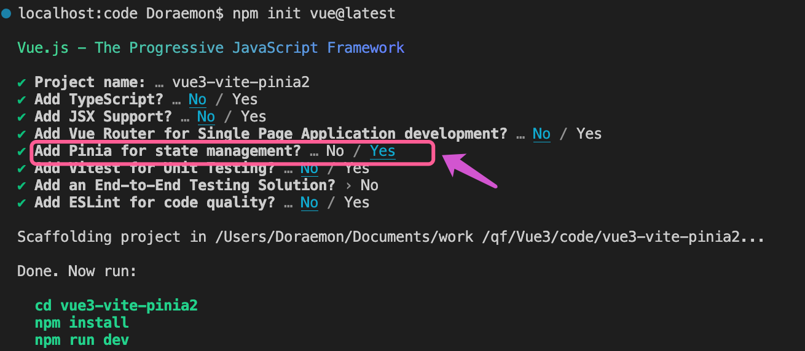


# Vue Router

页面之间的切换，是通过切换不同的地址实现的，地址对应着要显示的组件。而实现这个页面切换显示的功能的就是路由。

### 单页面VS多页面

单页面应用也称为SPA(Single Page Application),它主要是网页的界面渲染在一个静态的页面上， 当用户要从当前界面跳到另一个界面的时候， 在这个过程中，不需要重新加载整个页面，所以页面之间的切换十分快速。

多页面在进行页面切换时十分缓慢,在路由进行跳转的时候会加载所有的资源，而且页面重复代码多。

对比之下，单页面原理是JavaScript动态修改内容而已，资源只需要局部的刷新，因此SPA具有极高的流畅度,有利于提升用户体验。

#### 

|          | 多页面（MPA）              | 单页面（SPA）                   |
| -------- | -------------------------- | ------------------------------- |
| 组成     | 由多个完整页面构成         | 外壳页面和多个页面片段          |
| 资源共用 | 不共用，每个页面都需要加载 | 共用，只需要在页面加载          |
| 刷新方式 | 整页刷新                   | 页面局部刷新或更改              |
| URL模式  | xxx.com/first.html         | xxx.com/#/one或者 xxx.com/first |
| 用户体验 | 页面切换慢，体验差         | 页面切换快，体验好              |
| 数据传递 | 依赖URL传参，本地存储传参  | 容易（路由传参或者组件传值）    |
| SEO      | 利于SEO                    | 不利于SEO                       |
| 维护成本 | 相对复制                   | 相对容易                        |


#### 总结：

整体而言，单页面应该更占优势。而单页面应用的实现，就是通过路由来实现。在Vue中，通过VueRouter实现。


### 介绍

Vue Router是Vue.js的官方路由。它与Vue.js核心深度集成，让用Vue.js构建单页应用变得轻而易举。

官方文档：https://router.vuejs.org/zh/


## 使用路由步骤:

1. 安装

   ```bash
   npm install vue-router@4 --save
   ```

   

2. 引入并创建路由  src/router/index.js

   ```js
   import { createRouter, createWebHashHistory } from 'vue-router'
   import Home from '../views/Home.vue'
   
   
   const routes = [{
       path: '/',
       name: 'home',
       component: Home
   }, {
       path: '/news',
       // 异步组件，提升页面加载速度
       component: () => import('../views/News.vue')
   }]
   
   // 创建路由实例
   const router = createRouter({
      // 路由模式，必须添加
       history: createWebHashHistory(),
       routes
   })
   //导出
   export default router
   ```

   

3. 主文件引入，并安装

   ```diff
   // 11、路由
   import router from './router'
   const app = createApp(App)
    app.use(pinia)
   + app.use(router)
   app.mount('#app')
   ```

4. App.vue

   ```vue
    <!-- 路由导航 -->
   <router-link to="/">首页</router-link>   |   
   <router-link to="/news">新闻</router-link>  
   
   <!-- 路由出口 -->
   <router-view></router-view>
   ```

   


## 不同：

### 1、路由跳转

#### 选项式API写法：

```diff
<template>
  <h3>首页</h3>
  <button @click="goNews">选项式API写法去新闻</button>
</template>

<script>
export default {
  methods: {
    goNews() {
+      this.$router.push("/news");
    },
  },
};
</script>
```


#### 组合式API写法

```diff
<template>
  <h3>新闻</h3>
  <button @click="goHome">useRouter() 去首页</button>
</template>

<script setup>
+ import { useRouter } from "vue-router";
+ const router = useRouter();
+ const goHome = () => {
+  router.push("/");
+ };
</script>
```


### 2、路由传参

https://router.vuejs.org/zh/guide/essentials/dynamic-matching.html

#### 动态路由：

```js
 {
    // 动态字段以冒号开始
    path: '/detail/:id',
    component: () => import('../views/detail.vue')
}]
```


#### 路由导航：

```vue
 <!-- 路由导航 -->
 <router-link to="/">首页</router-link> |
 <router-link to="/news">新闻</router-link> |
 <router-link to="/detail/123">详情</router-link> |
```


#### 选项式API获取动态路由参数：

```vue
<template>
  <h3>详情页</h3>
</template>

 <script>
export default {
  mounted() {
    // Vue2 动态路由传参，获取参数写法
    console.log(this.$route.params.id);
  },
};

</script>
```


#### 组合式API获取动态路由参数：

```vue
<template>
  <h3>详情页</h3>
</template>

<script setup>
import {useRoute} from 'vue-router'
import { ref,onMounted } from "vue"
const id=ref("")
onMounted(()=>{
    const route=useRoute()
    console.log(route.params.id);
})
</script>
```


#### 在 `setup` 中访问路由和当前路由

因为我们在 `setup` 里面没有访问 `this`，所以我们不能再直接访问 `this.$router` 或 `this.$route`。作为替代，我们使用 `useRouter` 函数：

```js
import { useRouter, useRoute } from 'vue-router'

export default {
  setup() {
    const router = useRouter()
    const route = useRoute()

    function pushWithQuery(query) {
      router.push({
        name: 'search',
        query: {
          ...route.query,
        },
      })
    }
  },
}
```

`route` 对象是一个响应式对象，所以它的任何属性都可以被监听，但你应该**避免监听整个 `route`** 对象。在大多数情况下，你应该直接监听你期望改变的参数。

```js
import { useRoute } from 'vue-router'
import { ref, watch } from 'vue'

export default {
  setup() {
    const route = useRoute()
    const userData = ref()

    // 当参数更改时获取用户信息
    watch(
      () => route.params.id,
      async newId => {
        userData.value = await fetchUser(newId)
      }
    )
  },
}
```

请注意，在模板中我们仍然可以访问 `$router` 和 `$route`，所以不需要在 `setup` 中返回 `router` 或 `route`。


### 3、导航守卫

虽然你仍然可以通过 `setup` 函数来使用组件内的导航守卫，但 Vue Router 将更新和离开守卫作为 组合式 API 函数公开：

```js
import { onBeforeRouteLeave, onBeforeRouteUpdate } from 'vue-router'
import { ref } from 'vue'

export default {
  setup() {
    // 与 beforeRouteLeave 相同，无法访问 `this`
    onBeforeRouteLeave((to, from) => {
      const answer = window.confirm(
        'Do you really want to leave? you have unsaved changes!'
      )
      // 取消导航并停留在同一页面上
      if (!answer) return false
    })

    const userData = ref()

    // 与 beforeRouteUpdate 相同，无法访问 `this`
    onBeforeRouteUpdate(async (to, from) => {
      //仅当 id 更改时才获取用户，例如仅 query 或 hash 值已更改
      if (to.params.id !== from.params.id) {
        userData.value = await fetchUser(to.params.id)
      }
    })
  },
}
```

组合式 API 守卫也可以用在任何由 `<router-view>` 渲染的组件中，它们不必像组件内守卫那样直接用在路由组件上。


