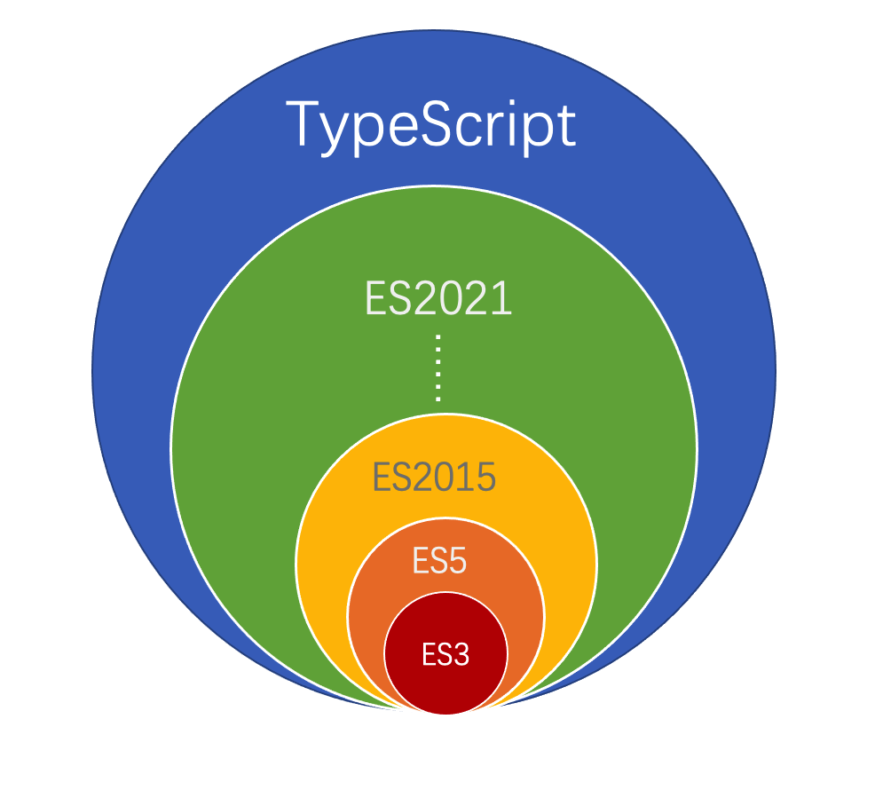
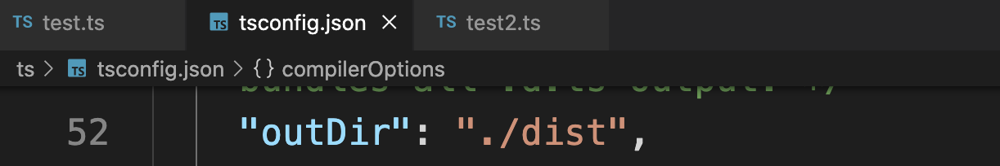
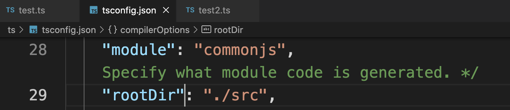
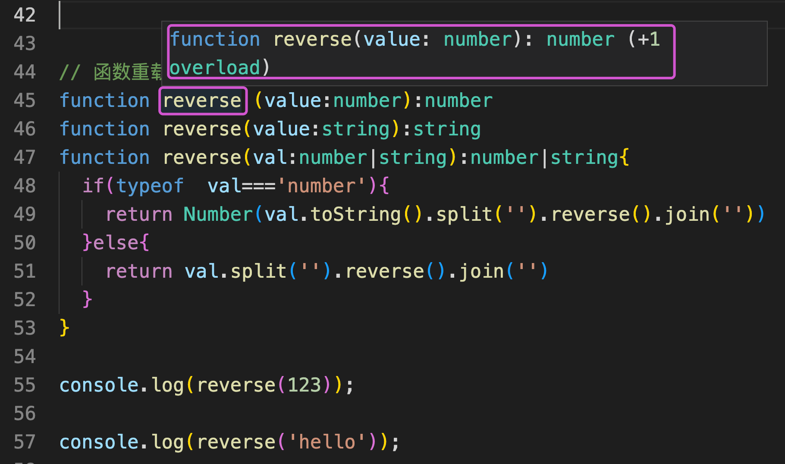

## 一、TypeScript 介绍

### 1.1 什么是TypeScript

TypeScript是一种由微软开发的开源、跨平台的编程语言。它是JavaScript的超集，最终会被编译为JavaScript代码。

2012年10月，微软发布了首个公开版本的TypeScript，2013年6月19日，在经历了一个预览版之后微软正式发布了正式版TypeScript。

TypeScript的作者是安德斯·海尔斯伯格，C#的首席架构师。它是开源和跨平台的编程语言。

中文网：https://www.tslang.cn/index.html

https://github.com/microsoft/TypeScript


#### 1.1.1 `JS`,`ES`,`TS`的关系

- **1995年：JavaScript**

当时的网景公司正凭借其Navigator浏览器成为Web时代开启时最著名的第一代互联网公司。

由于网景公司希望能在静态HTML页面上添加一些动态效果，于是 `Brendan Eich` 在两周之内设计出了JavaScript语言。

为什么起名叫JavaScript？原因是当时Java语言非常红火，所以网景公司希望借Java的名气来推广，但事实上JavaScript除了语法上有点像Java，其他部分基本上没啥关系。

- **1997年：ECMAScript**

因为网景开发了JavaScript，一年后微软又模仿JavaScript开发了JScript，为了让JavaScript成为全球标准，几个公司联合ECMA（European Computer Manufacturers Association）（欧洲计算机制造商协会）组织制定了JavaScript 语言的标准，被称为ECMAScript标准。

从1997年到2014年，17年共发布了5个版本，发布表较慢，从2015.6年，ES6发布之后，ES的命名方式发生大变化，以年份作为命名规则。比如，ES6又叫ECMAScript 2015 

| 版本   | 发布时间       | 一般称呼        | 简称 |
| ------ | -------------- | --------------- | ---- |
| 第1版  | 1997年6月      | ECMAScript 1    | ES1  |
| 第2版  | 1998年4月      | ECMAScript 2    | ES2  |
| 第3版  | 1999年12月     | ECMAScript 3    | ES3  |
| 第4版  | 2007年10月草案 | ECMAScript 4    | ES4  |
| 第5版  | 2009年12月     | ECMAScript 5    | ES5  |
| 第6版  | 2015年6月      | ECMAScript 2015 | ES6  |
| 第7版  | 2016年6月      | ECMAScript 2016 | ES7  |
| 第8版  | 2017年6月      | ECMAScript 2017 | ES8  |
| 第9版  | 2018年6月      | ECMAScript 2018 | ES9  |
| 第10版 | 2019年6月      | ECMAScript 2019 | ES10 |
| 第11版 | 2020年6月      | ECMAScript 2020 | ES11 |
| 第12版 | 2021年6月      | ECMAScript 2021 | ES12 |
| 第13版 | 2022年6月      | ECMAScript 2022 | ES13 |


- **TypeScript**

TypeScript 是 JavaScript 的超集，即包含JavaScript 的所有元素，能运行JavaScript 的代码，并扩展了JavaScript 的语法。相比于JavaScript ，它还增加了静态类型、类、模块、接口和类型注解方面的功能，更易于大项目的开发。

TypeScript 提供最新的和不断发展的 JavaScript 特性，包括那些来自 2015 年的 ECMAScript 和未来的提案中的特性，比如异步功能和 Decorators，以帮助建立健壮的组件。下图显示了 TypeScript 与 ES5、ES2015+ 之间的关系：




##### 总结：

TypeScript不仅包含了ECMAScript的全部内容，还扩展了其他内容。

ECMAScript是JavaScript的标准，TypeScript 是 JavaScript 的超集。


#### 1.1.2 TypeScript VS JavaScript

| TypeScript                                     | JavaScript                                 |
| ---------------------------------------------- | ------------------------------------------ |
| JavaScript 的超集用于解决大型项目的代码复杂性  | 一种脚本语言，用于创建动态网页             |
| 可以在编译期间发现并纠正错误                   | 作为一种解释型语言，只能在运行时发现错误   |
| 强类型，支持静态和动态类型                     | 弱类型，没有静态类型选项                   |
| 最终被编译成 JavaScript 代码，使浏览器可以理解 | 可以直接在浏览器中使用                     |
| 支持模块、泛型和接口                           | 不支持模块、泛型或接口                     |
| 支持 ES3，ES4，ES5 和 ES6+功能                 | 不支持编译其他 ES3，ES4，ES5 或 ES6+ 功能  |
| 社区的支持仍在增长，而且还不是很大             | 大量的社区支持以及大量文档和解决问题的支持 |


#### 1.1.3 为什么学TypeScript？

TypeScript 具有类型系统。

Javascript中没有严格的类型验证的限制，定义好的变量可以根据需求存放各类数据，但是正常情况下，我们不会给一个变量存储不同类型的数据。但是因为JS没有限制，所以很可能导致误操作，引发不必要的bug。

JS一开始只是一个做数据验证的脚本语言，随着技术的发展，网页开发能力越来越强，JS发展的也越来越好，在ES3版本之后，为了加入类型系统推出了ES4，但是最终觉得类型系统不符合JS灵活的特性，又被废弃。

但是对很多开发者来说，愿意舍弃一些灵活性来换取类型系统，所以就有了很多的类型系统的辅助工具: flow、 ts

使用类型系统的目的:

- 提高代码的可读性
- 规避了某些线上bug的产生


>TypeScript 是开发和编译环节起作用的。


### 1.2 安装和使用

#### 1.2.1 安装 TypeScript

全局安装 TypeScript：

```bash
npm install -g typescript
```

检查安装是否成功：

```bash
tsc -V 
```

#### 1.2.2  编译`.ts`文件

app.ts

```ts
let title:string='Hello Ts！'
let num:number=10
```


```bash
# 编译 src/test.ts  生成 dist/test.js
tsc ./src/test.ts --outFile ./dist/test.js

# 编译 src/下面所有文件做监听编译
tsc ./src/* --outDir ./dist --watch
```


#### 1.2.3 自动编译

==通过生成 `tsconfig.json` 配置文件的方式==

向上面的执行命令，可以配置到配置文件中。

（1）在命令行 执行 `tsc --init` 命令，创建一个tsconfig.json文件

（2）在此配置文件里修改：

```bash
"outDir": "./dist",
"rootDir": "./src",

# （3）执行命令，监听编译
tsc --watch
```

手动修改配置文件：






### 1.3 第一个 TypeScript 文件

在编辑器，将下面的代码输入到`greeter.ts`文件里：

```ts
function greeter(person: string) {
    return "Hello, " + person;
}

let user = "Jane User";

//  let user = [0, 1, 2];  //报错！

document.body.innerHTML = greeter(user);
```

##### 类型注解

TypeScript里的类型注解是一种轻量级的为函数或变量添加约束的方式。 在这个例子里，我们希望 `greeter`函数接收一个字符串参数。 然后尝试把 `greeter`的调用改成传入一个数组：


## 二、基础类型

TypeScript包含的最简单的数据单元有：数字，字符串，布尔值，Null和 Undefined等。 TypeScript支持与JavaScript几乎相同的数据类型，此外还提供了实用的枚举类型方便我们使用。

### 2.1 布尔值

最基本的数据类型就是简单的true/false值，在JavaScript和TypeScript里叫做`boolean`（其它语言中也一样）。

```ts
let isDone: boolean = false;
```

### 2.2 数字

和JavaScript一样，TypeScript里的所有数字都是浮点数。 这些浮点数的类型是 `number`。

```js
let num:number=7
```

### 2.3 字符串

像其它语言里一样，我们使用 `string`表示文本数据类型。 和JavaScript一样，可以使用双引号（ `"`）或单引号（`'`）表示字符串。

```ts
let name: string = "Lucy";
name = "Lily";
```

还可以使用**模版字符串**，定义多行文本和内嵌表达式。 这种字符串是被反引号包围（\`\`），并且以`${ expr }`这种形式嵌入表达式。

```ts
let name: string = `Gene`;
let age: number = 17;
let sentence: string = `Hello, my name is ${ name }.

I'll be ${ age + 1 } years old next month.`;
```


### 2.4 数组

TypeScript像JavaScript一样可以操作数组元素。 有两种方式可以定义数组。 第一种，可以在元素类型后面接上 `[]`，表示由此类型元素组成的一个数组：

```ts
let list: number[] = [1, 2, 3];

// 既有number，又有null的数组 【极少】
let list2:(number|null)[]=[1,2,4,null]
```

第二种方式是使用**数组泛型**，`Array<元素类型>`：

```ts
let list: Array<number> = [1, 2, 3];
```


### 2.5 元组 Tuple

元组类型允许表示一个已知元素数量和类型的数组，各元素的类型不必相同。 比如，你可以定义一对值分别为 `string`和`number`类型的元组。

更严格限制数组，限制不同类型对应的元素位置和元素个数。

```ts
// Declare a tuple type
let x: [string, number];
// Initialize it
x = ['hello', 10]; // OK
// Initialize it incorrectly
x = [10, 'hello']; // Error
```

当访问一个已知索引的元素，会得到正确的类型：

```ts
console.log(x[0].substr(1)); // OK
console.log(x[1].substr(1)); // Error, 'number' does not have 'substr'
```

当访问一个越界的元素，也会报错：

```ts
x[3] = 'world'; // 当访问一个越界的元素，也会报错：

console.log(x[5].toString()); // OK, 'string' 和 'number' 都有 toString
```


演示：

```ts
let tuple1:[string,number]=['hello',99]

function sum(m:number,n:number){

}
// 用元组限制  参数聚合； 限制两个参数必须是number类型
function sum2(...args:[number,number]){
	return args[0]+args[1]
}
```


### 2.6 枚举

`enum`类型是对JavaScript标准数据类型的一个补充，使用枚举我们可以定义一些带名字的常量。

```ts
enum Color {Red, Green, Blue}

let c: Color = Color.Green;
```

默认情况下，从`0`开始为元素编号。 你也可以手动的指定成员的数值。 例如，我们将上面的例子改成从 `1`开始编号：

```ts
enum Color {Red = 1, Green, Blue}

let c: Color = Color.Green;
```

或者，全部都采用手动赋值：

```ts
enum Color {Red = 1, Green = 2, Blue = 4}

let c: Color = Color.Green;
```

枚举类型提供的一个便利是你可以由枚举的值得到它的名字。 例如，我们知道数值为2，但是不确定它映射到Color里的哪个名字，我们可以查找相应的名字：==》倒推

```ts
enum Color {Red = 1, Green, Blue}
let colorName: string = Color[2];

console.log(colorName);  // 显示'Green'因为上面代码里它的值是2
```


应用：变量可能有几种类型的值（有限的，固定的），提前定义好

```ts
// 定义固定状态
enum Status {
  Success='successful',
  Danger='danger',
  Warning='warnind'
}
// 判断 后面 success ---》successful
if(data.status===Status.Success){

}
```


### 2.7 Any

有时候，我们会想要为那些在编程阶段还不清楚类型的变量指定一个类型。 这些值可能来自于动态的内容，比如来自用户输入或第三方代码库。 这种情况下，我们不希望类型检查器对这些值进行检查而是直接让它们通过编译阶段的检查。 那么我们可以使用 `any`类型来标记这些变量：

```ts
let notSure: any = 4;
notSure += "maybe a string instead";
notSure = false; // okay, definitely a boolean
```


应用场景：不知道定义成什么类型时，可以定义成any

在对现有代码进行改写的时候，`any`类型是十分有用的，它允许你在编译时可选择地包含或移除类型检查。

```ts
let notSure:any=new ECharts({})

notSure.ifItExists() // okay, ifItExists在运行时可能存在
notSure.toFixed() // okay, toFixed 函数存在（在编译时不做检查）
```

当你只知道一部分数据的类型时，`any`类型也是有用的。 比如，你有一个数组，它包含了不同的类型的数据：

```ts
let list: any[] = [1, true, "free"]; // 注意：此时不能限制成元组，元组不仅限制类型，还限制个数

list[1] = 100;
```

   

### 2.8 Void 

某种程度上来说，`void`类型像是与`any`类型相反，它表示没有任何类型。 当一个函数没有返回值时，你通常会见到其返回值类型是 `void`：

```ts
function warnUser(): void {
    console.log("This is my warning message");
}
```

声明一个`void`类型的变量没有什么大用，因为你只能为它赋予`undefined`，不能赋值其他的值：

```ts
let unusable: void = undefined;

let unusable:void='qewqe'  //void 不能赋值为字符串
```


### 2.9 类型断言

有时候你会遇到这样的情况，你会比TypeScript更了解某个值的详细信息。 通常这会发生在你清楚地知道一个实体具有比它现有类型更确切的类型。

通过**类型断言**这种方式可以告诉编译器，“相信我，我知道自己在干什么”。 类型断言好比其它语言里的类型转换，但是不进行特殊的数据检查和解构。 它没有运行时的影响，只是在编译阶段起作用。 TypeScript会假设你，程序员，已经进行了必须的检查。

类型断言有两种形式。 其一是“尖括号”语法：

```ts
let someValue: any = "this is a string";

let strLength: number = (<string>someValue).length;
```

另一个为`as`语法：

```ts
let someValue: any = "this is a string";

let strLength: number = (someValue as string).length;
```

两种形式是等价的。 至于使用哪个大多数情况下是凭个人喜好；然而，当你在TypeScript里使用JSX时，只有 `as`语法断言是被允许的。


```ts
// 类型断言 利用as告诉ts是什么类型的，进而可以做什么操作
// 有时这个值是后台返给的，不确定类型
let  val:(string|number)='hello ts';
// 当是字符串的话，转全大写===>我确定是string时，...
(val as string).toUpperCase()
```


### 总结：

1. 类型校验，约束开发人员
2. 很好的智能提示
3. 前后端交互，根据后端要返回的数据，提前定义好接口，枚举， 当后端返回数据有改动时，只需要改接口，枚举即可，业务逻辑不需要动


## 三、接口

TypeScript的核心原则之一是对值所具有的**结构**进行类型检查。 在TypeScript里，接口的作用就是为这些类型命名和为你的代码或第三方代码定义契约。

### 3.1 什么是接口

在面向对象语言中，接口(Interfaces) 是一个很重要的概念，它是对行为的抽象，而具体如何行动需要由类(class)去实现(implement) 。

在 TypeScript 中，接口是一个非常灵活的概念，除了可用于对类的一部分行为进行抽象以外，也常用于对 **对象的形状(Shape)** 进行描述。

对象的形状：对象应该长什么样子，应该有哪些属性和方法。

```ts
// 定义接口
interface IStudent{
  name:string,
  age:number
}
// 实现接口 常量zhagnsan类型是Person类型的，
const  zhagnsan:IStudent={
  name:'zs',
  age:18
}
const lisi:IStudent={
  name:'ls',
  age:7
}
```

#### 注意：

1. 接口的名字首字母一般都大写。建议在接口名字前面加个  `I`
2. 实现接口时，参数的类型和数量必须和接口定义保持一致。即 定义的变量，少于或多余接口定义的变量是不可以的！


### 3.2 可选属性

接口里的属性不全都是必需的。 有些是只在某些条件下存在，或者根本不存在。用 `?：` 

```ts
// 定义接口
interface IStudent{
  name:string,
  age:number,
  salary?:number //可选参数
}
// 实现接口
const  zhagnsan:IStudent={
  name:'zs',
  age:18,
  salary:20  //有
}
const lisi:IStudent={
  name:'ls',
  age:7  //无
}
```


### 3.3 任意属性

有时，我们希望一个接口允许有任意的属性，可以用下面的方式：

```ts
// 定义接口
interface IStudent{
  name:string,
  age:number,
  salary?:number, //可选参数，可有可无
  [key:string]:any, // 但是前面的必须要有，其他属性任意添加，类型不一致也可以，
}
// 实现接口
const  zhagnsan:IStudent={
  name:'zs',
  age:18,
  salary:20,  //有
  gender:'男'
}
const lisi:IStudent={
  name:'ls',
  age:7 , //无
  sex:'女'
}
```


### 3.4 只读属性

只读不能改。

```ts
// 定义接口
interface IStudent{
  readonly id:number,  //只读的！后面不可以修改！！
  name:string,
  age:number,
  salary?:number, //可选参数，可有可无
  [key:string]:any, // 但是前面的必须要有，其他属性任意添加，类型不一致也可以，
}
// 实现接口
const  zhagnsan:IStudent={
  id:1,
  name:'zs',
  age:18,
  salary:20,  //有
  gender:'男'
}
const lisi:IStudent={
  id:2,
  name:'ls',
  age:7 , //无
  sex:'女'
}

zhagnsan.id=2  //  修改，报错！！！
```

第一次需要赋值，后面不可以修改。


## 四、 函数

函数是JavaScript应用程序的基础。 它帮助你实现抽象层，模拟类，信息隐藏和模块。 在TypeScript里，虽然已经支持类，命名空间和模块，但函数仍然是主要的定义 **行为**的地方。 TypeScript为JavaScript函数添加了额外的功能，让我们可以更容易地使用。

### 4.1 函数声明

和JavaScript一样，TypeScript函数可以创建有名字的函数和匿名函数。

```ts
// Named function
function sum1(m,n){
  return m+n
}

// Anonymous function
let sum2=function(m,n){
  return n+n
}
```

对函数输入和输出进行约束：

```ts
function sum1(m:number,n:number):number{
  return m+n
}
```

注意：多输或者少输参数都不被允许：

```ts
function sum1(m:number,n:number):number{
  return m+n
}

// 多输或者少输参数都不被允许 Expected 2 arguments, but got 3.
console.log(sum1(1,2,3));
```

#### 小结：

函数限制：可以限制形参的个数、形参的类型以及返回值类型


### 4.2 完整函数类型

现在我们已经为函数指定了类型，下面让我们写出函数的完整类型。

```ts
let myAdd: (x: number, y: number) => number =
    function(x: number, y: number): number { return x + y; };
```

函数类型包含两部分：参数类型和返回值类型。 当写出完整函数类型的时候，这两部分都是需要的。 我们以参数列表的形式写出参数类型，为每个参数指定一个名字和类型。 这个名字只是为了增加可读性。 我们也可以这么写：

```ts
let myAdd: (baseValue: number, increment: number) => number =
    function(x: number, y: number): number { return x + y; };

const sum5:(base:number,increment:number)=>number=(m:number,n:number):number=>{
  return m+n
}
console.log(sum5(4,5));
```

注意：

区分TypesScript的就`=>` 和ES6的 `=>`。

TypesScript中，  `=>` 表示函数的定义，左边是输入约束，需要用括号括起来，右边是输出类型约束。


### 4.3 用接口定义函数

用接口来可以描述函数类型。它就像是一个只有参数列表和返回值类型的函数定义。参数列表里的每个参数都需要名字和类型。

```ts
// 用接口定义函数
interface IFunc{
  (x:number,y:number):number
}
// 定义符合这个接口的函数
const sum5:IFunc=(m:number,n:number):number=>{
  return m+n
}
```


#### 可选参数

前面的写法，传递给一个函数的参数个数必须与函数期望的参数个数一致。

JavaScript里，每个参数都是可选的，可传可不传。 没传参的时候，它的值就是undefined。 在TypeScript里我们可以在参数名旁使用 `?`实现可选参数的功能。 比如，我们想让last name是可选的：   ?:

```ts
function buildName(firstName: string, lastName?: string) {
    if (lastName)
        return firstName + " " + lastName;
    else
        return firstName;
}

let result1 = buildName("Bob");  // works correctly now
let result2 = buildName("Bob", "Adams", "Sr.");  // error, too many parameters
let result3 = buildName("Bob", "Adams");  // ah, just right
```


注意：

可选参数必须跟在必须参数后面。


#### 默认参数

在TypeScript里，我们也可以为参数提供一个默认值当用户==没有传递这个参数或传递的值是`undefined`时==。 它们叫做有默认初始化值的参数。 让我们修改上例，把last name的默认值设置为`"Smith"`。

```ts
function buildName(firstName: string, lastName = "Smith") {
    return firstName + " " + lastName;
}

let result1 = buildName("Bob");// works correctly now, returns "Bob Smith"
let result2 = buildName("Bob", undefined);// still works, also returns "Bob Smith"
let result3 = buildName("Bob", "Adams", "Sr."); // error, too many parameters
let result4 = buildName("Bob", "Adams");// ah, just right
```


#### 剩余参数

同ES6中，可以用`...rest`的方式获取函数中的剩余参数。

```ts
// ES6 剩余参数
function sum6(array,...rest){
  rest.forEach((item)=>{
    array.push(item)
  })
}
```

rest 是一个数组，所以，我们可以用数组的类型来定义它：

```ts
// 剩余参数 求和
const  sum6=(step:number,...nums:number[]):number=>{
  return nums.reduce((pre,item)=>{
    return pre+item
  },0)*step
}

sum6(1,2,3,4)
```

##### 注意：

剩余参数会被当做个数不限的可选参数。 可以一个都没有，同样也可以有任意个。而且只能是最后一个参数。


### 4.4 重载

JavaScript本身是个动态语言。 JavaScript里函数根据传入不同的参数而返回不同类型的数据是很常见的。

TypeScript 允许一个函数接受不同数量或类型的参数时，作出不同的处理。

比如，我们需要实现一个反转功能的函数 `reverse` ，输入数字 `123`，输出：`321` ,输入字符串：`hello` ， 输出 字符串`olleh`

```ts
// 函数重载
function reverse (value:number):number
function reverse(value:string):string
function reverse(val:number|string):number|string{
  if(typeof  val==='number'){
    return Number(val.toString().split('').reverse().join(''))
  }else{
    return val.split('').reverse().join('')
  }
}

console.log(reverse(123));  // 321
console.log(reverse('hello'));  //olleh
```

上例中，重复定义了多次 `reverse` 函数，前面两次是函数定义，最后一次是函数实现。

可以看到函数定义的提示：overload




## 五、类

传统方法中，JavaScript 通过构造函数实现类的概念，通过原型链实现继承。而在ES6中，我们终于迎来了class。

TypeScript除了实现了所有ES6中的类的功能以外，还添加了一些新的用法。

这一节主要介绍类的用法，下一节再介绍如何定义类的类型。


### 5.1 类的概念

虽然JavaScript中有类的概念，但是可能大多数JavaScript程序员并不是非常熟悉类，这里对类相关的概念做一个简单的介绍。

- 类(Class):定义了一种事物的抽象特点，包含它的属性和方法

- 对象(0bject) :类的实例，通过new 生成

- 面向对象(00P)的四大特性:抽象、封装、继承、多态

- 抽象(Abstract) :将事物的特点抽象成属性和方法

- 封装(Encapsulation) :将对数据的操作细节隐藏起来，只暴露对外的接口。外界调用端不需要(也不可能)知道细节，就能通过对外提供的接口来访问该对象，同时也保证了外界无法任意更改对象内部的数据

- 继承(Inheritance) ：子类继承父类，子类除了拥有父类的所有特性外,还有-些更具体的特性

- 多态(Polymorphism) ：由继承而产生了相关的不同的类，对同一个方法可以有不同的响应。比如Cat和Dog都继承自Animal ，但是分别实现了自己的eat方法。此时针对某一个实例，我们无需了解它是Cat 还是Dog，就可以直接调用eat 方法，程序会自动判断出来应该如何执行eat。

- 存取器(getter & setter) :用以改变属性的读取和赋值行为

- 修饰符(Modifers):修饰符是一些关键字，用于限定成员或类型的性质。比如public 表示公有属性或方法，private，protected。

- 抽象类(Abstract Class) ：抽象类是供其他类继承的基类，抽象类不允许被实例化。抽象类中的抽象方法必须在子类中被实现

- 接口(Interfaces) :不同类之间公有的属性或方法，可以抽象成一个接口。接口可以被类实现(implements)。

  一个类只能继承自另一个类，但是可以实现多个接口


### 5.2 ES6 中类的用法

#### 属性和方法

使用`class`定义类，使用`construcor` 定义构造函数。

通过 `new` 生成新的实例时，会自动调用构造函数。

```js
class Person {
  constructor(name, age) {
    this.name = name;
    this.age = age;
  }
  sayHi() {
    console.log(`我是${this.name},${this.age}岁了！`);
  }
}

let p = new Person("zs", 18);
p.sayHi(); // 我是zs,18岁了！
```


#### 类的继承

使用 `extends` 关键字实现继承，子类中使用 `super`关键字来调用父类的构造函数和方法。

```js
class Student extends Person {
  constructor(name, age, score) {
    super(name, age); // 调用父类的构造函数
    this.score = score;
  }
  sayHi() {
    super.sayHi() //调用父类的sayHi()
    // console.log("你好啊！" + super.sayHi()); //调用父类的sayHi()
  }
}

let s = new Student("Tom",20);
s.sayHi(); // 我是zs,20岁了！
```


#### 静态方法

使用 `static` 修饰符修饰的方法称为静态方法，它们不需要实例化，而是直接通过类来调用:

```js
// 静态方法
class Dog {
  static type='狗'
  static isDog(d) {
    console.log(d instanceof Dog);
    // return d instanceof Dog;
  }
}
let dog = new Dog("Jerry");
Dog.isDog(dog); //true
dog.isDog(dog); // Uncaught TypeError: dog.isDog is not a function
```


### 5.3 ES7 中类的用法

ES7中有一些关于类的提案，TypeScript 也实现了它们。

#### 实例属性

ES6 中实例的属性，只能通过构造函数中的 `this.xxx`来定义，ES7提案中，可以直接在类里面定义。

```js
class Bird {
  name='Poly'
  constructor(){
    //...
  }
}

let b=new Bird()
console.log(b.name);
```


#### 静态属性

ES7提案中，可以使用 `static`定义一个静态属性：

```js
class Bird {
  name = "Poly";
  static type = "animal"; //静态属性
  constructor() {
    //...
  }
}
let b = new Bird();
console.log(b.name);

// 访问静态属性
console.log(Bird.type); // animal
```


### 5.4 TS 中类的用法

#### public private和protected

TypeScript可以使用三种访向修饰符，分别是public 、private 和protected。

- public 修饰的属性或方法是公有的，可以在任何地方被访问到，默认所有的属性和方法都是public 的。
- private 修饰的属性或方法是私有的，不能在声明它的类的外部访问；只有父类内不才可以使用
- protected 修饰的属性或方法是受保护的，它和private 类似，区別是它在子类中也是允许被访问的

```ts
class Person{
  // public name:string
  // private name:string
  protected name:string
  
  constructor(name:string){
    this.name=name
  }
  sayHi(){
    console.log('父类sayHi方法：',this.name); 
  }
}

class Student extends Person{
  constructor(name:string){
    super(name)
  }
  run(){
    console.log('子类run方法：',this.name);    
  }
}

const p=new Person('per')
const s=new Student('stu')


// static 静态属性可以被类本身调用，并且内部没有this
// public 父类实例：ok；父类内部：ok；子类本身：ok；子类内部：ok  ；
//private: 父类实例：no；父类内部：ok；子类本身：no；子类内部：no  ；
//protected: 父类实例：no；父类内部：ok；子类本身：no；子类内部：ok  ；

// public 都可以
// private  私有的只能在父类内部访问；父类和子类实例，子类内部都不可以访问
// protected 受保护的  父类和子类内部都可以访问，实例都不可以访问
console.log(p.name);
console.log(s.name);
p.sayHi()
s.run()
```


#### readonly 修饰符

可以使用 `readonly`关键字将属性设置为只读的。 只读属性必须在声明时或构造函数里被初始化。

```ts
class Person{
  name:string

  // 直接写public id,可省略下面的 this.id=id 和上面的 id:string
  constructor(public readonly id:string,name:string){
    this.name=name
  }
  sayHi(){
    console.log('父类sayHi方法：',this.name); 
  }
}

class Student extends Person{
  constructor(id:string,name:string){
    super(id,name)
  }
  run(){
    console.log('子类run方法：',this.name);    
  }
}

const p=new Person('1','per')
const s=new Student('2','stu')


console.log(p.name,p.id);  // per 1
// 修改 id
// p.id=3  //无法为“id”赋值，因为它是只读属性。
```


#### 对象添加类类型

给对象加上 TypeScript 的类型很简单，与接口类似：

```ts
// 限定实例属于当前类
let p2:Person=new Person('1','per')
let s2:Student=new Student('2','stu')
```


### 5.5 类与接口

在 TypeScript 中，接口是一个非常灵活的概念，除了可用于对类的一部分行为进行抽象以外，也常用于对 **对象的形状(Shape)** 进行描述。接口是对行为的抽象，而具体如何行动需要由类(class)去实现(implements) 。

#### 类实现接口

实现（implements）是面向对象中的一个重要概念。一般来讲，一个类只能继承自另一个类，有时候不同类之间可以有一些共有的特性，这时候就可以把特性提取成接(interface) ，用 `implements` 关键字来实现。这个特性大大提高了面向对象的灵活性。

举例来说，狗是一个类，有打招呼的功能，我们通常会给狗类添加一个打招呼的方法。此时，又有一个鸟类，也有打招呼的功能，但是具体的打招呼语言不同，我们就可以把打招呼功能提取出来，作为一个接口，让狗类和鸟类都去实现它。

接口就是限制类必须要有什么属性或方法的。

```ts
// 定义接口：打招呼
interface ISay{
  say():string
}
// 定义接口：吃东西
interface IEat{
  eat():void
}
// 狗类
class Dog implements ISay,IEat{
  name:string
  age:number
  constructor(name:string,age:number){
    this.name=name
    this.age=age
  }
  say(): string {
    return `${this.name},今年${this.age}岁了，叫：汪汪汪~`
  }
  eat(): void {
    console.log(this.name+'吃骨头呀');   
  }
}
// 鸟🐦 类
class Bird implements ISay,IEat{
  name:string
  age:number
  constructor(name:string,age:number){
    this.name=name
    this.age=age
  }
  say(): string {
    return `${this.name},今年${this.age}岁了，叫：，汪汪汪~`
  }
  eat(): void {
    console.log(`${this.name},叫：喳喳喳的`);
  }
  
}

let dog=new Dog('小狗',3)
dog.eat()
console.log(dog.say());

let bird=new Bird('小鸟',2)
bird.eat()
console.log(bird.say());

```

案例中，`Dog` 和 `Bird` 都实现了 `ISay` 和 `IEat` 接口，都是既能吃，就能打招呼。我们还可以再加一个 `IFly` 飞的接口，只有 `Bird` 可以实现。


#### 接口继承接口

和类一样，接口也可以相互继承。 这让我们能够从一个接口里复制成员到另一个接口里，可以更灵活地将接口分割到可重用的模块里。

```ts
// 定义类别接口
interface IType extends ISay,IEat{
  type:string
}

// 定义🐑类
class Sheep implements IType{
  name:string
  age:number
  constructor(name:string,age:number){
    this.name=name
    this.age=age
  }
  say(): string {
    return `${this.name},今年${this.age}岁了，叫：，咩~`
  }
  eat(): void {
    console.log(`${this.name},吃青草`);
   
  }
  type:string='羊类'
  
}

let sheep=new Sheep('美羊羊',3)
console.log(sheep.type);
console.log(sheep.say());
sheep.eat()
```


#### 接口继承类

当接口继承了一个类类型时，它会继承类的成员但不包括其实现。 就好像接口声明了所有类中存在的成员，但并没有提供具体实现一样。 ==接口同样会继承到类的private和protected成员。 这意味着当你创建了一个接口继承了一个拥有私有或受保护的成员的类时，这个接口类型只能被这个类或其子类所实现（implements）==。

当你有一个庞大的继承结构时这很有用，但要指出的是你的代码只在子类拥有特定属性时起作用。 这个子类除了继承至基类外与基类没有任何关系。 例：

```ts
class Point{
  x:number
  y:number
  constructor(x:number,y:number){
    this.x=x
    this.y=y
  }
}
// 接口继承类
interface Ponit3d extends Point{
  z:number
}
/**
 * 相当于
 * interface Ponit3d {
 *  x:number
 *  y:number
 *  z:number
 * }
 */

let point3d:Ponit3d={x:1,y:2,z:3}

console.log(point3d);
```


#### 总结：

1. 一个类只能有一个父类，但是一个类可以继承多个接口
2. 一个接口可以继承接口，而且可以继承多个接口
3. 类是实现具体接口；
4. 接口可以继承类


## 六、泛型

泛型（Generic）是指在定义函数、接口或类的时候，不预先指定具体的类型，而在使用的时候再指定类型的一种特性。

实现效果：调用 `createArray` 函数，返回：

```ts
createArray(1,5)  //返回： [1,1,1,1,1]
createArray('hello',3)  // 返回：['hello','hello','hello']
createArray(null,3)  // 返回：[null,null,null]
```


首先想到的是any：

```ts
const  createArray=(value:any,length:number):Array<any>=>{
  let res=[]
  for (let i = 0; i < length; i++) {
    res[i]=value
  }
  return res
}
```

问题：

`Array[any]` 允许数组的每一项都为任意类型。不能保证输出的数组里面的元素跟输入的value数据类型一致。

此时，就需要用泛型：

### 6.1 泛型参数

```ts
// 推断，传入的value是string,那么返回值也是string
// 定义的时候，不知道什么类型。提前留个空，使用的时候再指定类型
// 写法1 ：
const  createArray=<T>(value:T,length:number):T[]=>{
  let res:T[]=[]
  for (let i = 0; i < length; i++) {
    res[i]=value
  }
  return res
}

// 写法2：
function createArray<T>(value:T,length:number):Array<T>{
  let res:T[]=[]
  for (let i = 0; i < length; i++) {
    res[i]=value
  }
  return res
}

// createArray(1,5)  //返回： [1,1,1,1,1]
// createArray('hello',3)  // 返回：['hello','hello','hello']
// createArray(null,3)  // 返回：[null,null,null]

const arr1:string[]= createArray<string>('hello',3)
const arr2:number[]= createArray<number>(1,5)
console.log(arr1);
console.log(arr2);
```


### 6.2 多类型参数

定义泛型时，可以一次定义多个类型参数。

案例：定义函数来一个交换输入的元组。

```ts
reverseTuple([1,'one']) ==> ['one',1]
reverseTuple(['one',1]) ==> [1,'one']
```


 ```ts
// 参数 params 限定为元组类型 [number,string]
const reverseTuple=(params:[number,string]):[string,number]=>{
    return [params[1],params[0]]
}
console.log(reverseTuple([1,'one'])); // ['one',1]


// 如果说 reverseTuple(['one',1]) ==> [1,'one']
const reverseTuple2 = <T,S> (params:[T,S]):[S,T]=>{
  return [params[1],params[0]]
}

const res1=reverseTuple2<string,number>(['one',1])
const res2=reverseTuple2<number,string>([1,'one'])
console.log(res1);
console.log(res2); // ['one',1]
 ```


### 6.3 泛型约束

在函数内部使用泛型参数的时候，由于事先不知道它是哪种类型，所以不能随意的操作它 的属性或方法：

```ts
function logging<T>(arg:T):T{
  console.log(arg.length); // Error: T doesn't have .length
  return arg
}

logging([1,2,3])
logging(999)
```

上例子中，泛型 `T` 不一定包含属性 `length` ，所以，编译的时候报错。


#### 方式一：操作`T`类型的数组

假设操作`T`类型的数组而不直接是`T`。

```ts
function logging<T>(arg: T[]): T[] {
    console.log(arg.length);  // Array has a .length, so no more error
    return arg;
}
```

可以理解为：泛型函数`logging`，接收类型参数`T`和参数`arg`，它是个元素类型是`T`的数组，并返回元素类型是`T`的数组。这样，把泛型变量T当做类型的一部分使用，而不是整个类型，增加了灵活性。


#### 方式二：泛型数组

还可以用 **泛型数组** `Array<T>` 的写法：

```ts
function logging<T>(arg: Array<T>): Array<T> {
    console.log(arg.length);  // Array has a .length, so no more error
    return arg;
}
```


#### 方式三：接口约束

还可以使用接口对泛型进行约束，只允许这个函数传入包含 `length` 属性的变量。

```ts
// 定义接口 ，必须要有length属性
interface ILength{
  length:number
}

// 让参数泛型继承接口
function logging<T extends ILength>(arg:T):T{
  console.log(arg.length);
  return arg
}

logging([1,2,3])
// logging(112) //类型“number”的参数不能赋给类型“ILength”的参数。
logging('sdfsfsf34')  // 也可以传字符串

```

案例中，我们用了 `extends`约束了泛型 `T` 必须符合 `ILength` 接口的形状，即必须要包含 `length` 属性。如果传入不合法参数，就报错。


### 6.4 泛型接口

前面我们学习过接口定义函数，可以实现接口来约束函数要符合的形状。

```ts
// 用接口定义函数
interface IFunc{
  (x:number,y:number):number
}
// 定义符合这个接口的函数
const sum5:IFunc=(m:number,n:number):number=>{
  return m+n
}
```

也可以使用含有泛型的接口来定义函数的形状。

```ts
// 定义接口 
interface ICreateArray{
  <T>(value:T,length:number):T[]
}

// 让createArray3方法去实现接口 ICreateArray
const  createArray3:ICreateArray=<T>(value:T,length:number):T[]=>{
  let res:T[]=[]
  for (let i = 0; i < length; i++) {
    res[i]=value
  }
  return res
}

createArray3('99',2)
```


### 6.6 泛型类

泛型类看上去与泛型接口差不多。 泛型类使用（ `<>`）括起泛型类型，跟在类名后面。

案例：新建一个队列类上实现两个方法，进入队列，离开队列，这时候就可以使用泛型类。

```ts

// 类名称之后传入泛型
class Queue<T>{
  private arr:T[]=[]
  // 入队
  push(item:T):T[]{
    this.arr.push(item)
    return this.arr
  }
  // 出队
  pop():T[]{
    this.arr.shift()
    return this.arr
  }
}
// 实例化 传入类型
let queue1: Queue<string>= new Queue<string>()
console.log(queue1.push('hello'));
console.log(queue1.push('apple'));
console.log(queue1.push('orange'));
// console.log(queue1.push(77)); //类型“number”的参数不能赋给类型“string”的参数。
console.log(queue1.pop());  // ['apple', 'orange']

let queue2: Queue<number>=new Queue<number>()
console.log(queue2.push(1));
console.log(queue2.push(2));
console.log(queue2.push(3));
console.log(queue2.pop()); 
```


 


