# 一、初始化项目

## 1、项目介绍

移动电商项目—锋购。

技术栈：Vue3(composition api) + Pinia + Vue Router4.x+Vant 4

辅助插件：axios+sass+lodash+store

```bash
npm i axios store lodash @types/lodash -S
npm i sass  -D
```


## 2、项目创建

```sh
npm init vue@latest

fenggou_mobile
```


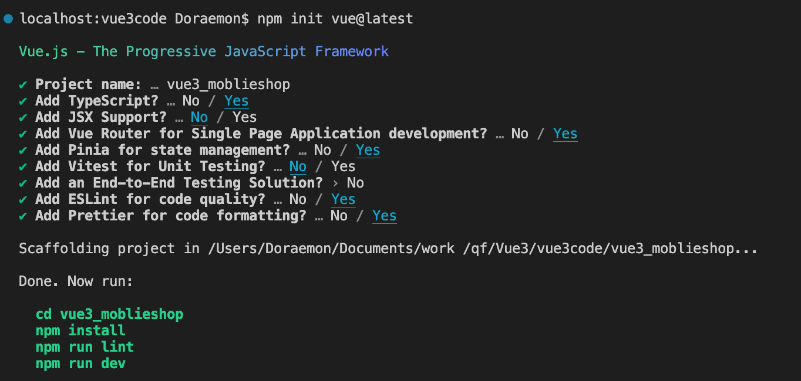


### 搭配 TypeScript 使用 Vue

https://cn.vuejs.org/guide/typescript/overview.html


#### 插件安装

- [Volar](https://marketplace.visualstudio.com/items?itemName=Vue.volar) 是官方的 VSCode 扩展，提供了 Vue 单文件组件中的 TypeScript 支持，还伴随着一些其他非常棒的特性。

  > Volar 取代了我们之前为 Vue 2 提供的官方 VSCode 扩展 [Vetur](https://marketplace.visualstudio.com/items?itemName=octref.vetur)。如果你之前已经安装了 Vetur，请确保在 Vue 3 的项目中禁用它。

- [TypeScript Vue Plugin](https://marketplace.visualstudio.com/items?itemName=Vue.vscode-typescript-vue-plugin) 用于支持在 TS 中 import `*.vue` 文件。


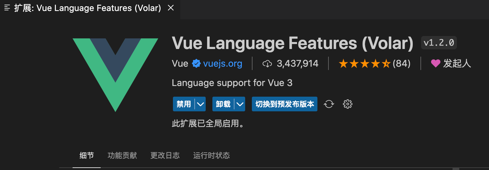


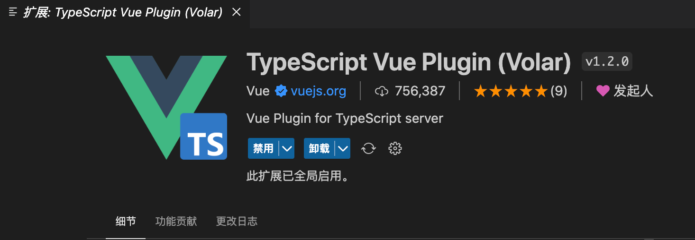


#### 装完 Volar会开启

关闭点击事件：$event

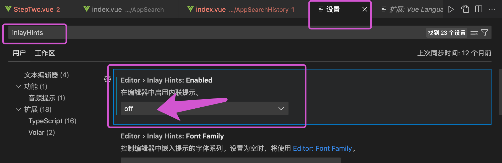


### 报错处理

在 `.ts` 文件中， 报错提示 找不到模块“./XXX.vue”或其相应的类型声明

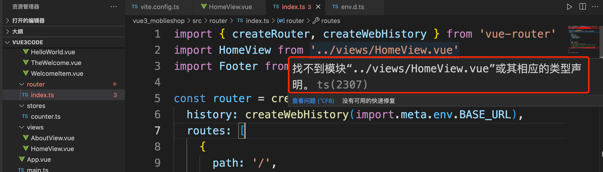

报错原因：typescript 只能理解 .ts 文件，无法理解 .vue文件

**解决：env.d.ts:**

```js
declare module "*.vue" {
  import { App, defineComponent } from "vue";
  const component: ReturnType<typeof defineComponent> & {
    install(app: App): void;
  };
  export default component;
}
```


### 自动导入设置

尤大推荐的神器 unplugin-vue-components ，解放双手！以后再也不用呆呆的手动引入组件、ui(Element-ui)库、或者 vue hooks等了。

安装：

```bash
npm install unplugin-vue-components -D
```


直接写组件名即可，插件会帮你引入进来 **注意别重名**

```js
// vite.config.js
import { defineConfig } from 'vite'
import Components from 'unplugin-vue-components/vite'
import { VantResolver } from "unplugin-vue-components/resolvers";

export default defineConfig({
  plugins: [
    vue(),
    Components({
      // 指定组件位置，默认是src/components
      dirs: ['src'],
     // 组件的有效文件扩展名。
      extensions: ["vue"],
      // 搜索子目录
      deep: true,
      // ui库解析器，也可以自定义
      // resolvers: [VantResolver()],
      // 配置文件生成位置
      dts: 'src/components.d.ts'
    })
  ]
})
```

插件会生成一个自己组件路径的components.d.ts文件

```js
// components.d.ts

// generated by unplugin-vue-components
// We suggest you to commit this file into source control
// Read more: https://github.com/vuejs/vue-next/pull/3399

declare module 'vue' {
  export interface GlobalComponents {
    BaseFilter: typeof import('./components/Common/BaseFilter.vue')['default']
    BaseHeader: typeof import('./components/Common/BaseHeader.vue')['default']
    BasePagination: typeof import('./components/Common/BasePagination.vue')['default']
    BaseSidebar: typeof import('./components/Common/BaseSidebar.vue')['default']
    BaseTags: typeof import('./components/Common/BaseTags.vue')['default']
    BaseTitle: typeof import('./components/Common/BaseTitle.vue')['default']
  }
}

export { }

```


## 3、初始化样式

#### 安装sass

```bash
npm i sass  -D
```

#### assets/css/index.scss

```scss
@import "./_reset";
@import "./_vant";
@import './layout'
```

#### main.ts

```ts
import "@/assets/css/index.scss";
```

#### _vant.scss

```css

```

#### _layout.scss

```scss
// 封装公共的红色背景导航条
```

#### _reset.scss

```scss
* {
  margin: 0;
}

html,
body,
#app {
  height: 100%;
  max-width: 750px;
  margin: 0 auto;
}
body{
  font-size: 14px;
}
```


## 4、Vant组件库

官网地址：https://vant-contrib.gitee.io/vant/#/zh-CN/quickstart

### 安装

```sh
# Vue3 项目，安装最新版 Vant
npm i vant -S
```


#### 配置按需引入

安装插件 [unplugin-vue-components](https://github.com/antfu/unplugin-vue-components), 它可以自动引入组件，并按需引入组件的样式。相比于基础用法，这种方式可以按需引入组件的 CSS 样式，从而减少一部分代码体积。

```sh
npm i unplugin-vue-components -D
```

基于 `vite` 的项目，在 `vite.config.js` 文件中配置插件：

```diff
// ...
// 添加
+import Components from 'unplugin-vue-components/vite';
+import { VantResolver } from 'unplugin-vue-components/resolvers';

export default {
  plugins: [
    // ...
    // 添加
+    Components({
+      resolvers: [VantResolver()],
+    }),
  ],
};

```

#### 使用

完成以上两步，就可以直接在模板中使用 Vant 组件了，`unplugin-vue-components` 会解析模板并自动注册对应的组件。

```vue
<template>
  <van-button type="primary" />
</template>
```


### 函数组件的样式

Vant 中有个别组件是以函数的形式提供的，包括 `Toast`，`Dialog`，`Notify` 和 `ImagePreview` 组件。在使用函数组件时，`unplugin-vue-components` 无法自动引入对应的样式，因此需要手动引入样式。

```ts
// main.ts
import 'vant/es/toast/style'
import 'vant/es/dialog/style';
import 'vant/es/notify/style';
import 'vant/es/image-preview/style';
```

你可以在项目的入口文件或公共模块中引入以上组件的样式，这样在业务代码中使用组件时，便不再需要重复引入样式了。


### 定制主题

#### 方式一：通过 CSS 覆盖

默认值被定义在 `:root` 节点上，HTML 里的所有子节点都可以访问到这些变量。你可以直接在代码中覆盖这些 CSS 变量，Button 组件的样式会随之发生改变：

##### _vant.scss

```css
/* 添加这段样式后，Primary Button 会变成红色 */
:root:root {
  --van-button-primary-background: red;
}
```

测试：

```vue
<van-button type="primary" />
```


#### 方式二：通过 ConfigProvider 覆盖

`ConfigProvider` 组件提供了覆盖 CSS 变量的能力，你需要在根节点包裹一个 `ConfigProvider` 组件，并通过 `theme-vars` 属性来配置一些主题变量。

##### 在 TypeScript 中使用

在 TypeScript 中定义 themeVars 时，建议使用 Vant 提供的 `ConfigProviderThemeVars` 类型，可以提供完善的类型提示：

##### src/config/theme.ts

```ts
import type { ConfigProviderThemeVars } from "vant";

export const themeVars:ConfigProviderThemeVars={
  rateIconFullColor: '#07c160',
      sliderBarHeight: '4px',
      sliderButtonWidth: '20px',
      sliderButtonHeight: '20px',
      sliderActiveBackground: '#07c160',
      buttonPrimaryBackground: '#07c160',
      buttonPrimaryBorderColor: '#07c160',
      buttonPrimaryBackground: "#d30707", // button 背景颜色
      buttonPrimaryBorderColor: "#ccc", // button 边框颜色
      dropdownMenuTitleActiveTextColor: "#d30707", // 下拉菜单选中颜色
  	  dropdownMenuOptionActiveColor: "#d30707",
}
```


##### 测试：App.vue

```vue
<template>
  <van-config-provider :theme-vars="themeVars">
    <van-button type="primary" />
    <RouterView />

    <RouterView name="footer" />
  </van-config-provider>
</template>

<script setup lang="ts">
import { themeVars } from "./config/theme";
</script>
```


## 5、移动端项目

### 设计相关

根据设计人员产出的设计图进行页面开发。标注图

https://www.figma.com/


### 移动端布局

rem 做适配：

移动端设计图大部分都是750宽。设计师会根据iPhone尺寸来进行设计（iphone6）。设备是375px，这是因为移动端屏幕都是Retina屏幕，大部分都是所谓的二倍屏幕。

设计图上量到的尺寸，放到css中应该除以2。

在屏幕750宽的时候，1rem=100px，当屏幕为100vw宽时候，1rem=？

750/100=100vw/x   x=10000vm/750=13.3333333333vw

```css
html,
body,
#app {
  height: 100%;
  max-width: 750px;
  margin: 0 auto;
}
body{
  font-size: 14px;
}
html{
  font-size: 13.333333333vw;
}
```


# 二、底部导航

## 效果图

·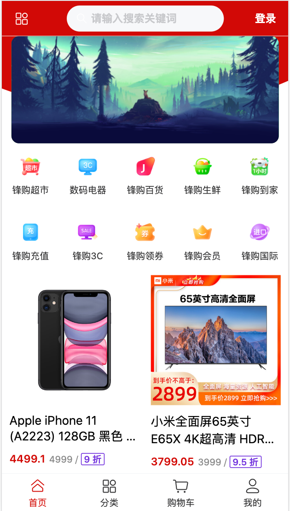


## 布局

### App.vue

```vue
<template>
  <van-config-provider :theme-vars="themeVars">
    <main class="app-container">
      <RouterView />
    </main>
    <!-- 底部 -->
    <CommonFooter />
  </van-config-provider>
</template>

<script setup lang="ts">
import { themeVars } from "./config/theme";
</script>

<style lang="scss" scoped>
.app-container {
  padding-top: 45px;
}
</style>
```


**components/CommonFooter/index.vue**


## 路由配置

### router/index.ts

```ts
import { createRouter, createWebHistory } from 'vue-router'
import AppMain from '@/views/AppMain/index.vue'
import AppCart from '@/views/AppCart/index.vue'
import AppMine from '@/views/AppMine/index.vue'
import AppNotFound from '@/views/AppNotFound/index.vue'

const router = createRouter({
  history: createWebHistory(import.meta.env.BASE_URL),
  routes:[
    {path:'/',redirect:'/main'},
    {path:'/main',name:'main',component:AppMain},
    {path:'/cart',name:'cart',component:AppCart},
    {path:'/mine',name:'mine',component:AppMine},
    { path: '/:pathMatch(.*)*', name: 'NotFound', component: AppNotFound },
  ]
})

export default router

```


### 捕获所有路由或 404 Not found 路由

https://router.vuejs.org/zh/guide/essentials/dynamic-matching.html#%E6%8D%95%E8%8E%B7%E6%89%80%E6%9C%89%E8%B7%AF%E7%94%B1%E6%88%96-404-not-found-%E8%B7%AF%E7%94%B1


### NotFound

`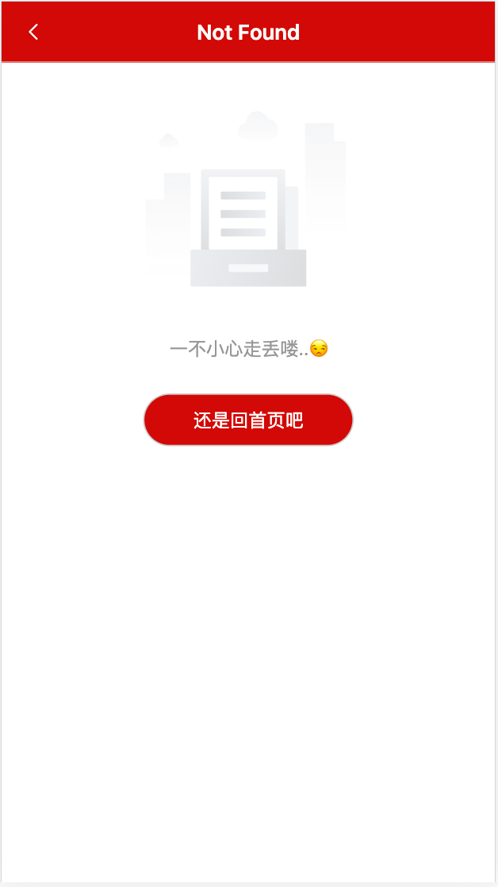

当404页面展示时，控制底部隐藏。

底部处理：修改路由规则，添加mata信息，增加判断。

```diff
 { path: '/:pathMatch(.*)*', 
     name: 'NotFound', component: AppNotFound,
+     meta:{hideFooter:true}
 },
```

#### App.vue:

```vue
 <!-- NotFound 不显示底部 -->
<AppFooter v-if="!route.meta.hideFooter" />
```


```js
import { type RouteLocationNormalizedLoaded, useRoute } from "vue-router";

// 取到当前路由的meta,判断是否展示footer
const route: RouteLocationNormalizedLoaded = useRoute();
```


# 三、顶部导航

### 效果图


### 静态布局

Vant ：导航组件/NavBar 导航栏

**components/CommonHeader/index.vue**

```vue
<template>
  <van-nav-bar class="app-header" title="锋购">
    <!--改成插槽写法-->
    <template #left>
      <van-icon name="arrow-left" size="18">返回</van-icon>
    </template>

    <template #right>
      <van-icon name="search" size="18" />
    </template>
  </van-nav-bar>
</template>

<script setup></script>

<style lang="scss" scoped></style>
```


### 插槽改造

```vue
<template>
  <!-- $attrs 透传样式 -->
  <van-nav-bar
    :class="[$attrs.class]"
    :title="title"
    :left-arrow="back"
    @click-left="backHandler"
    fixed
  >
    <!-- 左侧插槽 -->
    <template v-if="!back" #left>
      <slot name="left" />
    </template>
    <!-- 中间插槽 如果title 属性存在，就不放插槽了-->
    <template v-if="!title" #title>
      <slot name="title" />
    </template>
    <!-- 右侧插槽 -->
    <template #right>
      <slot name="right"></slot>
    </template>
  </van-nav-bar>
</template>

<script setup lang="ts">
import { useRouter } from "vue-router";
// import { onMounted, useAttrs } from "vue";
export interface IHeaderProps {
  title?: string;
  back?: boolean;
}

// 测试样式透传，具体样式由使用着传递过来
// const attrs = useAttrs();
// onMounted(() => {
//   console.log("====", attrs.class);
// });

const { title, back = false } = defineProps<IHeaderProps>();

const router = useRouter();
// 返回上一页
const backHandler = () => {
  // 有返回的，才可以返回
  if (back) {
    router.back();
  }
};
</script>

<style lang="scss" scoped>
</style>
```


### 使用组件

**AppMain/index.vue：**

Vant：表单组件 / Search搜索 /自定义按钮

```vue
<CommonHeader class="app-common_header">
    <!-- 左侧 -->
    <template #left>
		<van-icon name="apps-o" size="20" color="#fff"></van-icon>
    </template>
    <!-- 中间 -->
    <template #title>
        <van-search
                    shape="round"
                    background="#d30707"
                    placeholder="请输入搜索关键词"
                    @click="handleSearch"
                    />
    </template>
    <!-- 右侧 -->
    <template #right>
		<span color="#fff">登录</span>
    </template>
</CommonHeader>

<script setup lang="ts">
import { useRouter, type Router } from "vue-router";

const router: Router = useRouter();
// 点搜索框，跳到搜索界面
const handleSearch = () => {
  router.push({ name: "search" });
};
</script>
```


#### 提起公共样式 

_layout.scss:

```scss
@import "@/assets/css/var";

// 封装公共的红色背景导航条
.app-common_header {
  background-color: $red-color !important;
  font-weight: bold;
  .van-nav-bar__title,
  .van-nav-bar__left,
  .van-nav-bar__right {
    color: #fff;
    .van-icon {
      color: #fff;
    }
  }
  .van-search {
    padding: 0;
  }
}
```


### 全局注册

每个都得需要引入公共的头部组件，我们可以把头部组件注册为全局组件，那么在使用的地方，直接使用，无须注册即可。

#### utils/plugins.ts

```ts
// 注册成全局组件
import CommonHeader from "@/components/CommonHeader/index.vue";
import type { App } from 'vue'

export const common={
  install(app:App){
    app.component("CommonHeader", CommonHeader);
  }
}
```

#### main.ts

```ts
import {common as commonPlugin} from '@/utils/plugins'
app.use(commonPlugin)
```


# 四、首页

## 1、首页-效果图


## 2、首页-轮播图

### API层封装

#### 2.1  axios封装

创建文件: `utils/request.ts`

#### 2.2 安装axios

```sh
npm install axios -S
```


#### 2.3 二次封装

```ts
import axios  from 'axios'
import router from '@/router'
import useUserStore from "@/stores/user";


const req= axios.create({
  baseURL:'/foo',
  timeout:5000  // 最长请求时长
})

req.interceptors.request.use(config=>{
  // 组件外使用store,现用现取
  const useStore = useUserStore();
  // 传递token
  config.headers.token = useStore.token;


  return  config
},err=>{
  throw err
})

req.interceptors.response.use(res=>{
   const isSuccess=res.data.code==='200'

   if(isSuccess){
    return res.data.data;
   }
},err=>{
  return Promise.reject(err)
})


export default req
```


#### api/base.ts:

http://121.89.205.189:3000/api/banner/list

```ts
// 导出所有的接口
const base = {
  banner: "/banner/list",
};

export default base;
```


#### banner.ts

```ts
import base from "./base";
// 导入二次封装
import req from "@/utils/request";

/**
 * 首页轮播图
 * @returns
 * 定义接口的时候，就说明返回什么东西
 */
export const getBannerListApi = () =>
  req.get<any, BannerNS.IBannerItem[]>(base.banner);

```


#### 2.4 消息提示

引入函数组件的样式

Vant 中有个别组件是以函数的形式提供的，包括 `Toast`，`Dialog`，`Notify` 和 `ImagePreview` 组件。在使用函数组件时，`unplugin-vue-components` 无法自动引入对应的样式，因此需要手动引入样式。

```js
// Toast
import { showToast } from 'vant';
import 'vant/es/toast/style';

// Dialog
import { showDialog } from 'vant';
import 'vant/es/dialog/style';

// Notify
import { showNotify } from 'vant';
import 'vant/es/notify/style';

// ImagePreview
import { showImagePreview } from 'vant';
import 'vant/es/image-preview/style';
```


你可以在项目的入口文件或公共模块中引入以上组件的样式，这样在业务代码中使用组件时，便不再需要重复引入样式了。

```ts
// Notify
import { showNotify } from "vant";
import "vant/es/notify/style";

// token 过期
showNotify({ type: "danger", message: "登录过期，请重新登录" });
```


#### 2.5 设置代理

```js
server:{
    // 开启热更新，否则页面总是不更新
    hmr:true,
    proxy: {
      '/foo': {
        // http://121.89.205.189:3000/api/banner/list
        target: 'http://121.89.205.189:3000/api',
        changeOrigin: true,
        rewrite: (path) => path.replace(/^\/foo/, ''),
        }
    }
  }
```


### 创建全局声明文件

**vue3_moblieshop3/@types/banner.d.ts：** 根据后端给的接口文档，定义声明文件：

通常，将一些全局的类型声明放置到项目根目录@type中，需要利用 declare namespace来简化使用方式。

```ts
//@types/banner.d.ts
 declare namespace BannerNS{
   interface IBannerItem{
    alt:string,
    bannerid:string,
    flag:boolean,
    img:string,
    link:string
  }
}
```

#### 目录配置

通常会将全局性的声明文件放在项目根目录下的@types目录中，此时在 tsconfig.json中应该去include进来，才能生效。

tsconfig.json：

```json
"include": ["env.d.ts", "src/**/*", "src/**/*.vue","@types/**/*.d.ts"],

// "include": ["src/**/*.ts", "src/**/*.d.ts", "src/**/*.tsx", "src/**/*.vue"]
```


#### 界面中使用

```ts
// 无需import导入
const bannerList = ref<BannerNS.IBannerItem[]>([]);
```


## 3、首页-十宫格

### 效果图

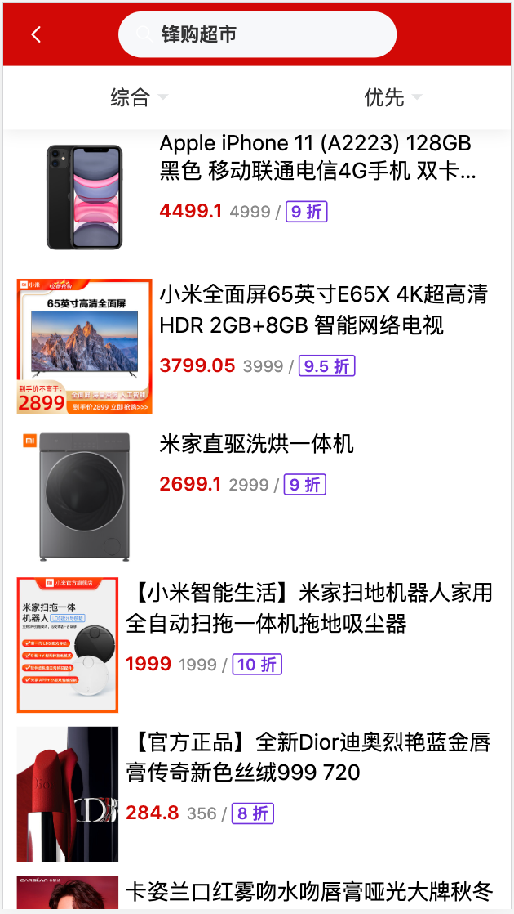      


#### 功能描述

1. 动态渲染十宫格
2. 点击跳转到列表页     `/list?search=锋购超市`

#### AppMain/components/AppMainNavList/index.vue

Vant组件：导航组件/Grid 宫格


```vue
<script setup lang="ts">
import { useRouter, type Router } from "vue-router";
const navs = [
  {
    navId: 1,
    text: "锋购超市",
    url: "https://m15.360buyimg.com/mobilecms/jfs/t1/175540/24/19329/6842/60ec0b0aEf35f7384/ec560dbf9b82b90b.png!q70.jpg",
  },
  {
    navId: 2,
    text: "数码电器",
    url: "https://m15.360buyimg.com/mobilecms/jfs/t1/178015/31/13828/6862/60ec0c04Ee2fd63ac/ccf74d805a059a44.png!q70.jpg",
  },
  {
    navId: 3,
    text: "锋购百货",
    url: "https://m15.360buyimg.com/mobilecms/jfs/t1/54043/33/19389/4660/62b049dbE3b9aef75/2fcd31afd5d702e4.png!q70.jpg",
  },
  {
    navId: 4,
    text: "锋购生鲜",
    url: "https://m15.360buyimg.com/mobilecms/jfs/t1/177902/16/13776/5658/60ec0e71E801087f2/a0d5a68bf1461e6d.png!q70.jpg",
  },
  {
    navId: 5,
    text: "锋购到家",
    url: "https://m15.360buyimg.com/mobilecms/jfs/t1/196472/7/12807/7127/60ec0ea3Efe11835b/37c65625d94cae75.png!q70.jpg",
  },
  {
    navId: 6,
    text: "锋购充值",
    url: "https://m15.360buyimg.com/mobilecms/jfs/t1/185733/21/13527/6648/60ec0f31E0fea3e0a/d86d463521140bb6.png",
  },
  {
    navId: 7,
    text: "锋购3C",
    url: "https://m15.360buyimg.com/mobilecms/jfs/t1/145692/9/1817/4493/5efbf652E61c4f3ec/722840c121d67fc6.png",
  },
  {
    navId: 8,
    text: "锋购领券",
    url: "https://m15.360buyimg.com/mobilecms/jfs/t1/186080/16/13681/8175/60ec0fcdE032af6cf/c5acd2f8454c40e1.png",
  },
  {
    navId: 9,
    text: "锋购会员",
    url: "https://m15.360buyimg.com/mobilecms/jfs/t1/37709/6/15279/6118/60ec1046E4b5592c6/a7d6b66354efb141.png",
  },
  {
    navId: 10,
    text: "锋购国际",
    url: "https://m15.360buyimg.com/mobilecms/jfs/t1/191060/24/12861/6818/60ec11f2E67cf5ee6/c264378678b3cd96.png",
  },
];

const router: Router = useRouter();
// 导航到列表页
const handleToList = (title: string) => {
  router.push({ name: "list", query: { search: title } });
};
</script>
```


## 4、首页-商品列表

### 接口：

#### Pro - 获取商品分页列表数据

GET

```http
http://121.89.205.189:3000/api/pro/list
```

参数

| 字段     | 类型   | 描述                    |
| :------- | :----- | :---------------------- |
| count    | Number | 页码,默认值为1          |
| limitNum | Number | 每页显示个数,默认值为10 |


### 实现

#### api/base.ts

```js
prolist: "/pro/list",
```


#### api/index.ts

```ts
// 定义接口
export interface IPageParams {
  count: number;
  limitNum?: 6;
}

/**
 * 获取商品列表
 * @returns
 * http://121.89.205.189:3000/api/pro/list
 */
export const getProListApi = (params: IPageParams) =>
  req.get<any, GoodsNS.IGoodsItem[]>(base.prolist, { params });
```


#### @types/pro.d.ts:

```ts
// 商品对象接口
declare namespace GoodsNS {
    
  interface IGoodsItem {
    readonly proid: string;
    proname: string;
    originprice: number;
    category: string;
    brand: string;
    desc: string;
    img1: string;
    discount: number;
    // 多加一个轮播图属性
    banners: string[];
  }
}

```


#### 封装通用组件

商品列表在很多页面都会用到，因此封装一个通用的组件CommonList，可多次复用。

梳理不同：

1. 布局方式不同：一行一个、一行两个   通过传递动态属性 column实现
2. 调用接口不同：通过传递不同的请求方法 action实现

组件内置业务：布局、自动获取数据、上拉加载更多


## 5、封装通用的商品列表

### 效果图

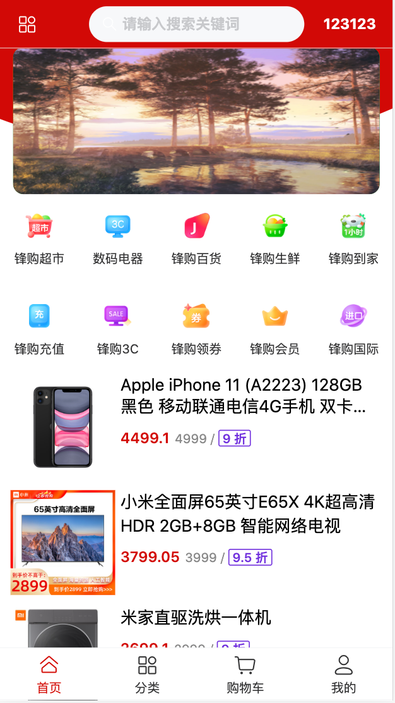    

商品列表，在有的页面显示成一列（左边图片，右侧商品信息），有的页面显示成两列（上面图片，下面商品信息）。所以，可以封装通用的商品列表，根据用户输入的列数，展示效果。

### 封装结构

Vant组件：展示组件/List 列表

https://vant-contrib.gitee.io/vant/#/zh-CN/list

#### components/CommonList/index.vue

```vue
<template>
  <div class="common-list">
    <!-- immediate-check	是否在初始化时立即执行滚动位置检查	boolean	true -->
    <van-list
      v-model:loading="loading"
      :finished="finished"
      finished-text="没有更多了"
      @load="onLoad"
      :immediate-check="false"
    >
      <!-- 循环 -->
      <van-cell
        v-for="item in goodsList"
        :key="item.proid"
        :title="item.proname"
      />
    </van-list>
  </div>
</template>

<script setup lang="ts">
import { ref, reactive, onMounted } from "vue";
import { getProListApi, type IPageParams } from "@/api";


export interface IProps {
  action(): any;
  column?: 1 | 2; //一列，还是两列
}
const { column = 1, action } = defineProps<IProps>();

const loading = ref<boolean>(false);
const finished = ref<boolean>(false);
//商品列表
const goodsList = ref<GoodsNS.IGoodsItem[]>([])
// 定义页码信息
const pageInfo = reactive<IPageParams>({
  count: 1,
  limitNum: 10,
});

const onLoad = async () => {
  try {
    const res = await getProListApi(pageInfo)
    console.log(res)
    goodsList.value = goodsList.value.concat(res)
    // 加载结束
    loading.value = false
    // 数据已全部加载完毕
    if (res.length === 0) {
      finished.value = true
    }
    // 页码+1
    pageInfo.count++
  } catch (error) {
    console.log(error)
  }
};

onMounted(() => {
  onLoad();
});
</script>

<style scoped>
.common-list {
  margin-bottom: 50px;
  padding: 0 10px;
}
</style>

```


#### Bug:一上来获取了两次第一页数据

一开始容器没撑开，高度没有，触发一次。

解决：

```html
 <!-- immediate-check	是否在初始化时立即执行滚动位置检查	boolean	true -->
```


##### 打折小标签

**Vant组件：展示组件/Tag标签**

https://vant-contrib.gitee.io/vant/#/zh-CN/tag

```vue
<van-tag color="#7232dd" plain>标签</van-tag>
```


##### 最多显示两行：

**Vant组件：基础组件/Style内置样式**

https://vant-contrib.gitee.io/vant/#/zh-CN/style

```vue
<!-- 最多显示两行 -->
<div class="van-multi-ellipsis--l2">
  这是一段最多显示两行的文字，多余的内容会被省略
</div>
```


### 动态定制

1. 显示几列，由父组件决定
2. 不同页面，展示的列表数据不同

作用：是外界传入发送网络请求的方法。即，不同的页面使用该组件，要展示的数据不一定一样，需要根据需求，去发网络请求。


##### 传入方法：

```vue
 <!-- 两列商品列表 -->
<CommonList :column="2" :action="getProListApi" />

<script setup lang="ts">
    import { getProListApi } from "@/api";
</script>
```


# 五、列表页

## 效果图

​	


## 路由配置

```ts
import AppList from "@/views/AppList/index.vue";

 {
      path: "/list",
      name: "list",
      component: AppList,
      meta: { hideFooter: true },
    },
```


## 布局

```vue
<template>
  <div class="page app-list">
    <CommonHeader class="app-common_header" back>
      <!-- 中间 -->
      <template #title>
        <van-search
          v-model="keyword"
          shape="round"
          background="#d30707"
          placeholder="请输入搜索关键词"
          @click="handleSearch"
        />
      </template>
    </CommonHeader>
    <!-- 过滤组件 -->
    <AppListFilter :filters="filters" />
    <!-- 公共的商品列表 -->
    <CommonList :action="getProSearchListApi" />
  </div>
</template>
<script setup lang="ts">
import { useRoute, useRouter, type Router } from "vue-router";
// 获取商品列表的接口
import { getProSearchListApi } from "@/api";


const route = useRoute();
// 获取参数
const keyword = ref<string>((route.query.search as string) || "");

  
</script>

<style lang="scss" scoped></style>
```


## 十宫格导航到列表

导航到商品列表页

**AppMain/AppMainNavList/index.vue**

```diff
<template>
  <div class="app-main_nav-list">
    <van-grid :column-num="5" :border="false">
      <van-grid-item
        v-for="nav in navs"
        :key="nav.navId"
        :icon="nav.url"
        :text="nav.text"
+        @click="handleToList(nav.text)"
      />
    </van-grid>
  </div>
</template>

<script setup lang="ts">
+import { useRouter, type Router } from "vue-router";
+const router: Router = useRouter();
+// 导航到列表页
+const handleToList = (title: string) => {
+  router.push({ name: "list", query: { search: title } });
+};
</script>
```


# 六、详情页

### 效果图

​	


### 路由配置：

```ts
import AppDetail  from '@/views/AppDetail/index.vue'

// 注意：动态路由传参 params 传参方式
{path:'/detail/:proid',name:'detail',component:AppDetail,meta:{hideFooter:true}},
```


### 接口：

**Pro - 获取产品的详情数据    GET**

```http
http://121.89.205.189:3000/api/pro/detail/:proid
```

参数

| 字段  | 类型   | 描述               |
| :---- | :----- | :----------------- |
| proid | String | 产品唯一值，产品id |

响应

```json
{
  code: '10001',
  message: '抱歉，没有查找到该商品'
}
{
  code: '200',
  message: '获取产品的详情数据'
  data: {}
}
```


#### api/base.ts

```ts
proDetail:'/pro/detail', // 商品详情
```

index.js:

```ts
/**
 * 获取商品详情  /pro/detail/:proid  params传参
 * @param proid   proid:string
 * @returns 
 */
export const getProDetailApi=(proid:string)=>{
  console.log(`${base.proDetail}/${proid}`);
 return  req.get(`${base.proDetail}/${proid}`)
}
```

#### AppDetail/index.vue

```ts
import { onMounted } from "vue";
import { useRoute } from "vue-router";
import { getProDetailApi } from "../../api";

onMounted(() => {
  getProDetail();
});

const route = useRoute();
const getProDetail = async () => {
  // params获取参数：
  // console.log("=====", route.params.proid);
  const res = await getProDetailApi(route.params.proid as string);
  proDetail.value = res;
};
```


 

# 七、AppNotFound

#### 效果图


#### 展示组件/Empty 空状态

```vue
<template>
  <div class="page app-not-found">
    <CommonHeader title="Not Found" class="app-common_header" :back="true" />

    <!-- 展示组件  Empty 空状态-->
    <van-empty description="一不小心走丢喽😭">
      <router-link v-slot="{ navigate }" to="/" custom>
        <van-button @click="navigate" round type="primary" class="bottom-button"
          >还是回首页吧</van-button
        >
      </router-link>
    </van-empty>
  </div>
</template>

<script setup lang="ts"></script>

<style scoped lang="scss">
.bottom-button {
  width: 160px;
  height: 40px;
}
</style>
```


# 八、登录

### 效果图

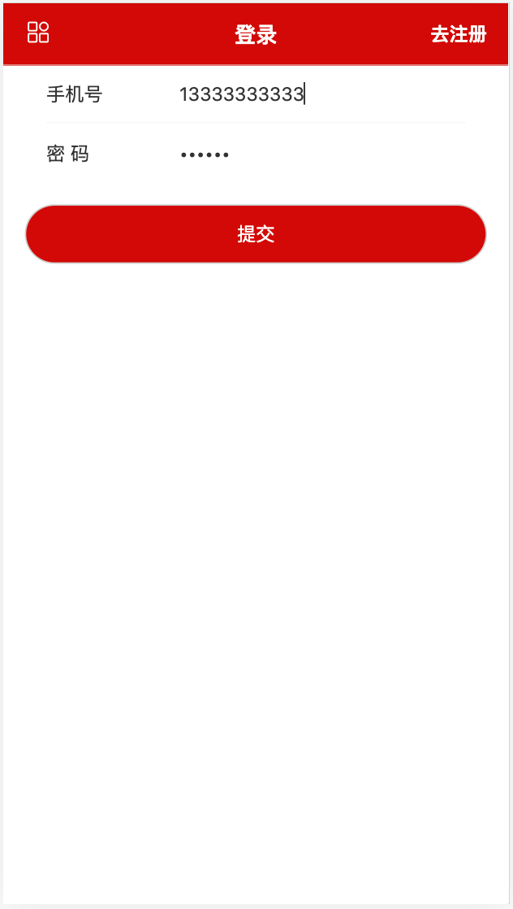

### 配置路由

```ts
import AppLogin  from '@/views/AppLogin/index.vue'

{path:'/login',name:'login',component:AppLogin,meta:{hideFooter:true}},
```


### 布局

```vue
<template>
  <div class="page">
    <CommonHeader class="app-common_header" title="登录">
      <!-- 左侧 -->
      <template #left>
        <router-link to="/">
          <van-icon name="apps-o" size="20" color="#fff"></van-icon>
        </router-link>
      </template>
      <template #right>
        <router-link
          v-slot="{ navigate }"
          custom
          :to="{ name: 'register-one' }"
        >
          <span @click="navigate" color="#fff">去注册</span>
        </router-link>
      </template>
    </CommonHeader>
    <!-- Form 表单-->
    <van-form @submit="onSubmit">
      <van-cell-group inset>
        <!-- 输入手机号 -->
        <van-field
          v-model="loginInfo.loginname"
          type="tel"
          name="tel"
          label="手机号"
          placeholder="请输入手机号"
          :rules="[
            {
              required: true,
              message: '请填写手机号',
              validator: validatorTel,
            },
          ]"
        />
        <van-field
          v-model="loginInfo.password"
          type="password"
          name="pwd"
          label="密   码"
          placeholder="密 码"
          :rules="[{ required: true, message: '请填写密码' }]"
        />
      </van-cell-group>
      <div style="margin: 16px">
        <van-button round block type="primary" native-type="submit">
          提交
        </van-button>
      </div>
    </van-form>
  </div>
</template>

<script setup lang="ts">
import { ref, reactive } from "vue";
import { phoneReg } from "../../utils/common";

interface ILoginInfo {
  loginname: string;
  password: string;
}

// 验证手机号
const validatorTel = (val) => {
  if (!val) return "手机号不能为空！";
  console.log(val);
  if (!phoneReg.test(val)) return "手机号输入错误";
};

const loginInfo = reactive<ILoginInfo>({
  loginname: "",
  password: "",
});
// 登录
const onSubmit = (values) => {
  // 调用登录接口
  console.log("submit", loginInfo);
};
</script>

<style lang="scss"></style>

```


### utils/common.ts：

封装正则：

```ts
export const phoneReg =
  /^(?:(?:\+|00)86)?1(?:(?:3[\d])|(?:4[5-79])|(?:5[0-35-9])|(?:6[5-7])|(?:7[0-8])|(?:8[\d])|(?:9[1589]))\d{8}$/;
```


### 接口

#### User - 账户名/手机号/邮箱 + 密码的登录方式

POST

```http
http://121.89.205.189:3000/api/user/login
```

#### 参数

| 字段      | 类型   | 描述               |
| :-------- | :----- | :----------------- |
| loginname | String | 账户名/手机号/邮箱 |
| password  | String | 密码               |

#### 成功返回

```ts
{
   code: '200',
   message: '登录成功',
   data: {
     token,
     userid
   }
 }
```


base.ts:

```ts
login: "/user/login", // 登录      
```


user.ts:

```ts

// 定义登录参数接口
export interface ILoginParams {
  loginname: string;
  password: string;
}

/**
 * 登录接口 post请求
 * @param userinfo:ILoginParams{ loginname: string; password: string }
 * @returns   { token: string; userid: string }
 */
export const postLoginApi = (params: ILoginParams) =>
  req.post<any, { token: string; userid: string }>(base.login, params);
```


# 九、仓库搭建

## 获取用户信息


GET

```http
http://121.89.205.189:3000/api/user/info
```

参数

| 字段   | 类型   | 描述   |
| :----- | :----- | :----- |
| userid | String | 用户id |


Base.ts

```ts
userinfo: "/user/info", //获取用户信息接口
```

user.ts:

```ts
/**
 * 获取用户信息
 * @param userid ：string
 * @returns
 */
export const getUserinfoApi = (userid: string) =>
  req.get<any, UserNS.IUserInfo>(base.userinfo, { params: { userid } });
```


### @types/user.d.ts

User - 获取用户信息   输入token和userid，获取用户信息。

```ts
declare namespace UserNS {
  interface IUserInfo {
    userid: string;
    username: string;
    tel?: string;
    nickname: string;
    avatar?: string;
    createTime?: string;
  }
}

```


## Pinia搭建仓库

### stores/user.ts

```ts

```


## 调登录接口

用pinia-plugin-persistedstate 本地存储

#### 步骤：

1. 安装

   ```bash
   npm install --save pinia-plugin-persistedstate
   ```

   

2. main.ts中导入，并安装

   ```js
   // 导入持久化插件，并安装到pinia
   import { createPinia } from 'pinia'
   import piniaPluginPersistedstate from 'pinia-plugin-persistedstate'
   
   const pinia = createPinia()
   pinia.use(piniaPluginPersistedstate)
   ```

   

#### 请求拦截，带token


## 界面完善

### 主页：AppMain/index.vue

```vue
<!-- 右侧 -->
<template #right>
    <span v-if="isLogin"> {{ userinfo.nickname }}</span>
    <router-link v-else to="/login" custom v-slot="{ navigate }">
      <span @click="navigate" color="#fff">登录</span>
    </router-link>
</template>
```


```ts
import { storeToRefs } from "pinia";
import useUserStore from "../../stores/user";

const userStore = useUserStore();
const { isLogin, userinfo } = storeToRefs(userStore);


```


### 详情页：AppDetail/index.vue:

```ts
import { storeToRefs } from "pinia";
import useUserStore from "../../stores/user";

const userStore = useUserStore();
const { isLogin, userinfo } = storeToRefs(userStore);
```


```vue
<!-- 加入购物车 业务组件：SubmitBar 提交订单栏 -->
<van-submit-bar
                :disabled="!isLogin"
                :price="proDetail.originprice * 100"
                :button-text="isLogin ? 加入购物车 : '去登录'"
                @submit="handleAddCart"
                />
```


### 购物车：AppCart/index.vue

```ts
import { storeToRefs } from "pinia";
import useUserStore from "../../stores/user";

const userStore = useUserStore();
const { isLogin, userinfo } = storeToRefs(userStore);
```


```vue
 <!-- 没有登录显示 -->
<van-empty v-if="!isLogin" description="请登录后查看哦😯">
    <router-link v-slot="{ navigate }" :to="{ name: 'login' }" custom>
        <van-button @click="navigate" round type="primary" class="bottom-button"
                    >马上登录</van-button
            >
    </router-link>
</van-empty>
<!-- 登录后显示 -->
<div v-else>
     <template v-if="cartList">
	 </template>

     <van-empty v-else description="购物车空空也😒，快去装满吧" />
</div>
```


# 十、退出登录

### 效果图

​	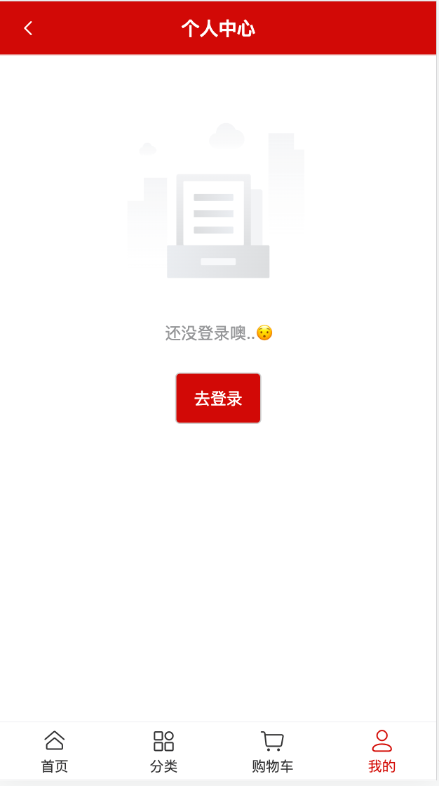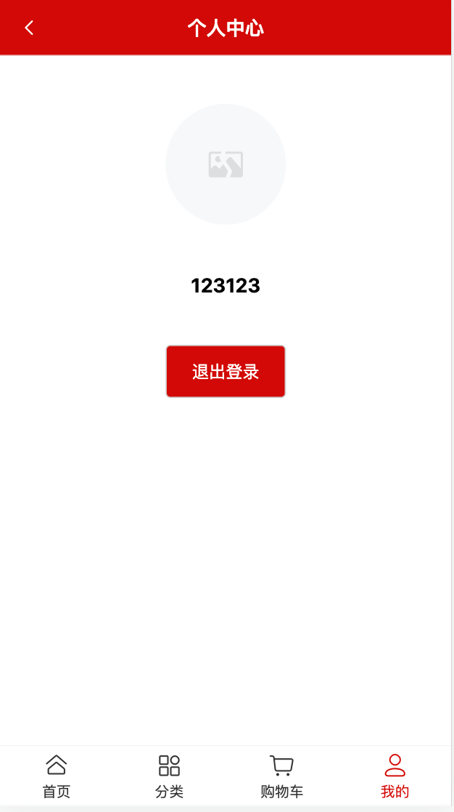

### user.ts

```ts
// 退出登录===》action
const exitAction = () => {
    router.push("/"); //回首页
};

return { userinfo, token, isLogin, loginAction, exitAction };
```


# 十一、注册

### 注册-Step1 ：验证手机号是否被注册过

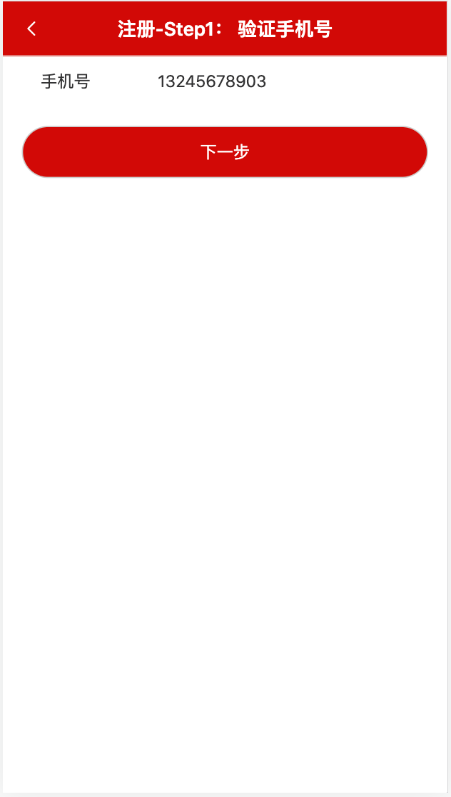


```vue
<template>
  <CommonHeader class="app-common_header" title="注册-Step1： 验证手机号" back>
  </CommonHeader>
  <!-- Form 表单  -->
  <van-form @submit="onSubmit">
    <van-cell-group inset>
      <van-field
        v-model="tel"
        type="tel"
        name="tel"
        label="手机号"
        placeholder="请输入手机号"
        :rules="[
          {
            required: true,
            message: '请填写手机号',
            validator: validatorTel,
          },
        ]"
      />
    </van-cell-group>
    <div style="margin: 16px">
      <van-button round block type="primary" native-type="submit">
        下一步
      </van-button>
    </div>
  </van-form>
</template>

<script setup lang="ts">
import { ref } from "vue";
import { useRouter } from "vue-router";
import { phoneReg } from "../../utils/common";
const tel = ref<string>("");
// 验证手机号
const validatorTel = (val) => {
  if (!val) return "手机号不能为空！";
  // console.log(tel);
  if (!phoneReg.test(val)) return "手机号输入错误";
};

const router = useRouter();

// 下一步
const onSubmit = () => {
  console.log(tel);

  // 验证手机号是否被注册过
  router.push({ name: "register-two", query: { tel: tel.value } });
};
</script>

<style lang="scss" scoped></style>

```


### 注册-Step2 ：  输入验证码

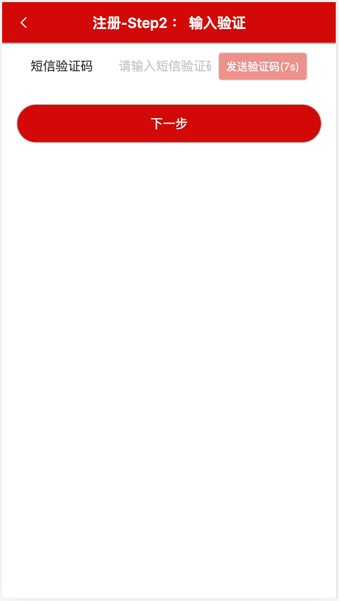


##### 插入按钮

通过 button 插槽可以在输入框尾部插入按钮。


### 注册-Step3 ：  输入密码

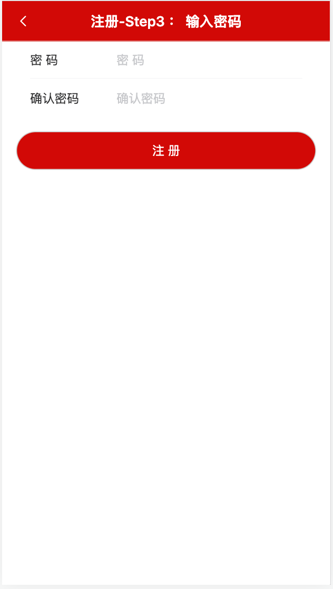


### 接口

POST

```http
http://121.89.205.189:3000/api/user/dofinishregister
```

参数

| 字段     | 类型   | 描述     |
| :------- | :----- | :------- |
| tel      | String | 手机号码 |
| password | String | 密码     |


Tel:  13211111111    13333333333

Pwd： 111111         123456

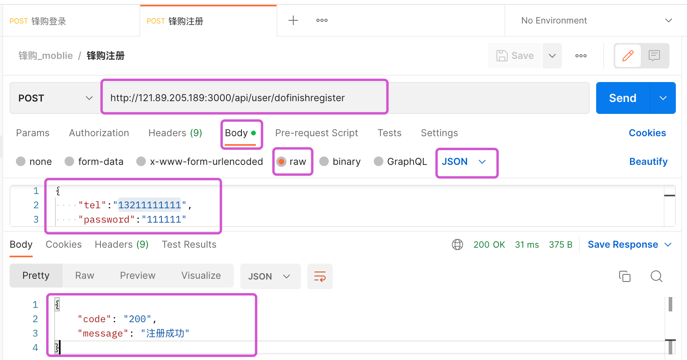


### 优化：

输入信息校验通过，才可以点击按钮，否则，不可点击状态。

```vue
<div style="margin: 16px">
        <van-button
          :disabled="!canNext"
          round
          block
          type="primary"
          native-type="submit"
        >
          提交
        </van-button>
</div>
```


```ts
// 能否点击下一步
const canNext = computed<boolean>(() => {
  if (!loginInfo.loginname) return false; //用户名不存在
  if (!loginInfo.password) return false; //密码不存在
  if (!phoneReg.test(loginInfo.loginname)) return false; //手机号不符合
  // 否则，返回true
  return true;
});
```


# 十二、购物车

## 效果图

​	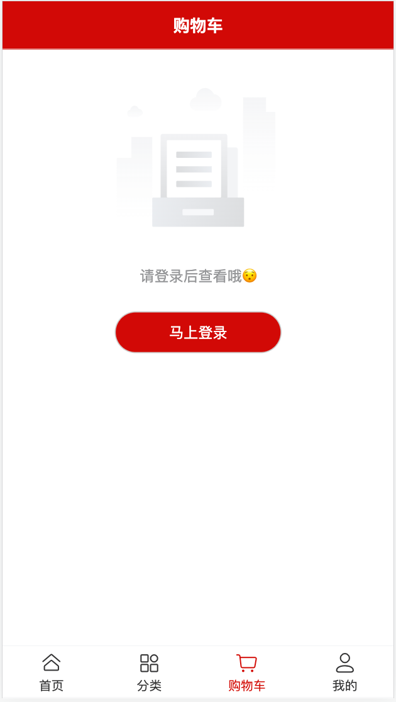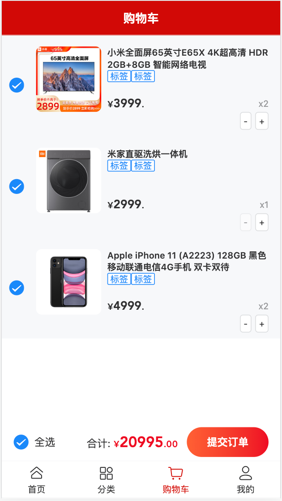


#### AppCart/index.vue

```vue
<template>
  <div class="page app-cart">
    <CommonHeader title="购物车" class="app-common_header" />
    <!-- 没有登录显示 -->
    <van-empty v-if="!token" description="请登录后查看哦😯">
      <router-link v-slot="{ navigate }" :to="{ name: 'login' }" custom>
        <van-button @click="navigate" round type="primary" class="bottom-button"
          >马上登录</van-button
        >
      </router-link>
    </van-empty>
    <!-- 登录后显示 -->
    <div v-else>
      <template v-if="cartList">
        <van-card
          v-for="item in cartList"
          :key="item.cartid"
          :num="item.num"
          :price="item.originprice"
          :title="item.proname"
          :thumb="item.img1"
        >
          <template #tags>
            <van-tag plain type="primary">标签</van-tag>
            <van-tag plain type="primary">标签</van-tag>
          </template>
          <template #footer>
            <van-button size="mini">-</van-button>
            <van-button size="mini">+</van-button>
          </template>
        </van-card>
      </template>

      <van-empty v-else description="购物车空空也😒，快去装满吧" />
      <van-submit-bar
        class="cart-bottom"
        :price="3050"
        button-text="提交订单"
        @submit="onSubmit"
      >
        <van-checkbox v-model="checkedAll">全选</van-checkbox>
      </van-submit-bar>
    </div>
  </div>
</template>

<script setup lang="ts">
import { ref } from "vue";
import type { ICartItem } from "@/@types/pro.d";
const token = ref<string>("dsfs");
// 购物车列表
const cartList = ref<ICartItem[]>([]);

// 全选
const checkedAll = ref<boolean>(false);
</script>

<style scoped lang="scss">
.bottom-button {
  width: 160px;
  height: 40px;
}
.app-cart {
  .cart-bottom {
    margin-bottom: 50px;
  }
}
</style>
```


## Cart - 查看购物车

### 功能描述

购物车，加载购物车列表，指已经加到购物车的商品。

### 接口文档

POST

```http
http://121.89.205.189:3000/api/cart/list
```

Header

| 字段  | 类型   | 描述  |
| :---- | :----- | :---- |
| token | String | token |

参数

| 字段   | 类型   | 描述   |
| :----- | :----- | :----- |
| userid | String | 用户id |

返回

```json
{
    "code": "10020",
    "message": "购物车数据为空"
}
```


### 具体实现

#### base.ts:

```ts
cartList: "/cart/list", // 查看购物车列表
```

#### cart.ts:

```ts
/**
 * 查看购物车列表 post请求
 * @param     userid: string  用户id
 * @returns   CartNS.ICartItem[] 购物车列表数据
 */
export const postCartListApi = (userid: string) =>
  req.post<any, CartNS.ICartItem[]>(base.cartList, { userid });
```


#### @types/cart.d.ts

```ts
// 购物车声明文件
declare namespace CartNS{
   interface ICartItem {
    readonly cartid:string,
    readonly userid:string,
    num:number,
    flag:boolean,
    img1:string,
    proname:string,
    originprice:number,
    readonly proid:string,
    discount:number,  
  }
}
```


##### AppCart/index.vue

```ts
import { postCartListApi } from "../../api/cart";


onMounted(() => {
  console.log(isLogin.value); //ComputedRefImpl类型的，得 value

  // 登录了，再加载列表
  if (isLogin.value) {
    loadCartList();
  }
});

// 购物车列表
const cartList = ref<CartNS.ICartItem[]>([]);
// 加载购物车列表
const loadCartList = async () => {
  try {
    const res = await postCartListApi(userinfo.value.userid);
    // 有可能是undefined，购物车没数据。有值没值都赋值
    cartList.value = res;
  } catch (error) {
    console.log(error);
  }
};
```


## Cart - 加入购物车

### 功能描述

商品详情页，添加商品到购物车。

### 接口文档

POST

```http
http://121.89.205.189:3000/api/cart/add
```

Header

| 字段  | 类型   | 描述  |
| :---- | :----- | :---- |
| token | String | token |

参数

| 字段   | 类型   | 描述           |
| :----- | :----- | :------------- |
| userid | String | 用户id         |
| proid  | String | 产品id         |
| num    | Number | 加入购物车数量 |

成功返回

```json
{
  code: '200',
  data:1
  message: '加入购物车成功'
}
```


### 具体实现

```ts
addCart: "/cart/add", //加入购物车
```


```ts
// 定义加入购物车商品接口
export interface IAddCartItem {
  userid: string; // 用户id
  proid: string; //产品id
  num: number; //加入购物车数量
}

/**
 * 加入购物车
 * @param params: IAddCartItem
 * @returns  无返回
 */
export const postAddCartApi = (params: IAddCartItem) => {
  return req.post<any, null>(base.addCart, params);
};

```


#### 详情页调用


## Cart - 更新购物车数量

### 功能描述

购物车列表，发送网络请求，点击加、减 更新购物车数量。

### 接口文档

POST

```http
http://121.89.205.189:3000/api/cart/updatenum
```

Header

| 字段  | 类型   | 描述  |
| :---- | :----- | :---- |
| token | String | token |

参数

| 字段   | 类型   | 描述     |
| :----- | :----- | :------- |
| cartid | String | 购物车id |
| num    | Number | 数量     |


成功返回

```json
{
  code: '200',
  message: '更新购物车数量'
}
```


### 具体实现

```ts
// 定义更新购物车商品数量接口
export interface IUpdateNumCartItem {
  cartid: string; // 购物车id
  num: number; //加入购物车数量
}

/**
 * 更新购物车数量
 * @param params
 * @returns 无返回
 */
export const postUpdateCartNumApi = (params: IUpdateNumCartItem) =>
  req.post<any, null>(base.updatenum, params);
```


#### AppCart/index.vue

点击加、减 更新购物车数量

```vue
<template #footer>
<van-button
            :disabled="item.num === 1"
            @click="handleUpdateNum(item.cartid, item.num - 1)"
            size="mini"
            >-</van-button>
<van-button
            @click="handleUpdateNum(item.cartid, item.num + 1)"
            size="mini"
            >+</van-button>
</template>
```


```ts
// 更新购物车数量
const handleUpdateNum = async (cartid: string, num: number) => {
  try {
    const res = await postUpdateCartNumApi({ cartid, num });
    // 修改数量之后，再次更新列表
    loadCartList();
  } catch (error) {
    console.log(error);
  }
};
```


#### 

## Cart - 删除购物车单条数据

### 功能描述

**反馈组件/SwipeCell 滑动单元格**

### 接口文档

POST

```http
http://121.89.205.189:3000/api/cart/remove
```

Header

| 字段  | 类型   | 描述  |
| :---- | :----- | :---- |
| token | String | token |

参数

| 字段   | 类型   | 描述     |
| :----- | :----- | :------- |
| cartid | String | 购物车id |

成功返回

```json
{
  code: '200',
  message: '删除购物车单条数据'
}
```


### 具体实现

```ts
removeCartItem: "/cart/remove", //删除购物车单条数据
```


```ts
/**
 * 删除购物车单条数据
 * @param cartid  	购物车id
 * @returns  无返回
 */
export const postRemoveCartItemApi = (cartid: string) =>
  req.post<any, null>(base.removeCartItem, { cartid });
```


#### AppCart/index.vue 右滑动，删除

```vue
 <template #right>
            <van-button
              @click="handleDelete(item.cartid)"
              square
              text="删除"
              type="danger"
              class="delete-button"
            />
          </template>
```


```ts
// 删除当前商品
const handleDelete = async (cartid: string) => {
  try {
    await postRemoveCartItemApi(cartid);
    // 删除之后，重新获取数据，刷新当前列表
    loadCartList();
  } catch (error) {
    console.log(error);
  }
};
```


## Cart - 更新商品选中状态

### 功能描述

每条购物车商品是否选中，应该是在后台做标记。

### 接口

POST

```http
http://121.89.205.189:3000/api/cart/selectone
```

Header

| 字段  | 类型   | 描述  |
| :---- | :----- | :---- |
| token | String | token |

参数

| 字段   | 类型    | 描述     |
| :----- | :------ | :------- |
| cartid | String  | 购物车id |
| flag   | Boolean | 是否选中 |

成功返回

```json
{
  code: '200',
  message: '更新当前购物车数据的选中状态'
}
```


###  具体实现

```ts

// 定义更新选中状态接口
export interface IUpdateSelectCartItem {
  cartid: string; // 购物车id
  flag: boolean; //是否选中
}

/**
 * 更新当前购物车数据的选中状态
 * @param params params: IUpdateCartItem
 * @returns   无返回
 */
export const postUpdateSelectCartApi = (params: IUpdateSelectCartItem) =>
  req.post<any, null>(base.updateSelectCartItem, params);

```


```vue
 <div class="cart-item">
     <van-checkbox
                   :model-value="item.flag"
                   @update:model-value="handleChangeFlag(item.cartid, !item.flag)"
                   ></van-checkbox>
     <van-card
               :num="item.num"
               :price="item.originprice"
               :title="item.proname"
               :thumb="item.img1"
               >
         <!--。。。。。-->
     </van-card>
</div>

<style scoped lang="scss">
.cart-item {
    display: flex;
    background: var(--van-card-background);
    padding-left: 10px;
    .van-card {
      flex: 1;
    }
    .van-checkbox {
      flex-grow: 0;
      flex-shrink: 0; //不收缩
    }
  }
</style>
```


```ts
// 更新当前购物车数据的选中状态
const handleChangeFlag = async (cartid: string, flag: boolean) => {
  try {
    await postUpdateSelectCartApi({ cartid, flag });
    loadCartList();
  } catch (error) {
    console.log(error);
  }
};
```


## Cart - 反选功能

即 所有商品选中，则全选按钮被选中，只要有一个没选中，则不选中。

全选按钮的状态，依赖于所有商品前面的复选框是否选中。

```vue
 <van-checkbox
          :model-value="checkedAll"
          @update:model-value="handleCheckAll"
          >全选</van-checkbox
     >
```


## Cart - 全选或全不选

### 描述

点击全选按钮，更新所有商品的选中状态。

### 接口

POST

```http
http://121.89.205.189:3000/api/cart/selectall
```

Header

| 字段  | 类型   | 描述  |
| :---- | :----- | :---- |
| token | String | token |

参数

| 字段   | 类型    | 描述         |
| :----- | :------ | :----------- |
| userid | String  | 用户id       |
| type   | Boolean | 是否全部选中 |

成功返回

```json
{
  code: '200',
  message: '更新所有购物车数据的选中状态'
}
```


### 实现

```ts
// 定义更新所有购物车数据的选中状态接口
export interface IUpdateAllSelectFlagCartItem {
  userid: string; // 用户id
  type: boolean; //是否全部选中
}

/**
 *  更新所有购物车数据的选中状态
 * @param params params: IUpdateAllSelectFlagCartItem
 * @returns  无返回
 */
export const postUpdateAllSelectFlagApi = (
  params: IUpdateAllSelectFlagCartItem
) => req.post<any, null>(base.selectall, params);

```


```ts

// 全选 点击所有商品都选中
const handleCheckAll = async () => {
  try {
    await postUpdateAllSelectFlagApi({
      userid: userinfo.value.userid,
      type: !checkedAll.value,
    });
    // 重新获取数据，刷新当前列表
    loadCartList();
  } catch (error) {}
};
```


## Cart - 价格合计

```vue
 <van-submit-bar
        class="cart-bottom"
        :price="allPrice * 100"
        button-text="提交订单"
        @submit="onSubmit"
      >
      </van-submit-bar>
```


```ts
// 总价合计
const allPrice = computed(() => {
  return cartList.value.reduce((prev, item) => {
    return item.flag ? prev + item.num * item.originprice : prev;
  }, 0);
});
```


#### 深层穿透

```css
/deep/是vue2.x中实现样式穿透的方案，在vue3.x中使用:deep()替代/deep/

:deep(.title){
	color:pink
}
```


