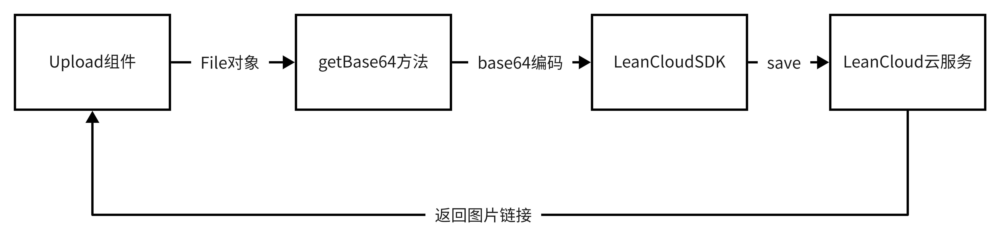
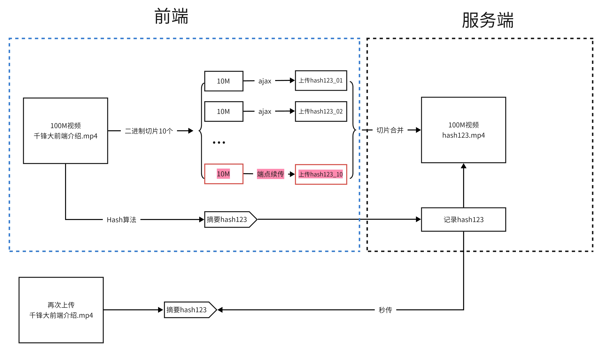

https://www.html.cn/create-react-app/

# 1.创建项目

```sh
# 现在
npx create-react-app admin-react-app --template typescript
```

**熟悉目录结构**

```
- admin-app
	-node_modules
	-public
	-src
		App.css
		App.test.tsx App.tsx的测试文件  npm run test 查看测试结果
		App.tsx
		index.css
		index.tsx react应用程序的入口文件
		logo.svg
		react-app-env.d.ts // 声明文件 // 指令声明对包的依赖关系
		reportWebVitals.ts // 测试性能
		seupTests.ts // 使用jest做为测试工具
	.gitignore
	package-lock.json
	package.json
	README.md
	tsconfig.json
```

> \*.d.ts 代表 ts 的声明文件

# 2.改造目录结构

```
src
	api    管理异步请求方法
	components  公共组件
	layout    基本布局骨架
	store   状态机
	router   路由
	utils   公共方法包
	views   业务组件（页面）
	App.tsx
	index.tsx
	logo.svg
	react-app-env.d.ts
	reportWebVitals.ts
  seupTests.ts
```

```tsx
// src/index.js
import React from "react";
import ReactDOM from "react-dom/client";
import "./index.css";
import App from "./App";
import reportWebVitals from "./reportWebVitals";

const root = ReactDOM.createRoot(
  // document.getElementById('root') as HTMLElement
  document.getElementById("root") as HTMLDivElement // 缩小类型范围
);
root.render(
  <React.StrictMode>
    <App />
  </React.StrictMode>
);

reportWebVitals();
```

```tsx
// src/App.tsx
import React, { FC } from "react";

interface IAppProps {}

const App: FC<IAppProps> = () => {
  return <div>App</div>;
};

export default App;
```

# 3.安装一些必须的模块

> 代码参考：step01-craco 分支

## 3.1 配置预处理器

两种方式：

- 抽离配置文件配置预处理器   （开发者自己配置webpack）
- 不抽离配置文件 craco 进行预处理器配置  （基于webpack做了封装、配置相对简洁）

> 本项目推荐使用第二种方式

```sh
$ yarn add @craco/craco @types/node --dev
```

https://www.npmjs.com/package/@craco/craco

### 3.1.1 配置别名@

项目根目录创建 `craco.config.js`，代码如下：

```ts
// craco.config.js
const path = require("path");
module.exports = {
  webpack: {
    alias: {
      "@": path.resolve(__dirname, "src"),
    },
  },
};
```

为了使 TS 文件引入时的别名路径能够正常解析，需要配置 `tsconifg.json`，在 `compilerOptions`选项里添加 path 等属性。为了防止配置被覆盖，需要单独创建一个文件 `tsconfig.path.json`，添加以下代码

```json
// tsconfig.path.json
{
  "compilerOptions": {
    "baseUrl": ".",
    "paths": {
      "@/*": ["./src/*"]
    },
    "types": ["node"]
  }
}
```

在 `tsconifg.json` 引入配置文件：

```json
// tsconfig.json
{
  "compilerOptions": {
    "target": "es5",
    "lib": ["dom", "dom.iterable", "esnext"],
    "allowJs": true,
    "skipLibCheck": true,
    "esModuleInterop": true,
    "allowSyntheticDefaultImports": true,
    "strict": true,
    "forceConsistentCasingInFileNames": true,
    "noFallthroughCasesInSwitch": true,
    "module": "esnext",
    "moduleResolution": "node",
    "resolveJsonModule": true,
    "isolatedModules": true,
    "noEmit": true,
    "jsx": "react-jsx"
  },
  "extends": "./tsconfig.path.json",
  "include": ["src"]
}
```

修改 `package.json` 如下：

```json
"scripts": {
  "start": "craco start",
  "build": "craco build",
  "test": "craco test"
},
```

必须重启后，新的配置才能生效

```sh
$ npm run start
```

## 3.2 安装 vscode 插件

> 插件名称：Typescript React code snippets
>
> 插件作用：可以通过 tssfc（TS 函数式组件） 等快捷键快速生成带 TS 类型约束的基本组件结构

## 3.3 AntDesign5 组件库

官网地址：https://ant.design/index-cn

国内官方镜像地址：https://ant-design.antgroup.com/index-cn

国内 gitee 镜像地址：https://ant-design.gitee.io/index-cn

```
yarn add antd -S
```


`src/index.tsx`

```tsx
// src/index.js
import React from "react";
import ReactDOM from "react-dom/client";
import "./index.css";
import App from "./App";
import reportWebVitals from "./reportWebVitals";

const root = ReactDOM.createRoot(
  document.getElementById("root") as HTMLDivElement
);
root.render(
  <React.StrictMode>
    <App />
  </React.StrictMode>
);

reportWebVitals();
```

测试组件库

```tsx
// src/App.tsx
import React, { FC } from "react";
import { Button } from "antd";
interface IAppProps {}

const App: FC<IAppProps> = () => {
  return (
    <div>
      App
      <Button type="primary" danger>
        Primary
      </Button>
    </div>
  );
};

export default App;
```

> 浏览器查看发现测试通过


# 4.创建主布局文件

> 代码参考：step02-layout 分支

预览模板：https://pro.ant.design/zh-CN/

> src/layout/Index.tsx 作为后台管理系统的主页面布局(包含左侧的菜单栏，顶部，底部等)

https://ant-design.gitee.io/components/layout-cn/#components-layout-demo-custom-trigger

> 不要照着代码敲，直接复制即可，给 Layout 组件添加 id 为`admin-app`

```tsx
// src/layout/Index.tsx 主要的布局文件
import {
  MenuFoldOutlined,
  MenuUnfoldOutlined,
  UploadOutlined,
  UserOutlined,
  VideoCameraOutlined,
} from "@ant-design/icons";
import { Layout, Menu } from "antd";
import React, { useState } from "react";

const { Header, Sider, Content } = Layout;

const App: React.FC = () => {
  const [collapsed, setCollapsed] = useState(false);

  return (
    <Layout id="admin-app">
      <Sider trigger={null} collapsible collapsed={collapsed}>
        <div className="logo" />
        <Menu
          theme="dark"
          mode="inline"
          defaultSelectedKeys={["1"]}
          items={[
            {
              key: "1",
              icon: <UserOutlined />,
              label: "nav 1",
            },
            {
              key: "2",
              icon: <VideoCameraOutlined />,
              label: "nav 2",
            },
            {
              key: "3",
              icon: <UploadOutlined />,
              label: "nav 3",
            },
          ]}
        />
      </Sider>
      <Layout className="site-layout">
        <Header className="site-layout-background" style={{ padding: 0 }}>
          {React.createElement(
            collapsed ? MenuUnfoldOutlined : MenuFoldOutlined,
            {
              className: "trigger",
              onClick: () => setCollapsed(!collapsed),
            }
          )}
        </Header>
        <Content
          className="site-layout-background"
          style={{
            margin: "24px 16px",
            padding: 24,
            minHeight: 280,
          }}
        >
          Content
        </Content>
      </Layout>
    </Layout>
  );
};

export default App;
```

> 主组件引入 主界面的布局文件

```tsx
// src/App.tsx
import { FC } from "react";
import Index from "./layout/Index";

type AppProps = {};

const App: FC = (props: AppProps) => (
  <>
    <Index />
  </>
);

export default App;
```

> 查看浏览器，预览运行结果

> 发现页面并不是全屏。审查元素设置 root 以及 components-layout-demo-custom-trigger 高度为 100%

```css
/* src/index.css */
@import "~antd/dist/antd.less";

// 设置全屏  --- 审查元素 一层一层找 坚决不放过任何一个遗漏的
html,
body,
#root {
  height: 100%;
}

#admin-app {
  height: 100%;
}
// 布局文件
// #components-layout-demo-custom-trigger .trigger {  // 组件库提供案例id，改成自己的
#admin-app .trigger {
  padding: 0 24px;
  font-size: 18px;
  line-height: 64px;
  cursor: pointer;
  transition: color 0.3s;
}
// #components-layout-demo-custom-trigger .trigger:hover
#admin-app .trigger:hover {
  color: #1890ff;
}

// #components-layout-demo-custom-trigger .logo {
#admin-app .logo {
  height: 32px;
  margin: 16px;
  background: rgba(255, 255, 255, 0.3);
}

.site-layout .site-layout-background {
  background: #fff;
}
```

# 5.拆分主界面

> 先拆分左侧的菜单栏组件

```tsx
// src/layout/components/SideBar.tsx 左侧菜单栏
import React, { FC, useState } from "react";
import {
  UploadOutlined,
  UserOutlined,
  VideoCameraOutlined,
} from "@ant-design/icons";
import { Layout, Menu } from "antd";
interface ISideBarProps {}

const { Sider } = Layout;
const SideBar: FC<ISideBarProps> = () => {
  const [collapsed] = useState(false);
  return (
    <Sider trigger={null} collapsible collapsed={collapsed}>
      <div className="logo" />
      <Menu
        theme="dark"
        mode="inline"
        defaultSelectedKeys={["1"]}
        items={[
          {
            key: "1",
            icon: <UserOutlined />,
            label: "nav 1",
          },
          {
            key: "2",
            icon: <VideoCameraOutlined />,
            label: "nav 2",
          },
          {
            key: "3",
            icon: <UploadOutlined />,
            label: "nav 3",
          },
        ]}
      />
    </Sider>
  );
};

export default SideBar;
```

```tsx
// src/layout/components/AppHeader.tsx 头部组件
import React, { FC, useState } from "react";
import { MenuFoldOutlined, MenuUnfoldOutlined } from "@ant-design/icons";
import { Layout } from "antd";
const { Header } = Layout;
interface IAppHeaderProps {}

const AppHeader: FC<IAppHeaderProps> = () => {
  const [collapsed, setCollapsed] = useState(false);
  return (
    <Header className="site-layout-background" style={{ padding: 0 }}>
      {React.createElement(collapsed ? MenuUnfoldOutlined : MenuFoldOutlined, {
        className: "trigger",
        onClick: () => setCollapsed(!collapsed),
      })}
    </Header>
  );
};

export default AppHeader;
```

```tsx
// src/layout/components/AppMain.tsx 内容区域
import React, { FC } from "react";
import { Layout } from "antd";
interface IAppMainProps {}
const { Content } = Layout;
const AppMain: FC<IAppMainProps> = () => {
  return (
    <Content
      className="site-layout-background"
      style={{
        margin: "24px 16px",
        padding: 24,
        minHeight: 280,
      }}
    >
      Content
    </Content>
  );
};

export default AppMain;
```

整和组件资源

```ts
// src/layout/components/index.ts
export { default as SideBar } from "./SideBar";
export { default as AppHeader } from "./AppHeader";
export { default as AppMain } from "./AppMain";
```

```tsx
// src/layout/Index.tsx 主要的布局文件
import { Layout } from "antd";
import React from "react";

import { AppHeader, AppMain, SideBar } from "./components";

const App: React.FC = () => {
  return (
    <Layout id="admin-app">
      {/* 左侧菜单栏 */}
      <SideBar />
      <Layout className="site-layout">
        {/* 头部 */}
        <AppHeader />
        {/* 内容 */}
        <AppMain />
      </Layout>
    </Layout>
  );
};

export default App;
```

> 此时点击头部的控制器，发现只有头部组件的 图标在切换，但是并没有影响左侧菜单的收缩
>
> 建议使用状态管理器管理控制的这个状态

# 6. 路由配置

> 代码参考：step03-router-menu 分支

2021 年 11 月 4 日 发布了 react-router-dom 的 v6.0.0 版本：https://reactrouter.com/

如需使用 v5 版本：https://v5.reactrouter.com/web/guides/quick-start `cnpm i react-router-dom@5 -S`

> 本项目采用 V6 版本

## 6.1 基本路由配置

1. 安装

```
yarn add react-router-dom
```

2. 注入路由 index.tsx

```tsx
import { HashRouter } from "react-router-dom";
const root = ReactDOM.createRoot(
  document.getElementById("root") as HTMLElement
);
root.render(
  <React.StrictMode>
    <HashRouter>
      <App />
    </HashRouter>
  </React.StrictMode>
);
```

3. 在 App.tsx 做路由映射

```tsx
import React from "react";
import "./App.css";
import { Route, Routes } from "react-router-dom";
import MainLayout from "./layout";
import Login from "./views/Login";
import DashBoard from "./views/DashBoard";
import Category from "./views/Course/Category";
import ArticleList from "./views/Course/ArticleList";
function App() {
  return (
    <div className="App">
      <Routes>
        <Route path="/" element={<MainLayout />}>
          <Route path="/dashboard" element={<DashBoard />} />
          <Route path="/course/category" element={<Category />} />
          <Route path="/course/article/list" element={<ArticleList />} />
        </Route>
        <Route path="/login" element={<Login />}></Route>
      </Routes>
    </div>
  );
}

export default App;
```

4. 在 layout/components/AppContent.tsx 中呈现子组件

```tsx
import React from "react";
import { Breadcrumb, Layout } from "antd";
import { Outlet } from "react-router-dom";  //使用Outlet呈现子组件
const { Content } = Layout;
type Props = {};

export default function AppContent({}: Props) {
  return (
    <Content style={{ margin: "0 16px" }}>
        <Outlet />
      </div>
    </Content>
  );
}

```

## 6.2 侧边菜单触发路由跳转

1. 定义菜单数据包 router/index.tsx

> 放在路由文件夹中，方便未来用这个数据包动态生成 Route，进而完成菜单与路由的自动关联

```tsx
import { AreaChartOutlined } from "@ant-design/icons";
export const mainRoutes = [
  {
    key: "/dashboard",
    label: "数据统计",
    title: "数据统计",
    icon: <AreaChartOutlined />,
  },
  {
    key: "/course/category",
    label: "课程分类",
    title: "课程分类",
    icon: <AreaChartOutlined />,
  },
  {
    key: "/course/article/list",
    label: "课程列表",
    title: "课程列表",
    icon: <AreaChartOutlined />,
  },
];
```

2. Menu 渲染与路由切换

> 在 layout/component/AppSide.tsx 中使用数据包渲染 Menu 并使用 useNavigate 触发路由切换

```tsx
import React, { useState } from "react";
import { Layout, Menu } from "antd";
import { mainRoutes } from "../../router/index";
import { useNavigate } from "react-router-dom";
const { Sider } = Layout;
type Props = {};

export default function AppSider({}: Props) {
  const [collapsed, setCollapsed] = useState(false);
  const navigate = useNavigate();
  const handleMenu = (obj: any) => {
    console.log(obj);
    navigate(obj.key);
  };
  return (
    <Sider
      collapsible
      collapsed={collapsed}
      onCollapse={(value) => setCollapsed(value)}
    >
      <div className="logo" />
      <Menu
        theme="dark"
        defaultSelectedKeys={["1"]}
        mode="inline"
        items={mainRoutes}
        onClick={handleMenu}
      />
    </Sider>
  );
}
```

## 6.3 为路由数据包添加 TS 约束

1. 新增类型定义文件 d.ts

```typescript
// src/router/inter.d.ts
import { ReactNode } from "react";

// key属性可以使用 左侧菜单的路由地址，因为它具有唯一性
export interface IMenuType {
  key: string;
  label: string;
  title: string;
  icon?: ReactNode;
  element?: ReactNode;
  children?: IMenuType[];
}
```

2. 约束菜单

```tsx
// routes/index.tsx
import { AreaChartOutlined } from "@ant-design/icons";
import { IMenuType } from "./inter.d.ts";
export const mainRoutes: IMenuType = [
  {
    key: "/dashboard",
    label: "数据统计",
    title: "数据统计",
    icon: <AreaChartOutlined />,
  },
  {
    key: "/course/category",
    label: "课程分类",
    title: "课程分类",
    icon: <AreaChartOutlined />,
  },
  {
    key: "/course/article/list",
    label: "课程列表",
    title: "课程列表",
    icon: <AreaChartOutlined />,
  },
];
```

3. 按业务划分二级菜单

```tsx
import {
  AreaChartOutlined,
  SettingOutlined,
  RadarChartOutlined,
} from "@ant-design/icons";
import { IMenuType } from "./inter";
import DashBoard from "@/views/DashBoard";
import Category from "@/views/Course/Category";
import ArticleList from "@/views/Course/ArticleList";
import Role from "@/views/Manager/Role";
import User from "@/views/Manager/User";
export const mainRoutes: IMenuType[] = [
  {
    key: "/dashboard",
    label: "数据统计",
    title: "数据统计",
    icon: <AreaChartOutlined />,
    element: <DashBoard />,
  },
  {
    key: "/course",
    label: "课程管理",
    title: "课程管理",
    icon: <RadarChartOutlined />,
    children: [
      {
        key: "/course/category",
        label: "课程分类",
        title: "课程分类",
        element: <Category />,
      },
      {
        key: "/course/article/list",
        label: "课程列表",
        title: "课程列表",
        element: <ArticleList />,
      },
    ],
  },
  {
    key: "/manager",
    label: "系统管理",
    title: "系统管理",
    icon: <SettingOutlined />,
    children: [
      {
        key: "/manager/role",
        label: "角色管理",
        title: "角色管理",
        element: <Role />,
      },
      {
        key: "/manager/user",
        label: "账号管理",
        title: "账号管理",
        element: <User />,
      },
    ],
  },
];
```

## 6.4 侧边菜单默认激活控制

1. 使用selectedKeys 与 openKeys 控制Menu组件

   ```tsx
   <Menu
       theme="dark"
       selectedKeys={[selectKey]}
       openKeys={openKey}
       mode="inline"
       items={mainRoutes}
       onClick={handleMenu}
       onOpenChange={handleOpen}
   />
   ```

2. 通过useLocation获取刷新后的路由路径

   ```tsx
   let location = useLocation();
   const [selectKey, setSelectKey] = useState<string>("");
   const [openKey, setOpenKey] = useState<Array<string>>([]);
   useEffect(() => {
       setSelectKey(location.pathname);
       let open = location.pathname.split("/");
       open.pop();
       open.shift();
       setOpenKey([`/${open.join("/")}`]);
   }, []);
   ```

3. 通过onClick切换激活、onOpenChange切换子菜单

   ```tsx
   const handleMenu = ({ key }: MenuParams) => {
       navigate(key);
       setSelectKey(key);
   };
   const handleOpen = (arr: any) => {
       setOpenKey(arr);
   };
   ```

   

## 6.5 动态渲染路由

> 根据菜单数据包，动态生成 Route 路由组件，后续就可以通过 router/index.tsx 中的数据变化，同时控制菜单跟路由。

1. 在 router/utils.tsx 中封装动态渲染函数

```tsx
//方法1:根据数据包动态生成Route
export const renderRoutes = () => {
  let arr: IMenuType[] = [];
  mainRoutes.forEach((item) => {
    if (item.children) {
      arr = [...arr, ...item.children];
    } else {
      arr.push(item);
    }
  });
  return arr.map((item) => (
    <Route key={item.key} path={item.key} element={item.element} />
  ));
};

//方法2：根据数据包动态生成Route，递归写法，调用时需要传递路由数据包
export const renderRoutes = (routes: IMenuType[]): ReactNode[] => {
  return routes.map((item: IMenuType) => {
    if (item.children) {
      return <Fragment key={item.key}>{renderRoutes(item.children)}</Fragment>;
    } else {
      return <Route key={item.key} path={item.key} element={item.element} />;
    }
  });
};
```

2. 调整 App.tsx 中的路由

```tsx
import React from "react";
import "./App.less";
// import router from "@/router/index"; //路径别名
import { Route, Routes } from "react-router-dom";
import MainLayout from "./layout";
import Login from "./views/Login";
import { renderRoutes } from "@/router/utils";
function App() {
  return (
    <div className="App">
      <Routes>
        <Route path="/" element={<MainLayout />}>
          {/* 方法1：手写路由 */}
          {/* <Route path="/dashboard" element={<DashBoard />} />
          <Route path="/course/category" element={<Category />} />
          <Route path="/course/article/list" element={<ArticleList />} />
          <Route path="/manager/role" element={<Role />} /> */}
          {/* 方法2：数据包生成路由【推荐】 */}
          {renderRoutes()}
        </Route>
        <Route path="/login" element={<Login />}></Route>
      </Routes>
    </div>
  );
}
export default App;
```


# 7. AntD主题配置【!注意版本!】

## 7.1 AntD4主题配置 【了解】

> 参考分支  step04-antd4-theme

https://ant-design.antgroup.com/docs/react/use-in-typescript-cn

> 在antd4版本中，修改主题的本质，其实是修改 Antd 组件库样式 less 主题颜色变量

按照 [配置主题](https://ant-design.antgroup.com/docs/react/customize-theme-cn) 的要求，自定义主题需要用到类似 [less-loader](https://github.com/webpack-contrib/less-loader/) 提供的 less 变量覆盖功能。我们可以引入 [craco-antd](https://github.com/DocSpring/craco-antd) 或者是 `craco-less`来帮助加载 less 样式和修改变量。

**<u>！！！craco-antd 主题配置方案，跟 ProComponent 不兼容！！！</u>**

> create-react-app创建的项目环境，默认是不能解析less语法的
>
> 可以先在项目中随便创建一个less文件，引入组件后，观察less嵌套语法是否能够生效

1. 安装less解析模块，让项目能够解析less语法

```
yarn add  @craco/craco  craco-less

npm安装可能会出异常
```

2. 项目根目录下新建theme.js主题文件

```
module.exports = {
  "@primary-color": "#6E48C2", //全局主色
};
```

3. 在根目录新建craco.config.js配置文件

```typescript
const CracoLessPlugin = require("craco-less");
const CracoAlias = require('craco-alias')
let theme = require('./theme.js')  //引入主题文件
module.exports = {
  plugins: [{ //less相关配置
    plugin: CracoLessPlugin,
    options: {
      lessLoaderOptions: {
        lessOptions: {
          modifyVars: theme,   //配置主题
          javascriptEnabled: true,
        },
      },
    },
  }],
  devServer:{ //本地代理
    proxy:{
      '/hehe':{
        target:'https://shopapi.smartisan.com',
        pathRewrite:{
          '^/hehe':''
        },
        changeOrigin:true
      }
    }
  }
};
```

4. 修改package.json中的启动命令

```
"scripts": {
  "start": "craco start",
  "build": "craco build"
},
```

5. 在项目index.js中引入antd.less

> 如果是在App.css中引入，记得将后缀改为less

6. 修改 `src/App.less`，在文件顶部引入 `antd/dist/antd.less`。

```css
@import '~antd/dist/antd.less';
```

7. 重启项目

```
yarn start
```

antd 内建了深色主题和紧凑主题，你可以参照 [使用暗色主题和紧凑主题](https://ant-design.antgroup.com/docs/react/customize-theme-cn#使用暗色主题和紧凑主题) 进行接入。

可以定制的变量列表如下：

```scss
@primary-color: #1890ff; // 全局主色
@link-color: #1890ff; // 链接色
@success-color: #52c41a; // 成功色
@warning-color: #faad14; // 警告色
@error-color: #f5222d; // 错误色
@font-size-base: 14px; // 主字号
@heading-color: rgba(0, 0, 0, 0.85); // 标题色
@text-color: rgba(0, 0, 0, 0.65); // 主文本色
@text-color-secondary: rgba(0, 0, 0, 0.45); // 次文本色
@disabled-color: rgba(0, 0, 0, 0.25); // 失效色
@border-radius-base: 2px; // 组件/浮层圆角
@border-color-base: #d9d9d9; // 边框色
@box-shadow-base: 0 3px 6px -4px rgba(0, 0, 0, 0.12), 0 6px 16px 0 rgba(0, 0, 0, 0.08),
  0 9px 28px 8px rgba(0, 0, 0, 0.05); // 浮层阴影
```

> 同样，你可以使用 [react-app-rewired](https://github.com/timarney/react-app-rewired) 和 [customize-cra](https://github.com/arackaf/customize-cra) 来自定义 create-react-app 的 webpack 配置。


## 7.2 AntD5主题配置

> 参考分支：step04-antd5-theme

[定制主题 - Ant Design (gitee.io)](https://ant-design.gitee.io/docs/react/customize-theme-cn)

> antd5 版本完全放弃了less的使用，采用Css-in-Js 的方式编写样式，所以不需要进行任何的less配置。

只需要在项目入口文件中index.tsx中使用ConfigProvider即可实现主题配置

```tsx
import React from "react";
import ReactDOM from "react-dom/client";
import "./index.css";
import App from "./App";
import reportWebVitals from "./reportWebVitals";
import "normalize.css";
import { HashRouter } from "react-router-dom";
import { ConfigProvider } from "antd";
const root = ReactDOM.createRoot(
  document.getElementById("root") as HTMLElement
);
root.render(
  <React.StrictMode>
    <HashRouter>
      <ConfigProvider
        theme={{
          token: {
            colorPrimary: "#6E48C2",
          },
        }}
      >
        <App />
      </ConfigProvider>
    </HashRouter>
  </React.StrictMode>
);

```


# 8.Axios 封装及 LeanCloud 配置

> 参考代码：step05-axios-leancloud 分支

## 8.1  LeanCloud使用

1. 注册LeanCloud账号
2. 新建LeanCloud应用，得到ID、KEY、BASE_URL
3. 使用RestAPI访问LeanCloud接口

## 8.2 封装Axios与使用

1. 安装 axios

```
yarn add axios
```

2. 注册并获取 LeanCloud 的配置参数，封装 request.ts

```typescript
import axios from "axios";
const instance = axios.create({
  baseURL: "https://api2204.h5project.cn/1.1",
  headers: {
    "X-LC-Id": "务必使用自己新建的LeanCloud应用ID",
    "X-LC-Key": "务必使用自己新建的LeanCloud应用Key",
    "Content-Type": "application/json",
  },
});
export default instance;
```

3. 封装测试 api 方法

```typescript
// api/course.ts
//测试
export const testPost = () => {
  return request.post("classes/ReactTest", { name: "三丰", score: 100 });
};
```

4. 在DashBoard组件中测试触发testPost

```tsx
import * as React from "react";
import { Button, Slider } from "antd";
import { testPost } from "@/api/course";
export interface IDashBoardProps {}
export default function DashBoard(props: IDashBoardProps) {
  return (
    <div>
      数据图表
      <Button
        type="primary"
        onClick={() => {
          testPost().then((res) => {
            console.log(res);
          });
        }}
      >
        按钮
      </Button>
      <Slider defaultValue={30}></Slider>
    </div>
  );
}

```


# 9.课程分类管理

> 代码分支  step06-category

> 对标用户端 App 名称： NiceDay ，可以在应用商店搜索安装参考

## 9.1 搭建分类管理主页

基于 Table、Modal 搭建分类管理主页

```tsx
import { Space, Table, Tag, Row, Col, Button, Modal } from "antd";
import type { ColumnsType } from "antd/es/table";
import React, { useState } from "react";
import CategoryForm from "./components/CategoryForm";
const Category: React.FC = () => {
  const [isModalOpen, setIsModalOpen] = useState(true);
  return (
    <div>
      <Row justify="space-between" align="middle">
        <Col>课程分类管理</Col>
        <Col>
          <Button type="primary">新增分类</Button>
        </Col>
      </Row>
      <Table columns={columns} dataSource={data} />
      <Modal title="Basic Modal" open={isModalOpen} footer={null}>
        <CategoryForm />
      </Modal>
    </div>
  );
};

export default Category;
```

## 9.2 拆分弹窗表单组件

单独拆分 CategoryForm 弹窗表单组件，完成数据录入请求

```tsx
//  views/Course/components/CategoryForm.tsx
import { Button, Form, Input, Select } from "antd";
import React from "react";
import { categoryPost, CategoryType } from "@/api/course";
const { Option } = Select;

const layout = {
  labelCol: { span: 6 },
  wrapperCol: { span: 16 },
};
const tailLayout = {
  wrapperCol: { offset: 8, span: 16 },
};

const CategoryForm: React.FC = () => {
  const [form] = Form.useForm();

  const onFinish = (values: CategoryType) => {
    console.log(values);
    categoryPost(values).then((res) => {
      console.log(res);
    });
  };

  const onReset = () => {
    form.resetFields();
  };

  return (
    <Form {...layout} form={form} name="control-hooks" onFinish={onFinish}>
      <Form.Item name="cateName" label="类目名称" rules={[{ required: true }]}>
        <Input />
      </Form.Item>
      <Form.Item name="fatherId" label="父级类目" rules={[{ required: true }]}>
        <Select placeholder="请选择父级类目" allowClear>
          <Option value="0-0">顶级类目</Option>
        </Select>
      </Form.Item>

      <Form.Item {...tailLayout}>
        <Button type="primary" htmlType="submit">
          提交
        </Button>
        <Button htmlType="button" onClick={onReset}>
          重置
        </Button>
      </Form.Item>
    </Form>
  );
};

export default CategoryForm;
```

## 9.3  使用Form表单录入分类

1. antd的Form表单的基本使用流程演示

   > 这里需要熟悉使用Form表单搭建页面的流程，并读懂Form组件逻辑代码即可

   [表单 Form - Ant Design (gitee.io)](https://ant-design.gitee.io/components/form-cn)

2. 封装分类录入 api

```typescript
import request from "@/utils/request";
export interface CategoryType {
  objectId?: string; //类目ID
  cateName: string; //类目名称
  fatherId: string; //父级类目ID
  status: boolean; //分类上架状态
}
//新增课程分类
export const categoryPost = (cateObj: CategoryType) => {
  return request.post("/classes/ReactCategory", cateObj);
};
```

3. 在Form表单内，向LeanCloud录入数据，测试其可用性

```tsx
const onFinish = (values: any) => {
    console.log(values);
    categoryPost(values).then((res) => {
        console.log(res);
    });
};
```

4. 加载并渲染主分类，通过Select实现父子分类关联

[查询约束语法参考 - LeanCloud 文档](https://leancloud.cn/docs/rest_api.html#hash827796182)

```tsx
//查询分类
export const categoryGet = () => {
  return request.get("classes/ReactCategory", {
    params: {
      where: {
        fatherId: "0-0",
      },
    },
  });
};

```


····

## 9.4 子类目录入逻辑

1. 加载并渲染主分类，通过Select实现父子分类关联

[查询约束语法参考 - LeanCloud 文档](https://leancloud.cn/docs/rest_api.html#hash827796182)

```tsx
//根据fatherId查询主分类
export const categoryGet = () => {
  return request.get("classes/ReactCategory", {
    params: {
      where: {
        fatherId: "0-0",
      },
    },
  });
};

```

2. CategoryForm.tsx 组件中渲染主类目 Select 列表

```tsx
interface IProps {
  setIsModalOpen: Dispatch<SetStateAction<boolean>>; //声明触发useState变化的set方法类型
  cateList: Array<CategoryType>; //1. 接收类目列表数据
}
const CategoryForm: React.FC<IProps> = (props) => {
  return (
    <Form {...layout} form={form} name="control-hooks" onFinish={onFinish}>
      <Form.Item name="fatherId" label="父级类目" rules={[{ required: true }]}>
        <Select placeholder="请选择父级类目" allowClear>
          <Option value="0-0">顶级类目</Option>
          {/* 2. 列表渲染主类目 */}
          {props.cateList.map(({ objectId, cateName }) => {
            return (
              <Option value={objectId} key={objectId}>
                {cateName}
              </Option>
            );
          })}
        </Select>
      </Form.Item>
      <Form.Item name="status" label="是否上架" valuePropName="checked">
        <Switch />
      </Form.Item>
    </Form>
  );
};

export default CategoryForm;
```


# 10.分类交互完善

> 代码分支  step06-category

## 10.1  跨组件控制Modal弹窗

1. Modal 的 open 属性控制

```tsx
<Modal
  title="类目管理"
  open={isModalOpen}
  footer={null}
  onCancel={() => {
    setIsModalOpen(false);
  }}
>
  <CategoryForm setIsModalOpen={setIsModalOpen} />
</Modal>
```

2. 在 Form 表单组件中，设定特殊的 props 类型

```tsx
interface IProps {
  setIsModalOpen: Dispatch<SetStateAction<boolean>>; //声明触发useState变化的set方法类型
}
const CategoryForm: React.FC<IProps> = (props) => {
  props.setIsModalOpen;
};
```

## 10.2 Table 表格渲染分类列表

1. columns 的作用，定义每一列表格渲染格式

```typescript
const columns: ColumnsType<CategoryType> = [
  {
    title: "类目ID",
    dataIndex: "objectId",
    key: "objectId",
    render: (text) => <a>{text}</a>,
  },
  {
    title: "上架状态", //表格头部文字
    dataIndex: "status", //需要跟数据包字段名称对应
    key: "status",
    render: (bool, record, index) => <Switch checked={bool} />,
    // render是格子的自定义渲染函数，
    //  bool：这一格子对应数据，
    //  record：这一行的数据对象，
    //  index：这一行的序号
  },
];
```

2. dataSourse 的作用，渲染表格的数据包，需要跟 columns 有对应关系

```typescript
const data: CategoryType[] = [
  //测试表格
  {
    objectId: "asdfadf",
    cateName: "冥想",
    fatherId: "0-0",
    status: true, //每个字段需要跟columns中的dataIndex对应，才能渲染出来
  },
];
```

3. 表格组件使用

```tsx
<Table columns={columns} dataSource={data} rowKey="objectId" />
```

## 10.4 Table表格渲染树形数据

1. 参考合理的组件库案例 【树形表格数据展示】

   [表格 Table - Ant Design (gitee.io)](https://ant-design.gitee.io/components/table-cn/#components-table-demo-tree-data)

2. 表格默认支持树形数据的展示

> 表格支持树形数据的展示，当数据中有 `children` 字段时会自动展示为树形表格，如果不需要或配置为其他字段可以用 `childrenColumnName` 进行配置。
>
> 可以通过设置 `indentSize` 以控制每一层的缩进宽度。

3. 对加载到的线上分类数据包格式进行处理，实现分类父子嵌套

```tsx
// 通过接口的继承，让Table数据包内支持追加children
interface CategoryTableType extends CategoryType {
  children?: CategoryType[];
}

useEffect(() => {
  categoryGet().then((res) => {
    let arr: CategoryTableType[]; //1.按照类目层级存放类目数据
    let { results } = res.data;
    console.log(results); //处理前,单层数组
    arr = results.filter((item: CategoryTableType) => item.fatherId == "0-0"); //2.找出主类目
    arr.forEach((item: CategoryTableType) => {
      //3.遍历主类目
      let children = results.filter(
        (child: CategoryTableType) => item.objectId == child.fatherId
      );
      item.children = children; //4.向指定主类目下，追加对应的子类目数据
    });
    console.log(arr); //处理后
    setData(arr); //5.处理后，数组每个对象中会携带children
  });
}, []);
```

4. 将带有 children 字段的 data，设置给 Table，即可实现展开效果

```tsx
export interface CategoryType {
  objectId?: string; //类目ID
  cateName: string; //类目名称
  fatherId: string; //父级类目ID
  status: boolean; //上架状态
  fatherName?: string; //父级类目名称
}
interface CategoryTableType extends CategoryType {
  children?: CategoryType[];
}

// 此时，data数据包的格式如下
const [data, setData] = useState<Array<CategoryTableType>>([]);

// 表格采用全新的data数据，自动实现树形效果
<Table columns={columns} dataSource={data} rowKey="objectId" />;
```

## 10.5 切换分类的上架状态

1. 封装 api

```typescript
export const categoryPut = (objectId: string, status: boolean) => {
  return request.put(`/classes/ReactCategory/${objectId}`, { status });
};
```

2. 调用异步请求，更新数据库后，更新本地列表

```tsx
const handleStatus = (record: CategoryType, index: number) => {
  // console.log(record, index);
  let { fatherId, status, objectId } = record;
  categoryPut(objectId, !status).then((res) => {
    if (fatherId == "0-0") {
      //修改父级类目
      data[index].status = !status;
    } else {
      //获取父级类目序号
      let fIdx: number = data.findIndex((item) => item.objectId == fatherId);
      // console.log(fIdx, index);
      data[fIdx].children[index].status = !status;
    }
    // console.log(data);
    setData([...data]);
  });
};
```


# 11.课程发布页交互

> 代码分支  step06-category

## 11.0 课程发布页搭建

> 只需要直接复制分类发布表单代码，按需做调整即可

## 11.1 Cascader 级联组件渲染分类

> 代码参考：step06-cascader 分支

1. Cascader组件使用

   [级联选择 Cascader - Ant Design (gitee.io)](https://ant-design.gitee.io/components/cascader-cn)

   ```tsx
   import React from 'react';
   import { Cascader } from 'antd';
   interface Option {
     value: string | number;
     label: string;
     children?: Option[];
   }
   // 1. 需要将分类数据包整理为如下options格式
   const options: Option[] = [
     {
       value: 'zhejiang',
       label: 'Zhejiang',
       children: [
         {
           value: 'hangzhou',
           label: 'Hangzhou',
           children: [
             {
               value: 'xihu',
               label: 'West Lake',
             },
           ],
         },
       ],
     },
   ];
   // 2. 将options设置给Cascader即可对应的级联选择交互
   const App: React.FC = () => (
     <Cascader options={options} placeholder="Please select" />
   );
   
   export default App;
   ```

   

2. 分类数据包格式处理

```tsx
const [cateList, setCateList] = useState<ICateParams[]>([]);
useEffect(() => {
    categoryGet({}).then((res) => {
        let { results } = res.data;
        let arr = results.filter((item: ICateParams) => item.fatherId == "0-0");
        arr.forEach((item: ICateParams) => {
            item.children = results.filter(
                (itm: ICateParams) => item.objectId == itm.fatherId
            );
        });
        setCateList(arr);
    });
}, []);
```


## 11.2 图片上传所需知识储备

> 代码分支：step07-upload

[图片上传流程 - boardmix](https://boardmix.cn/app/editor/0kxJvKZ_Tg5CG90bwy6BUw)




1. base64 编码

   - 存储图像信息的长字符串

   - base64 的格式特点

     ```
     data:image/png;base64,iVBORw0KGgoAAAANSUhEUgAABM
     ```

2. 前端

- Upload 组件

- 生成图片的 base64 编码资源

  ```
     data:image/png;base64,iVBORw0KG...
  ```

- Upload 组件的两种上传方式

  - 通过接口路径上传 action="后端给的图片上传地址"
  - 通过自定义方法上传 customRequest 【此项目选择本方案】

3. LeanCloud

- 安装并初始化 SDK
- 使用 SDK 将本地 base64 图片资源，转化为 LeanCloud 文件资源后，并上传

## 11.3 LeanCloud SDK 使用流程

[SDK 的安装与初始化](https://leancloud.cn/docs/sdk_setup-js.html#hash117588)
[SDK 构建 leancloud 文件资源](https://leancloud.cn/docs/leanstorage_guide-js.html#hash813653189)

1. 安装

   ```
   yarn add leancloud-storage
   ```

2. 封装 config/index.ts 存储公共配置常量

   ```typescript
   // 集中管理常量配置
   export const ID = "自己的LeanCloud空间ID";
   export const KEY = "自己的LeanCloud空间Key";
   export const BASE = "https://api2204.h5project.cn"; //自己的LeanCloud域名，可以是LeanCloud分配的临时域名
   ```

3. 在入口文件 index.tsx 中初始化 LeanCloud 的 SDK

   ```tsx
   import { ID, KEY, BASE } from "@/config/index"; //此文件需要自己定义
   // 初始化LeanCloud的SDK
   AV.init({
     appId: ID,
     appKey: KEY,
     serverURL: BASE,
   });
   ```

4. 在 ImgUpload.tsx 组件中使用 SDK 提供的方法，实现图片的上传

   ```tsx
   //自定义上传函数
   const handleUpload = (info: any): any => {
     // console.log(info);  //1.本地资源
     getBase64(info.file, (base64) => {
       //2.获取base64编码
       // console.log(base64);
       // picture.png 是文件名
       const file = new AV.File("picture.png", { base64 }); //3.构建LeanCloud资源对象
       file.save().then((res: any) => {
         //4.上传资源至LeanCloud
         console.log(res);
         let { url } = res.attributes;
         setImageUrl(url); //5.使用LeanCloud返回的图片链接预览
       });
     });
   };
   ```

## 11.4 使用子父通信，获取图片路径 【不推荐-可以思考】

> 我们可以采用父子通信的方式，让Form去获取ImgUpload组件提供的图片url，但是流程相对比较麻烦，每次在使用ImgUpload组件时，都需要向其传递一个自定义方法函数。

1. 在 ArticlePublic.tsx 中向 ImgUpload 传递一个 handleImg 事件函数

2. 在 ImgUpload.jsx 中上传那图片后，触发 handleImg 函数，并携带图片 url

3. 将图片 url 整合到 ArticlePublic.tsx 的表单数据中

4. 将带有真实图片 url 的表单数据，存储至 LeanCloud 数据库

## 11.5 Form表单提取自定义组件value

1. 提取思路

>  Form 表单会向内部的自定义组件的 props 注入一些属性：
>
> value    提供表单使用的数据
>
> onChange   方法修改value

- onChange 修改自定义组件对于表单的 value 值

  ```javascript
  props.onChange!(url); //让表单组件获取到url
  ```

2. ImgUpload组件内部逻辑调整

```tsx
interface ImgUploadProps {  // 2. 添加props类型约束
  onChange?: (url: string) => void;
  value?: string;
}
const ImgUpload: React.FC<ImgUploadProps> = (props) => {
  const [loading, setLoading] = useState(false);
  const [imageUrl, setImageUrl] = useState<string>();
  console.log("ImgUpload组件", props);  //1. 查看props内容
  const handleUpload = (info: any) => {
    getBase64(info.file, (base64) => {
      const file = new AV.File("react-img.png", { base64 }); 
      file.save().then((res: any) => {
        console.log(res);
        let { url } = res.attributes;
        setImageUrl(url);
        props.onChange!(url); //3. 将图片链接给到表单
      });
    });
  };
};
```


# 12. 富文本编辑器

## 12.1 BraftEditor的使用

> 参考：step08-braft-editor 分支

[braft文档](https://braft.margox.cn/) 

1. 安装

```
yarn add braft-editor
```

2. 引入使用

```tsx
// 引入编辑器组件
import BraftEditor from "braft-editor";
// 引入编辑器样式
import "braft-editor/dist/index.css";

// 调用
<BraftEditor />;
```

3. 结合Form表单的使用

```tsx
// 1-1. 引入编辑器组件
import BraftEditor from "braft-editor";
// 1-2. 引入编辑器样式
import "braft-editor/dist/index.css";

const ArticlePublic: React.FC = (props) => {
  const [form] = Form.useForm();

  const handleEditorChange = (editorState: any) => {
    console.log(editorState.toHTML());
      //3. 将用户输入的富文本内容设置给表单
    form.setFieldsValue({
      desc: editorState.toHTML(),  
    });
  };

  return (
    <Form {...layout} form={form} name="control-hooks" onFinish={onFinish}>
      <Form.Item name="desc" label="课程详情" rules={[{ required: true }]}>
        // 2. 调用富文本编辑器
        <BraftEditor
          onChange={handleEditorChange}
          style={{ border: "1px solid #d8d8d8" }}
        />
      </Form.Item>

      <Form.Item {...tailLayout}>
        <Button type="primary" htmlType="submit">
          提交
        </Button>
        <Button htmlType="button" onClick={onReset}>
          重置
        </Button>
      </Form.Item>
    </Form>
  );
};

export default ArticlePublic;

```

## 12.2 录入课程内容

1. 封装api方法

```typescript
// api/course.ts
// 课程发布
export interface ICourseType {
  name: string;
  info: string;
  poster: string;
  isvip: boolean;
  category: [string, string];
  catelv1: string;
  catelv2: string;
  desc: string;
}
export const coursePost = (courseObj: ICourseType) => {
  return request.post("classes/ReactAricle", courseObj);
};

```

2. 在表单onFinish中触发api

```tsx
const onFinish = (values: ICourseType) => {
    values.catelv1 = values.category[0];  //在数据库独立字段存放主分类id，方便按主分类查询
    values.catelv2 = values.category[1];  //在数据库独立字段存放子分类id，方便按子分类查询
    console.log(values);
    coursePost(values).then((res) => {
        console.log(res);
    });
};
```


# 13. ProComponent 高级组件

[文档](https://procomponents.ant.design/)

## 13.1 高级表格基本使用

> 代码参考: step09-ProComponent 分支

1. 安装 PropComponent

   ```
   yarn add @ant-design/pro-components
   ```

2. 从 ProComponent 官方获取高级表格组件 TS 代码

3. 注释代码中的 umi-request 相关引用逻辑【后期会使用 axios 请求高级表格数据】

4. 通过调整 columns 配置项，修改表格结构 【！！切记先配colums再发请求！！】

   ```
     {
        title: "商品名称",
        dataIndex: "name", //跟后端下发的数据包字段对应，才能渲染
        copyable: true,
        ellipsis: true,  //超出显示省略号
        filters: true,  //
        search:true,   //是否作为查询条件
        onFilter: true,
     },
   ```

5. 封装课程的请求 API

   ```typescript
   //课程列表
   export const courseGet = () => {
     return request.get("/classes/ReactAricle");
   };
   ```

6. 需要在 ProTable 组件的 request 配置项中，完成异步数据的请求

- request 内部的三个参数的作用
- request 内部的返回值格式 {data:数据包,success:true}

```javascript
<ProTable
  columns={columns}
  actionRef={actionRef}
  cardBordered
  request={async (params = {}, sort, filter) => {
    //当高级表格相关条件发生变化时，会自动触发request
    console.log(params, sort, filter);
    // 此处的params就是用户在查询表单中指定的字段
    // sort   是点击表格头部的排序按钮提供的数据
    // filter 是点击表格头部的筛选按钮提供的数据
    let res = await articleGet({ ...params }, sort.price);
    return {
      data: res.data.results,
      success: true,
    };
  }}
/>
```

8. 通过调整 request 方法的查询条件，修改表格内容

## 13.2 高级表格数据条件筛选

> 预备知识
>
> 1. 高级表格的request配置项中 params参数就是筛选表单录入的数据
> 2. 熟悉columns中的常用选项控制
>    + valueType 结合 valueEnum可以将筛选条件改为Select模式
>    + hideInSearch: true,   可以将某些表格字段从筛选表单中隐藏

1. 调整表格columns配置，支持按照是否为vip过滤课程

```typescript
{
    title: "是否VIP",
    dataIndex: "isvip",
    valueType: "select",
    valueEnum: {
      2: {
        text: "所有课程",
      },
      1: {
        text: "VIP课程",
      },
      0: {
        text: "免费课程",
      },
    },
    render: (bool, record) => {
      // console.log("vip格子", record);
      let color = record.isvip ? "blue" : "grey";
      return <Tag color={color}>{record.isvip ? "VIP课程" : "免费课程"}</Tag>;
    },
  },
```

2. 调整表格request传参

```tsx
<ProTable<ArticleType>
    columns={columns}
    actionRef={actionRef}
    cardBordered
    request={async (params = {}, sort, filter) => {
        console.log("params", params);
        console.log("filter", filter);
        console.log("sort", sort);
        let res = await articleGet(params as IArticleParams);
        return {
            data: res.data.results,
        };
    }}
/>
```

3. 修改api异步请求方法

> 发起where条件查询的时候，必须保证如下几点
>
> 1. 只携带想查的字段，不能多携带数据库中不存在的字段
> 2. 字段值的类型，要跟数据库字段类型一致。

```typescript
// 加载课程
export interface CourseConditionType {
  current?: number;
  pageSize?: number;
  created_at?: string;
  isvip?: string | boolean;
  name?: string;
  info?: string | { $regex: string; $options: "i" };  //模糊查询
}
type CourseKeyType = keyof CourseConditionType;  
export const courseGet = (params: CourseConditionType) => {
  delete params.current;  //删除非条件字段
  delete params.pageSize;
  delete params.created_at;
  for (let attr in params) {  // 删除字段值为空的字段
    if (params[attr as CourseKeyType] == "") {
      delete params[attr as CourseKeyType];
    }
  }
  if (params.isvip && params.isvip !== "2") { 
    params.isvip = Boolean(Number(params.isvip)); // 0-false-免费课程  1-true-收费课程
  }
  // 所有课程
  if (params.isvip && params.isvip == "2") {
    delete params.isvip;
  }
  if (params.info) {
    params.info = { $regex: `${params.info}`, $options: "i" }; //模糊查询
  }
  let search = JSON.stringify(params);
  return request.get(`classes/ReactAricle?where=${search}`);
};

```

4. 正则查询

   [LeanCloud正则查询接口](https://leancloud.cn/docs/rest_api.html#hash840042035)

## 13.3 侧边菜单的按需隐藏

1. 复用课程发布页，作为课程编辑页结构ArticleEdit.tsx
2. 配置路由，通过hidden属性隐藏侧边菜单显示

```typescript
{
    key: "/course/edit",
    label: "课程编辑",
    title: "课程编辑",
    element: <ArticleEdit />,
    hidden: true,
},
```

3. 在AppSider.tsx中处理菜单隐藏逻辑

```tsx
//通过递归函数，处理mainRoutes里的隐藏菜单
const menuDataHandle = (routes: IMenuProps[]) => {
    return routes.filter((item) => {
        if (item.children) {
            item.children = menuDataHandle(item.children);
        }
        return !item.hidden;
    });
};
  
  
<Menu
    theme="dark"
    selectedKeys={[selectKey]}
    openKeys={openKey}
    mode="inline"
    items={menuDataHandle(mainRoutes)}
    onClick={handleMenu}
    onOpenChange={handleOpen}
/>
  
```


3. 列表页通过query-string处理并传递search数据

> 如果考虑性能问题，也可以把columns配置项置于组件内部，然后通过编程式导航去传递search，这样只有当用户点击的时候才会执行qs.stringify，节省一定的渲染性能

```tsx
{
    title: "操作",
    valueType: "option",
    key: "option",
    render: (text, record, _, action) => [
      <Link to={`/course/edit?${qs.stringify(record)}`}>编辑</Link>,
      <a target="_blank" rel="noopener noreferrer" key="view">
        查看
      </a>
    ],
  },
```

4. 编辑页数据初始化渲染

> 需要使用setFildsValue、useLayoutEffect(保证富文本渲染正常)

```tsx
import ImgUpload from "@/components/ImgUpload";
import { Button, Cascader, CascaderProps, Form, Input, Switch } from "antd";
import React, { useEffect, useLayoutEffect, useState } from "react";
import { articlePost, categoryGet, articlePut } from "@/api/course";
import { CategoryTableType, ArticleType } from "@/types/course";
import RichText from "@/components/RichText";
import { useLocation } from "react-router-dom";
import qs from "query-string";
const { TextArea } = Input;

interface CacaderType {
  value: string;
  label: string;
  children: CacaderType[];
}
const ArticleEdit: React.FC = () => {
  const location = useLocation();
  const [casOption, setCasOption] = useState<Array<CacaderType>>([]);
  const [form] = Form.useForm(); //1. 获取表单对象
  let initData = qs.parse(location.search);
  useLayoutEffect(() => { //4. 此处使用useLayoutEffect，保证富文本渲染正常
    form.setFieldsValue(initData); //3.为表单设置默认值
  }, []);
  const handleSubmit = (values: ArticleType) => {
    let [catelv1, catelv2] = values.category;
    values.catelv1 = catelv1; //单独存放主分类id
    values.catelv2 = catelv2; //单独存放子分类id
    articlePut(initData.objectId as string, values).then((res) => {
      console.log(res);
    });
  };
  return (
    <Form
      onFinish={handleSubmit}
      labelCol={{ span: 4 }}
      wrapperCol={{ span: 18 }}
      layout="horizontal"
      form={form}  //2. 绑定表单
    >
      ...
    </Form>
  );
};

export default ArticleEdit;

```

5. 处理ImgUpload组件的默认预览

```tsx
<Upload
    name="avatar"
    listType="picture-card"
    className="avatar-uploader"
    showUploadList={false}
    beforeUpload={beforeUpload}
    customRequest={handleUpload}
    >
    // 添加通过props.value控制预览
    {imageUrl || props.value ? (  
        
    ) : (
        uploadButton
    )}
</Upload>
```


5. 处理RichEditor富文本编辑器的默认预览

```tsx
useEffect(() => {
    let editor = new E(editRef.current);
    ...其他逻辑
    editor.create();
    editor.txt.html(props.value); // 2. 重新设置编辑器内容
    return () => {
      editor.destroy();
    };
  }, [props.value]); //1. 观测props.value的变化
```

6. 处理query-string将布尔值解析为字符串的问题

```tsx
console.log(location);
let initData = qs.parse(location.search, { parseBooleans: true }); //需要告知query-string，解析后保持boolean格式
form.setFieldsValue(initData);
```

7. 请求api接口修改后端课程数据

```typescript
//课程更新
export const articlePut = (objectId: string, artObj: ArticleType) => {
  return request.put(`/classes/ReactAricle/${objectId}`, artObj);
};
```


# 14. 登录功能

## 14.1 搭建 Login 面板

1. 自己搭建

- Row Col
- Card
- Form

2. 使用高级表单LoginForm搭建 【**本课程采用这种方式**】

[LoginForm/Page - 登录表单 - Pro Components (ant.design)](https://procomponents.ant.design/components/login-form)

> LoginForm 和 LoginFormPage 是 ProForm 的变体，在使用LoginForm的时候需要参阅ProForm相关配置项及事件函数
>
> 调整项目如下：
>
> 1. 使用Row、Col让LoginForm上下左右居中。
> 2. 配置onFinish事件获取表单数据
> 3. onFinish事件函数要通过async声明才能通过类型验证
> 4. 将内部的Tabs组件配置按照Antd5要求，改为items配置（因为Tabs.TabPane即将废弃）

```tsx
import type { TabsProps } from "antd";
type LoginType = "phone" | "account";
const items: TabsProps["items"] = [
  {
    key: "account",
    label: `账号密码登录`,
  },
  {
    key: "phone",
    label: `手机号登录`,
  },
];
export default () => {
  const [loginType, setLoginType] = useState<LoginType>("account");
  const handleLogin = async (values: any) => { 
    console.log(values);
  };
  return (
    <ProConfigProvider hashed={false}>
      <div style={{ backgroundColor: "white" }}>
        <Row align="middle" justify="center" style={{ height: "100vh" }}>
          <Col>
            <LoginForm
              logo="https://github.githubassets.com/images/modules/logos_page/Octocat.png"
              title="Github"
              subTitle="全球最大的代码托管平台"
              onFinish={handleLogin}
              actions={
                <Space>
                  其他登录方式
                  <AlipayCircleOutlined style={iconStyles} />
                  <TaobaoCircleOutlined style={iconStyles} />
                  <WeiboCircleOutlined style={iconStyles} />
                </Space>
              }
            >
              <Tabs
                centered
                activeKey={loginType}
                items={items}
                onChange={(activeKey) => setLoginType(activeKey as LoginType)}
              ></Tabs>
              ...其他结构
            </LoginForm>
          </Col>
        </Row>
      </div>
    </ProConfigProvider>
  );
};
```


## 14.2 登录状态分析

> 为了方便未来交互中能够更方便的使用用户数据，需要将用户登录相关数据包在状态机中集中管理。

```
记录用户登录状态的数据包
{
  isLogin:false,  //表达用户登录状态
  isLoading:false,  //控制登录交互
  userInfo:null  //存储用户信息
}
```

1. 默认状态

```
{
  isLogin:false,
  isLoading:false,
  userInfo:null
}
```

2. 开始登录 LOGIN_START

```
{
  isLogin:false,
  isLoading:true,
  userInfo:null
}
```

3. 登录成功 LOGIN_SUCCESS

```
{
  isLogin:true,
  isLoading:false,
  userInfo:用户信息数据对象
}
```

4. 登录失败 LOGIN_FAIL

```
{
  isLogin:false,
  isLoading:false,
  userInfo:null
}
```

## 14.3 集成状态管理器 RTK

> 参考代码：step9-RTK 分支

1. RTK 基本使用流程回顾

   - 安装
   - 定义 store
     - createSlice
     - configureStore
   - Provider 注入
   - 使用
     - useSelector 提取数据
     - useDispatch 触发变化
2. 安装

```
yarn add @reduxjs/toolkit react-redux
```

3. 创建store/modules/user.ts模块

```typescript
import { IUserParams } from "./../../api/user";
import { createSlice, Dispatch } from "@reduxjs/toolkit";
import { userLogin } from "@/api/user";
import { NavigateFunction } from "react-router-dom";
export interface UserStateType {
  isLogin: boolean;
  isLoading: boolean;
  userInfo: Object | null;
}
let initialState: UserStateType = {
  isLogin: false,
  isLoading: false,
  userInfo: null,
};
//尝试提取本地存储数据
let uinfo = localStorage.getItem("userInfo");
if (uinfo) {
  initialState.isLogin = true;
  initialState.userInfo = JSON.parse(uinfo);
}
const userSlice = createSlice({
  name: "user",
  initialState,
  reducers: {
    //开始登录
    loginStart(state) {
      state.isLoading = true;
    },
    //登录成功
    loginSuccess(state, action) {
      state.isLoading = false;
      state.isLogin = true;
      state.userInfo = action.payload;
      localStorage.setItem("userInfo", JSON.stringify(action.payload)); //本地存储
    },
    //登录失败
    loginFail(state) {
      state.isLoading = false;
      state.isLogin = false;
      state.userInfo = null;
    },
  },
});

export const { loginStart, loginSuccess, loginFail } = userSlice.actions;

//异步请求
export const userLoginAsync = (
  dispatch: Dispatch,
  params: IUserParams,
  navigate: NavigateFunction
) => {
  dispatch(loginStart()); //开始登录
  console.log("开始登录");
  setTimeout(() => {
    //测试登录流程效果
    userLogin(params)
      .then((res) => {
        console.log("登录成功", res);
        dispatch(loginSuccess(res.data)); //登录成功
        navigate("/");
      })
      .catch((err) => {
        dispatch(loginFail()); //登录失败
        console.log("登录成功", err);
      });
  }, 1000);
};

export default userSlice.reducer;

```

4. 创建 store

```typescript
import { configureStore } from "@reduxjs/toolkit";
import user from "./modules/user";

const store = configureStore({
  reducer: {
    user,
  },
});
export default store;

export type RootState = ReturnType<typeof store.getState>; //获取状态机数据类型
export type AppDispatch = typeof store.dispatch;

```

1. 在 index.tsx 入口文件中，Provider 注入

```tsx
...
import { Provider } from "react-redux";  
import store from "./store";
const root = ReactDOM.createRoot(
  document.getElementById("root") as HTMLElement
);
root.render(
  <React.StrictMode>
    <Provider store={store}>
      <HashRouter>
        <App />
      </HashRouter>
    </Provider>
  </React.StrictMode>
);
```


## 14.4 登录功能实现

1. 点击【登录】按钮后，让登录面板进入 Loading 状态

   - Spin

   - 状态机中的 isLoading 控制 Spin

```tsx
import { useSelector, useDispatch } from "react-redux";
import { userLoginAsync } from "@/store/modules/user"; //1.引入异步action方法
import { RootState } from "@/store";  //2. 状态机state数据类型
import { useNavigate } from "react-router-dom";
const Login: React.FC = () => {
  const { isLoading } = useSelector((state: RootState) => state.user); //3.提取状态机数据
  const dispatch = useDispatch();
  const navigate = useNavigate();
  const onFinish = (values: any) => {
    userLoginAsync(dispatch, values, navigate); //5. 触发状态机异步请求
  };
  return (
    <Row justify="center" align="middle" className="login-cont">
      <Col span={8}>
        // 4. 使用状态机提供的isLoading控制Spin状态
        <Spin spinning={isLoading}>
          <Card title="知识付费管理平台">
            <Form
              name="normal_login"
              className="login-form"
              initialValues={initData}
              onFinish={onFinish}
            >
            	...
            </Form>
          </Card>
        </Spin>
      </Col>
    </Row>
  );
};

export default Login;

```


2. 通过异步 action 控制登录流程

```typescript
//异步请求
export const userLoginAsync = (
  dispatch: Dispatch,
  params: IUserParams,
  navigate: NavigateFunction
) => {
  dispatch(loginStart()); //1. 开始登录
  console.log("开始登录");
  setTimeout(() => {
    //测试登录流程效果
    userLogin(params)
      .then((res) => {
        console.log("登录成功", res);
        dispatch(loginSuccess(res.data)); //2. 登录成功
        navigate("/");
      })
      .catch((err) => {
        dispatch(loginFail()); //3. 登录失败
        console.log("登录成功", err);
      });
  }, 1000);
};
```


## 14.5 登录功能关联路由守卫

1. 封装guard/RequireAuth.tsx守卫组件

```tsx
import React from "react";
import { Navigate } from "react-router-dom";
import MainLayout from "@/layout";
import { useSelector } from "react-redux";
import { RootState } from "@/store";
type Props = {};

export default function RequireAuth({}: Props) {
  const { isLogin } = useSelector((state: RootState) => state.user);
  return <>{isLogin ? <MainLayout /> : <Navigate to="/login" />}</>;
}

```


2. 在 App.tsx 中使用守卫组件

```tsx
import React from "react";
import { Route, Routes } from "react-router-dom";
import Login from "./views/Login";
import { renderRoutes } from "@/router/utils";
import { mainRoutes } from "@/router/index";
import RequireAuth from "./guard/RequireAuth";
function App() {
  return (
    <div className="App">
      <Routes>
        <Route path="/" element={<RequireAuth />}>
          {renderRoutes(mainRoutes)}
        </Route>
        <Route path="/login" element={<Login />}></Route>
      </Routes>
    </div>
  );
}

export default App;

```


3. 登录成功后，在 store/modules/user.ts中触发路由跳转

```typescript
userLogin(params)
    .then((res) => {
    console.log("登录成功", res);
    dispatch(loginSuccess(res.data)); //登录成功
    navigate("/");  //触发路由跳转
})
```


4. 处理刷新后，登录状态丢失的问题

```typescript
// 2. 尝试提取本地存储数据
let uinfo = localStorage.getItem("userInfo");
if (uinfo) {
  initialState.isLogin = true;
  initialState.userInfo = JSON.parse(uinfo);
}
const userSlice = createSlice({
  name: "user",
  initialState,
  reducers: {
    //登录成功
    loginSuccess(state, action) {
      state.isLoading = false;
      state.isLogin = true;
      state.userInfo = action.payload;
      localStorage.setItem("userInfo", JSON.stringify(action.payload)); // 1. 本地存储
    },
  },
});
```

## 14.6 使用store2操作本地存储

[store2文档](https://www.npmjs.com/package/store2)

1. 安装

```
yarn add store2
```

2. 常用语法

```
store2('user', { name:'Marcus' })  // 向localStorage存储user数据

store2.get('user')  //提取localStorage中的user数据

store2.remove('user') //删除localStorage中的user数据

store2.session('user', { name:'Marcus' })   // 向sessionStorage存储user数据

store2.session.get('user')   // 提取sessionStorage中的user数据

store2.session.remove('user')   // 删除sessionStorage中的user数据
```


# 15 个人账号相关功能完善

> 参考代码：step10-setting 分支

## 15.1 退出登录

1. 搭建顶部导航栏的下拉菜单
   [参考组件](https://ant-design.gitee.io/components/dropdown-cn)

2. 在下拉菜单中显示当前用户名称

```
const { userInfo } = useSelector((state: RootState) => state.user);
```

3. 退出登录功能
   
   > 复用状态机 user.ts 模块中的 loginFail 方法

```
const userSlice = createSlice({
  name: "user",
  initialState,
  reducers: {
    //登录失败、退出登录
    loginFail(state) {
      state.isLoading = false;
      state.isLogin = false;
      state.userInfo = null;
      localStorage.removeItem("userInfo");
    },
  },
});
```

## 15.2 自动登录

> 勾选记住密码：使用 localStorage 进行持久存储
> 未勾选记住密码：使用 sessionStorage 进行会话存储

1. 如何判断是否记住密码

   > 让状态机做本地存储操作时，拿到勾选状态  autoLogin

2. 调整登录异步 action
   
   > 异步 action 的 params 参数中，可以拿到表单提交的 autoLogin

```tsx
export const userLoginAsync = (
  params: IUserParams,
  dispatch: Dispatch,
  navigate: NavigateFunction
) => {
  dispatch(loginStart()); //开启登录
  setTimeout(() => {
    userLogin(params)
      .then((res) => {
        dispatch(
          loginSuccess({
            userInfo: res.data,
            autoLogin: params.autoLogin,  //额外携带判断用户自动登录勾选状态
          })
        ); //登录成功
        navigate("/");
      })
      .catch((err) => {
        dispatch(loginFail()); //登录失败
      });
  }, 2000);
};
```

3. 修改同步 action 方法 loginSuccess 逻辑

```typescript
loginSuccess(state, action) {
      state.isLoading = false;
      state.isLogin = true;
      console.log("登录成功", action);
      let { userInfo, autoLogin } = action.payload;
      state.userInfo = userInfo;
      if (autoLogin) {
        store2("userInfo", userInfo); //存入localStorage
      } else {
        store2.session("userInfo", userInfo); //存入sessionStorage
      }
    },
```

4. 刷新后提取本地存储的逻辑调整

```typescript
//尝试提取本地存储数据
let info = store2.get("userInfo") || store2.session.get("userInfo");
console.log("userInfo", info);
if (info) {
  initialState.userInfo = info;
  initialState.isLogin = true;
}
```

## 15.3 个人设置

1. 个人设置页搭建
2. useSelector 封装

```typescript
// src/store/hook.ts 自定义useSelector 以及 useDispatch 避免后续组件使用时需要单独引入每一次 js不需要
import { useSelector, useDispatch, TypedUseSelectorHook } from "react-redux";
import { AppDispatch, RootState } from "./index";

// 在整个应用程序中使用，而不是简单的 `useDispatch` 和 `useSelector`
export const useAppDispatch: () => AppDispatch = useDispatch; // () => AppDispatch 代表返回的是一个函数
export const useAppSelector: TypedUseSelectorHook<RootState> = useSelector; // TypedUseSelectorHook<RootState> 类型注解
// 以后组件中不要再单独使用 useSelector, useDispatch，使用useAppSelector 以及useAppDispatch 代替

```

3. 用户默认内容显示

```tsx
const Setting: React.FC = () => {
  const [form] = Form.useForm();  //1.获取表单对象
  // const userInfo = useSelector((state: RootState) => state.user.userInfo);
  const { userInfo } = useAppSelector((state) => state.user); //提前封装自定义Hook，并指定state类型
  useEffect(() => {
    form.setFieldsValue(userInfo); //3. 为表单设置默认数据
  }, []);
  return (
    <Form
      onFinish={handleSubmit}
      labelCol={{ span: 4 }}
      wrapperCol={{ span: 18 }}
      layout="horizontal"
      form={form}  //2. 绑定表单对象
    >
    </Form>
  );
}
```

4. 看懂用户更新接口

```curl -X PUT \
  -H "X-LC-Id: {{appid}}" \
  -H "X-LC-Key: {{appkey}}" \
  -H "X-LC-Session: qmdj8pdidnmyzp0c7yqil91oc" \
  -H "Content-Type: application/json" \
  -d '{"phone":"18600001234"}' \
  https://API_BASE_URL/1.1/users/55a47496e4b05001a7732c5f
```

5. 更新 api 接口封装

```typescript
export interface UserUpdateFormType {
  username: string;
  avatar: string;
  nickname: string;
}

//用户信息更新
export const userUpdate = (objectId: string, params: UserUpdateFormType) => {
  return request.put(`/users/${objectId}`, params);
};

```

6. 为 axios 添加拦截器，并在拦截器中配置 session 请求头

```typescript
import axios from "axios";
import { BASE, ID, KEY } from "@/config";
import store2 from "store2";
const instance = axios.create({
  baseURL: `${BASE}/1.1/`,
  headers: {
    "X-LC-Id": ID,
    "X-LC-Key": KEY,
    "Content-Type": "application/json",
  },
});

// 添加请求拦截器
instance.interceptors.request.use(
  function (config) {
    // 在发送请求之前做些什么
    console.log("请求拦截器", config);
    if (config.url?.indexOf("users") != -1 && config.method == "put") {
      let info = store2.get("fx-admin-userinfo");
      config.headers["X-LC-Session"] = info.sessionToken;
    }
    return config;
  },
  function (error) {
    // 对请求错误做些什么
    return Promise.reject(error);
  }
);

// 添加响应拦截器
instance.interceptors.response.use(
  function (response) {
    // 2xx 范围内的状态码都会触发该函数。
    // 对响应数据做点什么
    return response;
  },
  function (error) {
    // 超出 2xx 范围的状态码都会触发该函数。
    // 对响应错误做点什么
    return Promise.reject(error);
  }
);

export default instance;

```

7. 在组件中发起更新请求

## 15.4 个人信息本地同步

> 核心思路
>
> 1. 登录成功时，在本地存储记录autoLogin
>
> 2. 在修改用户信息成功后，根据autoLogin判断去更新localStorage或sessionStorage

1. 调整状态机逻辑代码

```typescript
...其他逻辑
const userSlice = createSlice({
  name: "user",
  initialState,
  reducers: {
    ...其他逻辑
    loginSuccess(state, action) {
      state.isLogin = true;
      state.isLoading = false;
      let { userInfo, autoLogin } = action.payload;
      state.userInfo = userInfo;
      let auto = autoLogin ? true : false;
      store2("autoLogin", auto); // 1. 登录成功后，记录自动登录状态
      if (autoLogin) {
        store2("fx-admin-userinfo", userInfo);
      } else {
        store2.session("fx-admin-userinfo", userInfo);
      }
    },
    ...其他逻辑
    loginUpdate(state, action) { //2. 更新用户信息的action（也可以考虑复用loginSuccess的逻辑）
      let auto = store2.get("autoLogin"); 
      state.userInfo = action.payload;
      if (auto) {
        store2("fx-admin-userinfo", action.payload);
      } else {
        store2.session("fx-admin-userinfo", action.payload);
      }
    },
  },
});
...其他逻辑
export const { loginStart, loginSuccess, loginFail, loginUpdate } =
  userSlice.actions;  //3. 切记抛出loginUpdate
export default userSlice.reducer;

```

2. 在 Setting/index.tsx 中触发 loginSuccess 并传递相应的值

```tsx
const onFinish = (values: any) => {
    console.log(values);
    if (user.userInfo) {
      userUpdate(user.userInfo.objectId, values).then((res) => {
        dispatch(loginUpdate({ ...user.userInfo, ...values }));
      });
    }
  };
```

# 16 设置面包屑导航

> 代码参考： step11-breadcrumb 分支

## 16.1 参考文档

通过案例项目，演示面包屑交互：[管理平台示例 - Ant Design Pro](https://preview.pro.ant.design/form/basic-form)

参照组件库的面包屑 https://ant-design.gitee.io/components/breadcrumb-cn/#components-breadcrumb-demo-react-router

## 16.2 设置面包屑导航

面包屑组件实现思路分析

```ts
import React from "react";
import { Alert, Breadcrumb } from "antd";
import { HashRouter, Link, Route, Routes, useLocation } from "react-router-dom";
import { IMenuType } from "@/router/inter";
import { mainRoutes } from "@/router";

//面包屑数据包
const breadcrumbNameMap: Record<string, string> = {
  // "/course": "课程管理",
  // "/course/category": "课程分类",
  // "/course/artlist": "课程列表",
};
//将路由数据包处理为面包屑数据
const getBreadcrumbData = (menu: IMenuType[]) => {
  menu.forEach((item) => {
    if (item.children) {
      breadcrumbNameMap[item.key] = item.label;
      getBreadcrumbData(item.children);
    } else {
      breadcrumbNameMap[item.key] = item.label;
    }
  });
};
getBreadcrumbData(mainRoutes);
const Home = () => {
  const location = useLocation();
  const pathSnippets = location.pathname.split("/").filter((i) => i);

  const extraBreadcrumbItems = pathSnippets.map((_, index) => {
    const url = `/${pathSnippets.slice(0, index + 1).join("/")}`;
    return (
      <Breadcrumb.Item key={url}>
        <Link to={url}>{breadcrumbNameMap[url]}</Link>
      </Breadcrumb.Item>
    );
  });

  const breadcrumbItems = [
    <Breadcrumb.Item key="home">
      <Link to="/">首页</Link>
    </Breadcrumb.Item>,
  ].concat(extraBreadcrumbItems);

  return (
    <div style={{ padding: "20px 0" }}>
      <Breadcrumb>{breadcrumbItems}</Breadcrumb>
    </div>
  );
};

const AppBreadcrumb: React.FC = () => <Home />;

export default AppBreadcrumb;

```

## 16.3 调用面包屑组件

使用新封装的面包屑组件替换原来的面包屑组件，尽可能不动原来的布局

> layout/index.tsx 组件中调用

```tsx
import React from "react";
import { Breadcrumb, Layout } from "antd";
import { Outlet } from "react-router-dom";
import AppBreadcrumb from "./AppBreadcrumb";
const { Content } = Layout;
type Props = {};

export default function AppContent({}: Props) {
  return (
    <Content style={{ margin: "0 16px" }}>
      {/* 静态面包屑 */}
      {/* <Breadcrumb style={{ margin: "16px 0" }}>
        <Breadcrumb.Item>User</Breadcrumb.Item>
        <Breadcrumb.Item>Bill</Breadcrumb.Item>
      </Breadcrumb> */}
      {/* 动态面包屑 */}
      <AppBreadcrumb />
      <div
        className="site-layout-background"
        style={{ padding: 24, minHeight: 360 }}
      >
        <Outlet />
      </div>
    </Content>
  );
}
```

# 17 . 角色管理

> 参考代码：step12-role分支

## 17.0 角色管理页搭建

> 静态页面代码提取：step12-role-page 分支  

> 直接修改分类管理页的代码就可以快速实现了，需要调整
>
> 1. 新增角色按钮居左
> 2. 新增表单使用Drawer组件弹出
> 3. 代码参考 views/Manager/Role.tsx


## 17.1 角色的新增

1. 角色概念及作用

   > 设定一个带有可修改的菜单访问权限的信息字段
   > 管理员：课程发布、个人设置
   > 设定角色可以更加方便的控制每个账户对于平台的访问权限

2. 角色管理面板搭建

3. 角色字段分析

   - 角色ID  objectId
   - 角色名称 roleName
   - 被勾选的菜单 checkedKeys    后续做角色编辑及权限控制

4. 封装角色新增的api

```typescript
// api/user.ts
// 角色新增
export interface RoleType {
  objectId: string;
  roleName: string;
  checkedKeys: Array<string>;
}
export const rolePost = (roleObj: RoleType) => {
  return request.post("classes/ReactRole1", roleObj);
};

```

5. 封装RoleForm.tsx表单组件，用以录入角色

```typescript
import React, { useEffect, useState } from "react";
import { Button, Form, Input, Tree } from "antd";
import { mainRoutes } from "@/router";
import { rolePost, rolePut, RoleType } from "@/api/user";
import { useForm } from "antd/es/form/Form";

const layout = {
  labelCol: { span: 6 },
  wrapperCol: { span: 16 },
};

/* eslint-disable no-template-curly-in-string */
const validateMessages = {
  required: "${label} is required!",
  types: {
    email: "${label} is not a valid email!",
    number: "${label} is not a valid number!",
  },
  number: {
    range: "${label} must be between ${min} and ${max}",
  },
};
/* eslint-enable no-template-curly-in-string */
interface RoleFormPropsType {
  initData: RoleType | null; //表单初始数据包
  updateRoleList: (roleObj: RoleType) => void;
}
type CheckedType = { checked: Key[]; halfChecked: Key[] } | Key[]; //通过调试Tree.d.ts得到onCheck参数类型
const RoleForm: React.FC<RoleFormPropsType> = (props) => {
  const [form] = useForm();
  const [checkedKeys, setCheckedKeys] = useState<CheckedType>([]);
  const handleTreeCheck = (checkedKeyList: CheckedType) => {
    console.log(checkedKeyList);
    setCheckedKeys(checkedKeyList); //记录勾选的菜单
  };
  const onFinish = (values: RoleType) => {
    values.checkedKeys = checkedKeys;
    rolePost(values) //新增角色
  };
  return (
    <Form
      {...layout}
      name="nest-messages"
      onFinish={onFinish}
      form={form}
      style={{ maxWidth: 600 }}
      validateMessages={validateMessages}
    >
      <Form.Item name="roleName" label="角色名称" rules={[{ required: true }]}>
        <Input />
      </Form.Item>
      <Form.Item name="tree" label="菜单权限">
        <Tree
          checkable
          treeData={mainRoutes}
          checkedKeys={checkedKeys}
          onCheck={handleTreeCheck}
        />
      </Form.Item>

      <Form.Item wrapperCol={{ ...layout.wrapperCol, offset: 8 }}>
        <Button type="primary" htmlType="submit">
          新增角色
        </Button>
      </Form.Item>
    </Form>
  );
};

export default RoleForm;

```

## 17.2 角色列表及新增优化

1. 封装列表请求api

```typescript
// 角色查询
export const roleGet = () => {
  return request.get("classes/ReactRole1");
};

```

2. 在Role.tsx组件中请求数据

```tsx
// views/Manager/Role.tsx
useEffect(() => {
    roleGet().then((res) => {
      setData(res.data.results);
    });
  }, []);
```

3. RoleForm.tsx提交表单时通过子父通信将新数据包传给父组件

```tsx
// views/Manager/components/RoleForm.tsx
...
/* eslint-enable no-template-curly-in-string */
type CheckedType = { checked: Key[]; halfChecked: Key[] } | Key[];
interface RoleFormPropsType {  // 1. 为组件props设定类型约束
  updateRoleList: (arg: RoleType) => void;
}
const RoleForm: React.FC<RoleFormPropsType> = (props) => { //2. 通过泛型的方式为组件添加类型约束
  const [form] = useForm();
  const [checkedKeys, setCheckedKeys] = useState<CheckedType>();
  const onFinish = (values: any) => {
    values.checkedKeys = checkedKeys;
    rolePost(values).then((res) => {
      props.updateRoleList({ ...values, objectId: res.data.objectId }); //3. 通过子父通信将新数据包传给父级
    });
  };
  return (
    <Form
      {...layout}
      name="nest-messages"
      onFinish={onFinish}
      form={form}
      style={{ maxWidth: 600 }}
      validateMessages={validateMessages}
    >
        ...
    </Form>
  );
};

export default RoleForm;

```

4. Role.tsx角色列表中接收并渲染新数据

```tsx
// views/Manager/Role.tsx
...

const RoleList: React.FC = () => {
  ...
  const updateRoleList = (roleObj: RoleType) => { //1. 更新数据列表的函数
    data.push(roleObj);
    setData([...data]);
  };
  return (
    <div>
      
      <Table columns={columns} dataSource={data} rowKey="objectId" />;
      <Drawer
        title="新增角色"
        placement="right"
        open={open}
        onClose={handleClose}
      >
        {`2. 将更新列表的函数传给表单组件`}
        <RoleForm updateRoleList={updateRoleList} />  
      </Drawer>
    </div>
  );
};

export default RoleList;

```


## 17.3 角色编辑

> 核心思路：新增角色、编辑角色，两个功能复用同一个组件RoleForm。所以我们在打开Drawer弹窗的时候，需要通过给RoleForm传递不同数据包，来区分【新增】与【编辑】。
>
> 1. initData   传给RoleForm的数据包
> 2. updateRoleList   在表单中点击提交按钮时，更新角色列表的方法

1. 编辑时需要在 Drawer 向编辑组件传入待编辑的数据

- 定义响应式数据包

```tsx
// views/Manager/Role.tsx
const [roleData, setRoleData] = useState<RoleType | null>(null);
```

- 调用RoleForm组件时，传递roleData

```tsx
// views/Manager/Role.tsx
<Drawer
    title="新增角色"
    placement="right"
    onClose={handleClose}
    open={open}
    >
    <RoleForm initData={roleData} updateRoleList={updateRoleList} />
</Drawer>
```

- 新增角色按钮，将roleData设为null

```tsx
// views/Manager/Role.tsx
<Col>
    <Button
        type="primary"
        onClick={() => {
            setOpen(true);
            setRoleData(null);
        }}
        >
        新增角色
    </Button>
</Col>
```

- 编辑按钮，将roleData设为待编辑数据包

```tsx
// views/Manager/Role.tsx
{
    title: "操作",
        key: "action",
            render: (_, record) => (
                <Space size="middle">
                    <Button
                        type="primary"
                        onClick={() => {
                            setOpen(true);
                            setRoleData(record);  //通过向RoleForm组件传递数据包来设置表单默认数据
                        }}
                        >
                        编辑
                    </Button>
                    <Button type="primary" danger>
                        删除
                    </Button>
                </Space>
            ),
},
```

2. 在 RoleForm.tsx 组件中渲染被编辑数据

```tsx
// views/Manager/components/RoleForm.tsx
useEffect(() => {
    console.log("RoleForm的useEffect执行了");
    if (props.initData) { //编辑，表单中应该显示待编辑内容
        form.setFieldsValue(props.initData);
        let { checkedKeys } = props.initData;
        setCheckedKeys(checkedKeys); 
    } else {  //新增，表单内容应该为空
        form.resetFields();
        setCheckedKeys([]);
    }
}, [props.initData]);
```

3. 在点击 RoleForm.tsx 的提交按钮时，需要区分新增、编辑

```tsx
// views/Manager/components/RoleForm.tsx
const onFinish = (values: RoleType) => {
    values.checkedKeys = checkedKeys;
    values.halfCheckedKeys = halfKeys;
    console.log(values);
    if (props.initData) {  //编辑
      let { objectId } = props.initData;
      rolePut(objectId, values); 
      props.updateRoleList({ ...values, objectId });
    } else {  //新增
      rolePost(values).then((res) => {
        values.objectId = res.data.objectId;
        props.updateRoleList(values);
      }); 
    }
  };
```

4. 封装更新角色的api

```typescript
// 角色更新
export const rolePut = (roleId: string, roleObj: RoleType) => {
  return request.put(`classes/ReactRole1/${roleId}`, roleObj);
};

```


5. 在 Role.tsx 角色列表中，根据新增、编辑，更新列表数据

```tsx
// views/Manager/Role.tsx
const updateRoleList = (roleObj: RoleType) => {
    let isNew = true;
    for (let i = 0; i < data.length; i++) { //通过objectId匹配被更新的数据
      if (data[i].objectId === roleObj.objectId) {
        data[i] = roleObj; //更新
        isNew = false;
        break;
      }
    }
    if (isNew) {
      data.push(roleObj); //新增
    }
    setData([...data]);
    setOpen(false); //关闭遮罩
  };
```

## 17.4 删除角色

1. 封装api

```typescript
//角色删除 api/user.ts
export const roleDel = (objectId: string) => {
  return request.delete(`/classes/ReactRole/${objectId}`);
};
```


2. 使用Popconfirm组件做删除确认

```json
// views/Manager/Role.tsx
{
      title: "操作",
      render(text, record: RoleType, index) {
        return (
          <Space>
            <Popconfirm
              title="确定不是手抖点错?"
              onConfirm={() => {
                confirm(record, index);
              }}
              okText="确定"
              cancelText="取消"
            >
              <Button type="primary" size="small" danger>
                删除
              </Button>
            </Popconfirm>
          </Space>
        );
      },
},
```


3. 触发删除操作

```typescript
// views/Manager/Role.tsx
const confirm = (record: IRoleParams, index: number) => {
    console.log("点了确认");
    roleDel(record.objectId).then((res) => {
        data.splice(index, 1);
        setData([...data]);
    });
};
```


## 17.5 批量删除角色

1. 看懂批量操作接口

[批量操作接口 - LeanCloud 文档](https://leancloud.cn/docs/rest_api.html#hash787692837)

```
curl -X POST \    
  -H "X-LC-Id: {{appid}}" \
  -H "X-LC-Key: {{appkey}}" \
  -H "Content-Type: application/json" \
  -d '{
        "requests": [
          {
            "method": "DELETE",
            "path": `/1.1/classes/ReactRole/${objectId}`
          }
        ]
      }' \
  https://API_BASE_URL/1.1/batch
```


2. 封装批量删除api

```typescript
//批量删除角色
export const roleBatchDel = (selectedRowKeys: Array<string>) => {
  let requests = selectedRowKeys.map((roleId) => {
    return {
      method: "DELETE",
      path: `/1.1/classes/ReactRole1/${roleId}`,
    };
  });
  return request.post("batch", { requests });
};
```

2. 勾选时存储待删除的数据包、待删除的数据序号

```tsx
//1. 定义数据包记录用户勾选的数据id，需保证表格的rowKey为objectId
const [delRoleIds, setDelRoleIds] = useState<Array<string>>([]);


//2. 剔除表格的rowKey配置，让它使用数据包中的key
const rowSelection = {
    onChange: onSelectChange,
};
<Table rowSelection={rowSelection} columns={columns} dataSource={data} rowKey="objectId"/>

//3. 勾选事件触发时，记录待删除的数据objectId
const onSelectChange = (selectedRowKeys: any) => {
    //此处selectedRowKeys内容，提取的是表格每一行的key，跟表格的rowKey配置有关
    setDelRoleIds(selectedRowKeys);
};
```

2. 触发批量删除操作

```typescript
//批量删除操作
const handleBatchDel = () => {
    roleBatchDel(delRoleIds).then((res) => { //删除线上
        let arr = data.filter(   //同步清除本地数据
            (item: RoleType) => !delRoleIds.includes(item.objectId)
        );
        setData(arr);
        setDelRoleIds([]);
    });
};
```


# 18 账号管理

## 18.1 账号分配

1. 复用角色页面，快速搭建账号管理页
2. 改造UserForm.tsx并完成角色列表的渲染

```tsx
// 为每个数据包追加roleidx下标，方便后续提取rolename跟roleid
useEffect(() => {
    roleGet().then((res) => {
        let arr = res.data.results.map((item: RoleType, index: number) => {
            item.roleidx = index;
            return item;
        });
        setRoleList(arr);
    });
}, []);


//通过options配置渲染Select

<Form.Item name="idx" label="角色" rules={[{ required: true }]}>
    <Select
        options={roleList}
        fieldNames={{ label: "roleName", value: "idx" }}
        />
</Form.Item>
```

3. 看懂账号账号注册接口

[账号注册 - LeanCloud 文档](https://leancloud.cn/docs/rest_api.html#hash885156)

```
curl -X POST \
  -H "X-LC-Id: {{appid}}" \
  -H "X-LC-Key: {{appkey}}" \
  -H "Content-Type: application/json" \
  -d '{"username":"tom","password":"f32@ds*@&dsa","phone":"18612340000"}' \
  https://API_BASE_URL/1.1/users
```

4. 封装分配账号的api

```typescript
//分配账号【本质是代别人注册】
export interface IUserRegParams extends IUserParams {
  roleid: string;
  rolename: string;
  roleidx: number;
}
export const userReg = (params: IUserRegParams) => {
  return request.post("/users", params);
};
```

5. 触发账号分配请求

```typescript
const onFinish = (values: IUserRegParams) => {
    let { objectId, roleName } = roleList[values.roleidx];
    values.roleid = objectId;  //追加角色id
    values.rolename = roleName; //追加角色名称
    console.log(values);
    userReg(values);
};
```

## 18.2 账号列表渲染

> 默认情况下， LeanCloud可能不允许前端请求用户表，需要在LeanCloud控制台修改一下_User表权限

1. 封装api

```typescript
//账号列表
export const userGet = () => {
  return request.get("/users");
};
```

1. 渲染表格数据

```tsx
useEffect(() => {
    userGet().then((res) => {
        setData(res.data.results);
    });
}, []);
```


# 19 角色权限控制

> 参考代码：step13-permission分支

## 19.1 侧边菜单权限控制

> 核心思路：
>
> 1. 用户登录后，得到角色ID
> 2. 以角色ID为条件查询角色表，得到权限数据
> 3. 根据权限数据过滤路由数据包，控制菜单显示

1. 调整角色列表请求api，支持按id查询单个角色

```typescript
//角色列表
export const roleGet = (roleid: string = "") => {
  let id = roleid ? `/${roleid}` : "";
  return request.get(`/classes/ReactRole${id}`);
};
```

2. 调整用户登录异步请求，在用户信息数据包中，追加角色数据

```typescript
// store/modules/user.ts
export const userLoginAsync = (
  params: IUserParams,
  dispatch: Dispatch,
  navigate: NavigateFunction
) => {
  dispatch(loginStart()); //开启登录
  setTimeout(() => {
    userLogin(params)
      .then(async (res) => {
        let role = await roleGet(res.data.roleId); //1. 根据用户的角色id，动态获取角色权限数据包
        console.log("当前登录用户的权限数据", role);
        dispatch(
          loginSuccess({
            userInfo: { ...res.data, ...role.data }, // 2. 在用户信息中，追加权限数据
            autoLogin: params.autoLogin,
          })
        ); //登录成功
        navigate("/");
        // 拓展
        let list = store2.get("userList");
        if (!list) {
          store2("userList", [params]);
        } else {
          list.push(params);
          store2("userList", list);
        }
      })
      .catch((err) => {
        dispatch(loginFail()); //登录失败
      });
  }, 2000);
};
```

3. 整合后的用户信息格式如下

```json
{
      checkedKeys: ["/setting", "/course/artlist", "/course/category", "/course"], //路由权限
      createdAt: "2023-02-14T02:24:24.181Z",
      emailVerified: false,
      halfCheckedKeys: [],
      idx: 2,
      mobilePhoneVerified: false,
      objectId: "63eaf0d8a9aedb756769ce84",
      roleId: "63eaf0d8a9aedb756769ce84",
      roleName: "普通员工",
      sessionToken: "z5rczfihf7cb32x6cfss00h5r",
      shortId: "ebwbtf",
      updatedAt: "2023-02-14T02:49:10.019Z",
      username: "闰土",
}
```


3. 在AppSider.tsx侧边菜单中，使用当前登录的用户角色tree数据渲染菜单

```typescript
...
import { IMenuProps } from "@/router/inter";
import { useAppSelector } from "@/store/hook";
import { UserInfoType } from "@/api/user";

export default function AppSider(props: IAppSiderProps) {
  const { user } = useAppSelector((state) => state); // 1. 获取携带了权限的用户信息
  const [menuData, setMenuData] = useState<IMenuProps[]>([]); // 4-2. 动态存放过滤后的数据包
  useEffect(() => {
    setMenuData(menuDataHandle(mainRoutes)); //4-1.调用路由过滤方法，得到过滤后的菜单数据包
  }, []);
  // 处理菜单隐藏
  const menuDataHandle = (routes: IMenuProps[]) => {
    let { checkedKeys } = user.userInfo as UserInfoType; //2.提取路由权限数据包
    return routes.filter((item) => {
      if (item.children) {
        item.children = menuDataHandle(item.children);
      }
      return !item.hidden && checkedKeys.includes(item.key);  //3.根据路由权限过滤菜单数据包
    });
  };
  const handleMenu = ({ key }: MenuParams) => {
    navigate(key);
    setSelectKey(key);
  };
  const handleOpen = (arr: any) => {
    setOpenKey(arr);
  };
  return (
    <Menu
      theme="dark"
      selectedKeys={[selectKey]}
      openKeys={openKey}
      mode="inline"
      items={menuData}  // 5. 渲染用户有权访问的菜单
      onClick={handleMenu}
      onOpenChange={handleOpen}
    />
  );
}

```

## 19.2 通过白名单控制路由访问权限

> 在layout/index.tsx组件中中通过白名单判断控制路由访问

```tsx
// layout/index.tsx
import React from "react";
import { Breadcrumb, Layout } from "antd";
import { Outlet, useLocation } from "react-router-dom";
import AppBreadcrumb from "./AppBreadcrumb";
import { useAppSelector } from "@/store/hooks";
const { Content } = Layout;
type Props = {};

export default function AppContent({}: Props) {
  //1. 获取状态机中的路由白名单
  let whiteList: Array<string> = useAppSelector(
    (state) => state.user.userInfo!.checkedKeys.concat(['/'])
  );
  let { pathname } = useLocation(); //2. 获取当前用户访问的路由
  return (
    <Content style={{ margin: "0 16px" }}>
      {/* <Breadcrumb style={{ margin: "16px 0" }}>
        <Breadcrumb.Item>User</Breadcrumb.Item>
        <Breadcrumb.Item>Bill</Breadcrumb.Item>
      </Breadcrumb> */}
      <AppBreadcrumb />
      <div
        className="site-layout-background"
        style={{ padding: 24, minHeight: 360 }}
      >
		{/* 3 .通过白名单控制访问权限*/}
        {whiteList.includes(pathname) ? <Outlet /> : "没有权限"}
      </div>
    </Content>
  );
}

```

## 19.3 按钮级别的权限控制

> 例如：控制【管理员】可以访问图文课程页面，但是不能访问课程列表的编辑按钮

```tsx
let rolename = ""; //1. 当前用户的角色名称，变量提升

{
    title: "操作",
    valueType: "option",
    key: "option",
    render: (text, record, _, action) => [
      //3. 使用角色名称控制按钮访问权限
      rolename == "超级管理员" ? (
        <Link to={`/course/edit?${qs.stringify(record)}`}>编辑</Link>
      ) : (
        ""
      ),
      <a target="_blank" rel="noopener noreferrer" key="view">
        查看
      </a>,
      <TableDropdown
        key="actionGroup"
        onSelect={() => action?.reload()}
        menus={[
          { key: "copy", name: "复制" },
          { key: "delete", name: "删除" },
        ]}
      />,
    ],       
  },
];
  
  
 export default () => { 
     // 2. 提取状态机中的角色名称
 	rolename = useAppSelector((state) => state.user.userInfo!.rolename);
 }
```

## 19.4 lodash-es的使用

> 在AppSider组件中，如果直接处理mainRoutes数据包，因为js对象引用问题，会影响原始数据包，导致菜单渲染异常。需要借助lodash-es对mainRoutes进行深拷贝。
>
> Bug复现操作：
>
> 1. 先登录一个权限较低的账号，如：管理员。
> 2. 退出后再登录一个权限较高的账号，如：超级管理员。
> 3. 在不刷新的情况下，新登录的账号侧边菜单渲染可能出现部分缺失的异常。

[Lodash 简介 | Lodash 中文文档 | Lodash 中文网 (lodashjs.com)](https://www.lodashjs.com/)

1. 安装

```
yarn add lodash-es @types/lodash-es 
```

2. 引入使用

```tsx
import { cloneDeep } from "lodash-es";

useEffect(() => {
    let deepRoutes = cloneDeep(mainRoutes);
    setMenuData(menuDataHandle(deepRoutes));
}, []);
```


# 20. 数据可视化图表

> 参考代码：step14-echarts 分支

[Apache ECharts](https://echarts.apache.org/zh/index.html)

## 20.0 使用styled-components

> 使用styled-components 控制图表容器的样式
>
> 技术选型：css-in-js 
>
> 好处：
>
> 1. 可以让我们在js及jsx中写css，保证每个组件代码的独立性
>
> 2. 会随机生成class名词，能避免样式污染

1. 安装

   ```
   yarn add styled-components  @types/styled-components
   ```

2. 编写容器样式

   ```tsx
   import * as React from "react";
   import styled from "styled-components";
   export interface IDashBoardProps {}
   
   export default function DashBoard(props: IDashBoardProps) {
     return (
       <div>
         <Chart></Chart>
         <Chart></Chart>
         <Chart></Chart>
       </div>
     );
   }
   
   const Chart = styled.div`
     height: 300px;
     border: 1px solid red;
   `;
   
   ```

   

## 20.1 Echarts基本使用

[在项目中引入 ECharts - 入门篇 - Handbook - Apache ECharts](https://echarts.apache.org/handbook/zh/basics/import)

1. 安装

```
npm install echarts --save
```

2. 使用官方示例渲染基础图表

```typescript
import * as echarts from 'echarts';

// 基于准备好的dom，初始化echarts实例
var myChart = echarts.init(document.getElementById('main'));
// 绘制图表
myChart.setOption({
  title: {
    text: 'ECharts 入门示例'
  },
  tooltip: {},
  xAxis: {
    data: ['衬衫', '羊毛衫', '雪纺衫', '裤子', '高跟鞋', '袜子']
  },
  yAxis: {},
  series: [
    {
      name: '销量',
      type: 'bar',
      data: [5, 20, 36, 10, 10, 20]
    }
  ]
});
```


## 20.2 自定义配置Echarts

> 通过本地模拟data数据，体验图表变化

```typescript
let xdata = [];
let ydata = [];
for (let i = 9; i <= 17; i++) {
  xdata.push(i);
  ydata.push(Math.round(Math.random() * 800 + 200));
}
export default {
  title: {
    text: "在线学习人数",
  },
  grid: {
    width: "70%",
  },
  tooltip: {},
  xAxis: {
    data: xdata,
  },
  yAxis: {},
  series: [
    {
      name: "销量",
      type: "bar",
      data: ydata,
    },
  ],
};

```


## 20.3 折线图及自定义配置

1. 找到比较接近的折线图示例
2. 调整折线图数据及配置
   + 是否平滑曲线


## 20.4使用接口数据渲染图表

> 这里通过请求LeanCloud提供的计数接口，统计不同分类的课程数量占比。
>
> 真实项目中，数据的统计由后端整理好后通过一个数据接口统一下发。

1. 看懂LeanCloud的【对象计数】接口

[存储 REST API 使用指南 - LeanCloud 文档](https://leancloud.cn/docs/rest_api.html#hash737098615)

```
curl -X GET \
  -H "X-LC-Id: PhooC2pGuFn5MkTPdTRn7O99-gzGzoHsz" \
  -H "X-LC-Key: 4x587AuiHPH0eZspQnvR5qaH" \
  -G \
  --data-urlencode 'where={"pubUser":"官方客服"}' \
  --data-urlencode 'count=1' \
  --data-urlencode 'limit=0' \
  https://API_BASE_URL/1.1/classes/Post
```

2. 根据计数接口，封装api

```typescript
//按照分类统计课程数
export const chartGet = (catelv1: string) => {
  return request.get(
    `/classes/ReactAricle?where={"catelv1":"${catelv1}"}&count=1&limit=0`
  );
};

```

3. 同步请求得到计数结果后，再配置饼状图的option

```typescript
(async () => {
    var pieChart = echarts.init(
        document.getElementById("pie") as HTMLDivElement
    );
    // 1. 同步请求数据接口
    let res1 = await chartGet("63743fa51d35662164b31ad1"); //正念冥想
    let res2 = await chartGet("63743fb01d35662164b31adc"); //睡眠助手
    let res3 = await chartGet("63743fb760195e6845a5af15"); //舒缓音乐
    console.log(res1, res2, res3);
    // 2. 将得到的数据，赋值给指定的options配置
    pie.series[0].data[0].value = res1.data.count;
    pie.series[0].data[1].value = res2.data.count;
    pie.series[0].data[2].value = res3.data.count;
    // 3. 将整理后的option配置设置给图表对象
    pieChart.setOption(pie);
})();
```


# 21.地图的使用

> 参考代码：step15-map 分支

## 21.1高德地图基本使用流程

一、开发准备

1. 首先，[注册开发者账号](https://lbs.amap.com/dev/id/newuser)，成为高德开放平台开发者

2. 登陆之后，在进入「应用管理」 页面「创建新应用」

3. 为应用[添加 Key](https://lbs.amap.com/dev/key/app)，「服务平台」一项请选择「 Web 端 ( JSAPI ) 」。

4. 添加成功后，可获取到 key 值。

二、调整侧边菜单渲染与白名单控制

> 方便快速访问到新增的业务页面

三、安装高德地图模块

```
npm i @amap/amap-jsapi-loader --save
```

四、初始化地图

```tsx
import React, { useEffect } from "react";
import styled from "styled-components";
import AMapLoader from "@amap/amap-jsapi-loader";
export interface IMapProps {}

export default function Map(props: IMapProps) {
  useEffect(() => {
    AMapLoader.load({
      key: "fcc9cbc6387d1452d4efea62e79410d1", // 申请好的Web端开发者Key，首次调用 load 时必填
      version: "2.0", // 指定要加载的 JSAPI 的版本，缺省时默认为 1.4.15
      plugins: [""], // 需要使用的的插件列表，如比例尺'AMap.Scale'等
    })
      .then((AMap) => {
        let map = new AMap.Map("container", {
          //设置地图容器id
          viewMode: "3D", //是否为3D地图模式
          zoom: 5, //初始化地图级别
          center: [105.602725, 37.076636], //初始化地图中心点位置
        });
      })
      .catch((e) => {
        console.log(e);
      });
  }, []);
  return <MapContainer id="container">地图加载中...</MapContainer>;
}

const MapContainer = styled.div`
  height: 600px;
  border: 1px solid red;
`;

```

## 21.2拓展地图功能

> 实现地图覆盖热点的功能，参考示例
>
> [圆点标记-点标记-示例中心-JS API 2.0 示例 | 高德地图API (amap.com)](https://lbs.amap.com/demo/jsapi-v2/example/marker/circlemarker)

```tsx
import React, { useEffect } from "react";
import AMapLoader from "@amap/amap-jsapi-loader";
import { capitals } from "./capitals";
type Props = {};

export default function MyMap({}: Props) {
  useEffect(() => {
    AMapLoader.load({
      key: "57c8f4c2d0ec7719d59e864b88ddfe1f", // 申请好的Web端开发者Key，首次调用 load 时必填
      version: "2.0", // 指定要加载的 JSAPI 的版本，缺省时默认为 1.4.15
      plugins: ["AMap.Driving"], // 需要使用的的插件列表，如比例尺'AMap.Scale'等
    })
      .then((AMap) => {
        let map = new AMap.Map("container", {
          //设置地图容器id
          viewMode: "3D", //是否为3D地图模式
          resizeEnable: true,
          center: [116.397428, 39.90923], //地图中心点
          zoom: 5, //地图显示的缩放级别
        });
        for (var i = 0; i < capitals.length; i += 1) {
          var center = capitals[i].center;
          var circleMarker = new AMap.CircleMarker({
            center: center,
            radius: 10 + Math.random() * 10, //3D视图下，CircleMarker半径不要超过64px
            strokeColor: "white",
            strokeWeight: 2,
            strokeOpacity: 0.5,
            fillColor: "rgba(0,0,255,1)",
            fillOpacity: 0.5,
            zIndex: 10,
            bubble: true,
            cursor: "pointer",
            clickable: true,
          });
          circleMarker.setMap(map);
        }
      })
      .catch((e) => {
        console.log(e);
      });
  }, []);
  return (
    <div id="container" style={{ height: "500px", border: "1px solid red" }}>
      地图加载中...
    </div>
  );
}

```


# 22.Excel导入导出

> 参考代码：step16-excel 分支

## 20.1 Excel导出

[js-export-excel - npm (npmjs.com)](https://www.npmjs.com/package/js-export-excel)

1. 基本使用演示

```tsx
import React from "react";
const ExportJsonExcel = require("js-export-excel");

type Props = {};

export default function Export({}: Props) {
  const handleExport = () => {
    var option: any = {};

    option.fileName = "excel";

    option.datas = [
      {
        sheetData: [
          { one: "一行一列", two: "一行二列" },
          { one: "二行一列", two: "二行二列" },
        ],
        sheetName: "sheet",
        sheetFilter: ["two", "one"],
        sheetHeader: ["第一列", "第二列"],
        columnWidths: [20, 20],
      },
      {
        sheetData: [
          { one: "一行一列", two: "一行二列" },
          { one: "二行一列", two: "二行二列" },
        ],
      },
    ];

    var toExcel = new ExportJsonExcel(option); //new
    toExcel.saveExcel(); //保存
  };
  return (
    <div>
      <div onClick={handleExport}>导出表格</div>
    </div>
  );
}

```

2. 将数据库的数据导出为表格

```tsx
import React, { useEffect, useState } from "react";
import { Button, Table } from "antd";
import request from "@/utils/request";
const ExportJsonExcel = require("js-export-excel");

type Props = {};
const columns: any = [
  {
    title: "Banner的ID",
    dataIndex: "objectId",
    key: "objectId",
  },
  {
    title: "轮播名称",
    dataIndex: "name",
    key: "name",
  },
  {
    title: "图片链接",
    dataIndex: "img",
    key: "img",
  },
  {
    title: "超链接",
    dataIndex: "url",
    key: "url",
  },
  {
    title: "轮播描述",
    dataIndex: "desc",
    key: "desc",
  },
];
export default function Export({}: Props) {
  const [data, setData] = useState([]);
  useEffect(() => {
    request.get("/classes/Banner").then((res) => {
      setData(res.data.results);
    });
  }, []);
  const handleExport = () => {
    // 直接导出文件

    var option: any = {}; //导出文件相关配置

    option.fileName = "轮播图数据"; //导出的文件名

    option.datas = [
      //配置excel表格内部数据，一个对象为一张表
      {
        sheetData: data,
        sheetName: "轮播图",
        sheetFilter: ["name", "img", "url", "desc"], //控制每一列中需要渲染的字段
        // sheetHeader: ["轮播名称", "轮播图片", "超链接", "轮播描述"], //每一列的头部标题信息
        sheetHeader: ["name", "img", "url", "desc"], //方便后续导入
        columnWidths: [20, 20],
      },
    ];

    var toExcel = new ExportJsonExcel(option); //new
    toExcel.saveExcel(); //保存
  };
  return (
    <div>
      <Button onClick={handleExport}>导出Excel</Button>
      <Table dataSource={data} columns={columns} />
    </div>
  );
}

```


## 20.2 Excel导入

[xlsx - npm (npmjs.com)](https://www.npmjs.com/package/xlsx)

```typescript
// src/views/excel/Import.tsx
import { Button, Table, Switch, Image } from "antd";
import { useState } from "react";
import * as XLSX from "xlsx";
import request from "@/utils/request";

type ImportProps = {};
interface DataType {
  proid: string;
  proname: string;
  img1: string;
  originprice: number;
  discount: number;
  sales: number;
  stock: number;
  category: string;
  brand: string;
  issale: number;
  isrecommend: number;
  isseckill: number;
}
export default function Import(props: ImportProps) {
  const [banner, setBanner] = useState([]);
  const importExcel = () => {
    // 1. 导入数据
    const file = (document.getElementById("fileRef") as HTMLInputElement)
      .files![0];
    const reader = new FileReader();
    reader.readAsBinaryString(file); // 转成 二进制格式
    reader.onload = function () {
      const workbook = XLSX.read(this.result, { type: "binary" });
      const t = workbook.Sheets["轮播图"]; // 【！注意！】拿到表格数据,需要跟表格文件内部的表名一致
      // console.log(t)
      const r: any = XLSX.utils.sheet_to_json(t); // 2. 转换成json格式
      // console.log(r)
      setBanner(r);
      // 将r的数据上传至服务器
      console.log("json数据", r);

      //方法2，导出为html
      var container = document.getElementById("cont");
      (container as HTMLDivElement).innerHTML = XLSX.utils.sheet_to_html(t);
      console.log("html数据", XLSX.utils.sheet_to_html(t));
    };
  };

  //3. 将表格数据批量传入数据库
  const handleBatch = () => {
    let requests = banner.map((item) => {
      return {
        method: "POST",
        path: "/1.1/classes/Banner",
        body: item,
      };
    });
    request.post("/batch", { requests });
  };

  return (
    <>
      <Button
        onClick={() => {
          // 触发文件选择器
          (document.getElementById("fileRef") as HTMLInputElement).click();
        }}
      >
        导入数据
      </Button>
      <input type="file" hidden id="fileRef" onChange={importExcel} />
      <Button type="primary" onClick={handleBatch}>
        将导入的数据批量录入数据库
      </Button>
      <div id="cont"></div>
    </>
  );
}

```

# 23. 大文件上传

> 参考代码：step18-excel-bigfile 分支

> 【！！注意！！】演示大文件上传的时候，一定要先启动node服务，然后再重启一下React项目
>
> 因为，Node服务开发的时候使用的是3000端口，所有接口逻辑对接也都是通过3000端口提供的
>
> 需要React项目让出3000端口供Node使用。

## 1. 大文件上传流程图



## 2. 大文件上传流程及关键技术分析

> 大文件内容摘要

1. 普通文件上传【图片上传】
   + 使用Upload组件直接上传文件
   + 后端接收并存储文件，返回存放路径
   + 前端将文件路径存入数据库
2. 普通手段上传大文件的问题 【视频上传】
   + 如果直接使用Upload组件上传会存在问题  【不合理】
     + 上传速度较慢
     + 上传到中途意外断开后，下次需要整体重新上传
3. 大文件上传的推荐方式
   + **文件切片** ，原生JS可以将大文件在本地处理为二进制数据，然后进行切片，例如将1000M文件切成1000份。
   + 通过**hash算法**，生成当前视频对应的【**内容摘要id**】加密字符串 ，内容不变则内容摘要就不会变
     + 切片1内容：摘要 hash123_01
     + 切片2内容：摘要 hash123_02
   + 通过ajax依次向后端提交切片内容及其摘要
   + 假设ajax请求，在向后端传递到第999个切片数据包的时候，发生了网络错误
   + 用户就需要重新选择刚才的那个视频文件，进行上传
     + 前端会将生成【内容摘要id】传到后端
     + 后端会根据【内容摘要id】识别未上传的摘要id，并下发前端
     + 前端只需要把未上传的那一个切片给到服务器即可
     + 实现**【断点续传】**
   + 后端拿到了前端所提交的所有1000个切片，需要合成为对应的视频文件
   + 后端会同步保存视频摘要id：hash123
   + 当下次前端提交相同的文件的时候，直接可以实现**【秒传】**

## 3. 大文件上传后端服务

> LeanCloud云服务本身并没有提供大文件上传的接口，需要我们暂时使用Node服务进行测试体验。
>
> 真实项目中的大文件上传接口，由公司后端开发人员来实现
>
> 【！注意！】Node服务最终会把文件存储到项目的filelist目录下，该目录已经在.gitignore中添加了忽略，避免视频大文件被提交至git仓库

Node服务仓库地址：https://gitee.com/team-2203/large-file-upload.git

1. 克隆仓库

```
git clone https://gitee.com/team-2203/large-file-upload.git
```

2. 安装依赖

```bash
cd large-file-upload
yarn
```

3. 启动大文件上传服务

```
yarn start
```


## 4. 前端代码逻辑

> 【**！！注意！！**】前端代码逻辑是基于js准备的，为避免修改太多了类型约束，前端代码逻辑需要通过**jsx**文件进行演示

1. 新建大文件上传组件 【**注意使用jsx演示**】

```typescript
// views/BigFileUpload/index.jsx 
import React, { useState, useEffect, useMemo } from "react";
import request from "../../utils/large-request";
import styled from "styled-components";
import hashWorker from "../../utils/hash-worker";
import WorkerBuilder from "../../utils/worker-build";

const CHUNK_SIZE = 1 * 1024 * 1024;

const UpLoadFile = function () {
  const [fileName, setFileName] = useState("");
  const [fileHash, setFileHash] = useState("")
  const [chunkList, setChunkList] = useState([])
  const [hashPercentage, setHashPercentage] = useState(0)

  // 获取文件后缀名
  const getFileSuffix = (fileName) => {
    let arr = fileName.split(".");
    if (arr.length > 0) {
      return arr[arr.length - 1]
    }
    return "";
  }

  // 拆分文件
  const splitFile = (file, size = CHUNK_SIZE) => {
    const fileChunkList = [];
    let curChunkIndex = 0;
    while (curChunkIndex <= file.size) {
      const chunk = file.slice(curChunkIndex, curChunkIndex + size);
      fileChunkList.push({ chunk: chunk, })
      curChunkIndex += size;
    }
    return fileChunkList;
  }
  // 选择文件
  const handleFileChange = (e) => {
    const { files } = e.target;
    if (files.length === 0) return;
    // 保存文件名
    setFileName(files[0].name);
    // 文件分片
    const chunkList = splitFile(files[0])
    setChunkList(chunkList);
  }

  // 发送合并请求
  const mergeRequest = (hash) => {
    request({
      url: "http://localhost:3000/merge",
      method: "post",
      headers: {
        "content-type": "application/json"
      },
      data: JSON.stringify({
        // 服务器存储的文件名：hash+文件后缀名
        fileHash: hash,
        suffix: getFileSuffix(fileName),
        // 用于服务器合并文件
        size: CHUNK_SIZE
      })
    })
  }
  // 上传分片
  const uploadChunks = async (chunksData, hash) => {
    const formDataList = chunksData.map(({ chunk, hash }) => {
      const formData = new FormData()
      formData.append("chunk", chunk);
      formData.append("hash", hash);
      formData.append("suffix", getFileSuffix(fileName));
      return { formData };
    })

    const requestList = formDataList.map(({ formData }, index) => {
      return request({
        url: "http://localhost:3000/upload",
        data: formData,
        onprogress: e => {
          let list = [...chunksData];
          list[index].progress = parseInt(String((e.loaded / e.total) * 100));
          setChunkList(list)
        }
      })
    })
    // 上传文件
    Promise.all(requestList).then(() => {
      // 延迟发送合并请求，方便观察服务器合并文件的步骤
      setTimeout(() => {
        mergeRequest(hash);
      }, 1000);

    })
  }
  // 计算文件hash
  const calculateHash = (chunkList) => {
    return new Promise(resolve => {
      const woker = new WorkerBuilder(hashWorker)
      woker.postMessage({ chunkList: chunkList })
      woker.onmessage = e => {
        const { percentage, hash } = e.data;
        setHashPercentage(percentage);
        if (hash) {
          // 当hash计算完成时，执行resolve
          resolve(hash)
        }
      }
    })
  }
  // 上传文件
  const handleUpload = async (e) => {
    if (!fileName) {
      alert("请先选择文件")
      return;
    }
    if (chunkList.length === 0) {
      alert("文件拆分中，请稍后...")
      return;
    }
    // 计算hash
    const hash = await calculateHash(chunkList)
    console.log("文件的hash为：", hash)
    setFileHash(hash)
    const { shouldUpload, uploadedChunkList } = await verfileIsExist(hash, getFileSuffix(fileName));
    console.log(shouldUpload)
    if (!shouldUpload) {
      alert("文件已存在，无需重复上传");
      return;
    }
    let uploadedChunkIndexList = [];
    if (uploadedChunkList && uploadedChunkList.length > 0) {
      uploadedChunkIndexList = uploadedChunkList.map(item => {
        const arr = item.split("-");
        return parseInt(arr[arr.length - 1])
      })
      console.log(uploadedChunkIndexList)
      alert("已上传的区块号：" + uploadedChunkIndexList.toString())
    }
    const chunksData = chunkList.map(({ chunk }, index) => ({
      chunk: chunk,
      hash: hash + "-" + index,
      progress: 0
    })).filter(item2 => {
      // 过滤掉已上传的块
      const arr = item2.hash.split("-")
      return uploadedChunkIndexList.indexOf(parseInt(arr[arr.length - 1])) === -1;
    })
    console.log(chunksData)
    // 保存分片数据
    setChunkList(chunksData)
    // 开始上传分片
    uploadChunks(chunksData, hash)
  }

  // 秒传：验证文件是否存在服务器
  const verfileIsExist = async (fileHash, suffix) => {
    const { data } = await request({
      url: "http://localhost:3000/verFileIsExist",
      headers: {
        "content-type": "application/json"
      },
      data: JSON.stringify({
        fileHash: fileHash,
        suffix: suffix
      })
    })
    return JSON.parse(data);
  }

  return (
    <div>
      <input type="file" onChange={handleFileChange} /><br />
      <button onClick={handleUpload}>上传</button>
      <ProgressBox chunkList={chunkList} />
    </div>
  )
}
const BlockWraper = styled.div`
  width: ${({ size }) => size + "px"};
  height: ${({ size }) => size + "px"};
  text-align: center;
  font-size: 12px;
  line-height: ${({ size }) => size + "px"}; 
  border: 1px solid #ccc;
  position: relative;
  float: left;
  &:before {
    content: "${({ chunkIndex }) => chunkIndex}";
    position: absolute;
    width: 100%;
    height: 10px;
    left: 0;
    top: 0;
    font-size: 12px;
    text-align: left;
    line-height: initial;
    color: #000
  }
  &:after {
    content: "";
    position: absolute;
    width: 100%;
    height: ${({ progress }) => progress + "%"};
    background-color: pink;
    left: 0;
    top: 0;
    z-index: -1;
  }
`
const ChunksProgress = styled.div`
  *zoom: 1;
  &:after {
    content: "";
    display: block;
    clear: both;
  }
`
const Label = styled.h3``
const ProgressWraper = styled.div``
const Block = ({ progress, size, chunkIndex }) => {
  return (<BlockWraper size={size} chunkIndex={chunkIndex} progress={progress}>
    {progress}%
  </BlockWraper>)
}

const ProgressBox = ({ chunkList = [], size = 40 }) => {
  const sumProgress = useMemo(() => {
    if (chunkList.length === 0) return 0
    return chunkList.reduce((pre, cur, sum) => pre + cur.progress / 100, 0) * 100 / (chunkList.length)
  }, [chunkList])

  return (
    <ProgressWraper>
      <Label>文件切分为{chunkList.length}段，每段上传进度如下：</Label>
      <ChunksProgress>
        {chunkList.map(({ progress }, index) => (
          <Block key={index} size={size} chunkIndex={index} progress={progress} />
        ))}
      </ChunksProgress>
      <Label>总进度:{sumProgress.toFixed(2)}%</Label>
    </ProgressWraper >
  )
}

export default UpLoadFile;
```

2. 准备大文件上传组件所需的相关文件

   + 在utils中放入提前准备好的三个js方法文件，在代码分支：step18-excel-bigfile 中获取

     + hash-worker.js
     + large-request.js
     + worker-build.js

   + 安装styled-components模块

     ```
     yarn add styled-components @types/styled-components
     ```

     

## 5.大文件上传功能演示

1. 直接测试，可以观察到文件切片效果，每个切片1M大小
2. 多次测试，代码逻辑中有随机的上传失败设置，可以体验到断点续传
3. 上传相同视频测试，可以体验到秒传效果

# 24. 其他项目业务功能拓展

## 1.音频课程

> 结合图片图文发布的Upload组件可以实现**音频课程发布**

## 2.视频课程

> 结合大文件上传功能，可以实现**视频课程发布**
