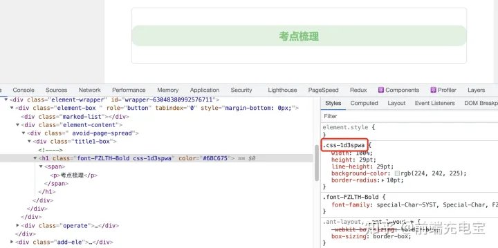
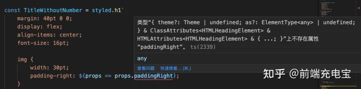

Styled Components 是一个使用CSS-in-JS技术实现的样式组件库，它是一个为React和React Native设计的库。它允许我们在应用中使用JavaScript和CSS混合起来编写样式级组件。并且它是支持Sass的，不需要添加任何库。

它是使用与CSS 模块的操作方法相同，这是一种编写CSS的方式，该CSS的范围仅限于单个组件，页面中的任何其他元素甚至组件都是无法访问它的。

### **（1）基本使用**

那该如何使用Styled Components库呢？来看看使用步骤： （1）安装库

```text
npm install styled-components --save
```

（2）引入库

```text
import styled from "styled-components";
```

（3）定义样式组件

```jsx
import React from "react";
import styled from "styled-components";

const Title = styled.h1`
  font-size: 20px;
  text-align: center;
  color: red;
`;

export default function App() {
  return <Title>Hello World</Title>;
}
```

这里就定义了一个样式组件Title，可以看到，它的实现还是非常简单的，语法就是：styled.标签名，后面跟一个模板字符串，其内容就是组件的样式属性。这样就创建了一个带样式的React组件。

### **（2）样式嵌套**

我们还可以在样式组件中嵌套样式，比如：

```jsx
import React from "react";
import styled from "styled-components";

const Title = styled.div`
  text-align: center;

    img {
        height: 100px;
        width: 200px;
    }
    p {
        font-size: 20px;
    color: red;
    }
`;

export default function App({imgUrl}) {
  return (
    <Title>
        <p>Hello World</p>
        
    </Title>
  );
}
```

### **（3）组件传参**

我们还可以给样式组件传递参数：

```jsx
import React from "react";
import styled from "styled-components";

const Title = styled.div`
  text-align: center;

    img {
        height: 100px;
        width: 200px;
    }

    p {
        font-size: 20px;
    color: ${props => props.color};
    }
`;

export default function App({imgUrl, themeColor}) {
  return (
    <Title>
        <p color={themeColor}>Hello World</p>
        
    </Title>
  );
}
```

这样就实现了动态改变文字的颜色。

### **（4）样式组件的class**

从上面组件中可以看出，我们定义的样式组件时没有class类名的，实际上类名的定义是style-components库帮我们完成的，来看一个实际的例子：

```jsx
const SeniorTitle = styled.h1`
    width: 100%;
    height: 29pt;
    line-height: 29pt;
    background-color: #E0F2E1;
    border-radius: 10pt;

    span {
        text-align: center;
    }

    p {
        font-size: 14pt;
        color: ${props => props.color};
    }
`;
```

上面是定义的一个h1组件，最终编译后，类名是css-1d3spwa，其中 span 的样式编译后如下：

```text
.css-1d3spwa span {
    text-align: center;
}
```



### **（5）样式组件继承**

我们还可以使用其他组件的样式，并继承它们所有的样式（如果有相同的样式，则会覆盖继承来的样式），来看例子：

```jsx
const BoringButton = styled.button`
  color: blue;
    background-color: green；
`;

const CoolButton = styled(BoringButton)`
  color: pink;
`;
```

这样，下面的组件就获得了上面组件的样式，并覆盖了重复了样式color。

### **（6）使用css辅助函数**

如果我们需要在多个样式组件中使用通用的样式，css辅助函数就派上用场了，来看看css辅助函数是如何使用的：

```jsx
import React from "react";
import styled, {css} from "styled-components";

const commonStyle = css`
  color: white;
    font-size: 20px;
`;

const Button = styled.button`
  ${commonStyle};
  background-color: red;
`;

const AnotherButton = styled.button`
  ${commonStyle};
  background-color: green;
`;
```

这里定义的commonStyle在两个button组件中使用时，不会有自己单独的类，而是会添加到这两个button组件对应的类中。

### **（7）引用其他样式组件**

我们还可以引用其他的样式组件，和继承时是类似的：

```jsx
const BoringButton = styled.button`
  color: blue;
    background-color: green；
`;

const CoolButton = styled.div`
    ${BoringButton} {
        color: pink;
    }
`;
```

### **（8）结合TypeScript使用样式组件**

如果我们项目使用React + TypeScript来编写，那么当给样式组件传递props时，就可能会报错：



这时我们可以通过泛型的形式给上述组件定义一个props类型：

```jsx
interface ITitleWithoutNumber {
    paddingRight: string;
}


const TitleWithoutNumber = styled.h1<ITitleWithoutNumber>`

`
```

这样就限制了组件props的类型，如果想添加一个新的props值，就需要先在interface接口中增加新的参数及类型。

### **（9）全局主题**

在style-components中我们还可以使用全局的主题，它通过ThemeProvider API来实现：

```jsx
import React from "react";
import { ThemeProvider } from "styled-components";

const theme = {
  colors: {
    powderWhite: "#FFFDF9",
    persianGreen: "#06B49A",
    lightBlue: "#AFDBD2",
    onyx: "#36313D"
  },
  fonts: ["sans-serif", "Roboto"],
  fontSizes: {
    small: "1em",
    medium: "2em",
    large: "3em"
  }
};

const Theme = ({ children }) => (
  <ThemeProvider theme={theme}>{children}</ThemeProvider>
);

export default Theme;
```

这里导出了一个Theme组件，它提供了一个theme主题，供子组件使用，可以这样来使用：

```jsx
import React from "react";
import Theme from "./Theme";
import styled from "styled-components";

const Container = styled.div`
  width: 100%;
  border: ${props => `1px solid ${props.theme.colors.onyx}`};
  background-color: ${props => props.theme.colors.lightBlue};
  font-family: ${props => props.theme.fonts[0]};
`;

const Heading = styled.h1`
  font-size: ${({ isHeading, theme: { fontSizes } }) =>
    isHeading ? fontSizes.large : fontSizes.small};
  color: ${({ theme: { colors } }) => colors.persianGreen};
`;

const App = () => {
  return (
    <Theme>
      <Container>
        <Heading isHeading={true}>Hello World</Heading>
        <h2>styled-components</h2>
      </Container>
    </Theme>
  );
};
export default App;
```

可以使用这种方式来实现全局的主题。

### **（10）优点和缺点**

style-components的优点：

- **开箱即用的Sass语法**：在style-components支持开箱即用的Sass语法，而不需要进行额外的安装或设置；
- **支持使用主题：** 在styled-components 提供了一个ThemeContext，可以直接传递主题对象的方法，方便使用全局主题；
- **动态样式：** 可以使用props来动态的设置和改变样式；
- **没有类型冲突：** 样式组件会我们生成唯一的类名，不会与其他组件的类型产生冲突；
- **便于维护：** 我们不需要在各种样式文件中查看样式，只需要在样式组件中查看其样式即可，便于维护；

style-components的缺点：

- **影响性能：** style-components在构建时会将React 组件中所有的样式定义转化为纯CSS，并将内容注入到index.html文件的`<style>`标签中。这样不仅增加了HTML文件的大小，并且无法对输出的CSS进行分块，影响了应用的性能；

